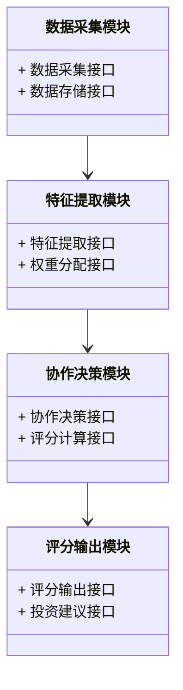

                 

# 利用多智能体AI实现费雪式的卓越公司识别

## 关键词：多智能体AI，费雪投资理论，公司识别，卓越企业，人工智能技术

## 摘要：  
本文探讨了如何利用多智能体人工智能技术，实现对费雪式卓越公司的识别。通过分析费雪投资理论的核心思想，并结合多智能体AI的优势，提出了一种基于多维度特征分析和AI协作的公司识别方法。本文详细讲解了多智能体AI的核心原理、算法实现、系统架构设计以及实际案例分析，为投资者和AI技术研究者提供了理论支持和实践指导。

---

## 第1章: 费雪投资理论与多智能体AI的结合

### 1.1 费雪投资理论的核心思想  
费雪（Philip Fisher）是20世纪著名的投资理论家，他提出“卓越公司”的概念，认为投资的核心是选择那些具备持续竞争优势、管理优秀、财务健康的企业。费雪理论强调长期投资、基本面分析以及对公司管理层的信任。  

#### 1.1.1 费雪的"卓越公司"定义  
卓越公司是指那些能够在行业内长期保持竞争优势、具备强大财务实力和优秀管理团队的企业。费雪认为，选择这样的公司进行投资，能够实现长期稳定的收益。  

#### 1.1.2 费雪投资理论的哲学基础  
费雪理论的核心是“时间的朋友们”，即选择那些能够在未来持续增长的公司。他强调对公司基本面的深入分析，包括财务数据、管理层能力和行业地位等。  

#### 1.1.3 费雪理论在现代的应用  
随着市场的复杂化和数据化的推进，传统的费雪理论需要结合现代技术手段进行优化。多智能体AI技术为实现这一目标提供了新的可能性。  

### 1.2 多智能体AI的基本概念  
多智能体系统（Multi-Agent System，MAS）是由多个智能体组成的分布式系统，每个智能体都具有一定的自主性、反应性和协作能力。  

#### 1.2.1 多智能体系统（MAS）的定义  
多智能体系统是由多个相互作用的智能体组成的系统，这些智能体能够通过协作完成复杂的任务。  

#### 1.2.2 多智能体系统的分类  
多智能体系统可以分为基于任务的多智能体系统、基于市场的多智能体系统以及基于网络的多智能体系统。  

#### 1.2.3 多智能体系统的核心特征  
- 分布式：每个智能体独立运行，具有自主性。  
- 协作性：智能体之间通过协作完成共同目标。  
- 反应性：智能体能够感知环境并做出实时反应。  

### 1.3 费雪理论与多智能体AI的结合  
通过结合费雪理论与多智能体AI，我们可以构建一种基于多维度特征分析的公司识别模型，从而实现对卓越公司的精准识别。  

#### 1.3.1 费雪理论与AI的契合点  
费雪理论强调对公司基本面的分析，而多智能体AI能够从多个维度对公司进行全方位分析，从而实现对公司基本面的深度挖掘。  

#### 1.3.2 多智能体AI在公司识别中的优势  
多智能体AI能够从多个维度对公司进行分析，包括财务数据、市场表现、管理层能力等，并通过协作实现对公司的综合评价。  

#### 1.3.3 费雪式卓越公司识别的AI实现路径  
通过多智能体AI对公司的多维度特征进行分析，并结合费雪理论的投资理念，构建一种基于多维度特征的公司识别模型。  

### 1.4 本章小结  
本章介绍了费雪投资理论的核心思想和多智能体AI的基本概念，并探讨了两者结合的可能性和优势。通过结合费雪理论与多智能体AI，我们可以实现对卓越公司的精准识别。  

---

## 第2章: 多智能体AI的核心概念与原理  

### 2.1 多智能体系统的组成与功能  
多智能体系统由多个智能体组成，每个智能体都有独立的功能和任务。  

#### 2.1.1 智能体的定义与分类  
智能体是一种能够感知环境并采取行动的实体，可以分为简单智能体和复杂智能体。  

#### 2.1.2 多智能体系统中的角色分配  
在多智能体系统中，角色分配是实现协作的关键。常见的角色分配方法包括基于任务的分配和基于能力的分配。  

#### 2.1.3 多智能体系统的协作机制  
协作机制是多智能体系统的核心，常见的协作机制包括基于通信的协作和基于任务分解的协作。  

### 2.2 多智能体系统的通信与协调  
智能体之间的通信与协调是实现协作的关键。  

#### 2.2.1 智能体之间的通信协议  
通信协议是智能体之间进行信息交换的规则，常见的通信协议包括基于消息队列的通信和基于事件驱动的通信。  

#### 2.2.2 多智能体系统的协调算法  
协调算法是实现智能体协作的核心，常见的协调算法包括基于一致性协议的协调和基于博弈论的协调。  

#### 2.2.3 通信与协调的实现方式  
通信与协调的实现方式包括基于消息队列的通信和基于事件驱动的通信。  

### 2.3 多智能体系统的决策机制  
决策机制是多智能体系统中智能体采取行动的核心。  

#### 2.3.1 分布式决策的基本概念  
分布式决策是指多个智能体通过协作完成决策的过程。  

#### 2.3.2 基于共识的决策算法  
基于共识的决策算法是实现分布式决策的核心，常见的算法包括Paxos算法和Raft算法。  

#### 2.3.3 基于博弈论的决策模型  
基于博弈论的决策模型是通过模拟博弈过程来实现决策的算法。  

### 2.4 本章小结  
本章详细讲解了多智能体系统的核心概念与原理，包括智能体的定义与分类、角色分配、协作机制、通信与协调以及决策机制。  

---

## 第3章: 基于多智能体的公司特征分析  

### 3.1 公司特征的多维度分析  
公司特征的多维度分析是实现卓越公司识别的关键。  

#### 3.1.1 公司财务指标的多维度分析  
公司财务指标的多维度分析包括盈利能力、偿债能力、运营能力和成长能力等。  

#### 3.1.2 公司市场表现的多维度分析  
公司市场表现的多维度分析包括市盈率、市净率、股息率等指标。  

#### 3.1.3 公司管理团队的多维度分析  
公司管理团队的多维度分析包括管理团队的能力、经验和稳定性等。  

### 3.2 基于多智能体的特征提取与权重分配  
特征提取与权重分配是实现公司特征分析的核心。  

#### 3.2.1 特征提取的数学模型  
特征提取的数学模型包括线性回归模型和非线性回归模型。  

#### 3.2.2 特征权重的计算方法  
特征权重的计算方法包括基于统计学的权重计算和基于机器学习的权重计算。  

#### 3.2.3 权重分配的优化算法  
权重分配的优化算法包括基于梯度下降的优化和基于遗传算法的优化。  

### 3.3 基于多智能体的公司评分系统  
公司评分系统是实现卓越公司识别的核心。  

#### 3.3.1 公司评分的计算公式  
公司评分的计算公式包括加权平均公式和非线性评分公式。  

#### 3.3.2 评分系统的验证与优化  
评分系统的验证与优化包括基于历史数据的验证和基于交叉验证的优化。  

#### 3.3.3 评分系统的实际应用案例  
实际应用案例包括对某行业的卓越公司的识别和对某行业的非卓越公司的识别。  

### 3.4 本章小结  
本章详细讲解了基于多智能体的公司特征分析，包括公司特征的多维度分析、特征提取与权重分配以及公司评分系统的设计与实现。  

---

## 第4章: 多智能体AI的算法实现与数学模型  

### 4.1 多智能体协作算法的设计与实现  
多智能体协作算法的设计与实现是实现卓越公司识别的关键。  

#### 4.1.1 多智能体协作算法的数学模型  
多智能体协作算法的数学模型包括基于一致性协议的协作模型和基于博弈论的协作模型。  

#### 4.1.2 多智能体协作算法的实现步骤  
多智能体协作算法的实现步骤包括初始化、智能体通信、协作决策和结果输出。  

#### 4.1.3 多智能体协作算法的优化与改进  
多智能体协作算法的优化与改进包括基于自适应算法的优化和基于分布式算法的优化。  

### 4.2 多智能体系统的数学模型  
多智能体系统的数学模型是实现协作的核心。  

#### 4.2.1 多智能体系统的数学模型  
多智能体系统的数学模型包括基于一致性协议的数学模型和基于博弈论的数学模型。  

#### 4.2.2 多智能体系统的优化算法  
多智能体系统的优化算法包括基于梯度下降的优化算法和基于遗传算法的优化算法。  

### 4.3 本章小结  
本章详细讲解了多智能体AI的算法实现与数学模型，包括多智能体协作算法的设计与实现以及多智能体系统的数学模型。  

---

## 第5章: 系统分析与架构设计方案  

### 5.1 系统应用场景介绍  
系统应用场景介绍包括金融投资、企业管理和学术研究等领域。  

### 5.2 系统功能设计  
系统功能设计包括数据采集模块、特征提取模块、协作决策模块和评分输出模块。  

#### 5.2.1 数据采集模块  
数据采集模块负责采集公司的多维度特征数据，包括财务数据、市场数据和管理数据。  

#### 5.2.2 特征提取模块  
特征提取模块负责对采集到的数据进行特征提取和权重分配。  

#### 5.2.3 协作决策模块  
协作决策模块负责基于多智能体协作算法对公司进行综合评分。  

#### 5.2.4 评分输出模块  
评分输出模块负责将评分结果输出，并提供投资建议。  

### 5.3 系统架构设计  
系统架构设计包括基于微服务架构的系统设计和基于分布式架构的系统设计。  

#### 5.3.1 系统架构设计的Mermaid类图  

#### 5.3.2 系统接口设计  
系统接口设计包括数据采集接口、特征提取接口、协作决策接口和评分输出接口。  

#### 5.3.3 系统交互设计  
系统交互设计包括用户输入、智能体协作和结果输出。  

### 5.4 本章小结  
本章详细讲解了系统分析与架构设计方案，包括系统应用场景、系统功能设计、系统架构设计以及系统接口设计。  

---

## 第6章: 项目实战  

### 6.1 项目环境安装  
项目环境安装包括安装Python、TensorFlow、Scikit-learn等工具。  

### 6.2 系统核心实现源代码  
系统核心实现源代码包括数据采集模块、特征提取模块、协作决策模块和评分输出模块的实现。  

#### 6.2.1 数据采集模块的实现  
数据采集模块的实现包括从数据库中采集公司数据。  

#### 6.2.2 特征提取模块的实现  
特征提取模块的实现包括对采集到的数据进行特征提取和权重分配。  

#### 6.2.3 协作决策模块的实现  
协作决策模块的实现包括基于多智能体协作算法对公司进行综合评分。  

#### 6.2.4 评分输出模块的实现  
评分输出模块的实现包括将评分结果输出，并提供投资建议。  

### 6.3 代码应用解读与分析  
代码应用解读与分析包括对核心代码的功能解读和对算法实现的分析。  

### 6.4 实际案例分析  
实际案例分析包括对某行业的卓越公司和非卓越公司的识别案例分析。  

### 6.5 项目小结  
项目小结包括项目实现的关键点、项目成果以及项目经验总结。  

---

## 第7章: 最佳实践与总结  

### 7.1 最佳实践  
最佳实践包括投资策略的优化、系统架构的优化以及算法的优化。  

### 7.2 小结  
小结包括本文的主要内容和研究成果。  

### 7.3 注意事项  
注意事项包括数据来源的可靠性、算法的可扩展性以及系统的可维护性。  

### 7.4 拓展阅读  
拓展阅读包括多智能体AI技术的深入研究以及费雪投资理论的进一步学习。  

---

## 作者：AI天才研究院/AI Genius Institute & 禅与计算机程序设计艺术 /Zen And The Art of Computer Programming  

---

通过以上结构，我们可以看到，利用多智能体AI实现费雪式卓越公司识别的过程是复杂而系统的。从理论到实践，从算法到系统设计，每一步都需要仔细思考和精心设计。希望本文能够为投资者和AI技术研究者提供有价值的参考和启示。

