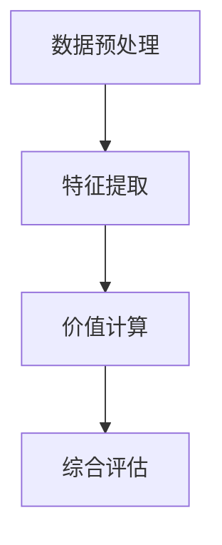

                 


# 利用多智能体AI评估公司的数据资产价值

> 关键词：多智能体AI，数据资产评估，数据价值，人工智能，企业数据管理

> 摘要：随着数据成为企业的重要资产，如何准确评估其价值成为关键问题。本文通过介绍多智能体AI的概念和原理，探讨其在数据资产评估中的应用，详细分析算法流程，并提供实际案例和系统架构设计，帮助读者全面理解如何利用多智能体AI来提升数据资产评估的效率和准确性。

---

## 第一部分：多智能体AI与数据资产评估概述

### 第1章：多智能体AI与数据资产评估的背景与概述

#### 1.1 多智能体AI的基本概念

##### 1.1.1 多智能体系统的定义与特点

多智能体系统（Multi-Agent System, MAS）由多个智能体组成，每个智能体都有自己的目标和行为规则。这些智能体通过通信和协作完成复杂任务。其特点包括分布式计算、自主性、协作性、反应性等。

##### 1.1.2 数据资产评估的必要性

数据资产评估是对数据资源的价值进行量化的过程，包括数据的准确性、完整性、及时性等因素。传统方法依赖人工评估，效率低且主观性强。随着数据规模的增大，传统方法难以满足需求。

##### 1.1.3 多智能体AI在数据资产评估中的作用

多智能体AI通过分布式计算和协作，能够高效评估数据价值，提供更精确的结果。每个智能体负责不同维度的评估，最终整合得出综合结论。

#### 1.2 多智能体AI与数据资产评估的关系

##### 1.2.1 数据资产评估的核心问题

数据资产评估涉及数据的质量、使用场景、市场价值等多个方面。传统方法难以全面覆盖，而多智能体AI提供了新的解决方案。

##### 1.2.2 多智能体AI如何解决数据资产评估的挑战

多智能体AI通过协作和分布式计算，能够快速处理大规模数据，提供动态评估结果。同时，智能体之间的协作能够优化评估过程，提高准确性。

##### 1.2.3 多智能体AI与数据资产评估的结合方式

多智能体AI可以应用于数据资产评估的多个环节，如数据清洗、特征提取、价值计算等。每个智能体负责不同任务，协同完成评估。

#### 1.3 本书的目标与结构

##### 1.3.1 本书的核心目标

通过介绍多智能体AI的原理和应用，帮助读者理解如何利用其评估数据资产价值。

##### 1.3.2 本书的主要内容框架

包括多智能体AI概述、数据资产评估方法、算法原理、系统架构设计、项目实战和总结等部分。

##### 1.3.3 本书的读者群体

适用于数据科学家、IT架构师、企业管理人员以及对多智能体AI感兴趣的技术人员。

---

## 第二部分：多智能体AI的核心原理

### 第2章：多智能体AI的核心原理

#### 2.1 多智能体系统的基本结构

##### 2.1.1 智能体的定义与分类

智能体是具有感知和自主决策能力的实体。根据功能和智能水平分为简单智能体、反应式智能体、认知智能体等。

##### 2.1.2 多智能体系统的组成与交互

多智能体系统由多个智能体和通信机制组成，智能体之间通过消息传递进行交互。

##### 2.1.3 多智能体系统的特点与优势

特点包括分布式、协作性、适应性等。优势在于能够处理复杂任务，提高效率和准确性。

#### 2.2 多智能体AI的关键技术

##### 2.2.1 智能体之间的通信与协作

智能体通过通信协议交换信息，协作完成任务。通信机制包括发布-订阅模式、请求-响应模式等。

##### 2.2.2 多智能体系统的协调机制

协调机制包括仲裁机制、任务分配机制、冲突解决机制等，确保系统高效运行。

##### 2.2.3 多智能体系统的决策模型

决策模型基于多智能体的感知和历史数据，通过算法进行决策优化。

#### 2.3 多智能体AI的应用场景

##### 2.3.1 金融领域的多智能体应用

用于股票预测、风险评估等领域，多个智能体协作进行数据分析。

##### 2.3.2 企业数据管理中的多智能体应用

用于数据清洗、特征提取、价值评估等环节，提高数据管理效率。

##### 2.3.3 其他领域的多智能体应用

如物流、交通管理等领域，多智能体协作优化资源分配。

---

## 第三部分：数据资产评估的方法与挑战

### 第3章：数据资产评估的方法与挑战

#### 3.1 数据资产评估的基本概念

##### 3.1.1 数据资产的定义与分类

数据资产包括结构化数据、非结构化数据、半结构化数据等。

##### 3.1.2 数据资产评估的必要性

企业需要了解数据价值以优化资源配置和业务决策。

##### 3.1.3 数据资产评估的挑战

数据规模大、多样性高、动态变化快，传统方法难以应对。

#### 3.2 数据资产评估的传统方法

##### 3.2.1 成本法

基于数据获取和存储成本评估价值，但难以反映数据的市场价值。

##### 3.2.2 市场法

参考市场上类似数据的价格，但数据市场不透明，难以获取准确价格。

##### 3.2.3 收益法

基于数据带来的收益预测其价值，但需要准确预测收益。

#### 3.3 多智能体AI在数据资产评估中的优势

##### 3.3.1 分布式计算能力

多智能体AI能够同时处理大规模数据，提高评估效率。

##### 3.3.2 协作优化

智能体协作能够优化评估过程，提高结果准确性。

##### 3.3.3 动态适应性

多智能体AI能够实时适应数据变化，提供动态评估结果。

---

## 第四部分：利用多智能体AI评估数据资产价值的算法原理

### 第4章：多智能体AI评估数据资产价值的算法原理

#### 4.1 算法概述

多智能体AI评估数据资产价值的算法包括数据预处理、特征提取、价值计算等步骤。

#### 4.2 数据预处理

##### 4.2.1 数据清洗

去除噪声数据，确保数据质量。

##### 4.2.2 数据转换

将数据转换为适合计算的格式，如标准化、归一化等。

#### 4.3 特征提取

##### 4.3.1 基于智能体的特征提取

每个智能体负责提取特定特征，如准确性、完整性等。

##### 4.3.2 特征融合

将多个智能体提取的特征进行融合，得到综合特征向量。

#### 4.4 价值计算

##### 4.4.1 基于多智能体的协同学习

智能体协作学习，通过投票、加权等方式计算数据价值。

##### 4.4.2 价值评估模型

使用机器学习模型对数据价值进行评估，如回归模型、分类模型等。

#### 4.5 算法实现

##### 4.5.1 Python代码实现

```python
# 示例代码：多智能体协同学习算法
class MultiAgentSystem:
    def __init__(self, agents):
        self.agents = agents

    def evaluate(self, data):
        for agent in self.agents:
            agent.analyze(data)
        results = [agent.report() for agent in self.agents]
        return self.combine(results)

    def combine(self, results):
        # 简单的平均值计算
        return sum(results) / len(results)
```

##### 4.5.2 算法流程图



---

## 第五部分：系统架构与项目实战

### 第5章：系统架构设计

#### 5.1 系统应用场景

企业数据管理、金融风险评估、精准营销等领域。

#### 5.2 系统功能设计

##### 5.2.1 数据采集模块

负责数据的采集和预处理。

##### 5.2.2 智能体协作模块

管理智能体的通信和协作。

##### 5.2.3 评估计算模块

进行数据价值的计算和展示。

#### 5.3 系统架构图


#### 5.4 接口设计与交互

##### 5.4.1 接口设计

RESTful API，如`POST /api/evaluate`。

##### 5.4.2 交互流程

用户提交数据，系统进行评估，返回结果。

### 第6章：项目实战

#### 6.1 环境搭建

##### 6.1.1 安装依赖

安装Python、TensorFlow、Kafka等工具。

#### 6.2 核心代码实现

##### 6.2.1 数据预处理代码

```python
import pandas as pd

def preprocess_data(data):
    # 数据清洗
    data.dropna(inplace=True)
    # 数据转换
    data['value'] = data['value'].astype(float)
    return data
```

##### 6.2.2 智能体协作代码

```python
class Agent:
    def __init__(self, name):
        self.name = name
        self.data = None

    def analyze(self, data):
        self.data = data

    def report(self):
        return self.data['value'].mean()
```

##### 6.2.3 评估计算代码

```python
class Evaluator:
    def __init__(self, agents):
        self.agents = agents

    def evaluate(self):
        results = [agent.report() for agent in self.agents]
        return sum(results) / len(results)
```

#### 6.3 实际案例分析

##### 6.3.1 案例背景

某公司客户数据，需要评估其市场价值。

##### 6.3.2 评估过程

1. 数据采集与预处理。
2. 智能体分析数据特征。
3. 评估计算数据价值。

#### 6.4 项目小结

通过项目实战，验证了多智能体AI在数据资产评估中的有效性，提高了评估效率和准确性。

---

## 第六部分：总结与展望

### 第7章：总结与展望

#### 7.1 全文总结

多智能体AI通过协作和分布式计算，能够高效评估数据资产价值，解决了传统方法的不足。

#### 7.2 未来展望

多智能体AI在数据资产评估中的应用将更加广泛，未来可能结合区块链、边缘计算等技术，进一步提升评估的准确性和安全性。

#### 7.3 最佳实践 tips

- 合理选择智能体数量和功能。
- 优化智能体之间的通信机制。
- 定期更新智能体模型，适应数据变化。

---

## 作者：AI天才研究院/AI Genius Institute & 禅与计算机程序设计艺术 /Zen And The Art of Computer Programming

