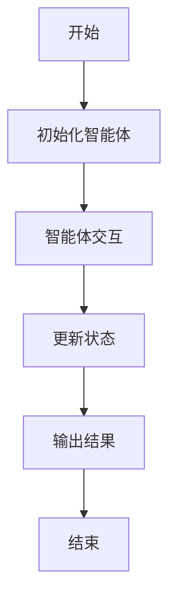
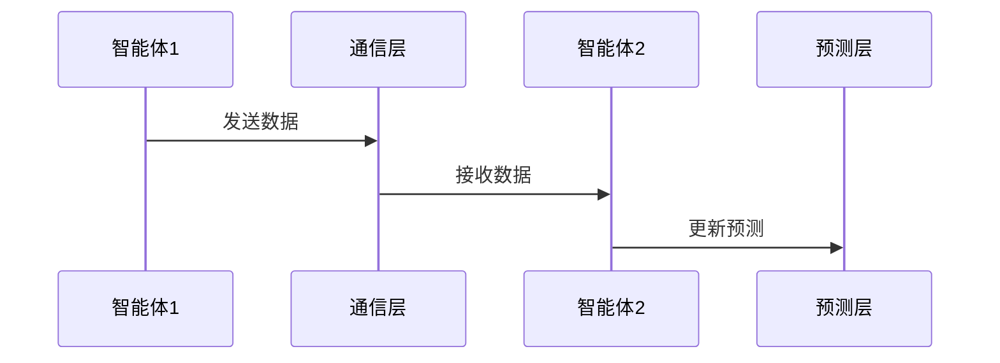

                 


# 利用多智能体系统构建全球宏观经济预测模型

## 关键词

- 多智能体系统 (Multi-Agent Systems)
- 宏观经济预测 (Macroeconomic Forecasting)
- 分布式计算 (Distributed Computing)
- 经济行为模拟 (Economic Behavior Simulation)
- 人工智能 (Artificial Intelligence)

## 摘要

本文探讨了利用多智能体系统构建全球宏观经济预测模型的方法。通过分析多智能体系统的核心概念、算法原理和系统架构，本文详细阐述了如何将智能体应用于宏观经济预测。从理论到实践，本文提供了完整的解决方案，包括项目实战和优化建议，帮助读者理解多智能体系统在宏观经济预测中的应用。

---

## 第1章 多智能体系统概述

### 1.1 多智能体系统的核心概念

多智能体系统（Multi-Agent Systems，MAS）由多个智能体组成，每个智能体能够独立感知环境、自主决策并执行任务。智能体之间的协作与竞争是MAS的核心特征。

- **智能体的结构**：包括感知、决策、行动三个部分。
- **智能体的通信机制**：通过消息传递或中间件进行交互。
- **智能体的行为模式**：分为反应式和规划式两种类型。

### 1.2 宏观经济预测的基本概念

宏观经济预测旨在预测经济指标的变化趋势，如GDP、通胀率等。传统方法包括时间序列分析和回归模型，但难以捕捉复杂经济互动。

### 1.3 多智能体系统的优势

- **分布式计算**：提升计算效率和系统鲁棒性。
- **实时互动**：准确模拟经济行为。
- **灵活性**：适用于不同经济场景。

---

## 第2章 多智能体系统与宏观经济预测的结合

### 2.1 多智能体系统的经济行为模拟

智能体模拟个体经济行为，如消费者、企业和政府的决策过程。通过模拟这些行为，可以预测宏观经济指标的变化。

### 2.2 宏观经济预测模型的构建

模型构建包括智能体行为建模和整体系统优化。智能体行为模型描述个体决策，整体模型整合个体行为预测宏观经济。

### 2.3 实际案例分析

以某国经济为例，分析多智能体系统如何模拟消费、投资和政府支出，预测GDP和通胀率。

---

## 第3章 数学模型与算法原理

### 3.1 智能体行为模型

智能体行为模型描述个体决策过程，如消费者选择最优购买行为。模型使用动态方程，如：

$$
U = \sum_{t=0}^{\infty} \beta^t u(C_t)
$$

其中，\(U\) 表示效用，\(C_t\) 表示消费，\(\beta\) 是贴现率。

### 3.2 宏观经济预测模型

宏观经济预测模型整合个体行为，如：

$$
Y = C + I + G + (X - M)
$$

其中，\(Y\) 是GDP，\(C\) 是消费，\(I\) 是投资，\(G\) 是政府支出，\(X\) 是出口，\(M\) 是进口。

### 3.3 分布式算法实现

采用分布式计算技术，通过消息传递实现智能体协作。算法流程如图所示：



---

## 第4章 系统架构设计

### 4.1 系统架构图

系统架构包括智能体层、通信层和预测层：


### 4.2 模块划分

- **智能体模块**：实现个体行为。
- **通信模块**：处理智能体交互。
- **预测模块**：整合数据生成预测。

### 4.3 系统交互流程



---

## 第5章 项目实战

### 5.1 环境搭建

- **工具安装**：安装Python、NumPy、Matplotlib和相关库。
- **框架选择**：使用Multi-Agent Framework框架。

### 5.2 核心代码实现

```python
class Agent:
    def __init__(self, id):
        self.id = id
        self.state = 0

    def update(self, data):
        self.state = data

def main():
    agents = [Agent(i) for i in range(10)]
    for agent in agents:
        agent.update(1)
    for agent in agents:
        print(agent.state)

if __name__ == "__main__":
    main()
```

### 5.3 案例分析

通过具体案例，展示系统如何预测GDP和通胀率，并分析预测结果。

---

## 第6章 优化与扩展

### 6.1 系统优化

- **性能优化**：优化通信机制，减少延迟。
- **模型调优**：调整参数，提高预测精度。

### 6.2 未来展望

探讨结合区块链和大数据技术，提升系统的安全性和数据处理能力。

---

## 第7章 总结与展望

### 7.1 全文总结

总结多智能体系统在宏观经济预测中的应用，强调其优势和潜力。

### 7.2 未来展望

提出未来研究方向，如复杂经济系统的建模与预测。

---

## 作者信息

作者：AI天才研究院/AI Genius Institute & 禅与计算机程序设计艺术 /Zen And The Art of Computer Programming

