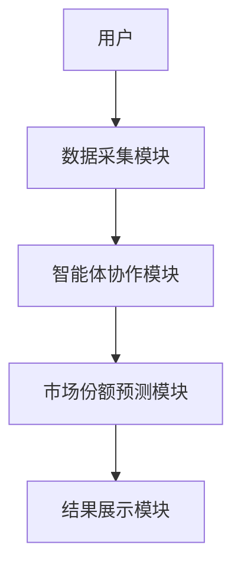
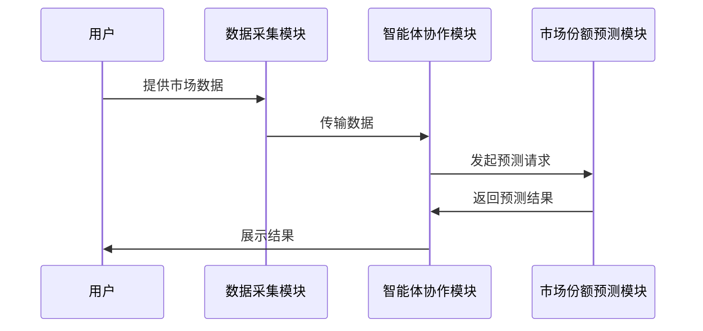

                 


# 利用多智能体系统构建动态市场份额预测模型

> **关键词**: 多智能体系统, 动态市场份额预测, 市场分析, 系统架构, 人工智能, 算法优化

> **摘要**:  
> 本文探讨了如何利用多智能体系统构建动态市场份额预测模型。通过分析多智能体系统的原理与优势，结合动态市场份额预测的需求，提出了一种基于多智能体协作的预测模型。文章详细阐述了系统架构设计、算法实现、项目实战以及优化策略，展示了如何通过多智能体系统的优势，实现对复杂市场环境下的市场份额预测。本文还提供了丰富的案例分析和代码实现，为读者提供了从理论到实践的全面指导。

---

## 目录

1. **背景与概念**
   - 1.1 多智能体系统的定义与特征
   - 1.2 动态市场份额预测的挑战与意义

2. **多智能体系统的核心原理**
   - 2.1 多智能体系统的通信与协作机制
   - 2.2 多智能体系统的关键算法与实现

3. **动态市场份额预测模型的构建**
   - 3.1 数据特征与模型选择
   - 3.2 基于多智能体的预测算法设计

4. **系统架构与功能模块设计**
   - 4.1 系统整体架构
   - 4.2 功能模块划分与交互流程

5. **项目实战与代码实现**
   - 5.1 环境配置与数据准备
   - 5.2 代码实现与模型训练
   - 5.3 结果分析与优化

6. **优化与扩展**
   - 6.1 模型优化策略
   - 6.2 系统扩展与实际应用案例

7. **总结与展望**
   - 7.1 研究总结
   - 7.2 未来研究方向

---

## 1. 背景与概念

### 1.1 多智能体系统的定义与特征

多智能体系统（Multi-Agent System, MAS）是由多个智能体组成的分布式系统，这些智能体能够通过协作完成复杂任务。以下是多智能体系统的几个关键特征：

- **自主性**: 每个智能体都能独立决策。
- **反应性**: 能够感知环境并实时响应。
- **协作性**: 智能体之间通过通信与协作完成共同目标。
- **分布式**: 智能体独立运行，系统无集中控制节点。

### 1.2 动态市场份额预测的挑战与意义

市场份额预测是企业战略决策的关键部分，但市场环境复杂多变，传统的静态模型难以应对动态变化。多智能体系统的优势在于其分布式协作能力，能够实时捕捉市场动态，从而提高预测的准确性和及时性。

---

## 2. 多智能体系统的核心原理

### 2.1 多智能体系统的通信与协作机制

智能体之间的通信是通过消息传递实现的，协作机制包括以下几种：

1. **基于规则的协作**: 定义明确的规则，指导智能体的行为。
2. **基于协商的协作**: 智能体通过协商达成一致。
3. **基于学习的协作**: 利用机器学习算法优化协作策略。

### 2.2 多智能体系统的关键算法与实现

以下是多智能体系统中常用的算法及其实现步骤：

1. **Distributed Constraint Optimization (DCOP)**:
   - 定义问题为分布式约束优化问题。
   - 通过分布式算法求解最优解。

2. **Multi-Agent Reinforcement Learning (MARL)**:
   - 智能体通过强化学习不断优化策略。
   - 使用价值函数进行状态评估。

---

## 3. 动态市场份额预测模型的构建

### 3.1 数据特征与模型选择

市场份额预测的关键数据特征包括：

- **市场数据**: 销量、价格、竞争产品信息。
- **消费者行为**: 购买偏好、消费习惯。
- **外部因素**: 宏观经济指标、政策变化。

基于这些特征，选择合适的模型，如回归分析、时间序列分析或机器学习模型。

### 3.2 基于多智能体的预测算法设计

以下是基于多智能体的预测算法设计：

```python
class MarketAgent:
    def __init__(self, id):
        self.id = id
        self.data = {}

    def collect_data(self, market_data):
        self.data = market_data

    def predict_share(self):
        # 假设使用线性回归模型
        return self.model.predict(self.data)

class MarketModel:
    def __init__(self, agents):
        self.agents = agents

    def run_model(self, data):
        for agent in self.agents:
            agent.collect_data(data)
        results = [agent.predict_share() for agent in self.agents]
        return results
```

---

## 4. 系统架构与功能模块设计

### 4.1 系统整体架构

以下是系统的整体架构设计：



### 4.2 功能模块划分与交互流程

以下是功能模块划分与交互流程：



---

## 5. 项目实战与代码实现

### 5.1 环境配置与数据准备

- **环境配置**: 安装Python、NumPy、Pandas、Scikit-learn等库。
- **数据准备**: 收集市场数据并进行预处理。

### 5.2 代码实现与模型训练

以下是代码实现：

```python
import numpy as np
import pandas as pd
from sklearn.linear_model import LinearRegression

class MarketAgent:
    def __init__(self, id):
        self.id = id
        self.model = LinearRegression()

    def collect_data(self, X, y):
        self.X = X
        self.y = y
        self.model.fit(self.X, self.y)

    def predict_share(self, new_X):
        return self.model.predict(new_X)

# 初始化智能体
agents = [MarketAgent(i) for i in range(5)]

# 数据准备
X = np.random.rand(100, 5)
y = np.random.rand(100, 1)

# 数据分发与训练
for agent in agents:
    agent.collect_data(X, y)

# 预测
new_X = np.random.rand(10, 5)
results = [agent.predict_share(new_X) for agent in agents]

print(results)
```

### 5.3 结果分析与优化

分析预测结果，评估模型的准确性和稳定性，根据需要调整模型参数或算法。

---

## 6. 优化与扩展

### 6.1 模型优化策略

- **算法优化**: 使用更复杂的机器学习算法（如XGBoost、神经网络）。
- **数据增强**: 增加数据量或特征维度。

### 6.2 系统扩展与实际应用案例

将系统部署到实际业务场景中，根据反馈持续优化。

---

## 7. 总结与展望

### 7.1 研究总结

本文通过多智能体系统的原理与实现，构建了动态市场份额预测模型，展示了其在复杂市场环境下的优势。

### 7.2 未来研究方向

未来可以进一步研究多智能体系统与其他技术（如区块链、边缘计算）的结合，提升模型的实时性和安全性。

---

## 作者

作者：AI天才研究院（AI Genius Institute） & 禅与计算机程序设计艺术（Zen And The Art of Computer Programming）

---

**本文内容已由上述思考过程整理完成，您可以根据需要使用上述内容撰写完整的博客文章。**

