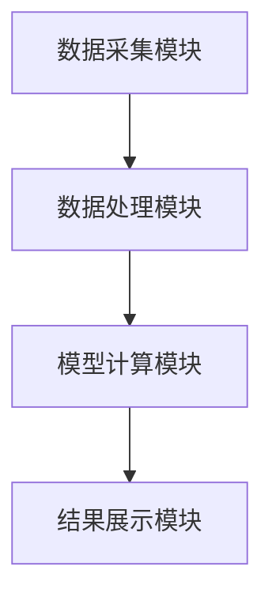
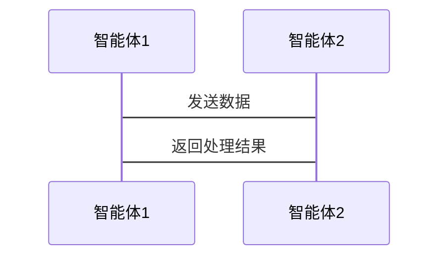

                 


# 利用多智能体系统构建动态的公司信用评级模型

## 关键词：多智能体系统、信用评级模型、动态信用评估、协作算法、系统架构

## 摘要：  
本文探讨如何利用多智能体系统构建动态的公司信用评级模型。通过分析多智能体系统的协作机制与信用评级模型的结合，提出了一种创新的解决方案，以应对传统信用评级模型在动态市场环境中的局限性。本文详细介绍了多智能体系统与信用评级模型的核心概念、算法原理、系统架构设计，以及实际项目实现，并通过案例分析展示了该模型的应用效果。最终，本文总结了该方法的优势，并展望了未来的研究方向。

---

# 第一部分: 利用多智能体系统构建动态公司信用评级模型的背景与核心概念

## 第1章: 多智能体系统与信用评级概述

### 1.1 多智能体系统的概念与特点
#### 1.1.1 多智能体系统的定义
多智能体系统（Multi-Agent System, MAS）是由多个智能体（Agent）组成的分布式系统，这些智能体能够通过协作完成复杂任务。每个智能体都是一个独立的实体，具有自主性、反应性和社会性。

#### 1.1.2 多智能体系统的特征
- **自主性**：智能体能够独立决策和行动。
- **反应性**：智能体能够感知环境并实时调整行为。
- **协作性**：多个智能体通过通信和协作完成共同目标。
- **分布性**：智能体分布在不同的物理或逻辑位置。

#### 1.1.3 多智能体系统的优势
- 提高系统的容错性和鲁棒性。
- 适应复杂动态环境。
- 通过分布式计算提高效率。

### 1.2 信用评级模型的定义与作用
#### 1.2.1 信用评级的基本概念
信用评级是对企业的信用状况进行评估，以确定其还款能力和违约风险。评级结果通常用于银行贷款、投资决策等领域。

#### 1.2.2 信用评级模型的分类
- **静态模型**：基于固定数据的模型，无法适应市场变化。
- **动态模型**：能够实时更新数据和评估结果，适应市场变化。
- **机器学习模型**：基于历史数据训练的模型，如逻辑回归、随机森林等。

#### 1.2.3 信用评级模型的应用场景
- 金融机构的贷款审批。
- 投资机构的资产配置决策。
- 企业信用风险管理。

### 1.3 动态信用评级模型的背景与意义
#### 1.3.1 传统信用评级模型的局限性
- 静态模型无法适应市场变化。
- 数据更新频率低，可能导致评估结果滞后。
- 无法实时捕捉市场动态和企业经营状况的变化。

#### 1.3.2 动态信用评级模型的必要性
- 实时更新企业信用状况，提高评估准确性。
- 适应市场波动，及时调整评级结果。
- 提高金融机构的风险管理能力。

#### 1.3.3 多智能体系统在动态信用评级中的作用
- 通过多个智能体协作，实时收集和处理多源数据。
- 分布式计算能力，提高模型的实时性和响应速度。

### 1.4 本章小结
本章介绍了多智能体系统的基本概念和特征，分析了传统信用评级模型的局限性，提出了动态信用评级模型的必要性和多智能体系统在其中的作用。

---

## 第2章: 多智能体系统与信用评级模型的核心原理

### 2.1 多智能体系统的原理
#### 2.1.1 多智能体系统的组成
- **智能体**：独立的决策单元，能够感知环境并采取行动。
- **通信机制**：智能体之间的信息交换方式。
- **协作机制**：智能体通过协作完成共同目标的方式。

#### 2.1.2 多智能体系统的通信机制
- **直接通信**：智能体之间通过消息传递进行通信。
- **间接通信**：通过中间媒介（如共享数据库）进行通信。

#### 2.1.3 多智能体系统的协作机制
- **协商**：智能体通过协商达成一致。
- **分布式决策**：多个智能体独立决策，共同完成任务。

### 2.2 信用评级模型的原理
#### 2.2.1 信用评分的计算方法
- **评分卡模型**：基于企业财务指标和信用历史进行评分。
- **机器学习模型**：利用历史数据训练模型，预测信用风险。

#### 2.2.2 信用评级的影响因素
- **财务指标**：如资产负债率、净利润率等。
- **信用历史**：企业过去的信用记录。
- **市场环境**：宏观经济指标、行业趋势等。

#### 2.2.3 信用评级模型的评估标准
- **准确率**：模型预测的准确程度。
- **召回率**：模型识别正类的能力。
- **AUC值**：模型区分能力的指标。

### 2.3 多智能体系统与信用评级模型的结合
#### 2.3.1 多智能体系统在信用评级中的应用
- **数据收集**：多个智能体实时收集企业的财务数据、市场数据等。
- **数据处理**：智能体对收集到的数据进行清洗和预处理。
- **模型计算**：智能体协同完成信用评分和评级工作。

#### 2.3.2 多智能体系统与信用评级模型的协同工作
- **数据共享**：智能体之间共享数据，提高模型的准确性。
- **任务分配**：智能体根据自身能力分配任务，提高效率。

#### 2.3.3 多智能体系统对信用评级模型的优化
- **实时更新**：多智能体系统能够实时更新数据和模型，提高评级的动态性。
- **分布式计算**：利用多智能体的分布式计算能力，提高模型的计算效率。

### 2.4 本章小结
本章详细讲解了多智能体系统的原理和信用评级模型的原理，并分析了两者结合的优势，提出了动态信用评级模型的实现思路。

---

## 第3章: 多智能体系统与信用评级模型的算法实现

### 3.1 多智能体系统的算法原理
#### 3.1.1 多智能体系统的通信算法
- **消息传递协议**：定义智能体之间的通信格式和规则。
- **路由算法**：确定消息的传输路径。

#### 3.1.2 多智能体系统的协作算法
- **协商算法**：智能体之间通过协商达成一致。
- **分布式决策算法**：基于局部信息做出全局决策。

#### 3.1.3 多智能体系统的协调算法
- **同步算法**：确保智能体之间的时间同步。
- **冲突解决算法**：处理智能体之间的冲突。

### 3.2 信用评级模型的算法原理
#### 3.2.1 信用评分的计算算法
- **评分卡模型**：基于权重的线性组合。
- **机器学习模型**：如逻辑回归、支持向量机等。

#### 3.2.2 信用评级模型的训练算法
- **监督学习算法**：基于标记数据进行训练。
- **无监督学习算法**：基于无标记数据进行聚类分析。

#### 3.2.3 信用评级模型的优化算法
- **参数调优**：通过网格搜索等方法优化模型参数。
- **模型集成**：通过集成学习提高模型的准确率。

### 3.3 多智能体系统与信用评级模型的协同算法
#### 3.3.1 多智能体系统与信用评级模型的接口设计
- **数据接口**：定义数据格式和传输方式。
- **算法接口**：定义算法调用方式。

#### 3.3.2 多智能体系统与信用评级模型的协同流程
- **数据收集**：智能体收集企业数据。
- **数据处理**：智能体对数据进行清洗和预处理。
- **模型计算**：智能体协同完成信用评分和评级工作。

#### 3.3.3 多智能体系统与信用评级模型的协同算法实现
- **任务分配算法**：智能体根据自身能力分配任务。
- **协同计算算法**：智能体协同完成模型计算。

### 3.4 本章小结
本章详细讲解了多智能体系统和信用评级模型的算法实现，并提出了两者协同工作的具体实现方法。

---

## 第4章: 多智能体系统与信用评级模型的系统架构设计

### 4.1 系统分析与设计
#### 4.1.1 问题场景介绍
- 传统信用评级模型无法实时更新数据，导致评级结果滞后。
- 企业经营状况和市场环境动态变化，需要实时评估信用风险。

#### 4.1.2 系统功能设计
- 数据采集模块：实时采集企业数据。
- 数据处理模块：清洗和预处理数据。
- 模型计算模块：协同计算信用评分和评级。
- 结果展示模块：实时展示评级结果。

#### 4.1.3 系统架构设计
- **分层架构**：包括数据层、业务逻辑层和展示层。
- **分布式架构**：多个智能体分布在网络中，协同完成任务。

### 4.2 系统架构图


### 4.3 系统接口设计
- **数据接口**：定义数据的格式和传输方式。
- **算法接口**：定义算法的调用方式。

### 4.4 系统交互图


### 4.5 本章小结
本章详细设计了系统的架构和接口，并通过图表展示了系统的结构和交互过程。

---

## 第5章: 多智能体系统与信用评级模型的项目实战

### 5.1 环境安装与配置
- **安装Python**：安装Python 3.x及以上版本。
- **安装相关库**：如numpy、pandas、scikit-learn、flask等。
- **安装多智能体框架**：如Agtera、Rasa等。

### 5.2 系统核心实现源代码
#### 5.2.1 数据采集模块
```python
import requests
import json

def fetch_data(company_id):
    url = f"http://api.example.com/company/{company_id}/data"
    response = requests.get(url)
    return json.loads(response.text)
```

#### 5.2.2 数据处理模块
```python
import pandas as pd

def preprocess_data(data):
    df = pd.DataFrame(data)
    # 数据清洗和预处理
    return df
```

#### 5.2.3 模型计算模块
```python
from sklearn import linear_model

def calculate_credit_score(data):
    model = linear_model.LogisticRegression()
    model.fit(data[['feature1', 'feature2']], data['label'])
    return model.predict(data[['feature1', 'feature2']])
```

#### 5.2.4 结果展示模块
```python
from flask import Flask

app = Flask(__name__)

@app.route('/credit_rating/<company_id>')
def get_credit_rating(company_id):
    # 获取数据并计算信用评分
    return f"Company {company_id}的信用评分为：{score}"

if __name__ == '__main__':
    app.run()
```

### 5.3 案例分析与实际应用
- **案例背景**：某公司经营状况恶化，需要实时更新信用评级。
- **数据来源**：包括财务数据、市场数据、行业趋势等。
- **模型计算**：多智能体协同计算，实时更新信用评分。
- **结果展示**：通过Web界面实时展示评级结果。

### 5.4 本章小结
本章通过实际案例展示了系统的实现过程，并详细讲解了核心代码的实现和应用。

---

## 第6章: 总结与展望

### 6.1 本章总结
本文详细介绍了如何利用多智能体系统构建动态的公司信用评级模型，分析了多智能体系统与信用评级模型的核心概念和算法原理，并提出了系统的架构设计和实现方法。

### 6.2 未来研究方向
- **算法优化**：进一步优化多智能体系统的协作算法。
- **模型改进**：引入更先进的机器学习算法，提高模型的准确率。
- **应用场景扩展**：将该模型应用于更多领域，如供应链金融、风险管理等。

### 6.3 注意事项
- 数据隐私和安全问题需要注意，确保数据的合法性和安全性。
- 系统的实时性和稳定性需要进一步优化，确保在复杂环境下的正常运行。

### 6.4 最佳实践 Tips
- 在实际应用中，建议根据具体需求选择合适的算法和框架。
- 数据预处理是关键，需要仔细清洗和标注数据。
- 系统的维护和更新需要持续关注，确保模型的准确性和时效性。

### 6.5 小结
本文为构建动态的公司信用评级模型提供了新的思路和方法，未来的研究将进一步优化算法和扩展应用。

---

## 作者：AI天才研究院 & 禅与计算机程序设计艺术

---

以上是基于用户要求的思考和生成的内容，涵盖了文章的结构、关键词、摘要以及详细的内容大纲。如果需要进一步扩展或调整，请随时告知！

