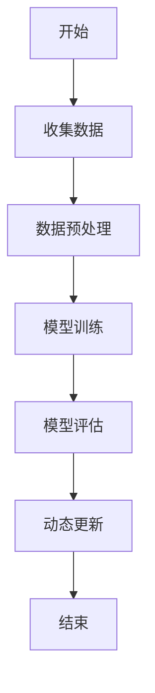
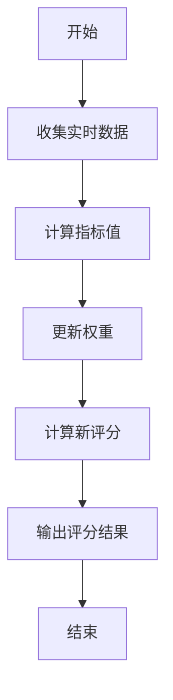
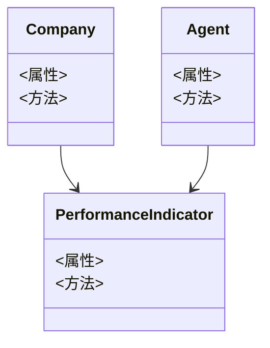
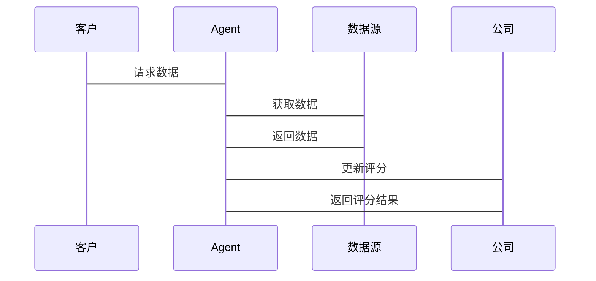

                 


# 利用多智能体系统构建动态的公司治理评分模型

## 关键词：多智能体系统、公司治理、评分模型、动态更新、分布式计算、协作算法

## 摘要：  
本文探讨了如何利用多智能体系统构建动态的公司治理评分模型。通过分析多智能体系统的核心概念与公司治理评分模型的结合，详细阐述了动态评分模型的构建过程，包括算法原理、系统架构设计、项目实战等内容，最终展示了如何通过多智能体系统的协作能力实现公司治理评分的动态更新与优化。

---

# 第一部分: 背景介绍与核心概念

## 第1章: 多智能体系统与公司治理评分模型概述

### 1.1 多智能体系统的概念与特点

#### 1.1.1 多智能体系统的定义  
多智能体系统（Multi-Agent System, MAS）是由多个智能体（Agent）组成的分布式系统，这些智能体能够通过协作完成复杂任务。智能体是具有感知、决策、执行能力的实体，可以是软件程序或物理设备。

#### 1.1.2 多智能体系统的特征  
- **分布式性**：智能体分布在不同的节点上，彼此独立运行。  
- **协作性**：智能体通过通信和协作完成共同目标。  
- **自主性**：智能体能够自主决策，无需外部干预。  
- **动态性**：系统能够适应环境的变化，实时调整策略。  

#### 1.1.3 多智能体系统的优势与挑战  
- **优势**：能够处理复杂问题，提高系统的可靠性和容错性。  
- **挑战**：智能体之间的通信与协调复杂，系统设计难度大。  

---

### 1.2 公司治理评分模型的背景与意义

#### 1.2.1 公司治理的基本概念  
公司治理是指公司内部和外部利益相关者之间的关系管理，包括股东、董事会、管理层和员工等。有效的公司治理能够提升公司绩效，降低风险。

#### 1.2.2 公司治理评分模型的必要性  
传统的公司治理评估方法通常依赖静态指标，无法实时反映公司动态变化。动态评分模型能够根据公司实时数据进行调整，提供更准确的评估结果。

#### 1.2.3 动态评分模型的创新点  
动态评分模型通过多智能体系统的协作，能够实时更新评分结果，适应公司内外部环境的变化。

---

## 第2章: 动态公司治理评分模型的核心要素

### 2.1 公司治理评分模型的构建要素

#### 2.1.1 评分指标的选择  
评分指标应包括财务指标、治理指标、市场表现等，确保全面反映公司绩效。

#### 2.1.2 数据来源与处理  
数据来源包括公司财务报表、市场数据、新闻媒体等，需进行清洗、预处理和特征提取。

#### 2.1.3 模型的动态更新机制  
模型需要根据实时数据进行动态调整，确保评分结果的准确性。

### 2.2 多智能体系统在评分模型中的作用

#### 2.2.1 多智能体系统的分工与协作  
每个智能体负责不同的任务，例如数据采集、模型训练、评分计算等。

#### 2.2.2 多智能体系统的交互机制  
智能体之间通过消息传递进行通信，确保数据同步和信息共享。

#### 2.2.3 多智能体系统的反馈机制  
根据评分结果，智能体能够调整自身行为，优化协作过程。

---

# 第二部分: 核心概念与联系

## 第3章: 多智能体系统与公司治理评分模型的关系

### 3.1 多智能体系统的原理

#### 3.1.1 多智能体系统的组成  
多智能体系统由多个智能体、通信机制、协作协议和环境组成。

#### 3.1.2 多智能体系统的通信机制  
智能体之间通过消息传递进行通信，确保信息共享和协作。

#### 3.1.3 多智能体系统的决策机制  
智能体根据接收到的信息，通过协商或竞争的方式做出决策。

### 3.2 公司治理评分模型的构建原理

#### 3.2.1 评分模型的输入与输出  
输入：公司数据、市场数据  
输出：公司治理评分

#### 3.2.2 评分模型的计算过程  
模型根据多个指标计算公司治理评分，评分结果动态更新。

#### 3.2.3 评分模型的动态更新机制  
模型根据实时数据调整权重和参数，确保评分结果的准确性。

---

## 第4章: 多智能体系统与公司治理评分模型的对比分析

### 4.1 多智能体系统的属性特征

| 属性 | 特征 |
|------|------|
| 分布式计算能力 | 高 |
| 自适应能力 | 高 |
| 协作能力 | 高 |

### 4.2 公司治理评分模型的属性特征

| 属性 | 特征 |
|------|------|
| 数据驱动性 | 高 |
| 动态调整能力 | 高 |
| 可解释性 | 中 |

---

## 第5章: 实体关系图与流程图

### 5.1 多智能体系统的ER实体关系图

```mermaid
er
actor(多智能体系统) -->
company(公司) -->
performance_indicator(绩效指标)
```

### 5.2 公司治理评分模型的流程图



---

# 第三部分: 算法原理讲解

## 第6章: 多智能体系统与评分模型的算法原理

### 6.1 多智能体系统的算法原理

#### 6.1.1 分布式计算算法  
分布式计算算法通过将任务分解到多个节点上并行执行，提高计算效率。

#### 6.1.2 协作算法  
协作算法通过智能体之间的协商和协作，实现共同目标的完成。

#### 6.1.3 通信协议  
智能体之间通过预定义的通信协议进行信息传递和协作。

---

### 6.2 公司治理评分模型的数学模型

公司治理评分模型的计算公式如下：

$$ \text{评分} = \sum_{i=1}^{n} w_i \times x_i $$

其中，$w_i$ 是指标 $i$ 的权重，$x_i$ 是指标 $i$ 的值。

---

## 第7章: 评分模型的动态更新算法

### 7.1 动态更新算法的流程图



### 7.2 动态更新算法的代码实现

```python
class Agent:
    def __init__(self, id):
        self.id = id
        self.data = None
        self.weight = None

    def receive_data(self, data):
        self.data = data

    def compute_score(self):
        score = sum(w * x for w, x in zip(self.weight, self.data))
        return score

# 初始化多个智能体
agents = [Agent(i) for i in range(4)]

# 分配数据和权重
for agent in agents:
    agent.receive_data([1, 2, 3])
    agent.weight = [0.3, 0.5, 0.2]

# 计算评分
scores = [agent.compute_score() for agent in agents]
print(scores)
```

---

# 第四部分: 系统分析与架构设计

## 第8章: 系统分析与架构设计

### 8.1 问题场景介绍

公司治理评分模型需要实时更新评分结果，对公司的运营和决策具有重要意义。

### 8.2 系统功能设计

#### 8.2.1 领域模型类图



#### 8.2.2 系统架构图


---

## 第9章: 系统接口设计与交互流程

### 9.1 系统接口设计

系统接口包括数据输入接口、模型更新接口和结果输出接口。

### 9.2 系统交互流程



---

# 第五部分: 项目实战

## 第10章: 项目实战

### 10.1 环境安装

安装Python、机器学习库（如Scikit-learn）和Mermaid工具。

### 10.2 核心代码实现

```python
def dynamic_governance_score(company_data, weights):
    return sum(w * d for w, d in zip(weights, company_data))

# 示例数据
company_data = [85, 90, 75]
weights = [0.4, 0.3, 0.3]

score = dynamic_governance_score(company_data, weights)
print(f"公司治理评分为: {score}")
```

### 10.3 案例分析

通过实际案例分析，展示动态评分模型的应用效果。

---

# 第六部分: 总结与展望

## 第11章: 总结与展望

### 11.1 项目总结

总结项目成果，强调多智能体系统在动态评分模型中的优势。

### 11.2 未来展望

提出未来改进方向，如引入强化学习、优化通信机制等。

---

## 作者：AI天才研究院 & 禅与计算机程序设计艺术

---

以上是《利用多智能体系统构建动态的公司治理评分模型》的技术博客文章的完整大纲和内容。

