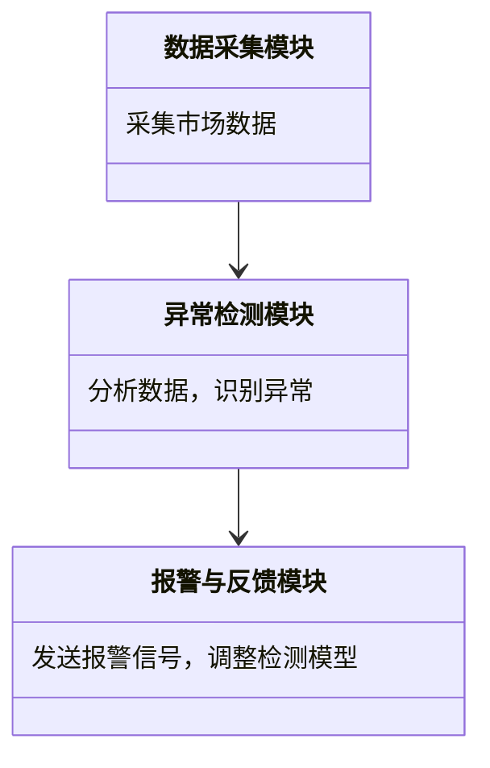

                 

<think>
好的，我将按照您的要求逐步构建这篇文章。首先，让我们理解您的需求：您希望撰写一篇关于利用多智能体系统构建动态市场异常检测模型的技术博客文章。我将按照以下步骤进行：

1. **文章标题**：《利用多智能体系统构建动态的市场异常检测模型》
2. **关键词**：多智能体系统、市场异常检测、动态模型、金融数据分析、人工智能、分布式系统、异常检测算法
3. **摘要**：简要概述文章的核心内容，即如何利用多智能体系统构建动态的市场异常检测模型，涵盖理论、算法、系统设计与实际应用等方面。

接下来，我将逐步构建每个章节的内容，确保涵盖您提到的每一个部分：背景介绍、核心概念、算法原理、系统架构设计、项目实战和最佳实践等。

---

# 利用多智能体系统构建动态的市场异常检测模型

## 关键词：
- 多智能体系统
- 市场异常检测
- 动态模型
- 金融数据分析
- 人工智能
- 分布式系统
- 异常检测算法

## 摘要：
本文探讨了如何利用多智能体系统构建动态的市场异常检测模型。通过分析多智能体系统的架构与通信机制，结合先进的异常检测算法，提出了一种动态、高效的市场异常检测方案。文章从理论基础到实际应用，详细介绍了系统的构建过程，包括算法实现、系统设计与优化策略，为金融市场的稳定运行提供了新的技术解决方案。

---

# 第一部分: 多智能体系统与市场异常检测概述

## 第1章: 多智能体系统与市场异常检测概述

### 1.1 多智能体系统的概念与特点

#### 1.1.1 多智能体系统的定义
多智能体系统（Multi-Agent System, MAS）是由多个相互作用的智能体（Agent）组成的分布式系统，这些智能体通过协作完成复杂任务。每个智能体都有自己的目标、知识和行为规则。

#### 1.1.2 多智能体系统的特征
- **分布式**：智能体独立运行，分布在网络中。
- **协作性**：智能体之间通过通信协作完成任务。
- **反应性**：智能体能够感知环境并实时响应。
- **自主性**：智能体具备自主决策能力。

#### 1.1.3 多智能体系统的优势
- 提高系统的容错性和鲁棒性。
- 增强系统的可扩展性和灵活性。
- 适用于复杂、动态的环境。

### 1.2 市场异常检测的背景与意义

#### 1.2.1 金融市场异常的定义
市场异常指的是市场数据偏离正常波动范围的情况，可能是市场操纵、突发事件或技术故障导致的。

#### 1.2.2 异常检测的重要性
- 保护投资者利益。
- 维护市场公平与稳定。
- 提供实时监控与预警。

#### 1.2.3 市场异常检测的挑战
- 数据的实时性与动态性。
- 异常模式的多样性和隐蔽性。
- 系统的高可用性和实时性要求。

### 1.3 多智能体系统在市场异常检测中的应用

#### 1.3.1 多智能体系统的优势
- 分布式计算能力。
- 实时数据处理能力。
- 高度的可扩展性。

#### 1.3.2 多智能体系统在金融市场的应用
- 实时监控市场数据。
- 分析交易行为。
- 发现异常交易模式。

#### 1.3.3 动态市场异常检测的需求
- 高频交易环境下的实时检测。
- 多市场、多数据源的综合分析。
- 动态调整检测模型。

### 1.4 本章小结
本章介绍了多智能体系统的概念、特点及其在市场异常检测中的应用优势，为后续章节奠定了理论基础。

---

# 第二部分: 多智能体系统的核心原理

## 第2章: 多智能体系统的架构与通信

### 2.1 多智能体系统的架构

#### 2.1.1 分层架构
- **感知层**：负责数据采集和初步处理。
- **决策层**：进行全局决策和任务分配。
- **执行层**：具体执行任务。

#### 2.1.2 分布式架构
- 每个智能体独立运行，通过通信协议协作。

#### 2.1.3 集中式架构
- 中央控制节点负责协调和决策。

### 2.2 多智能体系统的通信机制

#### 2.2.1 通信协议
- **点对点通信**：智能体之间直接通信。
- **发布-订阅模式**：通过消息中间件进行通信。

#### 2.2.2 信息交换
- 数据格式标准化。
- 安全加密机制。

#### 2.2.3 协作与协调
- 利用协商机制解决冲突。

### 2.3 多智能体系统的协作与决策

#### 2.3.1 协作机制
- 基于角色的协作。
- 基于任务的协作。

#### 2.3.2 分布式决策
- 去中心化的决策过程。
- 分布式一致性算法。

#### 2.3.3 冲突解决
- 基于优先级的冲突解决。
- 基于协商的冲突解决。

### 2.4 本章小结
本章详细介绍了多智能体系统的架构与通信机制，为后续章节的系统设计提供了理论支持。

---

# 第三部分: 市场异常检测的算法与模型

## 第3章: 市场异常检测的算法原理

### 3.1 异常检测的基本原理

#### 3.1.1 基于统计的异常检测
- 使用统计方法（如均值、标准差）检测异常。

#### 3.1.2 基于机器学习的异常检测
- 使用监督学习、无监督学习等方法。

#### 3.1.3 基于深度学习的异常检测
- 利用神经网络（如LSTM、Transformer）建模时间序列数据。

### 3.2 多智能体系统中的异常检测

#### 3.2.1 基于MAS的异常检测模型
- 多智能体协同进行数据处理和异常识别。

#### 3.2.2 基于MAS的异常检测算法
- 分布式异常检测算法。
- 基于多智能体的在线学习算法。

#### 3.2.3 基于MAS的异常检测流程
- 数据采集。
- 异常特征提取。
- 分布式计算与协作。

### 3.3 算法实现与优化

#### 3.3.1 算法实现步骤
- 数据预处理。
- 模型训练。
- 异常检测。

#### 3.3.2 算法优化策略
- 参数调优。
- 并行计算优化。
- 模型鲁棒性提升。

#### 3.3.3 算法性能评估
- 准确率、召回率、F1分数等指标。

### 3.4 本章小结
本章详细讲解了异常检测的基本原理和基于多智能体系统的异常检测算法，为后续章节的系统设计提供了算法基础。

---

# 第四部分: 系统设计与实现

## 第4章: 系统设计与架构

### 4.1 系统需求分析

#### 4.1.1 问题场景介绍
- 高频交易环境下的实时检测需求。
- 多市场数据源的综合分析需求。

#### 4.1.2 系统功能设计
- 数据采集模块。
- 异常检测模块。
- 报警与反馈模块。

#### 4.1.3 领域模型（Mermaid类图）


#### 4.1.4 系统架构设计（Mermaid架构图）
```mermaid
container 多智能体系统 {
    数据采集模块
    异常检测模块
    报警与反馈模块
}
```

### 4.2 系统实现与优化

#### 4.2.1 系统实现步骤
- 环境搭建：安装Python、TensorFlow、Kafka等工具。
- 数据预处理：清洗、归一化等。
- 模型训练：基于多智能体的异常检测模型。
- 系统集成：部署多智能体系统，实现通信与协作。

#### 4.2.2 系统优化策略
- 并行计算优化。
- 异常检测模型的动态调整。
- 系统容错性与可扩展性优化。

#### 4.2.3 系统性能评估
- 响应时间。
- 处理能力。
- 异常检测准确率。

### 4.3 本章小结
本章详细介绍了系统的整体设计与实现过程，为实际应用提供了参考。

---

# 第五部分: 项目实战

## 第5章: 项目实战与案例分析

### 5.1 项目环境安装
```bash
pip install numpy pandas tensorflow kafka-python
```

### 5.2 核心代码实现

#### 5.2.1 数据采集模块
```python
import kafka
from kafka import KafkaProducer

# 生产者发送市场数据
def send_market_data():
    producer = KafkaProducer(bootstrap_servers='localhost:9092')
    for data in market_data_generator():
        producer.send('market_topic', value=data)
```

#### 5.2.2 异常检测模块
```python
import tensorflow as tf
from tensorflow.keras import layers

# 基于LSTM的异常检测模型
class AnomalyDetector:
    def __init__(self):
        self.model = self.build_model()
    
    def build_model(self):
        model = tf.keras.Sequential()
        model.add(layers.LSTM(64, input_shape=(None, 1)))
        model.add(layers.Dense(1))
        model.compile(optimizer='adam', loss='mse')
        return model
    
    def detect_anomaly(self, data):
        prediction = self.model.predict(data)
        # 计算误差，判断是否异常
        error = abs(data - prediction)
        return error > threshold
```

#### 5.2.3 报警与反馈模块
```python
import logging

# 报警模块
def send_alarm(message):
    logging.info(f"Alarm: {message}")
```

### 5.3 案例分析与详细解读

#### 5.3.1 数据采集与处理
- 从Kafka主题中接收市场数据。
- 进行数据清洗和预处理。

#### 5.3.2 模型训练与部署
- 使用训练数据训练异常检测模型。
- 部署模型到生产环境，实时接收数据进行检测。

#### 5.3.3 实际案例分析
- 识别市场操纵行为。
- 检测突

