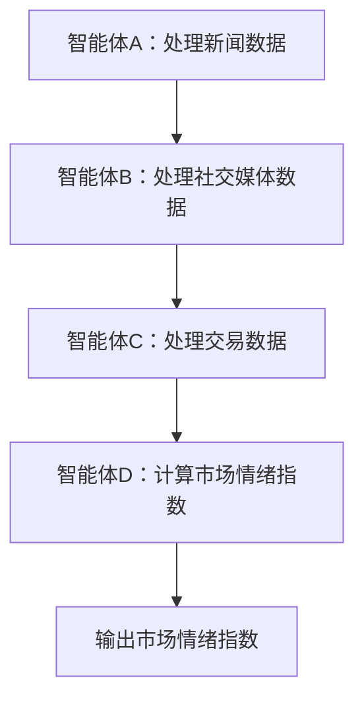
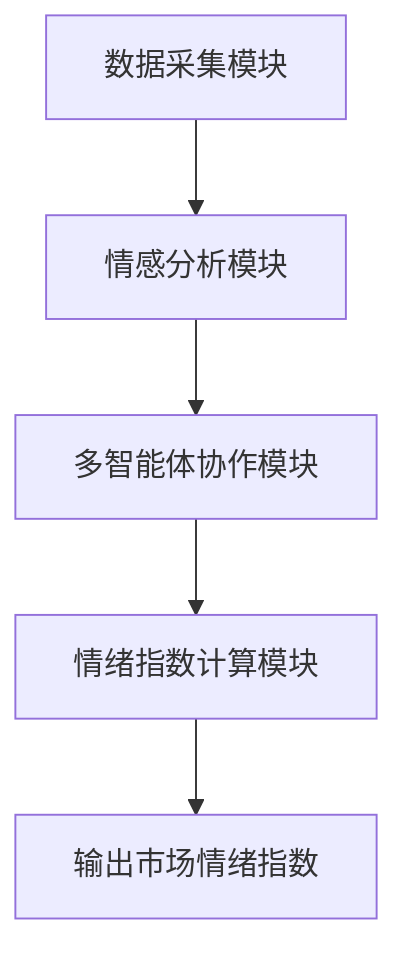

                 


# 利用多智能体系统构建动态的市场情绪指数

---

## 关键词：多智能体系统，市场情绪指数，自然语言处理，协同学习，动态指数

---

## 摘要：  
本文探讨了如何利用多智能体系统构建动态的市场情绪指数。通过结合多智能体系统的优势，我们提出了一种创新的方法来实时分析和预测市场情绪，从而为投资者和市场分析师提供更精准的决策支持。本文从市场情绪指数的传统计算方法入手，分析其局限性，提出基于多智能体系统的解决方案，并详细阐述其算法原理、系统架构设计以及实际应用案例。

---

# 第1章: 市场情绪指数的传统计算方法与局限性

## 1.1 市场情绪指数的定义  
市场情绪指数（Market Sentiment Index, MSI）是用来量化市场参与者情绪的指标。它反映了投资者对市场的乐观或悲观程度，通常基于新闻、社交媒体、交易数据等多种来源的信息进行计算。

---

## 1.2 市场情绪指数的传统计算方法

### 1.2.1 基于新闻的市场情绪分析
- 通过分析新闻标题的情绪倾向（如正面、负面、中性）来计算市场情绪指数。
- 例如：使用自然语言处理（NLP）技术对新闻进行情感分析，统计正面和负面新闻的数量，计算情绪指数。

### 1.2.2 基于社交媒体的市场情绪分析
- 通过分析社交媒体上的用户评论、帖子和情感表达，计算市场情绪指数。
- 例如：使用情感分析模型（如BERT）对社交媒体文本进行分析，统计情绪倾向，计算综合情绪指数。

### 1.2.3 基于交易数据的市场情绪分析
- 通过分析交易数据（如成交量、价格波动）来间接反映市场情绪。
- 例如：使用波动率指标（如VIX指数）来衡量市场的恐慌情绪。

---

## 1.3 市场情绪指数的传统方法的局限性

### 1.3.1 数据来源单一
- 传统方法通常依赖单一数据源（如新闻或社交媒体），无法全面反映市场情绪。
- 例如：社交媒体数据可能无法捕捉到机构投资者的真实情绪。

### 1.3.2 计算方式静态
- 传统方法通常基于固定的规则或统计方法，难以动态调整情绪指数的计算。
- 例如：固定权重的加权平均方法无法根据市场变化实时优化权重。

### 1.3.3 鲁棒性不足
- 传统方法对噪声数据的处理能力较弱，容易受到虚假信息或极端事件的影响。
- 例如：社交媒体上的虚假信息可能扭曲市场情绪指数。

---

## 1.4 多智能体系统的优势

### 1.4.1 分布式计算能力
- 多智能体系统可以分布式处理来自多个数据源的信息，提升计算效率。
- 例如：多个智能体分别负责处理新闻、社交媒体和交易数据。

### 1.4.2 协同学习能力
- 多智能体系统可以通过协同学习优化情绪指数的计算，动态调整权重和模型参数。
- 例如：多个智能体协同学习，实时更新情绪指数的计算公式。

### 1.4.3 高度灵活性
- 多智能体系统可以根据市场变化动态调整计算策略，增强情绪指数的实时性和准确性。
- 例如：根据市场波动实时调整智能体之间的协作策略。

---

## 1.5 本章小结  
本章介绍了市场情绪指数的传统计算方法及其局限性，同时阐述了多智能体系统在克服这些局限性方面的优势，为后续章节的深入分析奠定了基础。

---

# 第2章: 多智能体系统的核心概念与算法原理

## 2.1 多智能体系统的定义与特点

### 2.1.1 多智能体系统的定义
- 多智能体系统是由多个智能体组成的分布式系统，每个智能体都具有一定的自主性和智能性。
- 例如：多个智能体协同工作，分别处理不同类型的数据。

### 2.1.2 多智能体系统的特性
- **自主性**：智能体能够独立决策和行动。
- **反应性**：智能体能够实时感知环境并做出反应。
- **协作性**：智能体之间可以协同完成复杂任务。
- **分布式计算**：智能体之间的计算任务可以分布执行。

### 2.1.3 多智能体系统与单智能体系统的区别
| 特性 | 多智能体系统 | 单智能体系统 |
|------|--------------|--------------|
| 自主性 | 高           | 低           |
| 反应性 | 高           | 中           |
| 分布式 | 高           | 低           |
| 协作性 | 高           | 低           |

---

## 2.2 多智能体系统在市场情绪指数中的应用

### 2.2.1 智能体的分工与协作
- 每个智能体负责处理特定类型的数据，如新闻、社交媒体、交易数据。
- 智能体之间通过通信模块协同完成市场情绪指数的计算。

### 2.2.2 智能体的通信机制
- 使用消息队列（如Kafka）或RPC（如gRPC）进行智能体之间的通信。
- 例如：智能体A计算出新闻情绪指数后，通过通信模块将结果传递给智能体B。

### 2.2.3 智能体的协同学习机制
- 智能体之间通过共享模型参数或交换数据进行协同学习。
- 例如：使用联邦学习（Federated Learning）优化情绪指数的计算模型。

---

## 2.3 多智能体系统的算法原理

### 2.3.1 多智能体系统的协作流程


### 2.3.2 多智能体系统的情绪指数计算公式
$$
\text{市场情绪指数} = \sum_{i=1}^{n} w_i \times s_i
$$
其中：
- $w_i$ 是第 $i$ 个智能体的权重。
- $s_i$ 是第 $i$ 个智能体计算的情绪值。

---

## 2.4 本章小结  
本章详细介绍了多智能体系统的定义、特点及其在市场情绪指数中的应用，为后续章节的系统架构设计和实际应用奠定了理论基础。

---

# 第3章: 市场情绪指数的动态计算与优化

## 3.1 市场情绪指数的动态特性

### 3.1.1 动态特性的重要性
- 市场情绪会随着时间和市场环境的变化而波动。
- 例如：突发事件（如疫情、政策变化）会导致市场情绪快速变化。

### 3.1.2 动态计算的需求
- 需要实时更新市场情绪指数，以反映最新的市场动态。
- 例如：每分钟更新市场情绪指数，捕捉市场的短期波动。

---

## 3.2 基于多智能体系统的动态计算方法

### 3.2.1 动态权重分配
- 根据市场环境的变化动态调整智能体的权重。
- 例如：在市场波动剧烈时，增加交易数据智能体的权重。

### 3.2.2 实时数据处理
- 智能体实时接收和处理最新数据，确保情绪指数的动态更新。
- 例如：使用流处理技术（如Apache Flink）实时处理社交媒体数据。

### 3.2.3 模型优化
- 使用机器学习模型（如LSTM）优化市场情绪指数的计算。
- 例如：训练LSTM模型预测未来的情绪指数变化。

---

## 3.3 动态计算的优化策略

### 3.3.1 基于反馈的优化
- 根据市场情绪指数的实际效果优化计算模型。
- 例如：如果情绪指数预测错误，调整智能体的权重和模型参数。

### 3.3.2 基于博弈论的优化
- 将市场情绪指数的计算转化为博弈论问题，优化智能体的协作策略。
- 例如：智能体之间通过博弈论模型优化协作行为，提高情绪指数的准确性。

---

## 3.4 本章小结  
本章探讨了市场情绪指数的动态特性及其在多智能体系统中的计算方法，提出了动态权重分配和实时数据处理等优化策略，为实际应用提供了参考。

---

# 第4章: 多智能体系统与市场情绪指数的系统架构设计

## 4.1 系统架构设计概述

### 4.1.1 系统目标
- 实时计算市场情绪指数，提供动态的市场情绪分析结果。

### 4.1.2 系统设计原则
- **模块化**：系统功能模块化设计，便于维护和扩展。
- **可扩展性**：系统支持智能体数量的动态扩展。
- **实时性**：系统能够实时处理数据并更新市场情绪指数。

---

## 4.2 系统功能设计

### 4.2.1 数据采集模块
- 负责采集新闻、社交媒体和交易数据。
- 例如：使用API接口从新闻网站获取新闻数据。

### 4.2.2 情感分析模块
- 对采集到的数据进行情感分析，计算每条数据的情绪值。
- 例如：使用预训练的情感分析模型（如BERT）进行文本分析。

### 4.2.3 多智能体协作模块
- 负责协调多个智能体的协作，确保数据的实时处理和计算。
- 例如：智能体之间通过消息队列进行通信，协同完成情绪指数的计算。

### 4.2.4 情绪指数计算模块
- 根据智能体的计算结果，动态调整权重，最终计算市场情绪指数。
- 例如：使用加权平均的方法计算最终的情绪指数。

---

## 4.3 系统架构图



---

## 4.4 系统接口设计

### 4.4.1 数据接口
- 数据输入接口：接收新闻、社交媒体和交易数据。
- 数据输出接口：输出市场情绪指数。

### 4.4.2 智能体接口
- 智能体通信接口：智能体之间的通信接口。
- 智能体协作接口：智能体之间的协作接口。

---

## 4.5 本章小结  
本章详细设计了系统的架构和功能模块，提出了一个基于多智能体系统的市场情绪指数计算框架，为实际应用提供了参考。

---

# 第5章: 项目实战与优化建议

## 5.1 项目实战

### 5.1.1 环境安装
- 安装必要的工具和库，如Python、TensorFlow、Kafka等。
- 例如：安装以下Python库：
  ```
  pip install numpy pandas tensorflow kafka-python
  ```

### 5.1.2 核心代码实现

```python
import numpy as np
from kafka import KafkaConsumer, KafkaProducer
import tensorflow as tf

class SentimentAgent:
    def __init__(self, topic):
        self.topic = topic
        self.consumer = KafkaConsumer(topic)
        self.producer = KafkaProducer()

    def process_data(self, data):
        # 对数据进行情感分析
        sentiment = self.model.predict(data)
        return sentiment

    def run(self):
        for message in self.consumer:
            data = message.value
            sentiment = self.process_data(data)
            self.producer.send('sentiment_topic', sentiment)

if __name__ == '__main__':
    agent = SentimentAgent('market_data')
    agent.run()
```

### 5.1.3 代码解读
- `SentimentAgent`类：负责处理市场数据，进行情感分析。
- `process_data`方法：使用预训练的模型对数据进行情感分析，返回情绪值。
- `run`方法：从Kafka主题中获取数据，处理后发送到另一个主题。

---

## 5.2 实际案例分析

### 5.2.1 案例背景
- 假设我们有三个智能体分别处理新闻、社交媒体和交易数据。
- 使用Kafka进行智能体之间的通信。

### 5.2.2 案例实现
- 每个智能体分别订阅不同的主题，处理数据后发送到情绪指数计算模块。
- 例如：
  ```
  agent1 = SentimentAgent('news_topic')
  agent2 = SentimentAgent('social_topic')
  agent3 = SentimentAgent('trade_topic')
  ```

---

## 5.3 优化建议

### 5.3.1 模型优化
- 使用更先进的深度学习模型（如Transformer）优化情感分析模型。
- 例如：使用预训练的GPT模型进行情感分析。

### 5.3.2 系统优化
- 使用分布式计算框架（如Spark、Flink）优化系统的计算能力。
- 例如：使用Flink进行实时数据处理。

### 5.3.3 机制优化
- 实现智能体之间的动态协作机制，根据市场环境实时调整协作策略。
- 例如：在市场波动剧烈时，增加交易数据智能体的权重。

---

## 5.4 本章小结  
本章通过实际案例分析和优化建议，展示了如何将多智能体系统应用于市场情绪指数的计算，并提出了进一步优化的方向。

---

# 第6章: 总结与展望

## 6.1 本章总结
- 本文提出了利用多智能体系统构建动态市场情绪指数的方法。
- 通过分析市场情绪指数的传统计算方法及其局限性，探讨了多智能体系统的优势。
- 详细设计了系统的架构和功能模块，并通过实际案例展示了系统的实现。

---

## 6.2 未来展望
- 进一步优化多智能体系统的协作机制，提高市场情绪指数的计算精度。
- 探索多智能体系统与其他技术（如区块链、边缘计算）的结合，拓展市场情绪指数的应用场景。
- 研究更先进的算法（如强化学习）优化市场情绪指数的计算过程。

---

# 作者：AI天才研究院 & 禅与计算机程序设计艺术

