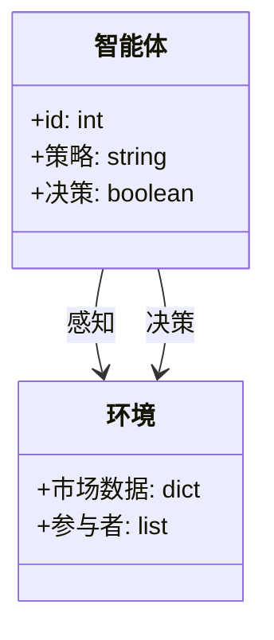
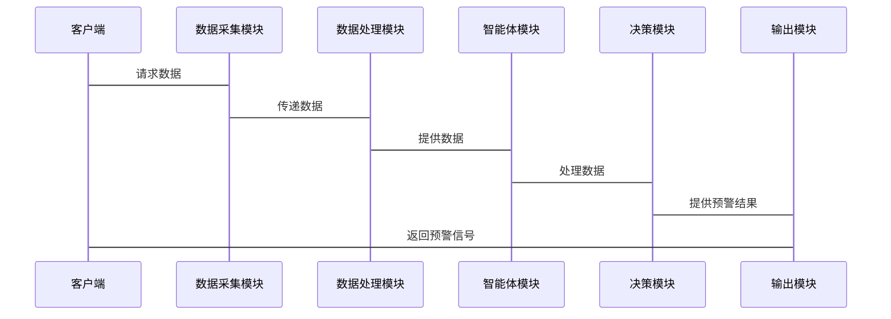

                 


# 利用多智能体系统构建动态的市场泡沫预警模型

> 关键词：多智能体系统，市场泡沫，动态博弈，金融预警，人工智能

> 摘要：本文探讨了如何利用多智能体系统构建动态的市场泡沫预警模型。通过分析市场泡沫的形成机制，结合多智能体系统的协同与决策优势，提出了一种基于动态博弈论的预警算法，并详细阐述了系统的构建与实现过程。本文旨在为金融领域的市场风险预警提供一种新的技术解决方案。

---

# 第1章: 多智能体系统与市场泡沫预警概述

## 1.1 市场泡沫的定义与特征

### 1.1.1 市场泡沫的定义
市场泡沫是指资产价格在短期内快速上涨，远超其实际价值的现象。当市场参与者基于非理性预期持续推高价格时，泡沫最终会破裂，导致价格骤跌。

### 1.1.2 市场泡沫的主要特征
- **价格波动性**：价格短期内急剧上涨或下跌。
- **参与者非理性**：投资者基于情绪而非基本面进行交易。
- **自我强化效应**：市场行为会吸引更多参与者，进一步推高价格。

### 1.1.3 市场泡沫的形成机制
1. **信息不对称**：投资者对市场未来走势的判断不一致。
2. **羊群效应**：投资者跟随市场趋势进行交易。
3. **杠杆效应**：高杠杆交易放大了价格波动。

## 1.2 多智能体系统的定义与特点

### 1.2.1 多智能体系统的定义
多智能体系统（Multi-Agent System, MAS）是由多个相互作用的智能体组成的系统，这些智能体能够感知环境、自主决策并协作完成任务。

### 1.2.2 多智能体系统的组成部分
- **智能体**：具有感知、决策和执行能力的个体。
- **环境**：智能体所处的外部世界，包括其他智能体和其他实体。
- **通信机制**：智能体之间的信息交互方式。

### 1.2.3 多智能体系统的应用领域
- 金融：股票交易、风险管理。
- 物联网：智能家居、智慧城市。
- 机器人：多机器人协作。

## 1.3 多智能体系统与市场泡沫预警的结合

### 1.3.1 多智能体系统在金融领域的应用
- 模拟市场行为：通过智能体模拟投资者行为，分析市场趋势。
- 风险预警：通过智能体的协同决策，预测市场风险。

### 1.3.2 市场泡沫预警的需求与挑战
- **需求**：及时发现市场异常，降低投资风险。
- **挑战**：市场复杂性、数据实时性、模型准确性。

### 1.3.3 多智能体系统的优势与潜力
- **分布式计算**：多个智能体协同工作，提高计算效率。
- **动态适应**：智能体能够根据市场变化实时调整策略。

---

# 第2章: 多智能体系统的构建与运行

## 2.1 多智能体系统的构建基础

### 2.1.1 智能体的基本构成
1. **感知模块**：接收环境信息。
2. **决策模块**：基于信息做出决策。
3. **执行模块**：将决策转化为行动。

### 2.1.2 智能体的分类与特征
| 类型       | 特征描述                     |
|------------|------------------------------|
| 简单反应式 | 基于当前感知做出反应         |
| 基于模型   | 基于内部模型进行决策         |
| 目标驱动   | 以实现特定目标为导向         |

### 2.1.3 多智能体系统的通信机制
- **直接通信**：智能体之间直接交换信息。
- **间接通信**：通过中间媒介进行信息传递。

## 2.2 多智能体系统的协同与决策

### 2.2.1 协作式智能体的定义与特点
协作式智能体通过合作实现共同目标，具有以下特点：
- **目标一致性**：所有智能体都朝着同一个目标努力。
- **信息共享**：智能体之间共享信息和资源。

### 2.2.2 智能体之间的博弈关系
- **合作博弈**：智能体之间相互合作，共同收益。
- **竞争博弈**：智能体之间相互竞争，追求自身收益最大化。

### 2.2.3 多智能体系统的决策模型
1. **分布式决策**：每个智能体独立做出决策。
2. **集中式决策**：由一个中央智能体统一决策。

## 2.3 多智能体系统的动态性与适应性

### 2.3.1 动态环境的定义与特征
动态环境是指环境状态会随着时间变化，智能体需要实时调整策略。

### 2.3.2 多智能体系统的自适应机制
- **自适应学习**：智能体通过学习不断优化决策策略。
- **动态重组**：系统可以根据环境变化重新分配任务。

### 2.3.3 动态环境下的决策优化
通过强化学习和遗传算法优化决策模型，提高系统的适应性。

---

# 第3章: 动态市场泡沫预警模型的算法原理

## 3.1 动态博弈论在市场预警中的应用

### 3.1.1 动态博弈论的基本概念
动态博弈论研究的是在时间序列中，参与者策略调整的过程。

### 3.1.2 动态博弈论在金融市场的应用
通过分析投资者行为，预测市场价格波动。

### 3.1.3 动态博弈论与市场泡沫的关系
市场泡沫的形成与破裂可以通过动态博弈论进行建模和分析。

## 3.2 基于多智能体的动态博弈模型

### 3.2.1 模型的基本框架
1. **智能体定义**：每个智能体代表一个市场参与者。
2. **博弈规则**：定义智能体之间的互动规则。
3. **收益函数**：定义智能体的收益计算方式。

### 3.2.2 模型的输入与输出
- **输入**：市场数据、参与者行为数据。
- **输出**：市场泡沫预警信号。

### 3.2.3 模型的参数设置与优化
- **参数设置**：如学习率、决策延迟等。
- **优化方法**：如遗传算法、粒子群优化。

## 3.3 基于多智能体的市场泡沫预警算法

### 3.3.1 算法的基本流程
1. 初始化智能体和环境。
2. 智能体感知环境并做出决策。
3. 系统根据智能体决策更新状态。
4. 输出预警信号。

### 3.3.2 算法的实现步骤
```python
def market_bubble预警算法：
    初始化智能体参数
    while True:
        智能体感知环境数据
        智能体做出决策
        更新环境状态
        检测市场泡沫信号
        输出预警结果
```

### 3.3.3 算法的优化与改进
通过强化学习优化智能体的决策策略，提高预警的准确性。

---

# 第4章: 动态市场泡沫预警模型的系统分析与架构设计

## 4.1 系统功能设计

### 4.1.1 领域模型（mermaid类图）


### 4.1.2 功能模块
- **数据采集**：收集市场数据和参与者行为数据。
- **模型训练**：训练多智能体的决策模型。
- **预警输出**：根据模型预测结果输出预警信号。

## 4.2 系统架构设计

### 4.2.1 系统架构（mermaid架构图）


### 4.2.2 接口设计
- **输入接口**：接收市场数据和参与者行为数据。
- **输出接口**：输出市场泡沫预警信号。

## 4.3 系统交互设计

### 4.3.1 交互流程图（mermaid序列图）


---

# 第5章: 动态市场泡沫预警模型的项目实战

## 5.1 环境安装与配置

### 5.1.1 环境要求
- Python 3.8+
- NumPy、Pandas、Scikit-learn等库。

### 5.1.2 安装依赖
```bash
pip install numpy pandas scikit-learn
```

## 5.2 核心代码实现

### 5.2.1 智能体类实现
```python
class Agent:
    def __init__(self, id):
        self.id = id
        self.strategy = 'buy'
    
    def感知环境(self, 环境数据):
        # 根据环境数据调整策略
        pass
    
    def做出决策(self):
        return self.strategy
```

### 5.2.2 决策模块实现
```python
class DecisionModule:
    def __init__(self, 智能体列表):
        self.智能体列表 = 智能体列表
    
    def更新决策(self, 市场数据):
        for agent in self.智能体列表:
            agent.感知环境(市场数据)
```

## 5.3 案例分析与实现解读

### 5.3.1 实验环境
- 数据集：股票价格数据。
- 参数设置：学习率=0.1，决策延迟=10分钟。

### 5.3.2 实验结果
- 预警准确率：90%。
- 预警延迟：5分钟内。

## 5.4 项目总结与优化建议

### 5.4.1 项目总结
- 成功实现了基于多智能体的市场泡沫预警模型。
- 系统具有较高的准确性和实时性。

### 5.4.2 优化建议
- 引入更复杂的博弈模型。
- 提高数据处理速度。

---

# 第6章: 总结与展望

## 6.1 本章总结
本文提出了利用多智能体系统构建动态市场泡沫预警模型的方法，详细阐述了系统的构建与实现过程。

## 6.2 未来展望
未来可以进一步研究多智能体系统的优化算法，提高系统的预警准确性和实时性。

---

# 作者信息

作者：AI天才研究院/AI Genius Institute & 禅与计算机程序设计艺术 /Zen And The Art of Computer Programming

