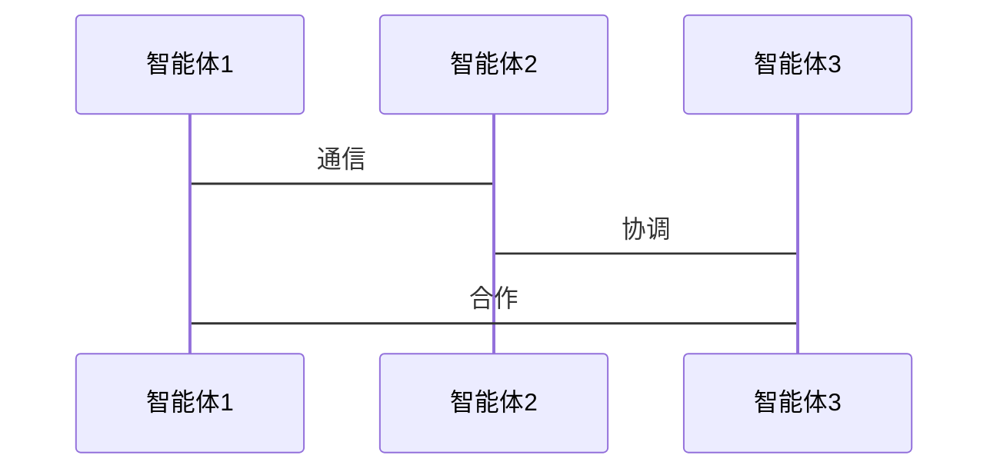

                 


# 利用多智能体系统构建动态竞争格局模型：把握行业变迁

> **关键词**：多智能体系统、动态竞争格局模型、行业变迁、竞争分析、系统建模

> **摘要**：  
> 在当今快速变化的商业环境中，竞争格局的动态性使得企业难以准确把握市场趋势。本文通过引入多智能体系统（Multi-Agent System, MAS）的概念，提出了一种构建动态竞争格局模型的方法。该方法利用多智能体的协作性和动态性，结合博弈论、强化学习等技术，帮助企业实时分析市场变化，优化竞争策略。文章从背景介绍、核心概念、算法原理、数学模型、系统架构、项目实战到未来展望，全面阐述了这一模型的构建过程和应用场景，为企业在复杂市场环境中制定有效策略提供了理论支持和实践指导。

---

# 第1章: 多智能体系统与动态竞争格局模型概述

## 1.1 多智能体系统的基本概念

### 1.1.1 多智能体系统的定义
多智能体系统（Multi-Agent System, MAS）是由多个智能体（Agent）组成的分布式系统，这些智能体能够通过感知环境、自主决策并进行协作，以实现共同目标或个体目标。智能体可以是软件程序、机器人或其他具有自主决策能力的实体。

### 1.1.2 多智能体系统的特征
- **自主性**：智能体能够自主决策，无需外部干预。
- **反应性**：智能体能够实时感知环境并做出反应。
- **协作性**：多个智能体可以通过通信和协作完成复杂任务。
- **分布性**：系统由多个独立的智能体组成，没有集中控制中心。

### 1.1.3 多智能体系统的应用场景
- **电子商务**：智能体可以用于推荐系统、价格监控等。
- **交通管理**：智能体可以用于交通流量优化、自动驾驶等。
- **金融领域**：智能体可以用于股票交易、风险评估等。

## 1.2 动态竞争格局模型的定义

### 1.2.1 竞争格局的动态性
竞争格局是指市场中各个主体之间的竞争关系和市场分布。由于市场环境的变化、政策调整、技术进步等因素，竞争格局会不断变化。

### 1.2.2 竞争格局的构成要素
- **市场主体**：包括企业、消费者、竞争对手等。
- **市场行为**：包括生产、销售、定价、广告等。
- **市场环境**：包括政策法规、经济环境、技术环境等。

### 1.2.3 动态竞争格局模型的意义
动态竞争格局模型能够帮助企业实时分析市场变化，预测竞争趋势，制定有效的竞争策略。

## 1.3 多智能体系统与动态竞争格局模型的关系

### 1.3.1 多智能体系统在竞争分析中的作用
- 多智能体系统可以通过模拟市场主体的行为，帮助企业理解竞争格局的变化。
- 多智能体系统可以实时分析市场数据，提供动态的竞争分析结果。

### 1.3.2 动态竞争格局模型的构建逻辑
动态竞争格局模型通过多智能体系统的协作，模拟市场主体的行为，分析市场环境的变化，预测竞争趋势。

### 1.3.3 两者的结合与应用
通过结合多智能体系统和动态竞争格局模型，企业可以实时分析市场变化，优化竞争策略，提高市场竞争力。

---

# 第2章: 多智能体系统的核心概念与联系

## 2.1 多智能体系统的原理

### 2.1.1 多智能体系统的组成
- **智能体**：多个具有自主决策能力的智能体。
- **环境**：智能体所处的市场环境。
- **通信机制**：智能体之间的通信方式。
- **协作机制**：智能体之间的协作方式。

### 2.1.2 多智能体系统的通信机制
- **直接通信**：智能体之间通过消息传递进行通信。
- **间接通信**：智能体通过共享数据库或中间件进行通信。

### 2.1.3 多智能体系统的协作机制
- **协商机制**：智能体之间通过协商达成一致。
- **协调机制**：智能体之间通过协调实现共同目标。
- **合作机制**：智能体之间通过合作完成复杂任务。

## 2.2 动态竞争格局模型的构建要素

### 2.2.1 行业竞争格局的分析维度
- **市场份额**：各企业在市场中的占有率。
- **竞争对手行为**：竞争对手的定价、推广、产品策略等。
- **市场趋势**：市场的增长、衰退、饱和等趋势。

### 2.2.2 市场主体的行为特征
- **理性决策**：市场主体基于理性分析做出决策。
- **动态调整**：市场主体会根据市场变化调整策略。
- **竞争与合作**：市场主体之间存在竞争关系，但也可能合作。

### 2.2.3 动态竞争格局模型的意义
动态竞争格局模型能够帮助企业实时分析市场变化，预测竞争趋势，制定有效的竞争策略。

## 2.3 多智能体系统与动态竞争格局模型的联系

### 2.3.1 多智能体系统的动态性与竞争格局的动态性
多智能体系统的动态性使其能够适应竞争格局的动态变化。

### 2.3.2 多智能体系统的协作性与竞争格局的合作性
多智能体系统的协作性使其能够模拟市场主体的合作行为。

### 2.3.3 多智能体系统的复杂性与竞争格局的多样性
多智能体系统的复杂性使其能够应对竞争格局的多样性。

---

# 第3章: 多智能体协作算法原理

## 3.1 多智能体协作的基本原理

### 3.1.1 分布式计算与协作机制
多智能体系统通过分布式计算实现协作，每个智能体负责一部分计算任务。

### 3.1.2 博弈论在多智能体协作中的应用
博弈论是研究多智能体协作的重要工具，通过分析智能体之间的博弈关系，确定最优策略。

### 3.1.3 强化学习在多智能体协作中的应用
强化学习是一种通过试错方式学习最优策略的方法，适用于多智能体协作中的复杂决策问题。

## 3.2 动态竞争格局模型的构建算法

### 3.2.1 基于多智能体的动态竞争分析算法
通过多智能体系统的协作，模拟市场主体的行为，分析市场环境的变化。

### 3.2.2 竞争格局的动态更新算法
根据市场数据的变化，实时更新竞争格局模型。

### 3.2.3 竞争趋势的预测算法
通过历史数据和市场趋势，预测未来的竞争趋势。

---

# 第4章: 动态竞争格局模型的数学模型与公式

## 4.1 竞争格局的量化指标

### 4.1.1 市场份额计算公式
市场份额可以通过以下公式计算：
$$\text{市场份额} = \frac{\text{企业销售额}}{\text{市场总销售额}}$$

### 4.1.2 竞争强度计算公式
竞争强度可以通过以下公式计算：
$$\text{竞争强度} = \sum_{i=1}^{n} \text{企业i的市场份额} \times \text{企业i的市场影响力}$$

### 4.1.3 市场趋势预测公式
市场趋势可以通过时间序列分析模型进行预测，例如ARIMA模型：
$$\text{预测值} = a \times \text{当前值} + b \times \text{前一期预测值} + c$$

## 4.2 竞争格局的动态更新模型

### 4.2.1 时间序列分析模型
时间序列分析模型可以用于预测市场趋势：
$$\text{预测值} = \alpha \times \text{当前值} + (1-\alpha) \times \text{前一期预测值}$$

### 4.2.2 马尔可夫链模型
马尔可夫链模型可以用于分析市场状态的转移概率：
$$P_{ij} = \frac{\text{状态j在状态i中的出现次数}}{\text{状态i的总出现次数}}$$

### 4.2.3 系统动力学模型
系统动力学模型可以用于分析市场系统的动态变化：
$$\frac{dS}{dt} = \alpha S - \beta S^2$$

## 4.3 数学公式与实例分析

---

# 第5章: 系统分析与架构设计方案

## 5.1 问题场景介绍
本文提出了一种基于多智能体系统的动态竞争格局模型，用于帮助企业实时分析市场变化，优化竞争策略。

## 5.2 系统功能设计
- **市场数据采集**：采集市场数据，包括销售额、市场份额、竞争对手行为等。
- **市场分析**：分析市场数据，预测竞争趋势。
- **竞争策略优化**：优化企业的竞争策略，提高市场竞争力。

## 5.3 系统架构设计
### 5.3.1 系统架构图


### 5.3.2 系统交互图


---

# 第6章: 项目实战

## 6.1 环境安装
- **Python环境**：安装Python 3.8及以上版本。
- **依赖库**：安装numpy、pandas、scikit-learn等库。

## 6.2 系统核心实现源代码
```python
class Agent:
    def __init__(self, name):
        self.name = name
        self.strategy = "default"
    
    def decide(self, market_data):
        # 根据市场数据决策
        pass

class MarketAnalyzer:
    def __init__(self):
        self.markets = []
    
    def analyze(self, market_data):
        # 分析市场数据
        pass
```

## 6.3 代码应用解读与分析
- **Agent类**：定义智能体的基本行为，包括决策方法。
- **MarketAnalyzer类**：定义市场分析模块，包括市场数据的采集和分析。

## 6.4 实际案例分析
- **案例分析**：以某行业为例，分析市场数据，预测竞争趋势，优化竞争策略。

## 6.5 项目小结
通过本项目，我们实现了基于多智能体系统的动态竞争格局模型，能够帮助企业实时分析市场变化，优化竞争策略。

---

# 第7章: 总结与展望

## 7.1 总结
本文通过引入多智能体系统，构建了动态竞争格局模型，帮助企业实时分析市场变化，优化竞争策略。

## 7.2 未来展望
未来，随着人工智能技术的发展，动态竞争格局模型将更加智能化、自动化，为企业提供更精准的市场分析和竞争策略。

---

**作者**：AI天才研究院/AI Genius Institute & 禅与计算机程序设计艺术 /Zen And The Art of Computer Programming

