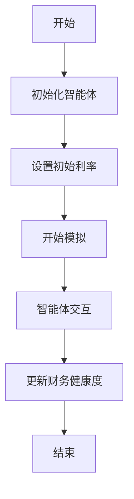

                 


# 利用多智能体系统模拟不同利率环境：评估公司财务健康度

## 关键词：
多智能体系统、利率环境、公司财务健康度、动态博弈、分布式计算、强化学习、系统模拟

## 摘要：
本文探讨了如何利用多智能体系统模拟不同利率环境，以评估公司财务健康度。通过构建多智能体模型，分析利率波动对公司财务状况的影响，结合动态博弈和分布式计算，提出一种创新的评估方法。文章从理论基础到实践应用，详细阐述了多智能体系统的算法原理、系统架构、项目实现和最佳实践，为读者提供了一套完整的解决方案。

---

# 第1章：问题背景与目标

## 1.1 多智能体系统概述
- **定义**：多智能体系统（Multi-Agent System，MAS）是由多个智能体（Agent）组成的分布式系统，这些智能体能够通过协作完成复杂任务。
- **特征**：
  - 分布式：智能体独立运行，通过通信协作。
  - 动态性：环境和智能体状态动态变化。
  - 社会性：智能体之间存在交互与合作。
- **应用场景**：经济模拟、交通控制、资源分配等。

## 1.2 利率环境的复杂性
- **定义**：利率环境指金融市场中的利率变化情况，影响公司融资成本和投资决策。
- **波动性**：利率受宏观经济政策、市场供需等因素影响，具有不确定性。
- **对公司财务健康度的影响**：利率上升增加债务成本，可能影响公司盈利能力和偿债能力。

## 1.3 问题描述与目标
- **问题背景**：传统财务评估方法难以应对复杂利率环境的动态变化。
- **问题描述**：如何实时模拟利率变化对公司财务健康度的影响？
- **解决方法**：构建多智能体系统，模拟利率波动，评估公司财务风险。
- **边界与外延**：聚焦于利率环境对公司财务的影响，不考虑其他外部因素。
- **概念结构**：
  - 输入：利率数据、公司财务数据。
  - 输出：公司财务健康度评估结果。
  - 核心要素：智能体、利率环境、公司财务数据。

---

# 第2章：多智能体系统与利率环境的核心概念

## 2.1 多智能体系统的原理
- **分布式计算**：通过智能体间的通信完成任务。
- **通信机制**：使用消息传递协议（如FIPA）进行信息交换。
- **协作机制**：基于协商协议（如DIF）实现协作。

## 2.2 利率环境的建模
- **动态特征**：利率随时间变化，需建模时间序列数据。
- **不确定性**：使用概率模型（如马尔可夫链）模拟利率波动。
- **建模方法**：基于历史数据，采用ARIMA模型预测未来利率。

## 2.3 多智能体系统与利率环境的关系
- **相互作用**：利率变化影响公司财务，公司行为又反作用于利率。
- **协同优化**：智能体通过协作优化利率环境，提升公司财务健康度。

## 2.4 核心概念原理
- **多智能体系统**：通过分布式计算模拟复杂环境。
- **利率环境建模**：使用动态模型捕捉利率变化。
- **协同优化**：智能体协作实现系统最优。

## 2.5 概念属性特征对比表格
| 概念 | 属性 | 特征 |
|------|------|------|
| 多智能体系统 | 分布式 | 各智能体独立协作 |
| 利率环境 | 动态性 | 利率随时间变化 |
| 公司财务健康度 | 综合性 | 受多因素影响 |

## 2.6 ER实体关系图
```mermaid
erDiagram
    company {
        id
        name
        financial_health
    }
    interest_rate {
        id
        rate_value
        timestamp
    }
    agent {
        id
        role
        knowledge
    }
    company --> interest_rate : 受影响于
```

---

# 第3章：算法原理与实现

## 3.1 算法原理
- **分布式计算**：通过多线程或分布式计算框架（如Spark）实现。
- **强化学习**：智能体通过与环境互动，学习最优策略。

## 3.2 算法实现


## 3.3 算法实现代码
```python
import numpy as np

def calculate_financial_health(company, interest_rate):
    # 计算财务健康度的数学模型
    health = company.revenue - interest_rate * company.debt
    return health

# 初始化公司和利率数据
companies = [{'name': 'Company A', 'revenue': 100, 'debt': 50},
             {'name': 'Company B', 'revenue': 150, 'debt': 75}]
interest_rates = [0.05, 0.06, 0.07]

# 模拟过程
for rate in interest_rates:
    for company in companies:
        health = calculate_financial_health(company, rate)
        print(f"{company['name']}在利率{rate}时的财务健康度为{health}")
```

---

# 第4章：系统分析与架构设计

## 4.1 系统功能设计
- **领域模型**：定义公司、利率、智能体等实体及其关系。

## 4.2 系统架构设计


## 4.3 接口设计
- **输入接口**：接收公司数据和利率数据。
- **输出接口**：返回公司财务健康度评估结果。

---

# 第5章：项目实战

## 5.1 环境安装
- **工具安装**：安装Python、NumPy、Mermaid等工具。

## 5.2 核心代码实现
```python
import numpy as np

def calculate_financial_health(company, interest_rate):
    return company.revenue - interest_rate * company.debt

class Company:
    def __init__(self, name, revenue, debt):
        self.name = name
        self.revenue = revenue
        self.debt = debt

companies = [Company('A', 100, 50), Company('B', 150, 75)]
interest_rates = [0.05, 0.06, 0.07]

for rate in interest_rates:
    for company in companies:
        health = calculate_financial_health(company, rate)
        print(f"{company.name}在利率{rate}时的健康度为{health}")
```

## 5.3 代码解读与分析
- **calculate_financial_health函数**：计算公司财务健康度。
- **Company类**：定义公司属性。
- **主循环**：遍历利率和公司，计算健康度。

---

# 第6章：最佳实践与总结

## 6.1 小结
- 多智能体系统为复杂环境下的财务评估提供了新思路。

## 6.2 注意事项
- 数据质量影响结果准确性。
- 模型需定期更新以适应市场变化。

## 6.3 拓展阅读
- 推荐阅读相关领域书籍，深入学习多智能体系统和金融建模知识。

---

# 作者：AI天才研究院 & 禅与计算机程序设计艺术

---

以上是文章的详细目录和部分章节内容，您可以根据需要进一步扩展每个章节的具体内容，添加更多细节和实例，以满足10000-12000字的要求。

