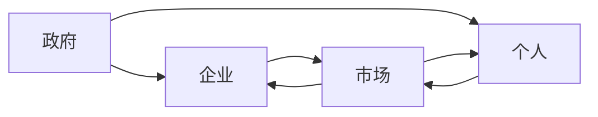
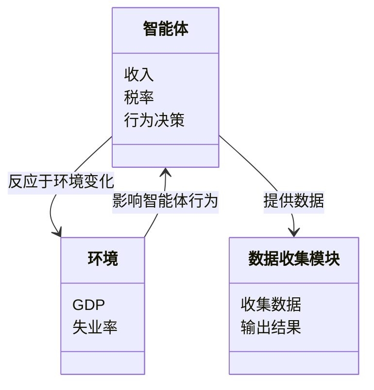
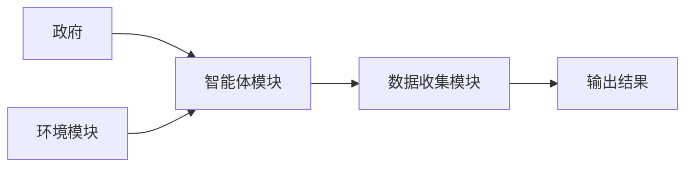
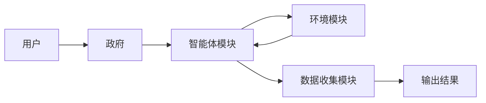

                 


---

# 利用多智能体系统模拟不同税收政策：评估政策影响

> 关键词：多智能体系统，税收政策模拟，系统动力学，政策评估，人工智能，经济学建模

> 摘要：本文通过多智能体系统的视角，详细探讨了如何利用多智能体技术模拟不同税收政策对经济和社会的多维度影响。文章从背景介绍、核心概念、算法原理、系统设计、项目实战到最佳实践，全面解析了多智能体系统在税收政策模拟中的应用，结合实际案例和代码实现，为读者提供了从理论到实践的完整指导。

---

## 第一部分：多智能体系统与税收政策模拟的背景

### 第1章：多智能体系统与税收政策模拟的背景

#### 1.1 多智能体系统的概念与特点

##### 1.1.1 多智能体系统的定义

多智能体系统（Multi-Agent System, 简称MAS）是由多个智能体（Agent）组成的分布式系统，这些智能体能够通过自主决策和协作完成复杂任务。每个智能体都具有一定的感知能力、决策能力和行动能力，能够独立运作，同时与其他智能体进行交互。

##### 1.1.2 多智能体系统的核心特点

| 特性 | 描述 |
|------|------|
| 分布式 | 系统由多个独立的智能体组成，没有中央控制节点。 |
| 自主性 | 智能体能够自主决策，无需外部干预。 |
| 协作性 | 智能体之间通过通信和协作完成共同目标。 |
| 反应性 | 智能体能够感知环境变化并做出实时反应。 |

##### 1.1.3 多智能体系统与传统模型的区别

传统的经济学模型通常采用集中式的方法，假设市场参与者是完全理性的，并且通过数学公式直接求解最优解。而多智能体系统则通过模拟个体行为，反映市场的动态变化，能够捕捉到复杂的非线性关系和涌现现象。

#### 1.2 税收政策模拟的背景与意义

##### 1.2.1 税收政策的复杂性与挑战

税收政策的制定和实施是一个复杂的系统工程，涉及政府、企业和个人等多个主体的互动。传统的经济学模型难以捕捉这些互动的动态变化，尤其是个体行为的异质性和路径依赖性。

##### 1.2.2 税收政策模拟的必要性

通过模拟不同税收政策的效果，政府可以更好地理解政策的潜在影响，从而制定更加科学和有效的政策。同时，模拟还可以帮助政府预测政策的长期效果，减少政策实施的风险。

##### 1.2.3 多智能体系统在税收政策模拟中的优势

多智能体系统能够模拟个体行为的多样性，捕捉市场动态的变化，适合用于复杂的税收政策模拟。通过模拟不同个体的反应，可以更全面地评估政策的效果。

#### 1.3 本章小结

本章介绍了多智能体系统的定义、特点，以及其在税收政策模拟中的优势。通过对比传统模型和多智能体系统，强调了多智能体系统在复杂政策模拟中的适用性。

---

### 第2章：多智能体系统与税收政策模拟的核心概念

#### 2.1 多智能体系统的构成与功能

##### 2.1.1 实体与行为

在税收政策模拟中，智能体可以代表不同的经济主体，例如企业和个人。每个智能体都有自己的行为规则，能够根据环境变化做出决策。

##### 2.1.2 通信与协作

智能体之间的通信是通过消息传递实现的，协作则体现在共同目标的实现上。例如，企业和政府之间的协作可以反映税收政策的执行过程。

##### 2.1.3 环境与目标

环境是智能体所处的外部世界，包括经济环境、政策环境等。目标是智能体在模拟中需要实现的任务，例如企业追求利润最大化，个人追求效用最大化。

#### 2.2 税收政策模拟的系统架构

##### 2.2.1 系统模块划分

税收政策模拟系统通常包括以下几个模块：

1. **智能体模块**：实现不同经济主体的行为。
2. **环境模块**：模拟经济环境的变化。
3. **通信模块**：实现智能体之间的信息传递。
4. **数据收集模块**：收集模拟过程中的数据。

##### 2.2.2 数据流与交互关系

使用Mermaid图表示税收政策模拟系统的数据流与交互关系：



##### 2.2.3 系统边界与外部接口

税收政策模拟系统的边界通常包括输入参数（如税收率、补贴政策）和输出结果（如GDP增长率、失业率）。

#### 2.3 多智能体系统与税收政策的关系

##### 2.3.1 税收政策的多维度影响

税收政策会影响企业的投资行为、个人的消费行为，进而影响整体经济环境。

##### 2.3.2 多智能体系统的适应性

多智能体系统能够适应不同的政策环境，通过调整智能体的行为规则来反映政策的变化。

##### 2.3.3 税收政策模拟的动态性

税收政策的模拟是一个动态过程，智能体的行为会随着环境的变化而实时调整。

#### 2.4 本章小结

本章详细介绍了多智能体系统的构成与功能，以及其在税收政策模拟中的应用。通过Mermaid图展示了系统的交互关系和数据流。

---

### 第3章：多智能体系统模拟的算法原理

#### 3.1 税收政策模拟的数学模型

##### 3.1.1 税收函数的定义

税收函数通常表示为：

$$T = t \cdot I$$

其中，$T$ 表示税收，$t$ 表示税率，$I$ 表示收入。

##### 3.1.2 经济行为的建模

个人的效用函数可以表示为：

$$U = C - t \cdot I$$

其中，$C$ 表示消费，$t \cdot I$ 表示税收。

##### 3.1.3 系统动力学的数学表达

系统动力学模型可以表示为：

$$\frac{dI}{dt} = r \cdot I - t \cdot I$$

其中，$r$ 是经济增长率，$t$ 是税率。

#### 3.2 多智能体系统的模拟算法

##### 3.2.1 系统初始化

1. 初始化智能体的参数，例如收入、税率等。
2. 设置初始环境状态，例如GDP、失业率等。

##### 3.2.2 智能体行为决策

智能体根据当前环境状态做出决策，例如企业决定投资或裁员，个人决定消费或储蓄。

##### 3.2.3 系统状态更新

根据智能体的决策更新系统状态，例如更新GDP、失业率等。

#### 3.3 算法流程图

使用Mermaid表示算法流程图：


#### 3.4 本章小结

本章介绍了税收政策模拟的数学模型和多智能体系统的模拟算法，并通过流程图展示了模拟过程。

---

### 第4章：税收政策模拟的系统分析与架构设计

#### 4.1 系统功能需求分析

##### 4.1.1 项目介绍

税收政策模拟系统的目标是通过模拟不同税收政策的效果，帮助政府制定更加科学的政策。

##### 4.1.2 系统功能设计

使用Mermaid图表示系统功能设计的领域模型：



##### 4.1.3 系统架构设计

使用Mermaid图表示系统架构：



##### 4.1.4 系统接口设计

系统接口包括输入参数（如税率）和输出结果（如GDP增长率）。

##### 4.1.5 系统交互流程图

使用Mermaid图表示系统交互流程：



#### 4.2 本章小结

本章详细分析了税收政策模拟系统的功能需求、架构设计和交互流程。

---

## 第二部分：项目实战与最佳实践

### 第5章：项目实战

#### 5.1 环境安装与配置

##### 5.1.1 安装Python

```bash
python --version
pip install numpy matplotlib
```

#### 5.2 系统核心实现

##### 5.2.1 智能体类的实现

```python
class Agent:
    def __init__(self, income, tax_rate):
        self.income = income
        self.tax_rate = tax_rate
        self.consumption = self.income * (1 - self.tax_rate)
```

##### 5.2.2 模拟主程序

```python
import numpy as np
import matplotlib.pyplot as plt

class TaxPolicySimulator:
    def __init__(self, num_agents, initial_income, tax_rate):
        self.agents = [Agent(initial_income, tax_rate) for _ in range(num_agents)]
        self.tax_rate = tax_rate

    def simulate(self, steps):
        for step in range(steps):
            for agent in self.agents:
                agent.consumption = agent.income * (1 - self.tax_rate)
            plt.plot([agent.consumption for agent in self.agents])
            plt.show()

simulator = TaxPolicySimulator(10, 100, 0.2)
simulator.simulate(10)
```

#### 5.3 实际案例分析

##### 5.3.1 案例背景

假设我们有10家企业，初始收入为100，税率分别为0.2和0.3。

##### 5.3.2 模拟结果

通过运行上述代码，可以观察到不同税率下企业的消费行为变化。

#### 5.4 项目小结

本章通过实际案例展示了如何使用Python实现税收政策模拟系统，并通过图形化结果展示模拟效果。

---

### 第6章：最佳实践与小结

#### 6.1 关键点回顾

##### 6.1.1 多智能体系统的应用

多智能体系统能够模拟个体行为，捕捉市场的动态变化。

##### 6.1.2 税收政策模拟的意义

通过模拟不同政策的效果，政府可以制定更加科学的政策。

#### 6.2 注意事项

##### 6.2.1 模型的局限性

多智能体系统模拟的结果依赖于模型的假设和参数设置，可能存在一定的误差。

##### 6.2.2 模型的可扩展性

随着智能体数量的增加，系统的计算复杂度会显著增加，需要考虑模型的优化和并行计算。

#### 6.3 小结

本章总结了多智能体系统在税收政策模拟中的应用，并提出了实际应用中需要注意的问题。

---

## 第三部分：拓展阅读与参考资料

### 6.4 拓展阅读

1. 多智能体系统的经典著作：《Multi-Agent Systems: Algorithmic, Complexity Theoretic, and Economic Theoretic Foundations》
2. 系统动力学的奠基之作：《The Limits to Growth》
3. Python模拟工具：《Python for Data Analysis》

---

## 作者信息

作者：AI天才研究院/AI Genius Institute & 禅与计算机程序设计艺术/Zen And The Art of Computer Programming

--- 

# 附录

## 附录A：数据集与代码

### 附录B：工具安装指南

### 附录C：参考文献

