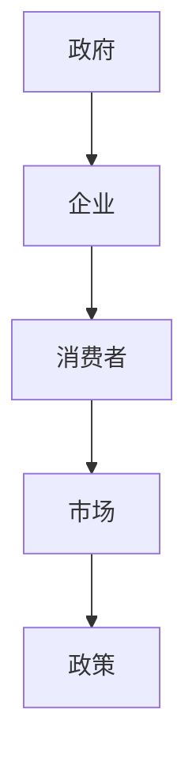
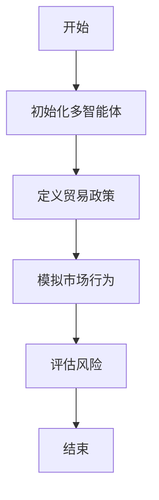
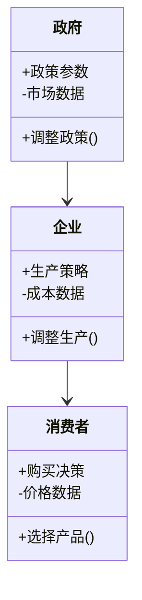
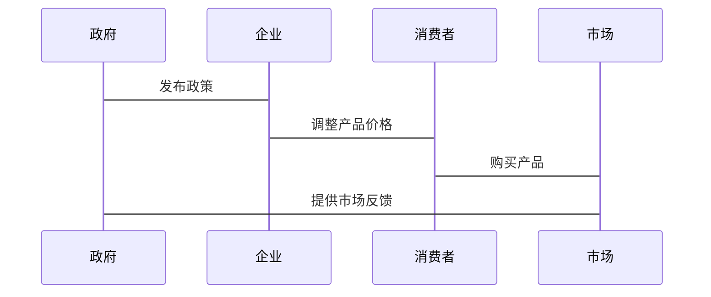

                 


# 利用多智能体系统模拟不同贸易政策：评估全球化风险

## 关键词：多智能体系统、贸易政策模拟、全球化风险、经济模型、系统设计

## 摘要：本文探讨了利用多智能体系统模拟不同贸易政策的方法，分析其在全球化风险评估中的应用。通过系统设计、算法实现和案例分析，展示了如何利用多智能体系统进行经济模拟，评估贸易政策的潜在风险，并提出优化建议。

---

# 第1章: 多智能体系统与贸易政策概述

## 1.1 多智能体系统的定义与特点
### 1.1.1 多智能体系统的定义
多智能体系统（Multi-Agent System, MAS）是由多个智能体（Agent）组成的分布式系统，这些智能体能够自主决策、协作和交互，共同完成复杂任务。

### 1.1.2 多智能体系统的核心特点
- **自主性**：每个智能体都能独立决策。
- **反应性**：能够感知环境并实时响应。
- **协作性**：智能体之间通过通信和协调完成共同目标。
- **分布式性**：系统由多个独立的智能体构成，没有中心控制节点。

### 1.1.3 多智能体系统与传统单智能体系统的区别
| 特性           | 单智能体系统       | 多智能体系统       |
|----------------|--------------------|--------------------|
| 控制方式       | 中央控制           | 分布式控制         |
| 任务处理       | 单一主体处理任务   | 多个主体协作完成任务 |
| 系统复杂度     | 较低               | 较高               |

## 1.2 贸易政策的基本概念
### 1.2.1 贸易政策的定义
贸易政策是国家或组织为了管理国际贸易活动而制定的规则和措施，包括关税、补贴、贸易壁垒等。

### 1.2.2 主要贸易政策类型
- **自由贸易政策**：减少贸易壁垒，促进商品自由流动。
- **保护主义政策**：通过关税和补贴保护国内产业。
- **配额政策**：限制进口商品的数量。

### 1.2.3 全球化与贸易政策的关系
全球化促进了跨国贸易和投资，使得贸易政策的制定和实施更加复杂，需要考虑全球市场和各国利益的平衡。

## 1.3 全球化风险的定义与评估
### 1.3.1 全球化风险的定义
全球化风险是指由于全球化进程中的不确定性因素（如经济波动、政策变化等）可能带来的负面影响。

### 1.3.2 全球化风险的主要类型
- **经济风险**：如汇率波动、贸易不平衡。
- **政治风险**：如贸易政策变化、地缘政治冲突。
- **市场风险**：如市场需求变化、供应链中断。

### 1.3.3 全球化风险的评估方法
1. **定量分析**：通过数学模型评估风险的具体数值。
2. **定性分析**：通过专家判断和情景分析评估风险的影响程度。

## 1.4 多智能体系统在贸易政策模拟中的应用
### 1.4.1 多智能体系统在经济模拟中的优势
- **分布式计算**：能够模拟复杂的经济系统。
- **实时交互**：能够模拟市场参与者的实时行为。
- **灵活性**：能够适应不同的政策情景。

### 1.4.2 贸易政策模拟的核心问题
- 如何模拟不同贸易政策对市场行为的影响。
- 如何评估政策变化对经济系统的潜在风险。

### 1.4.3 多智能体系统模拟贸易政策的可行性
通过模拟市场参与者的决策过程，可以评估不同贸易政策的潜在影响，为政策制定者提供科学依据。

---

# 第2章: 多智能体系统的核心概念与联系

## 2.1 多智能体系统的原理
### 2.1.1 多智能体系统的组成要素
- **智能体**：具有自主决策能力的个体。
- **环境**：智能体所处的外部环境。
- **通信机制**：智能体之间的交互方式。
- **协调机制**：智能体协作的规则和协议。

### 2.1.2 多智能体系统的核心原理
多智能体系统通过智能体之间的协作与竞争，模拟复杂系统的动态行为。

### 2.1.3 多智能体系统与传统单智能体系统的区别
通过对比分析，突出多智能体系统在复杂问题解决中的优势。

## 2.2 贸易政策模拟的系统模型
### 2.2.1 贸易政策模拟的基本模型
- **供需模型**：模拟市场供需关系。
- **博弈模型**：模拟市场参与者之间的博弈过程。

### 2.2.2 多智能体系统在贸易政策模拟中的角色
- **政府智能体**：制定和调整贸易政策。
- **企业智能体**：根据政策调整生产和销售策略。
- **消费者智能体**：根据价格和质量选择产品。

### 2.2.3 贸易政策模拟的系统架构
- **数据层**：存储市场数据和政策参数。
- **智能体层**：实现各智能体的行为逻辑。
- **交互层**：模拟智能体之间的交互和通信。

## 2.3 实体关系图与算法流程图
### 2.3.1 实体关系图（ER图）


### 2.3.2 算法流程图


## 2.4 本章小结
本章介绍了多智能体系统的原理及其在贸易政策模拟中的应用，通过实体关系图和算法流程图展示了系统的整体架构和运行流程。

---

# 第3章: 算法与模型

## 3.1 贸易政策模拟的算法原理
### 3.1.1 基于主体的模型
基于主体的模型（Agent-Based Model, ABM）是一种通过模拟个体行为来研究系统整体行为的方法。

### 3.1.2 基于主体的模型的数学表达
$$ P(t+1) = P(t) + \sum_{i=1}^{n} \text{智能体}_i(P(t)) $$

### 3.1.3 算法实现
1. 初始化系统参数和智能体。
2. 模拟智能体的行为和交互。
3. 记录和分析模拟结果。

## 3.2 数学模型与公式
### 3.2.1 国际贸易平衡公式
$$ \text{贸易平衡} = \text{出口} - \text{进口} $$

### 3.2.2 贸易政策的数学表达
$$ \text{关税} = t \times \text{进口商品价值} $$

## 3.3 代码实现
```python
class Agent:
    def __init__(self, id):
        self.id = id
        self.strategy = 'maximize_profit'

    def decide(self, market_price):
        if self.strategy == 'maximize_profit':
            return 'export'
        else:
            return 'import'

# 初始化多智能体系统
agents = [Agent(i) for i in range(10)]
market_price = 100

# 模拟市场行为
for agent in agents:
    action = agent.decide(market_price)
    print(f"Agent {agent.id} decides to {action}")
```

## 3.4 本章小结
本章通过数学模型和代码实现，详细讲解了多智能体系统在贸易政策模拟中的算法原理和实现方法。

---

# 第4章: 系统设计

## 4.1 系统架构设计
### 4.1.1 系统架构图


### 4.1.2 功能模块设计
- **数据输入模块**：读取初始数据和政策参数。
- **智能体行为模块**：实现各智能体的行为逻辑。
- **交互模块**：模拟智能体之间的交互和通信。
- **结果分析模块**：记录和分析模拟结果。

## 4.2 功能设计
### 4.2.1 领域模型


### 4.2.2 系统交互


## 4.3 接口设计与交互
### 4.3.1 系统接口
- **政府接口**：发布政策和调整政策。
- **企业接口**：调整生产和价格。
- **消费者接口**：选择产品和反馈意见。

### 4.3.2 交互过程
1. 政府根据当前市场情况发布政策。
2. 企业根据政策调整生产和定价。
3. 消费者根据价格和质量选择产品。
4. 市场反馈消费者选择结果，政府根据反馈调整政策。

## 4.4 本章小结
本章详细讨论了系统的架构设计、功能模块和交互过程，为后续的实现提供了理论基础。

---

# 第5章: 项目实战

## 5.1 环境安装与配置
### 5.1.1 安装Python和相关库
- 安装Python 3.8及以上版本。
- 安装`networkx`和`matplotlib`库。

### 5.1.2 安装开发环境
- 安装Jupyter Notebook用于代码开发和调试。

## 5.2 核心代码实现
### 5.2.1 多智能体系统实现
```python
import networkx as nx
import matplotlib.pyplot as plt

class GovernmentAgent:
    def __init__(self):
        self.strategy = 'adjust_policy'

    def decide(self, market_data):
        if self.strategy == 'adjust_policy':
            return 'increase关税'

class EnterpriseAgent:
    def __init__(self):
        self.strategy = 'maximize_profit'

    def decide(self, market_price):
        if self.strategy == 'maximize_profit':
            return 'adjust_price'

# 初始化系统
government = GovernmentAgent()
enterprise = EnterpriseAgent()
market_price = 100

# 模拟市场行为
government_decision = government.decide('high_demand')
enterprise_decision = enterprise.decide(market_price)

print(f"Government decision: {government_decision}")
print(f"Enterprise decision: {enterprise_decision}")
```

### 5.2.2 交互过程实现
```python
government_decision = 'increase关税'
enterprise_decision = 'adjust_price'

# 绘制交互图
G = nx.DiGraph()
G.add_nodes_from(['Government', 'Enterprise', 'Market'])
G.add_edges_from([('Government', 'Market'), ('Enterprise', 'Market')])
nx.draw(G, with_labels=True, node_color='white')
plt.show()
```

## 5.3 案例分析
### 5.3.1 案例背景
假设政府调整关税政策，企业根据政策调整价格，消费者根据价格选择产品。

### 5.3.2 实际案例分析
- 政府提高关税导致企业成本上升，企业调整价格，消费者选择替代产品。

## 5.4 项目小结
通过实际案例分析，验证了多智能体系统在贸易政策模拟中的有效性。

---

# 第6章: 总结与展望

## 6.1 研究总结
本文通过多智能体系统模拟不同贸易政策，评估全球化风险，展示了多智能体系统在经济模拟中的优势和应用前景。

## 6.2 未来展望
未来的研究可以进一步优化算法，增加更多类型的智能体，提高模拟的精度和复杂度。

---

# 作者：AI天才研究院/AI Genius Institute & 禅与计算机程序设计艺术 /Zen And The Art of Computer Programming

---

以上是我的思考和规划过程，接下来我会根据以上大纲撰写完整的文章内容。

