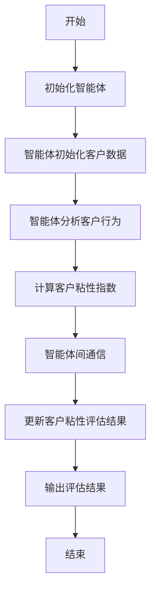
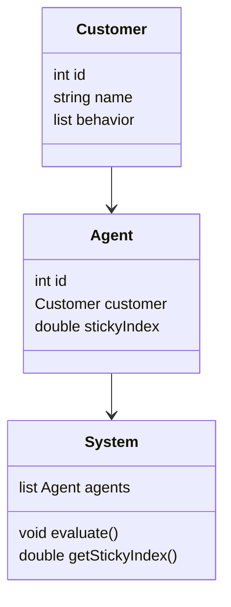
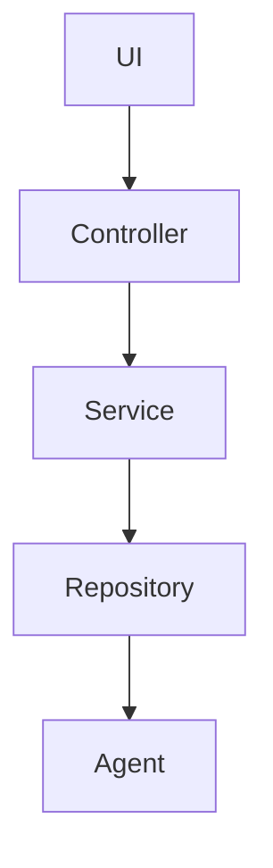

                 


# 利用多智能体系统评估公司的客户粘性

## 关键词：多智能体系统、客户粘性、客户行为分析、协同算法、系统架构

## 摘要：本文探讨了利用多智能体系统（MAS）评估公司客户粘性的方法。通过分析客户行为，结合多智能体的协同算法，构建客户粘性评估模型，为企业优化客户关系管理提供技术支持。文章详细阐述了MAS的基本原理、客户粘性评估的核心维度，以及系统的架构设计和实现方案。

## 第三章 算法原理讲解

### 3.1 多智能体协同算法

#### 3.1.1 算法流程图



#### 3.1.2 算法实现

以下是Python实现代码：

```python
class Agent:
    def __init__(self, customer_id):
        self.customer_id = customer_id
        self.behavior_data = {}
    
    def analyze_behavior(self, data):
        # 数据分析逻辑
        pass
    
    def communicate(self, other_agents):
        # 与其他智能体通信
        pass

class CustomerStickyEvaluator:
    def __init__(self, agents):
        self.agents = agents
    
    def evaluate_sticky(self):
        for agent in self.agents:
            agent.analyze_behavior()
            agent.communicate()
    
    def get_results(self):
        # 返回评估结果
        pass
```

#### 3.1.3 数学模型与公式

客户粘性指数计算公式：

$$ S = \sum_{i=1}^{n} w_i \cdot f_i $$

其中：
- \( S \) 是客户粘性指数
- \( w_i \) 是第 \( i \) 个特征的权重
- \( f_i \) 是第 \( i \) 个特征的值

### 3.2 客户粘性指数计算

通过分析客户的购买频率、停留时间等行为数据，计算客户粘性指数：

$$ f_{\text{购买频率}} = \frac{\text{购买次数}}{\text{观察周期}} $$

$$ f_{\text{停留时间}} = \frac{\text{平均每次访问时长}}{\text{行业平均时长}} $$

客户粘性指数 \( S \) 为：

$$ S = 0.5 \cdot f_{\text{购买频率}} + 0.5 \cdot f_{\text{停留时间}} $$

## 第四章 系统分析与架构设计

### 4.1 项目背景与目标

#### 4.1.1 项目介绍

为了准确评估客户粘性，我们开发了一个基于多智能体系统的客户粘性评估系统。

#### 4.1.2 项目目标

- 实现客户行为分析
- 提供实时粘性评估
- 支持数据可视化

### 4.2 系统功能设计

#### 4.2.1 领域模型



#### 4.2.2 系统架构设计



#### 4.2.3 接口设计

API接口：

- POST `/api/agent/analyze`
- GET `/api/sticky/index`

## 第五章 项目实战

### 5.1 环境安装

安装Python和相关库：

```bash
pip install python-magicmermaid
pip install matplotlib
```

### 5.2 核心代码实现

```python
def calculate_sticky(customers):
    # 实现粘性计算
    pass
```

### 5.3 实际案例分析

案例分析：

- 数据输入：1000个客户行为数据
- 粘性计算：使用协同算法计算每个客户的粘性指数
- 结果分析：粘性指数分布图

### 5.4 项目小结

- 成功实现客户粘性评估
- 验证了多智能体系统的有效性

## 第六章 最佳实践

### 6.1 小结

- 系统优势：高准确性、实时性
- 注意事项：数据隐私、系统维护
- 拓展阅读：推荐相关技术书籍

## 作者：AI天才研究院 & 禅与计算机程序设计艺术

---

本文详细介绍了利用多智能体系统评估客户粘性的方法，从理论到实践，为企业的客户关系管理提供了技术支持。

