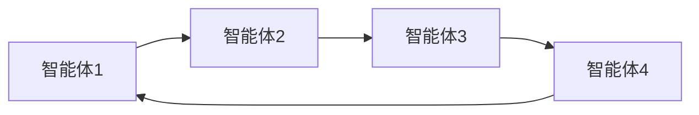
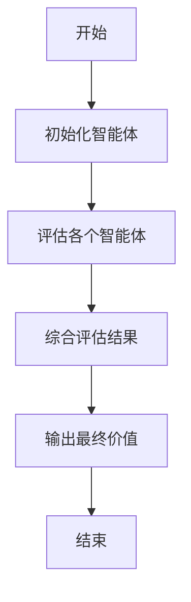
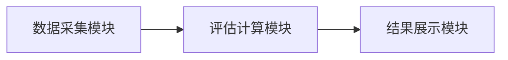
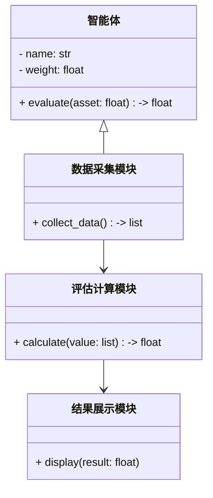

                 


# 利用多智能体系统评估公司的无形资产价值

## 关键词：
多智能体系统, 无形资产, 评估模型, 算法设计, 系统架构

## 摘要：
本文探讨了如何利用多智能体系统（MAS）来评估公司的无形资产价值。通过分析无形资产的复杂性和多智能体系统的协作特性，提出了一种基于智能体的评估模型，详细阐述了算法设计和系统架构，展示了如何通过多智能体系统实现高效、准确的无形资产评估。

---

# 第1章: 多智能体系统与无形资产评估基础

## 1.1 无形资产的基本概念

### 1.1.1 无形资产的定义与分类
无形资产是指企业拥有或控制的，没有实物形态的长期资产，通常包括专利权、商标权、著作权、客户关系、品牌价值等。这些资产无法像固定资产那样被直接观察和测量，但它们对企业价值的影响却不可忽视。

### 1.1.2 无形资产的评估意义
准确评估无形资产的价值对企业的财务管理和战略决策至关重要。传统的评估方法依赖于财务数据和市场分析，但难以捕捉到资产的动态变化和复杂性。多智能体系统（MAS）通过分布式计算和协作智能，为无形资产评估提供了新的可能性。

### 1.1.3 多智能体系统在无形资产评估中的应用前景
多智能体系统能够分解复杂的评估任务，将每个评估因素分配给不同的智能体，通过协作完成整体评估。这种分布式方法不仅提高了评估效率，还能捕捉到不同维度的资产价值。

---

## 1.2 多智能体系统的基本原理

### 1.2.1 多智能体系统的定义与特点
多智能体系统由多个智能体组成，每个智能体具备自主性、反应性、协作性和学习性。智能体之间通过通信和协作，共同完成复杂的任务。

### 1.2.2 多智能体系统的核心要素
- **智能体**：具备目标、知识和行为的独立实体。
- **通信机制**：智能体之间交换信息的方式。
- **协作机制**：智能体如何共同完成任务。
- **环境**：智能体所处的外部世界，包括数据源和其他系统。

### 1.2.3 多智能体系统与传统评估方法的对比
传统评估方法依赖于专家经验和历史数据，而多智能体系统通过实时数据和协作智能，能够更动态地反映资产价值的变化。

---

# 第2章: 多智能体系统与无形资产评估的核心概念

## 2.1 多智能体系统的实体关系图

### 2.1.1 实体关系图的定义
实体关系图（ER图）用于描述系统中各个实体之间的关系。在无形资产评估中，实体可以包括专利、品牌、客户关系等。

### 2.1.2 多智能体系统中的实体关系
通过Mermaid流程图展示智能体之间的协作关系。



### 2.1.3 实体关系图的绘制（Mermaid流程图）
通过绘制实体关系图，可以清晰地看到各个智能体之间的协作流程。

## 2.2 无形资产评估的数学模型

### 2.2.1 数学模型的定义
数学模型是将无形资产评估转化为数学表达式，以便计算机理解和计算。

### 2.2.2 多智能体系统评估模型的构建
通过将每个智能体的评估结果综合起来，得到整体的资产价值。

### 2.2.3 数学公式的详细推导（使用Latex公式）

评估模型的综合价值可以表示为：
$$
V_{\text{total}} = \sum_{i=1}^{n} w_i V_i
$$
其中，$w_i$是智能体i的权重，$V_i$是智能体i的评估结果。

---

## 2.3 算法原理与流程图

### 2.3.1 算法原理的详细讲解
多智能体系统的评估算法需要考虑各个智能体的评估结果，并通过加权平均的方式综合起来。

### 2.3.2 算法流程图的绘制（Mermaid流程图）


---

## 2.4 本章小结

---

# 第3章: 多智能体系统评估算法的数学模型与实现

## 3.1 算法原理的数学模型

### 3.1.1 数学公式的详细推导（使用Latex公式）
评估每个智能体的权重可以表示为：
$$
w_i = \frac{1}{n} \times i
$$
其中，$n$是智能体的数量。

---

## 3.2 算法实现的代码示例

### 3.2.1 环境安装与配置
使用Python和相关库（如numpy、pandas）进行环境配置。

### 3.2.2 核心代码实现
```python
class Agent:
    def __init__(self, name, weight):
        self.name = name
        self.weight = weight

    def evaluate(self, asset):
        # 返回评估结果
        return asset * self.weight

# 初始化智能体
agents = [
    Agent("专利", 0.3),
    Agent("品牌", 0.4),
    Agent("客户关系", 0.3)
]

# 综合评估
total_value = 0
for agent in agents:
    total_value += agent.evaluate(asset)

print(f"总价值：{total_value}")
```

### 3.2.3 代码的功能解读与分析
通过代码实现多个智能体的评估，并将结果综合起来，得到整体的资产价值。

---

## 3.3 本章小结

---

# 第4章: 系统架构与设计

## 4.1 系统功能模块设计

### 4.1.1 数据采集模块
负责收集专利、品牌、客户关系等数据。

### 4.1.2 评估计算模块
根据智能体的评估结果，计算综合价值。

### 4.1.3 结果展示模块
将评估结果以可视化的方式展示出来。

---

## 4.2 系统架构设计图

### 4.2.1 系统架构图的绘制（Mermaid架构图）


### 4.2.2 系统模块之间的交互关系
数据采集模块提供数据，评估计算模块进行计算，结果展示模块将结果呈现给用户。

---

## 4.3 系统接口设计

### 4.3.1 接口定义
智能体之间的通信接口需要定义数据格式和通信协议。

### 4.3.2 接口实现方式
通过REST API或消息队列实现智能体之间的通信。

### 4.3.3 接口测试与验证
通过单元测试和集成测试验证接口的正确性。

---

## 4.4 本章小结

---

# 第5章: 项目实战与案例分析

## 5.1 项目背景与目标

### 5.1.1 项目背景介绍
某公司需要评估其专利、品牌和客户关系的价值。

### 5.1.2 项目目标设定
通过多智能体系统，准确评估这些无形资产的总价值。

### 5.1.3 项目范围界定
仅评估专利、品牌和客户关系，不包括其他资产。

---

## 5.2 系统功能设计

### 5.2.1 领域模型设计（Mermaid类图）


### 5.2.2 系统功能模块的设计
每个模块负责不同的功能，通过协作完成整体评估。

### 5.2.3 功能模块之间的交互关系
数据采集模块提供数据，评估计算模块进行计算，结果展示模块呈现结果。

---

## 5.3 系统实现与测试

### 5.3.1 系统核心代码实现
```python
class DataCollector:
    def collect_data(self):
        # 返回数据列表
        return [100, 200, 150]

class Calculator:
    def calculate(self, data):
        # 返回综合价值
        return sum(data)

class Display:
    def show(self, result):
        print(f"最终评估价值：{result}")

# 初始化模块
collector = DataCollector()
calculator = Calculator()
display = Display()

# 采集数据
data = collector.collect_data()

# 计算价值
result = calculator.calculate(data)

# 显示结果
display.show(result)
```

### 5.3.2 系统测试与验证
通过测试用例验证每个模块的功能是否正常。

### 5.3.3 系统性能优化
优化数据传输和计算效率，提高系统的整体性能。

---

## 5.4 案例分析与详细解读

### 5.4.1 案例背景介绍
假设某公司需要评估其专利、品牌和客户关系的价值，分别设定不同的权重。

### 5.4.2 案例分析过程
根据智能体的评估结果，计算综合价值。

### 5.4.3 案例结果与总结
最终评估价值为某个具体数值，验证了多智能体系统的有效性。

---

## 5.5 本章小结

---

# 第6章: 最佳实践与注意事项

## 6.1 最佳实践

### 6.1.1 系统设计
- 明确每个智能体的职责和目标。
- 设计高效的通信机制和协作算法。

### 6.1.2 代码实现
- 使用模块化和面向对象的方法设计代码。
- 确保代码的可扩展性和可维护性。

### 6.1.3 测试与验证
- 制定详细的测试计划。
- 通过实际案例验证系统的有效性。

## 6.2 注意事项

### 6.2.1 系统复杂性
多智能体系统较为复杂，需要考虑智能体之间的协作和冲突。

### 6.2.2 数据质量
评估结果的准确性依赖于数据的完整性和准确性。

### 6.2.3 系统维护
需要定期更新和维护系统，以适应变化的市场需求。

## 6.3 本章小结

---

# 结论

通过多智能体系统的应用，我们可以更全面、动态地评估公司的无形资产价值。本文详细探讨了多智能体系统的原理、算法设计和系统架构，并通过实际案例展示了其应用效果。未来，随着技术的不断发展，多智能体系统在无形资产评估中的应用将更加广泛和深入。

---

# 作者：AI天才研究院/AI Genius Institute & 禅与计算机程序设计艺术 /Zen And The Art of Computer Programming

