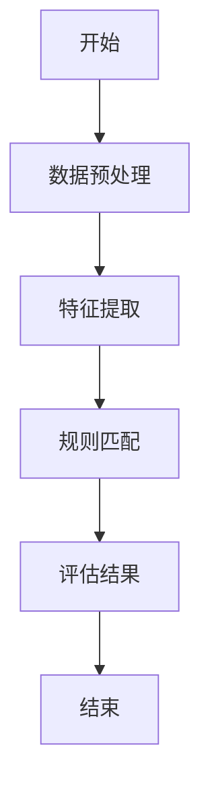
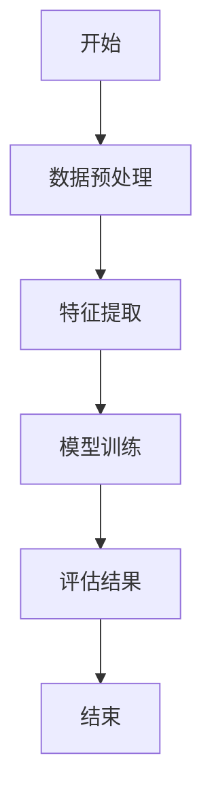
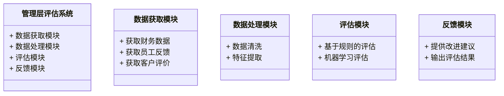
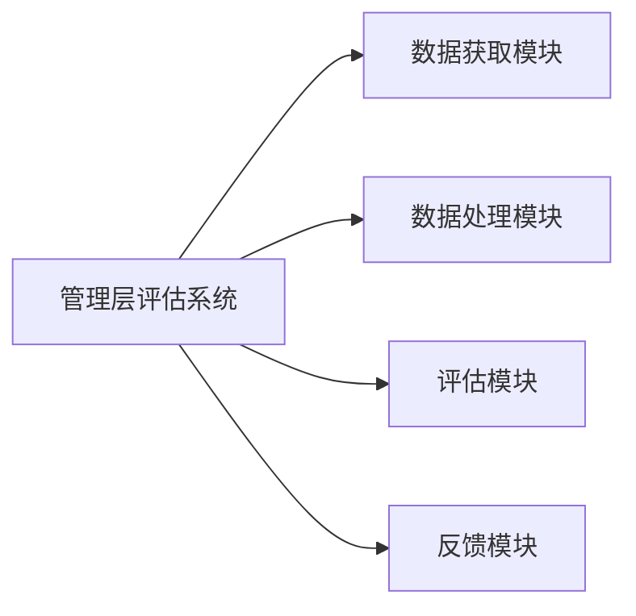
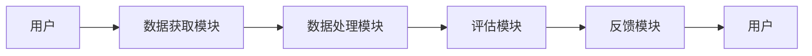

                 


# 利用多智能体系统评估管理层质量和诚信度

> 关键词：多智能体系统, 管理层评估, 诚信度评估, 算法原理, 系统架构

> 摘要：本文提出了一种基于多智能体系统的管理层质量和诚信度评估方法。通过分析多智能体系统的原理与优势，详细阐述了该系统在评估过程中的应用，包括数据处理、算法设计、系统架构和项目实战。本文旨在为管理层评估提供一种高效、智能的解决方案。

---

# 第一部分: 背景与核心概念

## 第1章: 问题背景与描述

### 1.1 问题背景

#### 1.1.1 管理层质量与诚信度的重要性
在现代企业中，管理层的质量和诚信度直接关系到企业的生存与发展。一个优秀的管理层能够带领企业在复杂多变的环境中稳步前行，而诚信度则是衡量管理层道德水准的重要指标。然而，传统的管理层评估方法往往依赖于主观判断，存在评估标准不统一、数据来源单一等问题。

#### 1.1.2 当前评估方法的局限性
传统的管理层评估方法主要依赖于主观评价和单一数据来源，存在以下问题：
- 数据来源单一：通常仅依赖于财务数据或员工反馈，缺乏多维度的数据支持。
- 评估标准不统一：不同企业对管理层的评估标准可能存在差异，导致评估结果缺乏可比性。
- 评估过程复杂：由于涉及多个维度的分析，传统的评估方法往往耗时且成本较高。

#### 1.1.3 多智能体系统的优势
多智能体系统（Multi-Agent System, MAS）通过多个智能体的协作，能够高效地处理复杂问题。其优势在于：
- 并行处理能力：多个智能体可以同时处理不同的任务，提高评估效率。
- 协作能力强：智能体之间能够共享信息，形成协同效应。
- 适应性强：系统能够根据环境变化动态调整评估策略。

### 1.2 问题描述

#### 1.2.1 管理层评估的核心维度
管理层评估的核心维度包括：
- 专业能力：包括决策能力、战略规划能力等。
- 道德素质：包括诚信度、责任感等。
- 团队协作能力：包括沟通能力、领导能力等。

#### 1.2.2 诚信度评估的挑战
诚信度评估的挑战主要在于数据的多样性和复杂性：
- 数据来源多样：需要整合财务数据、员工反馈、客户评价等多种数据。
- 数据复杂性：数据可能存在不完整、噪声大等问题，增加了评估的难度。

#### 1.2.3 多智能体系统在评估中的应用价值
多智能体系统能够通过多个智能体的协作，从多个维度对管理层进行评估，解决传统方法的局限性。

### 1.3 问题解决与边界

#### 1.3.1 多智能体系统如何解决评估问题
通过多个智能体的协作，多智能体系统能够从多个维度对管理层进行评估，包括数据收集、分析、评估和反馈。

#### 1.3.2 系统的边界与外延
系统的边界包括：
- 数据输入：包括财务数据、员工反馈、客户评价等。
- 数据输出：包括管理层评估结果、改进建议等。

#### 1.3.3 核心概念与组成要素
多智能体系统的组成要素包括：
- 智能体：负责数据收集、分析和评估。
- 通信机制：智能体之间的信息共享与协作。
- 协调机制：智能体任务分配与冲突解决。

## 第2章: 多智能体系统的核心概念

### 2.1 多智能体系统原理

#### 2.1.1 多智能体系统的定义
多智能体系统是由多个智能体组成的分布式系统，智能体通过协作完成特定任务。

#### 2.1.2 智能体的基本属性
智能体具有以下基本属性：
- 智能性：能够理解和处理信息。
- 反应性：能够对外界变化做出反应。
- 主动性：能够主动采取行动。

#### 2.1.3 多智能体系统的协作机制
多智能体系统的协作机制包括：
- 任务分配：智能体根据自身能力分配任务。
- 信息共享：智能体之间共享信息和数据。
- 协调控制：通过协调机制确保任务顺利进行。

### 2.2 核心概念对比

#### 2.2.1 多智能体与单智能体的对比
| 特性 | 单智能体 | 多智能体 |
|------|----------|----------|
| 能力 | 单一     | 多元化    |
| 协作 | 无       | 强        |
| 效率 | 低       | 高        |

#### 2.2.2 不同评估方法的优劣势分析
| 方法 | 传统评估 | 多智能体评估 |
|------|----------|-------------|
| 优势 | 简单     | 多维度       |
| 劣势 | 主观性高  | 复杂性高     |

#### 2.2.3 系统架构的对比与选择
系统架构的选择需要考虑以下因素：
- 系统规模：单智能体适用于小规模系统，多智能体适用于大规模系统。
- 任务复杂度：任务复杂度高时选择多智能体系统。

### 2.3 多智能体系统与管理层评估的结合

#### 2.3.1 系统架构与功能
系统架构包括：
- 数据获取模块：负责数据的收集。
- 数据处理模块：负责数据的预处理。
- 评估模块：负责管理层的评估。
- 反馈模块：负责评估结果的反馈。

#### 2.3.2 数据流与信息处理
数据流包括：
- 数据来源：财务数据、员工反馈、客户评价等。
- 数据处理流程：数据清洗、特征提取、模型训练等。

#### 2.3.3 系统的交互与协作
智能体之间的协作包括：
- 信息共享：智能体之间共享数据和信息。
- 任务分配：智能体根据自身能力分配任务。
- 协调控制：通过协调机制确保任务顺利进行。

---

# 第二部分: 算法原理与数学模型

## 第4章: 算法原理

### 4.1 基于规则的评估算法

#### 4.1.1 算法的流程图


#### 4.1.2 算法实现代码
```python
def evaluate_quality(data):
    processed_data = preprocess(data)
    features = extract_features(processed_data)
    result = rule_based_evaluation(features)
    return result
```

### 4.2 机器学习模型

#### 4.2.1 算法的流程图


#### 4.2.2 算法实现代码
```python
def evaluate_quality(data):
    processed_data = preprocess(data)
    features = extract_features(processed_data)
    model = train_model(features)
    result = predict(model, features)
    return result
```

### 4.3 数学模型

#### 4.3.1 管理层质量评分模型
$$ \text{评分} = \alpha \cdot \text{专业能力} + \beta \cdot \text{道德素质} + \gamma \cdot \text{团队协作能力} $$

#### 4.3.2 诚信度评分模型
$$ \text{诚信度} = \theta \cdot \text{财务数据} + \phi \cdot \text{员工反馈} + \psi \cdot \text{客户评价} $$

---

## 第5章: 数学模型与公式

### 5.1 管理层质量评分公式
$$ \text{评分} = \sum_{i=1}^{n} w_i \cdot x_i $$
其中，\( w_i \) 是第 \( i \) 个特征的权重，\( x_i \) 是第 \( i \) 个特征的值。

### 5.2 诚信度评分公式
$$ \text{诚信度} = \frac{\sum_{j=1}^{m} y_j}{m} $$
其中，\( y_j \) 是第 \( j \) 个评价指标的得分，\( m \) 是评价指标的数量。

---

# 第三部分: 系统分析与架构设计

## 第6章: 系统分析与架构设计

### 6.1 系统功能设计

#### 6.1.1 领域模型类图


#### 6.1.2 系统架构设计


### 6.2 系统接口设计

#### 6.2.1 接口设计
系统接口包括：
- 数据输入接口：接收财务数据、员工反馈、客户评价等。
- 数据输出接口：输出评估结果和改进建议。

#### 6.2.2 交互流程图


---

## 第7章: 项目实战

### 7.1 环境安装与配置

#### 7.1.1 环境安装
安装Python和相关库：
```bash
pip install numpy pandas scikit-learn
```

#### 7.1.2 系统核心实现源代码
```python
def preprocess(data):
    # 数据清洗
    cleaned_data = data.dropna()
    return cleaned_data

def extract_features(data):
    # 特征提取
    features = data[['收入', '利润', '员工满意度']]
    return features

def rule_based_evaluation(features):
    # 基于规则的评估
    score = 0
    for feature in features:
        if feature > 0.8:
            score += 1
    return score

def train_model(features, labels):
    # 模型训练
    from sklearn.linear_model import LinearRegression
    model = LinearRegression()
    model.fit(features, labels)
    return model

def predict(model, features):
    # 模型预测
    predictions = model.predict(features)
    return predictions
```

---

## 第8章: 总结与展望

### 8.1 项目小结
通过本文的介绍，我们详细阐述了利用多智能体系统评估管理层质量和诚信度的方法。通过多智能体系统的协作，能够高效地从多个维度对管理层进行评估，解决传统方法的局限性。

### 8.2 未来展望
未来的研究方向包括：
- 提高系统的智能化水平。
- 优化算法的性能。
- 扩展系统的应用场景。

---

作者：AI天才研究院/AI Genius Institute & 禅与计算机程序设计艺术 /Zen And The Art of Computer Programming

