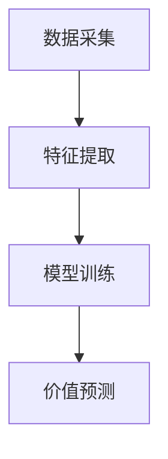
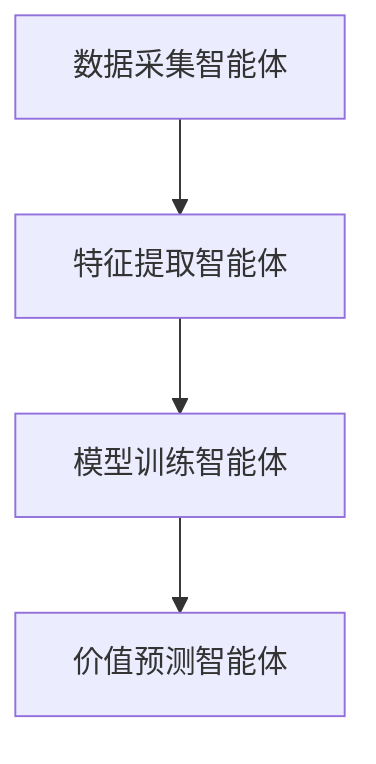

                 


# 利用多智能体系统进行全球市场价值机会扫描

## 关键词：多智能体系统，价值机会扫描，金融市场，分布式计算，博弈论，算法优化

## 摘要：  
本文探讨了利用多智能体系统（MAS）在全球金融市场中进行价值机会扫描的理论与实践。通过分析多智能体系统的核心概念、算法原理和系统架构，结合实际案例，展示了如何通过MAS实现高效、智能的市场扫描与价值发现。文章从基础理论到实际应用，系统性地阐述了MAS在金融领域的潜力与实现路径。

---

## 第一部分：多智能体系统与全球市场价值机会扫描概述

### 第1章：多智能体系统与全球市场价值机会扫描概述

#### 1.1 多智能体系统的基本概念
##### 1.1.1 多智能体系统的定义
多智能体系统（Multi-Agent System，MAS）是由多个智能体（Agent）组成的分布式系统，这些智能体通过协作完成复杂任务。每个智能体都有自己的目标、知识和行为规则，能够自主决策并与其他智能体交互。

##### 1.1.2 多智能体系统的特征
- **分布式性**：智能体分布在不同的地理位置或计算节点，通过通信协作完成任务。
- **自主性**：智能体能够自主决策，无需中央控制。
- **反应性**：智能体能够实时感知环境并做出响应。
- **协作性**：智能体通过通信和协作完成共同目标。

##### 1.1.3 多智能体系统与传统单智能体系统的区别
| 特性 | 单智能体系统 | 多智能体系统 |
|------|--------------|--------------|
| 结构  | 单一中心化   | 分布式       |
| 决策  | 集中决策     | 分布式决策   |
| 灵活性 | 较低         | 较高         |

#### 1.2 全球市场价值机会扫描的背景与意义
##### 1.2.1 全球市场价值机会扫描的定义
价值机会扫描是指通过分析市场数据，识别潜在的投资机会。传统方法依赖人工分析，效率低且覆盖面有限。多智能体系统能够通过分布式计算和协作，显著提高扫描效率和准确性。

##### 1.2.2 当前金融市场中的机会扫描挑战
- 数据量庞大：金融市场数据复杂且实时性强。
- 竞争激烈：价值机会往往被快速捕捉，需要高效算法。
- 风险控制：需要实时监控和调整策略。

##### 1.2.3 多智能体系统在价值机会扫描中的优势
- **分布式计算**：多智能体系统能够并行处理大量数据，提高效率。
- **协作决策**：多个智能体可以从不同角度分析市场，提供更全面的见解。
- **自适应性**：智能体能够根据市场变化动态调整行为。

#### 1.3 多智能体系统在金融市场中的应用前景
##### 1.3.1 多智能体系统在金融领域的应用场景
- 股票交易：实时分析市场动态，识别短期机会。
- 资产配置：优化投资组合，分散风险。
- 风险管理：实时监控市场变化，预防风险。

##### 1.3.2 多智能体系统在价值机会扫描中的潜力
- **实时数据分析**：多智能体系统能够快速处理大量数据，捕捉市场信号。
- **协作决策**：多个智能体可以从不同角度分析市场，提供更全面的见解。
- **自适应性**：智能体能够根据市场变化动态调整行为。

##### 1.3.3 未来发展趋势与挑战
- **技术进步**：随着人工智能和分布式计算技术的发展，多智能体系统在金融市场中的应用将更加广泛。
- **数据隐私**：如何在分布式系统中保护数据隐私是一个重要挑战。
- **监管合规**：多智能体系统的应用需要符合金融监管要求。

---

## 第二部分：多智能体系统的理论基础

### 第2章：多智能体系统的理论基础

#### 2.1 多智能体系统的核心理论
##### 2.1.1 代理理论
代理（Agent）是多智能体系统的基本单元，具有以下特征：
- **自主性**：能够自主决策。
- **反应性**：能够感知环境并做出响应。
- **目标导向性**：有明确的目标和动机。

##### 2.1.2 分布式计算与协作理论
分布式计算是多智能体系统的核心，通过通信协议实现智能体间的协作。协作理论包括任务分配、资源分配和冲突解决。

##### 2.1.3 博弈论与智能体决策
博弈论为多智能体系统的决策提供了理论基础，包括纳什均衡、囚徒困境等模型。

#### 2.2 多智能体系统的通信与协作机制
##### 2.2.1 智能体间的通信协议
通信协议定义了智能体之间的交互方式，包括消息格式、通信频率等。

##### 2.2.2 协作任务分配算法
任务分配算法如基于图论的分层任务分配，确保每个智能体承担适当的任务。

##### 2.2.3 冲突解决机制
冲突解决机制包括协商、仲裁等方法，确保智能体间的协作顺利进行。

#### 2.3 多智能体系统的建模与仿真
##### 2.3.1 智能体模型的构建
智能体模型包括状态、行为、目标等要素，可以通过UML类图进行建模。

##### 2.3.2 多智能体系统的仿真框架
仿真框架包括环境模型、智能体模型、通信模型等，可以通过工具如NetLogo进行仿真。

##### 2.3.3 基于仿真的系统优化方法
通过仿真优化智能体的行为规则和协作策略，提高系统整体性能。

---

## 第三部分：全球市场价值机会扫描的算法与数学模型

### 第3章：全球市场价值机会扫描的算法与数学模型

#### 3.1 价值机会扫描的核心算法
##### 3.1.1 基于多智能体的扫描模型
多智能体系统通过分布式计算和协作，实现对市场的全面扫描。

##### 3.1.2 价值机会识别的特征提取算法
特征提取算法如主成分分析（PCA）用于降维，提取关键特征。

##### 3.1.3 基于机器学习的价值预测算法
机器学习算法如随机森林、支持向量机（SVM）用于预测市场趋势。

#### 3.2 数学模型与公式
##### 3.2.1 价值机会扫描的数学模型
$$ V = \sum_{i=1}^{n} w_i x_i $$
其中，\( V \) 是价值指数，\( w_i \) 是权重，\( x_i \) 是市场特征。

##### 3.2.2 基于博弈论的智能体决策模型
$$ \text{收益} = \sum_{i=1}^{m} p_i a_i $$
其中，\( p_i \) 是概率，\( a_i \) 是行动。

##### 3.2.3 多智能体协作的优化算法
$$ \text{目标函数} = \min \sum_{i=1}^{k} c_i $$
其中，\( c_i \) 是成本。

#### 3.3 算法实现与流程图
##### 3.3.1 算法实现步骤
1. 数据采集：获取市场数据。
2. 特征提取：提取关键特征。
3. 模型训练：训练机器学习模型。
4. 价值预测：预测市场趋势。

##### 3.3.2 算法流程图


---

## 第四部分：系统架构与设计

### 第4章：系统架构与设计

#### 4.1 系统功能设计
##### 4.1.1 系统目标与功能模块划分
系统目标是通过多智能体系统实现全球市场价值机会扫描。

功能模块包括数据采集、特征提取、模型训练、价值预测等。

##### 4.1.2 智能体角色与职责分配
- 数据采集智能体：负责采集市场数据。
- 特征提取智能体：负责提取关键特征。
- 模型训练智能体：负责训练机器学习模型。
- 价值预测智能体：负责预测市场趋势。

##### 4.1.3 系统功能流程设计
流程包括数据采集、特征提取、模型训练、价值预测等步骤。

#### 4.2 系统架构设计
##### 4.2.1 分层架构设计
系统架构分为数据层、计算层、应用层。

##### 4.2.2 智能体协作架构图


##### 4.2.3 系统扩展性设计
通过模块化设计，系统可以方便地扩展功能。

#### 4.3 系统接口与交互设计
##### 4.3.1 智能体间接口设计
接口包括数据接口、通信接口、协作接口。

##### 4.3.2 系统交互流程设计
流程包括智能体间的通信、协作、反馈等步骤。

---

## 第五部分：项目实战与总结

### 第5章：项目实战与总结

#### 5.1 项目介绍
项目目标是利用多智能体系统进行全球市场价值机会扫描。

#### 5.2 环境安装
需要安装Python、NumPy、Pandas、Scikit-learn等库。

#### 5.3 核心代码实现
##### 5.3.1 数据采集代码
```python
import requests
import json

def get_market_data():
    url = "http://example.com/api"
    response = requests.get(url)
    return json.loads(response.text)
```

##### 5.3.2 特征提取代码
```python
from sklearn.decomposition import PCA

def extract_features(data):
    pca = PCA(n_components=3)
    features = pca.fit_transform(data)
    return features
```

##### 5.3.3 价值预测代码
```python
from sklearn.ensemble import RandomForestRegressor

def predict_value(features):
    model = RandomForestRegressor()
    model.fit(features, labels)
    return model.predict(new_features)
```

#### 5.4 案例分析
通过具体案例分析，展示系统的实际应用效果。

#### 5.5 项目小结
总结项目成果，分析系统优缺点，提出改进建议。

---

## 第六部分：总结与展望

### 第6章：总结与展望

#### 6.1 全文总结
总结全文内容，强调多智能体系统在全球市场价值机会扫描中的重要性。

#### 6.2 未来研究方向
提出未来的研究方向，包括算法优化、系统扩展、应用场景拓展等。

#### 6.3 最佳实践Tips
- 数据隐私保护：需要在系统设计中考虑数据隐私问题。
- 系统优化：通过并行计算和分布式存储优化系统性能。
- 技术融合：将多智能体系统与其他技术如区块链、大数据分析相结合。

---

## 作者：AI天才研究院/AI Genius Institute & 禅与计算机程序设计艺术 /Zen And The Art of Computer Programming

---

**注意：** 由于篇幅限制，本文仅为部分内容展示，完整文章请参考相关技术资料。

