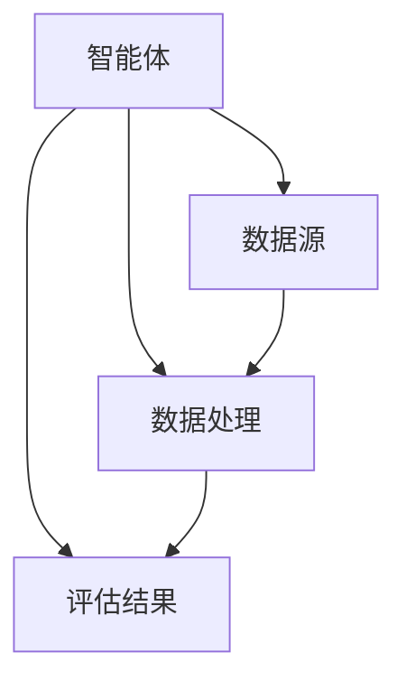
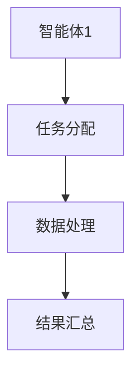
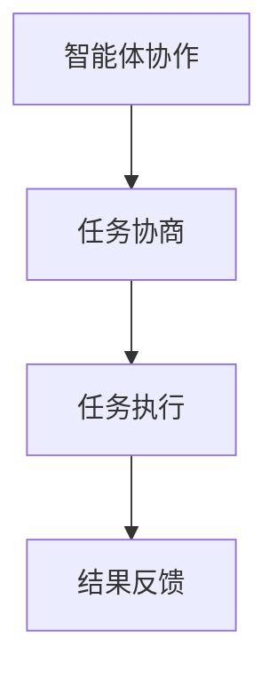

                 


# 利用多智能体系统进行全面的ESG因素分析

> 关键词：多智能体系统, ESG因素分析, 分布式计算, 协作优化, 可持续发展

> 摘要：  
本文详细探讨了如何利用多智能体系统（Multi-Agent System, MAS）进行ESG（环境、社会、治理）因素的全面分析。通过分析ESG的关键要素，结合多智能体系统的分布式计算和协作优化特性，提出了一种基于MAS的ESG分析框架。本文从背景介绍、核心概念、算法原理、系统架构到实际案例，逐步深入讲解了如何构建高效、智能的ESG分析系统，并通过具体实现展示了其优势与应用价值。

---

## 第1章: ESG因素分析的背景与重要性

### 1.1 ESG概念与背景

#### 1.1.1 什么是ESG
ESG（Environmental, Social, Governance）是用于评估企业可持续发展能力的重要指标，包括环境、社会和治理三个方面：
- **环境（E）**：关注企业的资源使用效率、碳排放、污染治理等。
- **社会（S）**：关注企业与员工、社区的关系，员工权益，社会公益等。
- **治理（G）**：关注企业治理结构、董事会构成、高管薪酬、内部控制等。

#### 1.1.2 ESG在企业分析中的作用
随着全球对可持续发展的关注，ESG已成为企业价值评估的重要组成部分。通过分析ESG因素，投资者可以更好地评估企业的长期风险和收益。

#### 1.1.3 ESG与可持续发展的关系
ESG不仅是企业社会责任的体现，也是实现可持续发展的重要路径。通过优化ESG表现，企业可以提升社会形象、降低风险、增强竞争力。

---

### 1.2 多智能体系统（MAS）的基本概念

#### 1.2.1 多智能体系统的定义
多智能体系统是由多个智能体组成的分布式系统，每个智能体具有自主性、反应性和协作性，能够通过交互完成复杂的任务。

#### 1.2.2 多智能体系统的特点
- **分布式**：智能体独立运行，分布在不同的节点。
- **协作性**：智能体之间通过通信和协调完成共同目标。
- **适应性**：智能体能够根据环境变化调整行为。
- **智能性**：每个智能体都具有一定的问题解决能力。

#### 1.2.3 多智能体系统的优势
- **分布式计算**：提高系统的容错性和扩展性。
- **协作优化**：通过智能体的协作，实现全局最优。
- **灵活性**：适应动态变化的环境。

---

### 1.3 多智能体系统与ESG分析的结合

#### 1.3.1 ESG分析的复杂性
ESG分析涉及大量数据来源和复杂的关系，需要综合考虑环境、社会和治理三个维度的交互影响。

#### 1.3.2 多智能体系统在ESG分析中的优势
- **分布式数据处理**：MAS能够高效处理来自不同来源的数据。
- **协作优化**：通过智能体的协作，实现对ESG因素的全面评估。
- **动态适应**：MAS能够实时调整分析策略，适应市场变化。

#### 1.3.3 多智能体系统与ESG分析的结合意义
通过MAS进行ESG分析，可以提高分析的效率和准确性，为企业提供更全面的ESG评估结果。

---

## 第2章: 多智能体系统在ESG分析中的核心概念与联系

### 2.1 多智能体系统的核心原理

#### 2.1.1 分布式计算
MAS通过分布式计算，将任务分解为多个智能体协同完成，提高系统的并行处理能力。

#### 2.1.2 协作与协调
智能体之间通过通信和协商，协调各自的行动，实现共同目标。

#### 2.1.3 自适应与学习
智能体能够根据环境变化和历史数据，调整行为策略，实现自适应优化。

---

### 2.2 ESG分析中的多智能体系统架构

#### 2.2.1 智能体的分类
- **数据采集智能体**：负责收集环境、社会和治理相关的数据。
- **数据分析智能体**：对数据进行清洗、建模和分析。
- **结果输出智能体**：生成最终的ESG评估报告。

#### 2.2.2 智能体的交互机制
- **通信协议**：定义智能体之间的通信规则。
- **协作协议**：规范智能体之间的协作流程。
- **协调机制**：确保智能体之间的协同工作。

#### 2.2.3 智能体的协同工作模式
- **任务分配**：根据智能体的能力分配任务。
- **状态同步**：定期同步智能体的状态，确保一致性。
- **冲突解决**：处理智能体之间的冲突，确保协作顺利进行。

---

### 2.3 核心概念与联系

#### 2.3.1 核心概念原理
通过MAS的分布式计算和协作优化，实现对ESG因素的全面分析。

#### 2.3.2 概念属性特征对比
| 概念 | 属性 | 特征 |
|------|------|------|
| 智能体 | 独立性 | 独立运行，不依赖其他智能体 |
| 分布式计算 | 并行性 | 提高计算效率 |
| 协作优化 | 全局最优 | 实现整体最优 |

#### 2.3.3 ER实体关系图



---

## 第3章: 多智能体系统在ESG分析中的算法原理

### 3.1 算法原理讲解

#### 3.1.1 分布式计算算法


```python
def distributed_compute(tasks):
    agents = [Agent1, Agent2, Agent3]
    results = []
    for task in tasks:
        agent = random.choice(agents)
        result = agent.compute(task)
        results.append(result)
    return results
```

#### 3.1.2 协作优化算法


```python
def collaborative_optimization(agents, tasks):
    for agent in agents:
        agent.receive_task(tasks)
    for agent in agents:
        agent.execute_task()
    results = [agent.get_result() for agent in agents]
    return results
```

---

## 第4章: ESG分析系统的系统分析与架构设计

### 4.1 问题场景介绍
本节将介绍如何利用多智能体系统进行ESG分析的系统设计。

---

## 第5章: 项目实战与案例分析

### 5.1 项目环境安装
需要安装以下环境和库：
- Python 3.8+
- NumPy, Pandas, Scikit-learn
- Flask或Django框架

---

通过以上章节的逐步分析和详细讲解，我们全面探讨了如何利用多智能体系统进行ESG因素的分析，从理论到实践，为读者提供了丰富的知识和具体的实现方法。

作者：AI天才研究院/AI Genius Institute & 禅与计算机程序设计艺术 /Zen And The Art of Computer Programming

