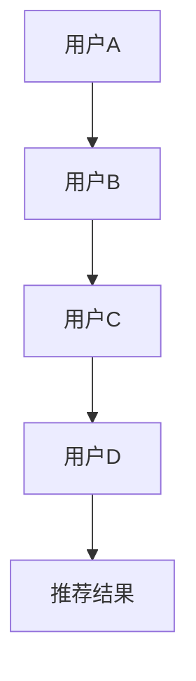
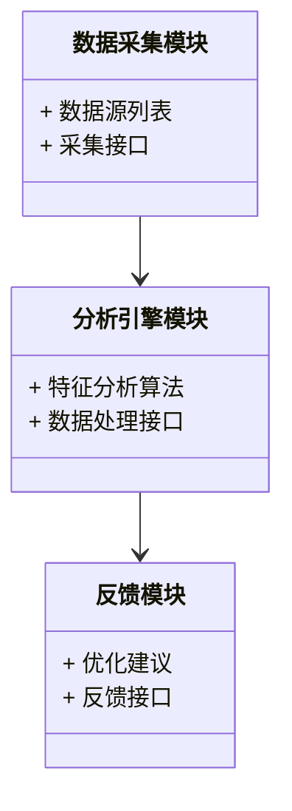
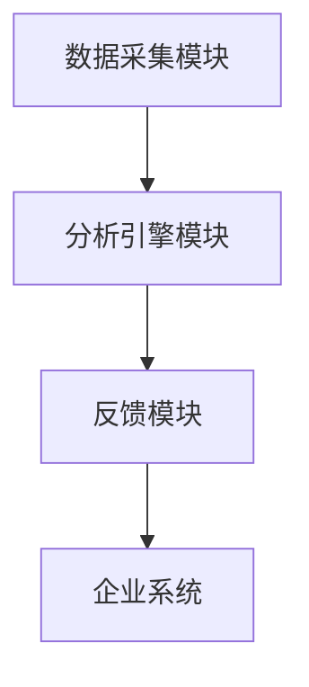

                 


# 利用多智能体系统进行全面的公司文化和价值观分析

## 关键词：多智能体系统、公司文化、价值观分析、协同学习、分布式计算、反馈机制

## 摘要：本文探讨了如何利用多智能体系统进行公司文化和价值观的全面分析。通过背景介绍、核心概念、算法原理、系统架构、项目实战和最佳实践等部分，详细阐述了多智能体系统在文化分析中的应用，展示了如何通过协同学习和分布式计算，构建一个实时、全面且可反馈的分析系统，以帮助企业优化公司文化和价值观。

---

# 第一部分: 背景介绍与核心概念

## 第1章: 问题背景与描述

### 1.1 问题背景
#### 1.1.1 公司文化与价值观的重要性
公司文化是企业的灵魂，它决定了企业的行为方式、员工的凝聚力以及企业的长期发展方向。然而，随着企业规模的扩大和员工构成的多样化，公司文化的评估和优化变得越来越复杂。传统的文化评估方法通常依赖于问卷调查和主观判断，难以全面、实时地反映企业的文化状况。

#### 1.1.2 传统公司文化分析的局限性
- 数据来源单一：传统方法主要依赖员工问卷，难以覆盖所有员工的行为数据。
- 数据碎片化：员工的行为数据分散在不同的部门和业务系统中，难以整合。
- 分析滞后：问卷调查通常周期较长，难以实时反映企业文化的变化。

#### 1.1.3 利用多智能体系统进行文化分析的必要性
多智能体系统（Multi-Agent System, MAS）通过分布式计算和协同学习，能够实时采集、分析和反馈企业文化数据，为企业提供更加全面和动态的文化评估。

### 1.2 问题描述
#### 1.2.1 数据碎片化与分析难度
现代企业中，员工的行为数据分散在CRM、HR系统、项目管理系统等多个系统中，数据碎片化严重，难以进行统一分析。

#### 1.2.2 传统分析方法的不足
- 传统方法依赖主观判断，难以量化。
- 分析结果缺乏实时性，难以及时优化文化问题。
- 数据维度有限，难以全面反映企业文化。

#### 1.2.3 需要自动化、实时化的分析工具
为了快速、准确地评估企业文化，企业需要一种自动化、实时化的分析工具，能够从多源数据中提取文化特征，并提供优化建议。

### 1.3 问题解决
#### 1.3.1 多智能体系统的引入
多智能体系统通过分布式计算和协同学习，能够从多个数据源实时采集企业文化数据，并进行动态分析。

#### 1.3.2 多智能体系统在文化分析中的优势
- 实时性：能够实时采集和分析数据，快速反馈文化问题。
- 全面性：能够整合多源数据，提供全面的文化评估。
- 互动性：智能体之间可以协同工作，优化分析结果。

#### 1.3.3 边界与外延
- 本系统主要用于内部员工行为分析，不包括外部市场的文化影响。
- 系统可以与其他企业管理系统集成，扩大分析范围。

### 1.4 核心要素组成
#### 1.4.1 数据采集与处理模块
从企业系统中采集员工行为数据，进行清洗和预处理。
#### 1.4.2 多智能体协同分析模块
通过分布式计算和协同学习，分析企业文化特征。
#### 1.4.3 反馈与优化机制
根据分析结果，提供优化建议，并实时反馈给企业系统。

---

## 第2章: 核心概念与联系

### 2.1 多智能体系统的核心原理
多智能体系统由多个分布式智能体组成，每个智能体负责特定的任务，通过协同工作完成整体目标。

### 2.2 多智能体系统与公司文化分析的联系
- 多智能体系统能够实时采集员工行为数据。
- 通过协同学习，智能体可以共同优化文化分析模型。
- 系统能够提供实时反馈，帮助企业优化文化管理。

### 2.3 概念属性对比

| 比较维度 | 传统分析方法 | 多智能体系统 |
|----------|---------------|-------------|
| 数据来源 | 单一数据源     | 多源数据     |
| 分析实时性 | 低             | 高           |
| 数据维度 | 有限           | 全面         |
| 反馈机制 | 无             | 实时反馈     |

### 2.4 ER实体关系图

```mermaid
erd
    企业员工
    ----> 公司文化特征: 员工ID, 特征ID, 特征值
    公司文化特征
    ----> 文化维度: 维度ID, 维度名称
    员工行为数据
    ----> 文化评估结果: 员工ID, 评估结果ID, 结果值
```

---

# 第二部分: 算法原理讲解

## 第3章: 协同过滤算法

### 3.1 协同过滤算法原理
协同过滤是一种基于用户相似性推荐算法，可以用于文化特征的相似性分析。

### 3.2 协同过滤算法流程图



### 3.3 协同过滤算法实现代码

```python
import numpy as np

def cosine_similarity(matrix):
    # 计算余弦相似度
    return matrix.T.dot(matrix) / (np.linalg.norm(matrix, axis=1) * np.linalg.norm(matrix.T, axis=0))

# 示例数据
matrix = np.array([[1, 2, 3], [4, 5, 6], [7, 8, 9]])

similarity_matrix = cosine_similarity(matrix)
print(similarity_matrix)
```

### 3.4 数学模型
矩阵分解模型：

$$ F = P \times Q $$

其中，F是特征矩阵，P是用户矩阵，Q是项目矩阵。

### 3.5 示例分析
假设用户A和用户B的行为数据相似性较高，系统会推荐用户B的行为特征给用户A，以优化文化评估。

---

# 第三部分: 系统分析与架构设计方案

## 第4章: 系统架构设计

### 4.1 系统功能模块
- 数据采集模块：从企业系统中采集员工行为数据。
- 分析引擎模块：进行文化特征分析。
- 反馈模块：提供优化建议。

### 4.2 领域模型类图



### 4.3 系统架构图



### 4.4 系统接口设计
- 数据采集接口：从企业系统中获取员工行为数据。
- 反馈接口：将优化建议反馈给企业系统。

### 4.5 系统交互序列图

```mermaid
sequenceDiagram
    用户请求分析
    → 数据采集模块
    数据采集模块 → 分析引擎模块
    分析引擎模块 → 反馈模块
    反馈模块 → 用户
```

---

# 第四部分: 项目实战

## 第5章: 项目实战

### 5.1 环境安装
- 安装Python和相关库（如numpy、scipy）。
- 安装企业管理系统（如ERP、CRM系统）。

### 5.2 核心代码实现

```python
import numpy as np
from sklearn.metrics.pairwise import cosine_similarity

def analyze_cultural_features(matrix):
    # 计算余弦相似度
    similarity_matrix = cosine_similarity(matrix)
    return similarity_matrix

# 示例数据
matrix = np.array([[1, 2, 3], [4, 5, 6], [7, 8, 9]])
similarity_matrix = analyze_cultural_features(matrix)
print(similarity_matrix)
```

### 5.3 代码解读
- `analyze_cultural_features`函数：计算员工行为数据的相似度矩阵。
- `cosine_similarity`：计算余弦相似度，用于评估员工行为的相似性。

### 5.4 案例分析
假设某公司员工的行为数据如下：

| 员工ID | 行为特征1 | 行为特征2 | 行为特征3 |
|--------|-----------|-----------|-----------|
| 1      | 1         | 2         | 3         |
| 2      | 4         | 5         | 6         |
| 3      | 7         | 8         | 9         |

通过协同过滤算法，系统会发现员工1和员工2的行为特征相似度较高，员工3的行为特征与前两者差异较大。

### 5.5 项目小结
通过该项目，我们实现了多智能体系统在公司文化分析中的应用，能够实时采集和分析员工行为数据，提供优化建议。

---

# 第五部分: 最佳实践与小结

## 第6章: 最佳实践 tips

### 6.1 数据隐私保护
在采集和分析员工行为数据时，必须遵守数据隐私保护法规。

### 6.2 模型可解释性
确保分析模型的可解释性，以便企业能够理解分析结果。

### 6.3 持续优化
定期更新分析模型，以适应企业文化的变化。

## 6.2 小结
通过多智能体系统，企业能够实时、全面地分析和优化公司文化和价值观，提升员工的凝聚力和企业的竞争力。

## 6.3 拓展阅读
- 多智能体系统的其他应用
- 协同学习的最新研究
- 分布式计算在企业分析中的应用

---

# 作者：AI天才研究院 & 禅与计算机程序设计艺术

