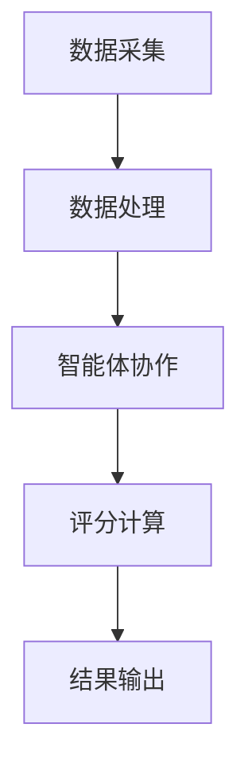
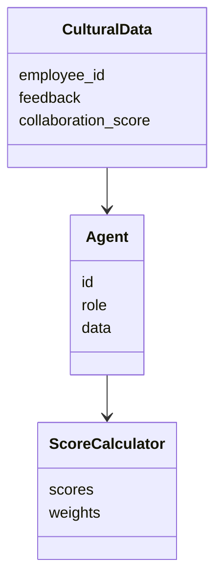
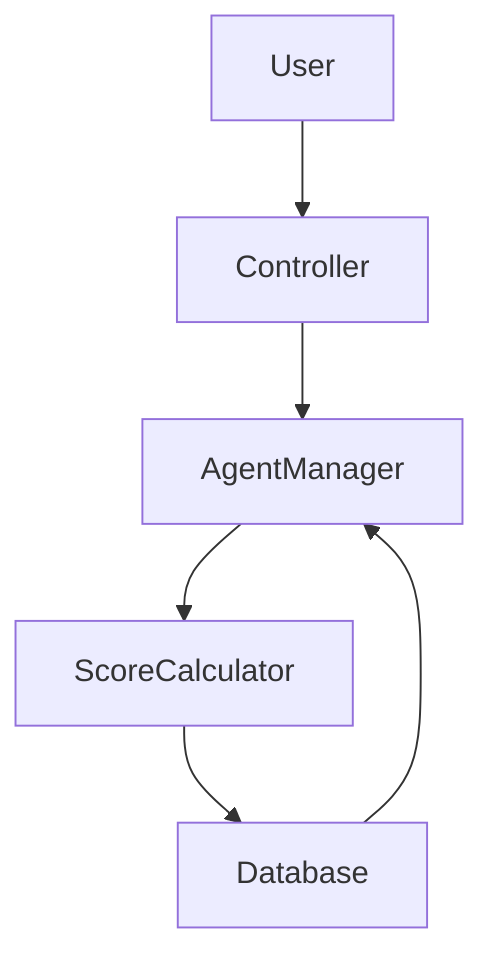
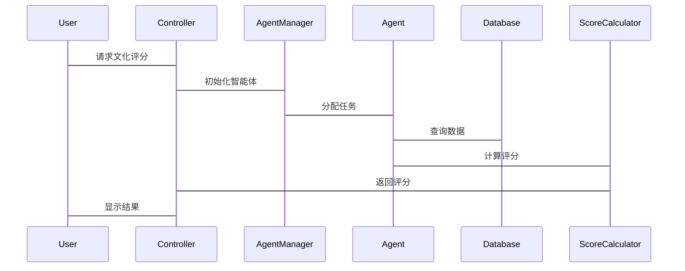

                 


# 利用多智能体系统进行全面的公司文化评分

## 关键词：多智能体系统，公司文化评分，算法原理，系统架构，项目实战

## 摘要：  
本文探讨了如何利用多智能体系统进行全面的公司文化评分。通过分析多智能体系统的核心原理和其在文化评分中的应用，结合数学模型和实际案例，详细阐述了评分系统的实现过程。文章从背景介绍、核心概念、算法原理到系统架构设计、项目实战，全面解析了如何利用多智能体系统提升公司文化评估的效率和准确性。

---

## 第一部分：背景介绍

### 第1章：公司文化评分的重要性

#### 1.1 问题背景
- **公司文化的核心作用**：公司文化是企业凝聚力和长期发展的基石。良好的文化可以提升员工满意度、促进创新、增强企业竞争力。然而，如何量化文化的表现并进行有效的评估是一个复杂的挑战。
- **现有公司文化评估的局限性**：传统的文化评估通常依赖主观问卷调查，存在数据片面、难以量化的问题。此外，不同部门或团队的文化差异难以被统一评估。
- **多智能体系统在文化评分中的优势**：多智能体系统通过分布式协作和数据融合，能够从多个维度和层次对文化进行评估，提供更全面和客观的评分结果。

#### 1.2 问题描述
- **公司文化评分的定义**：公司文化评分是对企业整体文化表现的量化评估，包括员工价值观、团队协作能力、企业价值观等多个方面。
- **多智能体系统在评分中的应用范围**：多智能体系统可以用于数据收集、分析和评分计算，帮助企业在不同部门和团队之间建立统一的文化评估标准。
- **评分系统的边界与外延**：评分系统不仅关注定量指标，还需要结合定性分析，确保评估结果的全面性和可操作性。

#### 1.3 问题解决
- **多智能体系统如何解决文化评分问题**：通过分布式协作和智能体之间的数据共享，多智能体系统能够从多个角度收集和分析数据，提供更精准的文化评分结果。
- **系统设计的核心要素**：包括数据采集、智能体协作、评分算法和结果可视化。
- **系统实现的关键步骤**：数据预处理、智能体设计、算法实现和系统集成。

---

## 第二部分：多智能体系统的核心概念与联系

### 第2章：多智能体系统的基本概念

#### 2.1 多智能体系统的核心原理
- **多智能体系统的定义**：多智能体系统是由多个具有独立决策能力的智能体组成的分布式系统，能够通过协作完成复杂的任务。
- **智能体的属性与特征**：智能体具有自主性、反应性、协作性和学习性，能够在动态环境中适应和优化自身的行为。
- **多智能体系统的协作机制**：智能体之间的协作通过通信和协调完成，确保任务的高效完成。

#### 2.2 多智能体系统的协作机制
- **分布式协作的定义**：智能体在不同位置独立工作，通过通信协议进行协作。
- **智能体之间的通信协议**：包括消息传递、状态同步和任务分配。
- **协作任务的分配策略**：基于智能体的能力和当前状态，动态分配任务。

---

## 第三部分：多智能体系统在公司文化评分中的应用

### 第3章：公司文化评分模型的设计

#### 3.1 多智能体评分模型的原理
- **模型的输入与输出**：输入包括员工反馈、团队协作数据和企业价值观；输出是综合评分和改进建议。
- **智能体的评分规则**：每个智能体负责特定维度的评分，例如团队协作智能体负责评估团队合作能力。
- **模型的优化方法**：通过机器学习算法优化评分模型，提升评估的准确性和一致性。

#### 3.2 多智能体系统的评分流程
- **数据采集阶段**：通过问卷调查、员工访谈和团队协作数据收集文化相关数据。
- **数据处理阶段**：对数据进行清洗、归一化处理，并提取关键特征。
- **评分计算阶段**：智能体协作计算每个维度的评分，并综合得到整体文化评分。

---

## 第四部分：算法原理与实现

### 第4章：多智能体评分算法的数学模型

#### 4.1 算法原理
- **智能体协作的数学表达**：智能体之间的协作可以用图论模型表示，节点代表智能体，边代表协作关系。
- **评分计算的公式推导**：通过加权平均和相关性分析，计算每个维度的评分权重。

#### 4.2 算法实现
- **算法流程图（Mermaid）**



- **Python代码实现**

```python
def multi_agent_cultural_score():
    # 数据采集
    data = collect_data()
    # 数据处理
    processed_data = preprocess(data)
    # 智能体协作
    agents = initialize_agents(processed_data)
    for agent in agents:
        agent.collaborate()
    # 评分计算
    scores = calculate_scores(agents)
    return scores

# 示例调用
multi_agent_cultural_score()
```

---

## 第五部分：系统分析与架构设计

### 第5章：系统架构设计方案

#### 5.1 系统应用场景
- **典型场景分析**：例如，企业年度文化评估、部门文化诊断、团队协作优化。
- **系统的用户角色**：包括普通员工、部门经理和企业高管。

#### 5.2 系统功能设计
- **领域模型类图（Mermaid）**



- **系统架构图（Mermaid）**



- **系统接口设计**：包括数据接口、智能体接口和评分接口。
- **系统交互序列图（Mermaid）**



---

## 第六部分：项目实战

### 第6章：项目实战

#### 6.1 环境安装
- 需要安装的工具和库：Python、Mermaid、机器学习库（如scikit-learn）。

#### 6.2 系统核心实现源代码
```python
import numpy as np
from sklearn.metrics.pairwise import cosine_similarity

def collect_data():
    # 示例数据采集
    return np.array([[4, 3, 2], [5, 1, 4], [3, 5, 1]])

def preprocess(data):
    # 数据预处理
    return data

def initialize_agents(data):
    # 初始化智能体
    agents = []
    for i in range(len(data)):
        agents.append(Agent(i, data[i]))
    return agents

class Agent:
    def __init__(self, id, data):
        self.id = id
        self.data = data
        self.role = 'collaborator'

    def collaborate(self):
        # 示例协作逻辑
        pass

def calculate_scores(agents):
    # 示例评分计算
    scores = []
    for agent in agents:
        scores.append(np.mean(agent.data))
    return scores

# 示例调用
scores = multi_agent_cultural_score()
print(scores)
```

#### 6.3 代码应用解读与分析
- **代码功能解读**：上述代码展示了多智能体系统的实现过程，包括数据采集、预处理、智能体初始化、协作和评分计算。
- **代码优化建议**：可以引入更复杂的协作算法，如基于强化学习的智能体协作，以提升评分的准确性。

#### 6.4 实际案例分析和详细讲解剖析
- **案例背景**：某公司希望通过多智能体系统评估各部门的文化表现。
- **实施过程**：数据采集、预处理、智能体协作、评分计算。
- **结果分析**：通过评分结果发现某些部门的协作能力较弱，提出改进建议。

#### 6.5 项目小结
- **项目总结**：通过多智能体系统实现公司文化评分，能够提供更全面和客观的评估结果。
- **经验分享**：数据质量、智能体协作算法和评分模型的优化是系统成功的关键。

---

## 第七部分：最佳实践、小结、注意事项、拓展阅读

### 第7章：总结与展望

#### 7.1 最佳实践 tips
- **数据质量**：确保数据来源多样且具有代表性。
- **算法选择**：根据具体需求选择合适的智能体协作和评分算法。
- **系统维护**：定期更新数据和优化算法，确保评分结果的准确性和时效性。

#### 7.2 小结
- 多智能体系统为公司文化评分提供了新的思路，通过分布式协作和数据融合，能够更全面地评估企业文化表现。
- 本文详细探讨了系统设计、算法实现和项目实战，为实际应用提供了参考。

#### 7.3 注意事项
- **数据隐私**：在数据采集和处理过程中，需遵守相关隐私保护法规。
- **系统可扩展性**：设计时考虑系统的可扩展性，方便未来功能的扩展和升级。

#### 7.4 拓展阅读
- 推荐阅读《多智能体系统与分布式计算》和《机器学习在企业中的应用》，深入了解多智能体系统和机器学习技术。

---

## 作者：AI天才研究院 & 禅与计算机程序设计艺术

---

通过本文的详细讲解，读者可以全面了解如何利用多智能体系统进行全面的公司文化评分。从理论到实践，从算法到系统架构，本文为读者提供了丰富的知识和实用的指导。希望本文能够为企业的文化评估和管理提供新的思路和方法。

