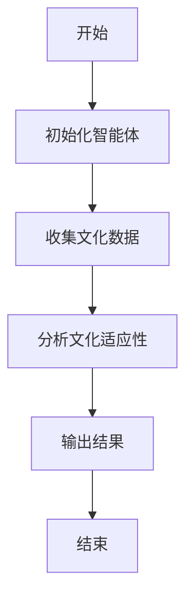
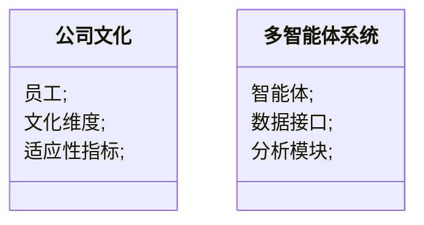
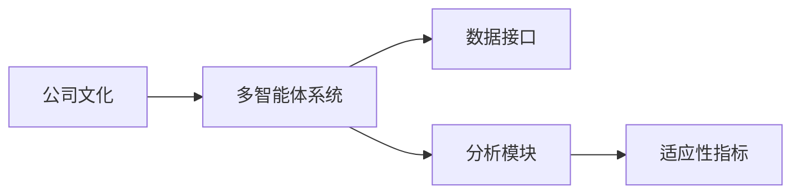
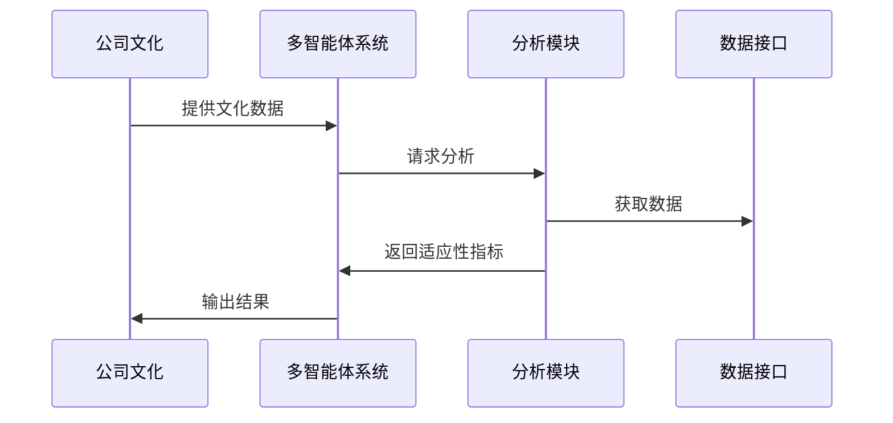

                 


# 利用多智能体系统进行全面的公司文化适应性分析

> 关键词：多智能体系统，公司文化，文化适应性分析，AI技术，系统架构设计

> 摘要：本文深入探讨了利用多智能体系统进行全面的公司文化适应性分析的方法，从背景介绍、核心概念、算法原理、系统架构设计到项目实战，详细分析了如何通过多智能体系统实现对公司文化的多维度评估与优化。文章内容涵盖理论与实践，旨在为企业提供一种全新的文化适应性分析工具。

---

# 目录大纲

## 第一章：背景介绍

### 1.1 问题背景
- 1.1.1 公司文化适应性分析的重要性
- 1.1.2 多智能体系统在文化适应性分析中的应用潜力
- 1.1.3 当前文化适应性分析的局限性

### 1.2 问题描述
- 1.2.1 文化适应性分析的核心目标
- 1.2.2 多智能体系统在文化适应性分析中的角色
- 1.2.3 问题解决的边界与外延

### 1.3 核心概念与联系
- 1.3.1 多智能体系统的核心原理
- 1.3.2 多智能体系统与公司文化的实体关系图
- 1.3.3 多智能体系统与公司文化适应性分析的关系

## 第二章：多智能体系统的核心概念与联系

### 2.1 多智能体系统的定义与特点
- 2.1.1 多智能体系统的定义
- 2.1.2 多智能体系统的核心特点
- 2.1.3 多智能体系统与传统AI的区别

### 2.2 多智能体系统的实体关系图
- 2.2.1 ER图展示
```mermaid
er
    actor 公司;
    actor 员工;
    actor 文化维度;
    relation "属于" --> 公司;
    relation "影响" --> 员工;
    relation "构成" --> 文化维度;
```

### 2.3 多智能体系统与公司文化适应性分析的关系
- 2.3.1 多智能体系统在文化适应性分析中的应用
- 2.3.2 多智能体系统与公司文化适应性分析的相互作用

## 第三章：多智能体系统在公司文化适应性分析中的算法原理

### 3.1 算法原理概述
- 3.1.1 多智能体系统的基本原理
- 3.1.2 公司文化适应性分析的算法流程


### 3.2 算法实现
- 3.2.1 算法的数学模型
$$ y = f(x) $$
- 3.2.2 算法的Python实现
```python
def analyze_cultural适应性():
    # 初始化智能体
    agents = initializ...
    # 收集文化数据
    data = collect_data()
    # 分析文化适应性
    result = analyze(agents, data)
    return result
```

## 第四章：系统分析与架构设计

### 4.1 项目背景
- 4.1.1 项目目标
- 4.1.2 项目范围
- 4.1.3 项目关键成功因素

### 4.2 系统功能设计
- 4.2.1 领域模型图


### 4.3 系统架构设计
- 4.3.1 系统架构图


### 4.4 系统接口设计
- 4.4.1 接口描述
- 4.4.2 交互流程


## 第五章：项目实战

### 5.1 环境安装
- 5.1.1 系统要求
- 5.1.2 工具安装

### 5.2 系统核心实现
- 5.2.1 核心代码实现
```python
def collect_data():
    # 数据收集逻辑
    return data
```

### 5.3 代码解读与分析
- 5.3.1 代码功能说明
- 5.3.2 代码优化建议

### 5.4 实际案例分析
- 5.4.1 案例背景
- 5.4.2 分析过程
- 5.4.3 分析结果解读

## 第六章：最佳实践、小结与拓展阅读

### 6.1 最佳实践
- 6.1.1 关键成功因素
- 6.1.2 常见问题与解决方案

### 6.2 小结
- 6.2.1 本文总结
- 6.2.2 未来研究方向

### 6.3 拓展阅读
- 6.3.1 推荐书籍
- 6.3.2 相关论文

## 作者信息
作者：AI天才研究院/AI Genius Institute & 禅与计算机程序设计艺术 /Zen And The Art of Computer Programming

---

通过以上目录大纲，可以清晰地看到文章从理论到实践的完整结构，涵盖了从背景介绍到系统架构设计再到项目实战的各个方面，确保内容详实且逻辑清晰。

