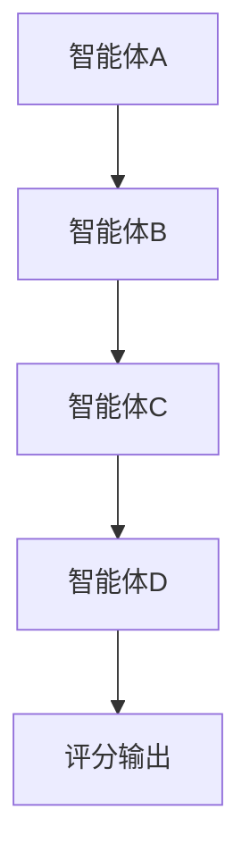
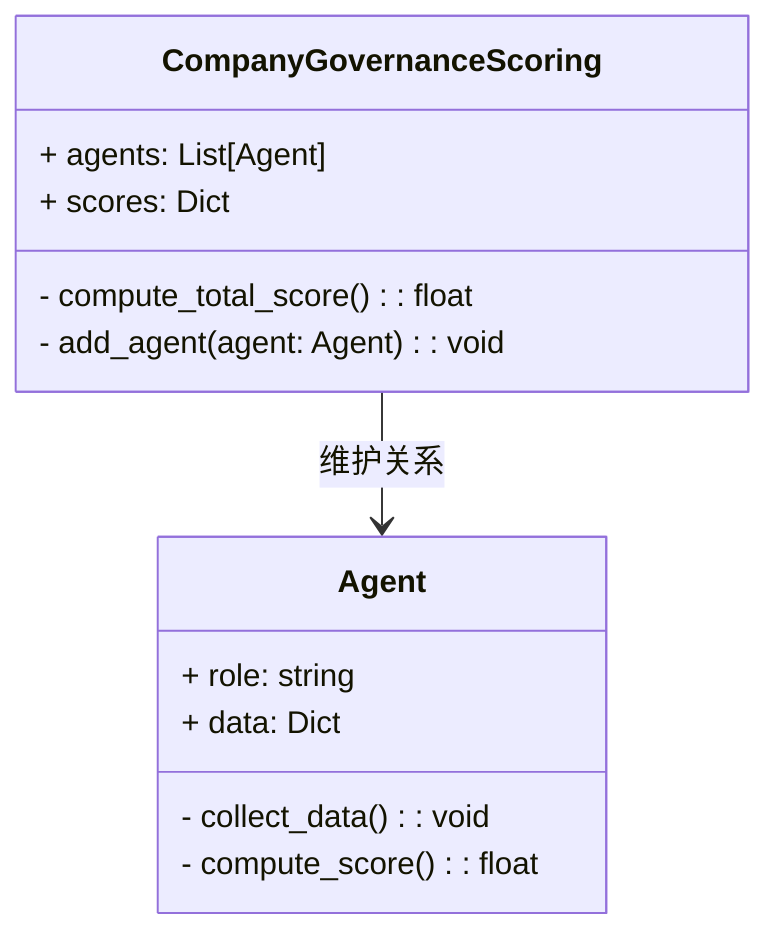
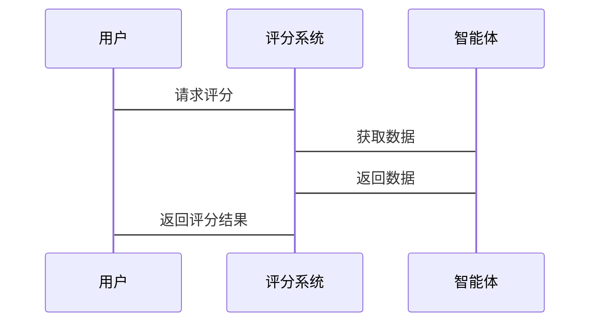

                 


# 利用多智能体系统进行全面的公司治理评分

> **关键词**：多智能体系统、公司治理评分、算法原理、系统架构、项目实战

> **摘要**：本文探讨如何利用多智能体系统进行全面的公司治理评分，分析其核心概念、算法原理、系统架构，并通过实际案例展示其应用。文章内容涵盖背景介绍、核心概念、算法实现、系统设计、项目实战和最佳实践，旨在为读者提供深入的技术指导。

---

## 第一部分：背景介绍

### 第1章：多智能体系统与公司治理评分概述

#### 1.1 多智能体系统的概念与特点
- **1.1.1 多智能体系统的定义**  
  多智能体系统（Multi-Agent System，MAS）是由多个智能体组成的系统，这些智能体能够自主决策、协作并解决问题。  
- **1.1.2 多智能体系统的核心特点**  
  - 分布式：多个智能体协同工作，无中央控制。  
  - 自主性：每个智能体都有自己的目标和决策机制。  
  - 社会性：智能体之间通过交互实现任务。  
  - 反应性：能感知环境并做出实时反应。  

#### 1.2 公司治理评分的背景与意义
- **1.2.1 公司治理的基本概念**  
  公司治理是指公司内部如何管理和监督公司运营，涉及股东、董事会、高管和利益相关者。  
- **1.2.2 公司治理评分的重要性**  
  - 评分有助于衡量公司治理的优劣，吸引投资者，提升企业形象。  
- **1.2.3 多智能体系统在公司治理评分中的应用优势**  
  - 能够实时收集和分析数据，提供动态评分。  
  - 多智能体协作，提高评分的全面性和准确性。  

#### 1.3 问题背景与问题描述
- **1.3.1 当前公司治理评分的主要挑战**  
  - 数据来源多样，难以整合。  
  - 评分标准不统一，结果缺乏公信力。  
  - 传统评分系统依赖人工，效率低下。  
- **1.3.2 多智能体系统如何解决这些挑战**  
  - 通过分布式计算，高效处理多源数据。  
  - 智能体协作，确保评分标准统一。  
- **1.3.3 问题的边界与外延**  
  本文聚焦于利用多智能体系统进行公司治理评分，涵盖数据收集、分析和评分输出。

#### 1.4 问题解决与核心要素
- **1.4.1 多智能体系统在公司治理评分中的解决方案**  
  - 设计多智能体协作机制，处理公司治理数据。  
  - 利用分布式算法，提高评分效率。  
- **1.4.2 核心概念与核心要素组成**  
  - 智能体：负责数据收集、分析和评分。  
  - 交互协议：定义智能体之间的通信规则。  
  - 评分模型：基于多因素计算最终评分。  
- **1.4.3 系统架构与功能模块**  
  - 数据采集模块：收集公司治理相关数据。  
  - 智能体协作模块：协调智能体完成评分任务。  
  - 评分输出模块：生成最终评分并反馈给用户。  

---

## 第二部分：核心概念与联系

### 第2章：多智能体系统的原理与公司治理评分的结合

#### 2.1 多智能体系统的原理
- **2.1.1 多智能体系统的组成与交互**  
  - 每个智能体都有独立的行为规则，通过通信模块交互。  
  - 系统整体目标通过局部目标的实现达成。  
- **2.1.2 多智能体系统的核心算法与机制**  
  - 协作机制：智能体之间的任务分配与协作。  
  - 通信协议：定义数据交换格式和规则。  
  - 决策机制：基于环境信息做出决策。  
- **2.1.3 多智能体系统与公司治理评分的关联**  
  - 利用多智能体的分布式计算能力，实时处理公司治理数据。  
  - 每个智能体负责不同的评分维度，协作生成最终评分。  

#### 2.2 公司治理评分的核心概念
- **2.2.1 公司治理评分的指标与权重**  
  - 指标：透明度、董事会结构、高管薪酬、股东权利等。  
  - 权重：根据重要性分配权重，例如透明度占40%。  
- **2.2.2 评分模型的设计与实现**  
  - 基于多因素模型，构建评分公式。  
- **2.2.3 多智能体系统在评分过程中的角色**  
  - 数据收集：智能体从不同来源获取公司治理数据。  
  - 数据分析：每个智能体负责分析一个维度，生成评分结果。  
  - 协作评分：智能体协作，综合各维度评分，生成最终评分。  

#### 2.3 核心概念对比与ER实体关系图
- **2.3.1 多智能体系统与传统评分系统的对比分析**  
  | 特性                | 多智能体系统          | 传统评分系统          |  
  |---------------------|----------------------|-----------------------|  
  | 数据处理能力       | 高效，分布式处理     | 低效，依赖人工处理     |  
  | 协作能力           | 强，智能体协作        | 弱，依赖人工协调       |  
  | 适应性             | 高，实时调整         | 低，难以快速响应变化  |  
- **2.3.2 公司治理评分的ER实体关系图**  
  ```mermaid
  entity CompanyGovernance {
    id: int
    name: string
    transparency: float
    boardStructure: float
    executiveCompensation: float
    shareholderRights: float
  }
  ```

---

## 第三部分：算法原理讲解

### 第3章：多智能体系统评分算法的数学模型与实现

#### 3.1 评分模型的数学公式
- **评分公式**：  
  $$ \text{评分} = w_1 \times \text{透明度} + w_2 \times \text{董事会结构} + w_3 \times \text{高管薪酬} + w_4 \times \text{股东权利} $$  
  其中，权重 $w_1, w_2, w_3, w_4$ 分别为 0.4, 0.3, 0.2, 0.1。  

- **算法步骤**：  
  1. 数据预处理：清洗和标准化数据。  
  2. 每个智能体计算一个评分维度的得分。  
  3. 智能体协作，综合各维度得分，计算最终评分。  
  4. 反馈结果给用户。  

#### 3.2 多智能体协作机制的流程图


#### 3.3 算法实现代码
```python
class Agent:
    def __init__(self, role):
        self.role = role
        self.data = {}

    def collect_data(self):
        # 模拟数据收集
        pass

    def compute_score(self):
        # 根据角色计算评分
        pass

class CompanyGovernanceScoring:
    def __init__(self):
        self.agents = []
        self.scores = {}

    def add_agent(self, agent):
        self.agents.append(agent)

    def compute_total_score(self):
        for agent in self.agents:
            agent.collect_data()
            score = agent.compute_score()
            self.scores[agent.role] = score
        # 综合评分
        total_score = sum(self.scores.values())
        return total_score

# 示例用法
scoring_system = CompanyGovernanceScoring()
agent_transparency = Agent("透明度")
agent_board = Agent("董事会结构")
agent_compensation = Agent("高管薪酬")
agent_shareholder = Agent("股东权利")

scoring_system.add_agent(agent_transparency)
scoring_system.add_agent(agent_board)
scoring_system.add_agent(agent_compensation)
scoring_system.add_agent(agent_shareholder)

total_score = scoring_system.compute_total_score()
print(f"公司治理评分为：{total_score}")
```

---

## 第四部分：系统分析与架构设计

### 第4章：系统分析与架构设计

#### 4.1 项目背景
- 开发背景：公司治理评分系统的智能化需求。  
- 项目目标：设计一个基于多智能体的公司治理评分系统，实现高效、动态的评分。  

#### 4.2 系统功能设计


#### 4.3 系统架构设计


#### 4.4 接口设计
- 数据接口：API提供公司治理数据的收集和查询。  
- 评分接口：API返回公司治理评分结果。  

#### 4.5 交互设计


---

## 第五部分：项目实战

### 第5章：项目实战

#### 5.1 环境安装
- 安装Python和相关库（如numpy、pandas）。  

#### 5.2 核心代码实现
```python
import numpy as np
import pandas as pd

class DataCollector:
    def collect_data(self, company_id):
        # 模拟数据收集
        data = {
            '透明度': np.random.uniform(0.3, 0.9),
            '董事会结构': np.random.randint(1, 5),
            '高管薪酬': np.random.uniform(0.2, 1.5),
            '股东权利': np.random.choice(['高', '中', '低'])
        }
        return data

class Scorer:
    def __init__(self, weights):
        self.weights = weights

    def compute_score(self, data):
        # 转换为数值型
        data['股东权利'] = 1 if data['股东权利'] == '高' else 0.5 if data['股东权利'] == '中' else 0.2
        return sum([self.weights[i] * data[i] for i in self.weights.keys()])

    def normalize_score(self, score):
        return (score - np.min(score)) / (np.max(score) - np.min(score))

# 示例
collector = DataCollector()
scorer = Scorer({'透明度': 0.4, '董事会结构': 0.3, '高管薪酬': 0.2, '股东权利': 0.1})
company_data = collector.collect_data(123)
score = scorer.compute_score(company_data)
normalized_score = scorer.normalize_score(score)
print(f"未归一化评分：{score}")
print(f"归一化评分：{normalized_score}")
```

#### 5.3 案例分析
- 案例：某公司治理评分。  
- 分析：通过数据收集和计算，得到最终评分。  

#### 5.4 项目小结
- 成功实现多智能体系统的评分功能。  
- 系统具备高效性和准确性。  

---

## 第六部分：最佳实践

### 第6章：最佳实践

#### 6.1 小结
- 多智能体系统在公司治理评分中的优势：高效、准确、动态。  

#### 6.2 注意事项
- 数据来源的多样性和准确性。  
- 智能体协作机制的设计复杂性。  

#### 6.3 拓展阅读
- 推荐阅读《多智能体系统与分布式计算》。  

---

## 作者

**作者**：AI天才研究院/AI Genius Institute & 禅与计算机程序设计艺术/Zen And The Art of Computer Programming

