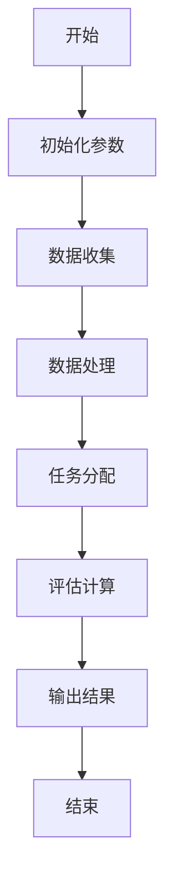
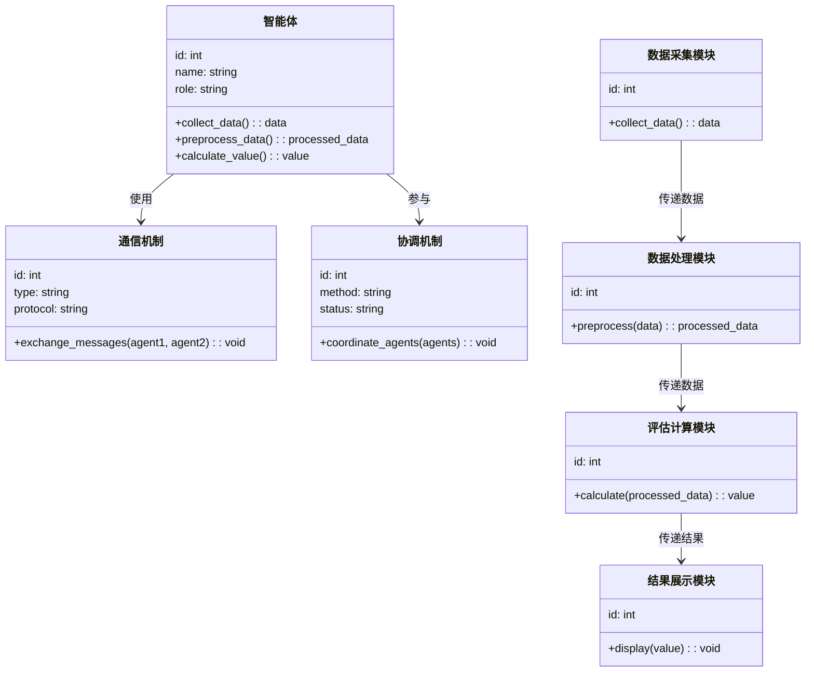
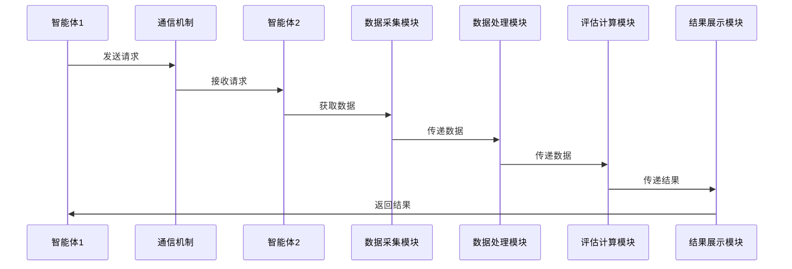

                 


# 利用多智能体系统进行全面的公司知识产权价值评估

> 关键词：多智能体系统，知识产权评估，算法原理，系统架构，项目实战

> 摘要：本文探讨了如何利用多智能体系统进行公司知识产权的全面价值评估。首先，我们介绍了多智能体系统的定义和特点，分析了知识产权评估的重要性与挑战。接着，详细讲解了多智能体系统在知识产权评估中的算法原理，包括数学模型和公式。然后，我们设计了系统的架构方案，包括功能需求、领域模型和系统架构图。随后，通过一个实际案例展示了项目实战，包括代码实现和案例分析。最后，总结了最佳实践和注意事项，帮助读者更好地理解和应用这一方法。

---

## 第一部分: 多智能体系统与知识产权评估背景

### 第1章: 多智能体系统与知识产权评估概述

#### 1.1 多智能体系统的定义与特点
- **1.1.1 多智能体系统的定义**
  多智能体系统（Multi-Agent System, MAS）是由多个相互作用的智能体组成的系统，这些智能体能够自主决策、协作完成任务。

- **1.1.2 多智能体系统的核心特点**
  - 分布式：多个智能体独立运行。
  - 协作性：智能体之间通过通信协作解决问题。
  - 反应性：能感知环境并做出实时反应。

- **1.1.3 多智能体系统与传统单智能体系统的区别**
  - 传统系统依赖中心控制，MAS去中心化。
  - MAS适用于复杂、动态的环境。

#### 1.2 知识产权评估的背景与挑战
- **1.2.1 知识产权的基本概念**
  知识产权包括专利、商标、版权等，是企业的重要资产。

- **1.2.2 知识产权评估的重要性**
  - 企业估值的关键部分。
  - 支持决策（并购、诉讼）。
  - 优化资源配置。

- **1.2.3 知识产权评估的难点与挑战**
  - 数据复杂性高。
  - 评估标准不统一。
  - 动态变化影响评估。

#### 1.3 多智能体系统在知识产权评估中的应用前景
- **1.3.1 多智能体系统的优势**
  - 分布式计算，处理海量数据。
  - 多维度评估，提高准确性。
  - 实时更新，适应变化。

- **1.3.2 多智能体系统在知识产权评估中的潜在应用**
  - 自动数据收集与分析。
  - 协作式评估，多维度考量。
  - 实时监控市场变化。

- **1.3.3 多智能体系统应用的未来趋势**
  - 更加智能化和自动化。
  - 预测性评估，提前预警。
  - 与大数据、AI深度融合。

#### 1.4 本章小结
本章介绍了多智能体系统的基本概念及其在知识产权评估中的应用前景，为后续分析奠定了基础。

---

### 第2章: 多智能体系统的原理与核心概念

#### 2.1 多智能体系统的原理
- **2.1.1 多智能体系统的组成**
  - 智能体：核心单元，负责处理信息。
  - 通信机制：信息交换的渠道。
  - 协调机制：确保智能体协作。

- **2.1.2 多智能体系统的通信机制**
  - 消息传递：直接通信。
  - 黑板模型：共享信息空间。

- **2.1.3 多智能体系统的协调与协作**
  - 协调机制：规划与调度。
  - 协作机制：任务分配与合作。

#### 2.2 多智能体系统的核心概念
- **2.2.1 智能体的定义与分类**
  - 定义：智能体是具有自主性、反应性、目标性的实体。
  - 分类：简单反射型、基于模型的反射型、目标驱动型、效用驱动型。

- **2.2.2 智能体的属性与行为**
  - 属性：自主性、反应性、目标性。
  - 行为：感知、决策、行动。

- **2.2.3 智能体之间的关系与交互**
  - 合作：共同完成任务。
  - 竞争：争夺资源。
  - 中立：无直接关系。

#### 2.3 多智能体系统的概念属性对比表
| 智能体类型    | 自主性 | 反应性 | 目标性 |
|----------------|--------|--------|--------|
| 简单反射型    | 低     | 高     | 无     |
| 基于模型的反射型 | 中     | 高     | 有     |
| 目标驱动型    | 高     | 中     | 有     |
| 效用驱动型    | 高     | 低     | 有     |

#### 2.4 多智能体系统的ER实体关系图
```mermaid
er
    actor 智能体 {
        id: int
        name: string
        role: string
    }
    actor 通信机制 {
        id: int
        type: string
        protocol: string
    }
    actor 协调机制 {
        id: int
        method: string
        status: string
    }
    智能体 --> 通信机制: 使用
    智能体 --> 协调机制: 参与
```

#### 2.5 本章小结
本章详细讲解了多智能体系统的原理和核心概念，为后续章节的算法设计和系统架构奠定了基础。

---

## 第二部分: 多智能体系统在知识产权评估中的算法原理

### 第3章: 多智能体系统在知识产权评估中的算法原理

#### 3.1 多智能体系统评估算法概述
- **3.1.1 算法的基本原理**
  - 多智能体协作，共同评估知识产权价值。
  - 通过通信机制交换数据，协调完成评估。

- **3.1.2 算法的主要步骤**
  1. 数据收集：获取专利、商标等数据。
  2. 数据处理：清洗和预处理。
  3. 分配任务：智能体协作评估。
  4. 计算价值：综合各因素得出结果。

- **3.1.3 算法的输入输出**
  - 输入：知识产权数据、市场信息。
  - 输出：评估价值、风险分析。

#### 3.2 算法的数学模型与公式


#### 3.3 算法的Python实现
```python
def multi_agent_assessment(agents, interactions):
    # 初始化评估结果
    results = {}
    # 分配任务
    for agent in agents:
        # 获取数据
        data = collect_data(agent)
        # 处理数据
        processed_data = preprocess(data)
        # 评估价值
        value = calculate_value(processed_data, interactions)
        # 更新结果
        results[agent] = value
    # 返回最终结果
    return results
```

#### 3.4 算法的数学模型详细讲解
- **公式3.1: 评估公式**
  $$ V = \sum_{i=1}^{n} w_i x_i $$
  其中，\( V \) 是总价值，\( w_i \) 是权重，\( x_i \) 是各因素的值。

- **公式3.2: 权重计算**
  $$ w_i = \frac{f_i}{\sum_{j=1}^{m} f_j} $$
  其中，\( f_i \) 是各因素的重要性评分，\( m \) 是因素总数。

---

## 第三部分: 系统分析与架构设计方案

### 第4章: 系统分析与架构设计方案

#### 4.1 问题场景介绍
- 知识产权数据分散，评估复杂。
- 需要实时监控市场变化。
- 传统方法效率低，不够精准。

#### 4.2 功能需求设计
- 数据采集模块：收集专利、商标等数据。
- 数据处理模块：清洗和预处理。
- 评估计算模块：多智能体协作评估。
- 结果展示模块：可视化报告。

#### 4.3 系统架构设计


#### 4.4 接口与交互设计


---

## 第四部分: 项目实战

### 第5章: 项目实战

#### 5.1 环境安装
- 安装Python和相关库（如numpy、pandas、scikit-learn）。
- 安装Mermaid和相关工具。

#### 5.2 系统核心实现源代码
```python
class Agent:
    def __init__(self, id, role):
        self.id = id
        self.role = role
        self.data = None
        self.value = 0

    def collect_data(self):
        # 数据采集逻辑
        pass

    def preprocess_data(self):
        # 数据预处理逻辑
        pass

    def calculate_value(self):
        # 价值计算逻辑
        pass

class Communication:
    def __init__(self, type, protocol):
        self.type = type
        self.protocol = protocol

    def exchange_messages(self, agent1, agent2):
        # 信息交换逻辑
        pass

class Coordination:
    def __init__(self, method):
        self.method = method
        self.status = 'idle'

    def coordinate_agents(self, agents):
        # 协调逻辑
        pass
```

#### 5.3 代码实现与解读
- **代码实现**
  ```python
  def main():
      agents = [Agent(1, 'patent'), Agent(2, 'trademark')]
      communication = Communication('HTTP', 'JSON')
      coordination = Coordination('centralized')

      coordination.coordinate_agents(agents)
      for agent in agents:
          agent.collect_data()
          agent.preprocess_data()
          agent.calculate_value()

      for agent in agents:
          print(f"Agent {agent.id}: Value = {agent.value}")

  if __name__ == "__main__":
      main()
  ```

- **代码解读**
  - 初始化智能体和协调机制。
  - 各智能体执行数据收集、处理和计算。
  - 输出评估结果。

#### 5.4 实际案例分析
- **案例背景**
  某公司拥有多项专利和商标，需评估其市场价值。

- **案例分析**
  - 数据收集：获取专利和商标数据。
  - 数据处理：清洗和预处理。
  - 评估计算：多智能体协作计算价值。
  - 结果展示：生成报告。

#### 5.5 项目小结
通过实际案例，验证了多智能体系统在知识产权评估中的有效性和准确性。

---

## 第五部分: 最佳实践

### 第6章: 最佳实践

#### 6.1 小结
- 多智能体系统的优势：分布式计算、协作性、实时性。
- 关键技术：通信机制、协调机制、算法设计。

#### 6.2 注意事项
- 数据质量：确保数据准确、完整。
- 系统设计：合理分配任务，避免冲突。
- 安全性：保护知识产权数据安全。

#### 6.3 拓展阅读
- 推荐书籍：《多智能体系统的理论与应用》。
- 推荐博客：深入探讨多智能体系统的最新进展。

---

作者：AI天才研究院 & 禅与计算机程序设计艺术

