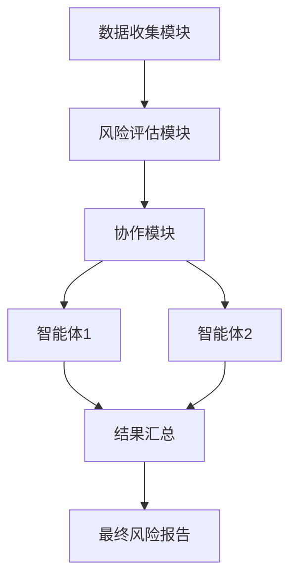
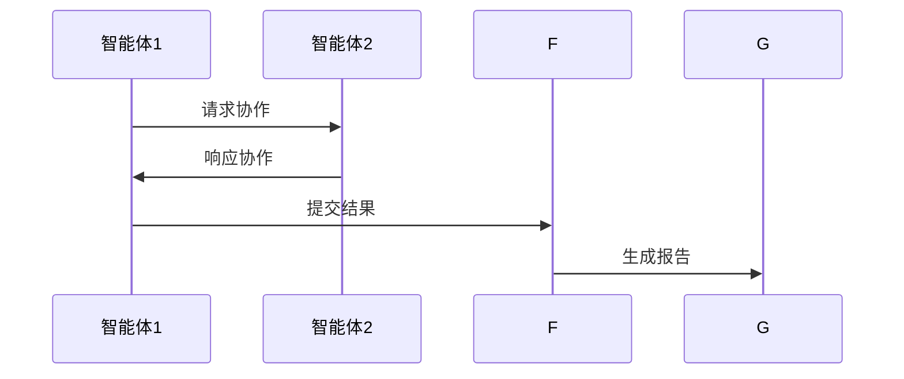

                 


# 利用多智能体系统进行全面的地缘政治风险分析

## 关键词：多智能体系统、地缘政治风险、人工智能、风险评估、系统架构

## 摘要：  
本文探讨了利用多智能体系统（MAS）进行地缘政治风险分析的方法，通过系统的结构化分析和算法设计，展示了如何利用MAS的独特优势来提升地缘政治风险分析的效率和准确性。文章从背景介绍、核心概念、算法原理、系统架构、项目实战到最佳实践，逐步展开，深入分析了MAS在地缘政治风险评估中的应用，并通过实际案例展示了系统的实现过程。

---

## 第一部分：背景介绍

### 第1章：多智能体系统与地缘政治风险分析概述

#### 1.1 多智能体系统的概念与特点
多智能体系统（Multi-Agent System, MAS）是由多个智能体组成的分布式系统，这些智能体能够通过交互协作完成复杂的任务。与传统单一智能体系统相比，MAS具有以下特点：
- **分布式计算**：智能体之间通过分布式计算实现任务分解和协同。
- **自主性**：每个智能体都具有自主决策的能力。
- **协作性**：智能体之间通过信息共享和协作完成共同目标。
- **动态性**：系统能够适应环境的变化，实时调整策略。

#### 1.2 地缘政治风险分析的背景与重要性
地缘政治风险分析是指对特定地区或事件可能引发的政治、经济和社会风险进行评估。随着全球化的发展，地缘政治风险的复杂性不断提高，传统的单一分析方法已难以应对。多智能体系统通过分布式计算和协作机制，能够更高效地处理海量数据，提升风险分析的精度。

#### 1.3 多智能体系统与地缘政治风险分析的结合
多智能体系统与地缘政治风险分析的结合，不仅能够提高分析效率，还能通过多角度的数据整合，发现潜在风险点。MAS的独特优势在于其分布式计算和协作机制，能够将复杂问题分解为多个子问题，通过智能体的协作完成整体分析。

---

## 第二部分：核心概念与联系

### 第2章：多智能体系统与地缘政治风险分析的核心概念

#### 2.1 多智能体系统的原理
- **分布式计算**：MAS通过分布式计算将任务分解为多个子任务，每个智能体负责一部分数据的处理和分析。
- **协调机制**：智能体之间通过协调机制实现信息共享和任务分配，确保系统整体目标的实现。

#### 2.2 地缘政治风险分析的原理
- **数据收集**：通过多种渠道（如新闻、社交媒体、政府报告等）收集相关数据。
- **风险评估**：基于收集的数据，利用数学模型和算法对潜在风险进行评估和预测。

#### 2.3 多智能体系统与地缘政治风险分析的联系
- **系统模块化**：MAS的模块化结构与地缘政治风险分析的多维度特点相匹配，能够分别对政治、经济、社会等维度进行分析。
- **动态协作**：MAS的动态协作机制能够实时调整分析策略，适应地缘政治环境的变化。

---

## 第三部分：算法原理讲解

### 第3章：基于多智能体的地缘政治风险分析算法

#### 3.1 分布式计算算法
- **分布式计算的定义与特点**：分布式计算将任务分解为多个部分，通过智能体协作完成。
- **实现步骤**：数据收集、任务分配、局部计算、结果汇总。

#### 3.2 协调机制与决策算法
- **协调机制的定义**：智能体之间的信息共享和任务分配机制。
- **决策算法**：基于协调机制的决策算法，包括协商、拍卖等方法。

#### 3.3 多智能体系统的算法实现
- **代码示例**：以下是基于MAS的分布式计算算法的Python代码示例：
  ```python
  import threading
  import queue

  class Agent:
      def __init__(self, id, task_queue):
          self.id = id
          self.task_queue = task_queue
          self.result = None

      def run(self):
          while not self.task_queue.empty():
              task = self.task_queue.get()
              # 处理任务
              self.result = self.process_task(task)
              # 分享结果
              self.share_result(task.receiver)

      def process_task(self, task):
          # 处理具体任务的逻辑
          return f"Task {task.task_id} processed by Agent {self.id}"

      def share_result(self, receiver):
          # 分享结果给其他智能体
          pass

  class Task:
      def __init__(self, task_id, receiver):
          self.task_id = task_id
          self.receiver = receiver

  def main():
      # 初始化任务队列
      task_queue = queue.Queue()
      # 创建多个智能体
      agents = [Agent(i, task_queue) for i in range(5)]
      # 启动智能体
      for agent in agents:
          thread = threading.Thread(target=agent.run)
          thread.start()

  if __name__ == "__main__":
      main()
  ```

---

## 第四部分：数学模型与公式

### 第4章：地缘政治风险分析的数学模型

#### 4.1 风险评估模型
- **定义**：风险评估模型用于量化地缘政治风险的大小。
- **公式**：风险值 = $ \sum_{i=1}^{n} (w_i \times f_i) $，其中 $w_i$ 是因素权重，$f_i$ 是风险因素的值。

#### 4.2 多智能体协作模型
- **定义**：多智能体协作模型描述了智能体之间的协作关系。
- **公式**：协作度 = $ \frac{\sum_{i=1}^{m} c_i}{m} $，其中 $c_i$ 是智能体i的贡献值，$m$ 是智能体总数。

---

## 第五部分：系统架构设计方案

### 第5章：基于多智能体的地缘政治风险分析系统架构

#### 5.1 功能设计
- **数据收集模块**：负责收集相关数据。
- **风险评估模块**：基于数学模型进行风险评估。
- **协作模块**：智能体之间的协作机制。

#### 5.2 系统架构图


#### 5.3 接口设计
- 数据接口：智能体之间通过队列或消息队列进行数据交换。
- 控制接口：用于协调智能体的任务分配和协作。

#### 5.4 交互序列图


---

## 第六部分：项目实战

### 第6章：基于MAS的地缘政治风险分析系统实现

#### 6.1 环境安装
- **Python 3.8+**
- **依赖库**：`threading`, `queue`, `mermaid`

#### 6.2 核心实现
- **数据收集**：通过网络爬虫收集相关数据。
- **风险评估**：基于数学模型进行计算。
- **协作机制**：智能体之间的任务分配和结果分享。

#### 6.3 案例分析
- **案例描述**：分析某地区的地缘政治风险。
- **实现步骤**：数据收集、任务分配、局部计算、结果汇总。

#### 6.4 实现解读
- **代码实现**：详细解读核心代码，如智能体的协作机制和任务分配逻辑。

---

## 第七部分：最佳实践

### 第7章：基于MAS的地缘政治风险分析系统的最佳实践

#### 7.1 小结
多智能体系统通过其分布式计算和协作机制，显著提升了地缘政治风险分析的效率和精度。

#### 7.2 注意事项
- 数据隐私和安全问题需要特别注意。
- 系统的可扩展性和容错性需要充分考虑。

#### 7.3 拓展阅读
- 《Multi-Agent Systems: Complexity and Cognitive Architectures》
- 《Risk Assessment in Geopolitical Analysis》

---

## 作者：AI天才研究院/AI Genius Institute & 禅与计算机程序设计艺术 /Zen And The Art of Computer Programming

