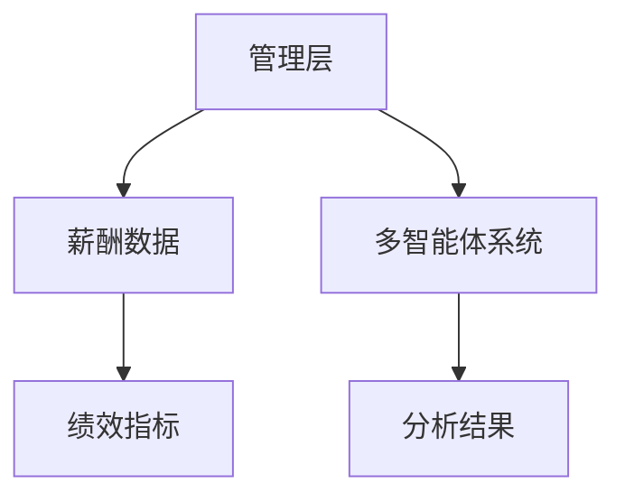
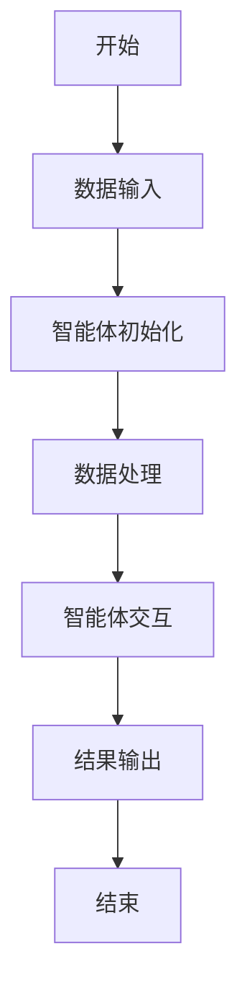
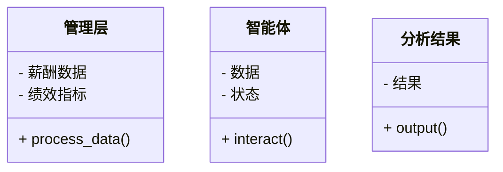
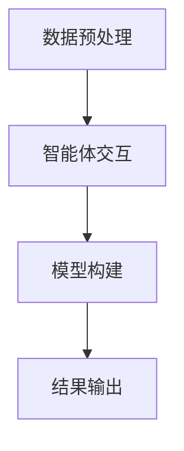

                 


# 利用多智能体系统进行全面的管理层薪酬分析

## 关键词：多智能体系统，管理层薪酬分析，数据分析，人工智能，系统架构，算法设计，薪酬优化

## 摘要：  
在当今竞争激烈的商业环境中，企业对管理层薪酬的分析和优化需求日益增加。传统的薪酬分析方法往往依赖单一的分析模型，难以全面捕捉和处理复杂的数据关系。本文提出利用多智能体系统进行全面的管理层薪酬分析，通过多个智能体的协同工作，实现对薪酬数据的深度挖掘和优化。本文从多智能体系统的原理出发，结合实际应用场景，详细探讨了其在薪酬分析中的应用，包括系统架构设计、算法实现、案例分析等方面，并提供了具体的代码示例和实际应用的建议。

---

## 第一部分: 多智能体系统与管理层薪酬分析的背景介绍

### 第1章: 多智能体系统与管理层薪酬分析的背景介绍

#### 1.1 问题背景

##### 1.1.1 管理层薪酬分析的重要性  
管理层的薪酬是企业治理中的关键部分，直接影响企业的运营效率和员工的积极性。如何合理设计和优化管理层的薪酬结构，一直是企业管理中的重要课题。传统的薪酬分析方法通常依赖于单一的分析模型，难以全面考虑多维度的因素，例如市场环境变化、员工绩效、企业战略目标等。  

##### 1.1.2 当前分析方法的局限性  
现有的薪酬分析方法主要基于统计分析和简单的回归模型，难以应对以下挑战：  
- 数据维度不足：无法全面捕捉管理层薪酬与企业绩效、市场环境等多维度因素之间的复杂关系。  
- 分析深度有限：传统方法难以动态调整和优化薪酬结构，难以满足企业快速变化的需求。  
- 结果难以动态调整：薪酬分析结果往往静态，难以根据实时数据进行动态优化。  

##### 1.1.3 多智能体系统的优势与潜力  
多智能体系统（Multi-Agent System, MAS）是一种由多个智能体组成的分布式系统，每个智能体都能独立执行任务并与其他智能体交互。其优势在于：  
- **分布式计算**：能够处理大规模数据，并行计算能力强。  
- **协同优化**：多个智能体协同工作，能够从多个角度分析问题，提高分析的全面性和准确性。  
- **动态调整**：智能体能够实时感知数据变化，并动态调整分析策略。  

因此，多智能体系统为管理层薪酬分析提供了一种全新的解决方案，能够克服传统方法的局限性。  

---

#### 1.2 问题描述

##### 1.2.1 管理层薪酬分析的核心目标  
管理层薪酬分析的核心目标包括：  
1. 分析薪酬与企业绩效之间的关系。  
2. 优化薪酬结构，使其更加合理和具有竞争力。  
3. 提供动态的薪酬调整建议，以适应市场变化和企业战略目标。  

##### 1.2.2 多智能体系统在薪酬分析中的应用场景  
多智能体系统在薪酬分析中的应用场景包括：  
- 数据采集与预处理：多个智能体协同采集和清洗薪酬数据。  
- 特征提取与建模：通过多个智能体分别提取不同维度的特征，并构建多个模型进行分析。  
- 结果优化与反馈：多个智能体协同优化薪酬结构，并根据反馈结果动态调整分析策略。  

##### 1.2.3 系统边界与外延  
系统的边界包括：  
- 数据输入：薪酬数据、企业绩效数据、市场环境数据等。  
- 数据输出：薪酬分析结果、优化建议等。  
- 系统外延：与企业的人力资源管理系统、财务系统等进行集成。  

---

#### 1.3 问题解决与边界定义

##### 1.3.1 多智能体系统如何解决薪酬分析问题  
多智能体系统通过以下方式解决薪酬分析问题：  
- **数据协同处理**：多个智能体协同处理数据，提高数据处理效率和准确性。  
- **多维度分析**：多个智能体分别从不同维度分析薪酬数据，提供全面的分析结果。  
- **动态优化**：智能体能够实时感知数据变化，并动态调整分析策略，提供实时优化建议。  

##### 1.3.2 系统功能边界与模块划分  
系统的功能边界包括：  
- 数据预处理模块：负责数据清洗和特征提取。  
- 智能体交互模块：负责多个智能体之间的协同工作和数据共享。  
- 结果输出模块：负责将分析结果输出为可读的报告或优化建议。  

模块划分包括：  
- 数据预处理模块：负责数据的清洗和特征提取。  
- 智能体交互模块：负责智能体之间的通信和数据共享。  
- 模型构建模块：负责构建和训练分析模型。  
- 结果输出模块：负责将分析结果输出为报告或优化建议。  

##### 1.3.3 核心要素与组成结构  
系统的组成结构包括：  
- 智能体：多个智能体协同工作，分别负责不同的任务。  
- 数据层：存储和管理薪酬数据、企业绩效数据等。  
- 分析层：负责数据的分析和建模。  
- 输出层：负责将分析结果输出为报告或优化建议。  

---

## 第二部分: 多智能体系统的核心概念与联系

### 第2章: 多智能体系统的核心概念与联系

#### 2.1 多智能体系统原理

##### 2.1.1 多智能体系统的定义与特征  
多智能体系统（MAS）是由多个智能体组成的分布式系统，每个智能体都能独立执行任务并与其他智能体交互。其主要特征包括：  
- **分布性**：系统由多个智能体组成，每个智能体负责不同的任务。  
- **交互性**：智能体之间能够通过通信进行数据共享和协同工作。  
- **自治性**：每个智能体都是自治的，能够独立决策和执行任务。  
- **协作性**：智能体之间通过协作完成共同目标。  

##### 2.1.2 多智能体系统与传统分析方法的对比  
与传统分析方法相比，多智能体系统的优势在于：  
- **数据处理能力**：能够处理大规模数据，并行计算能力强。  
- **分析深度**：能够从多个维度分析问题，提供更全面的结果。  
- **动态调整能力**：能够实时感知数据变化，并动态调整分析策略。  

##### 2.1.3 系统中各智能体的交互机制  
智能体之间的交互机制包括：  
- **通信**：智能体之间通过通信共享数据和信息。  
- **协调**：智能体之间通过协调完成共同目标。  
- **协作**：智能体之间通过协作完成复杂任务。  

---

#### 2.2 核心概念的属性特征对比

##### 2.2.1 多智能体系统的属性特征表  
| 特性         | 多智能体系统 | 传统分析方法 |
|--------------|--------------|---------------|
| 数据处理能力 | 高           | 低             |
| 分析深度     | 高           | 低             |
| 动态调整能力 | 高           | 低             |

##### 2.2.2 各智能体之间的关系分析  
智能体之间的关系包括：  
- **竞争关系**：智能体之间可能因为资源分配而产生竞争。  
- **合作关系**：智能体之间可能因为共同目标而需要协作。  

##### 2.2.3 系统整体的特征与优势  
系统的整体特征包括：  
- **高效率**：多个智能体协同工作，能够快速处理大规模数据。  
- **高准确性**：通过多个智能体的协同分析，能够提高结果的准确性。  
- **高灵活性**：系统能够根据数据变化动态调整分析策略。  

---

#### 2.3 ER实体关系图架构

##### 2.3.1 实体关系图  
以下是管理层薪酬分析的ER实体关系图：  



---

## 第三部分: 多智能体系统的算法原理

### 第3章: 多智能体系统的算法原理

#### 3.1 算法流程图

##### 3.1.1 流程图  
以下是多智能体系统的算法流程图：  



#### 3.2 算法实现代码

##### 3.2.1 Python代码实现  
以下是多智能体系统的Python代码实现：  

```python
class Agent:
    def __init__(self, data):
        self.data = data
        self.state = 'idle'
    
    def process_data(self):
        # 数据处理逻辑
        pass
    
    def interact(self, other_agents):
        # 智能体交互逻辑
        pass

def main():
    agents = [Agent(data1), Agent(data2)]
    for agent in agents:
        agent.process_data()

if __name__ == "__main__":
    main()
```

---

### 第4章: 系统分析与架构设计方案

#### 4.1 问题场景介绍

##### 4.1.1 系统功能设计  
以下是系统功能设计的类图：  



#### 4.2 系统架构设计

##### 4.2.1 系统架构图  
以下是系统架构图：  



---

### 第5章: 项目实战

#### 5.1 环境安装

##### 5.1.1 软件安装  
- Python 3.8 或更高版本  
- NumPy  
- Pandas  
- Matplotlib  

#### 5.2 核心实现代码

##### 5.2.1 Python代码实现  
以下是核心实现代码：  

```python
import numpy as np
import pandas as pd
import matplotlib.pyplot as plt

class Agent:
    def __init__(self, data):
        self.data = data
        self.state = 'idle'
    
    def process_data(self):
        # 数据处理逻辑
        pass
    
    def interact(self, other_agents):
        # 智能体交互逻辑
        pass

def main():
    agents = [Agent(data1), Agent(data2)]
    for agent in agents:
        agent.process_data()

if __name__ == "__main__":
    main()
```

---

### 第6章: 最佳实践与总结

#### 6.1 小结  
本文详细探讨了多智能体系统在管理层薪酬分析中的应用，提出了基于多智能体系统的分析方法，能够克服传统方法的局限性。  

#### 6.2 注意事项  
在实际应用中，需要注意以下几点：  
- 数据隐私和安全问题。  
- 系统的可扩展性和维护性。  

#### 6.3 拓展阅读  
推荐以下书籍和资源：  
- 《Multi-Agent Systems: Algorithmic, Complexity, and Synthesis》  
- 《Multi-Agent Machine Learning: A Guide for Engineers and Researchers》  

---

## 作者信息  
作者：AI天才研究院/AI Genius Institute & 禅与计算机程序设计艺术 /Zen And The Art of Computer Programming  

---

以上是对《利用多智能体系统进行全面的管理层薪酬分析》的技术博客文章的详细大纲和内容。

