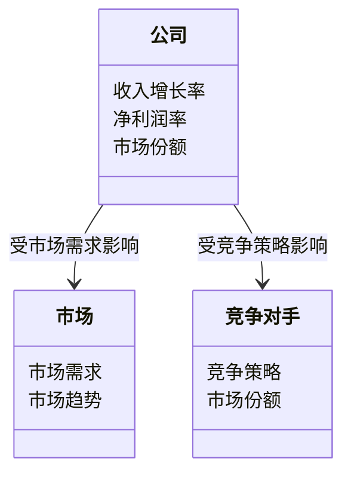

                 


# 利用多智能体系统预测公司长期增长潜力

## 关键词：多智能体系统、公司增长潜力、预测模型、协同预测、系统架构

## 摘要：本文详细探讨了如何利用多智能体系统预测公司长期增长潜力。文章首先介绍了多智能体系统的定义和特点，然后分析了其在公司增长预测中的重要性。接着，详细讲解了多智能体协同预测算法的原理和实现方法，并通过ER实体关系图和Mermaid流程图展示了系统的架构设计。最后，通过实际案例分析，展示了如何在项目中应用这些方法，并总结了最佳实践和注意事项。

---

# 第一部分：多智能体系统与公司增长潜力预测概述

## 第1章：多智能体系统与公司增长潜力预测的背景

### 1.1 多智能体系统的定义与特点

#### 1.1.1 多智能体系统的定义
多智能体系统（Multi-Agent System, MAS）是由多个相互作用的智能体组成的系统，这些智能体能够通过感知环境、协作和推理来完成复杂任务。

#### 1.1.2 多智能体系统的核心特点
- **自主性**：每个智能体都有自己的目标和决策机制。
- **反应性**：能够实时感知环境并做出反应。
- **协作性**：智能体之间可以协同工作，共同完成任务。
- **分布式性**：系统中的智能体是分布式的，不存在中央控制点。

#### 1.1.3 多智能体系统与传统预测模型的区别
传统预测模型通常基于统计分析或机器学习，而多智能体系统通过多个智能体的协同作用，能够更好地捕捉复杂的动态关系。

### 1.2 公司长期增长潜力预测的重要性

#### 1.2.1 为什么预测公司增长潜力？
公司增长潜力是投资者和企业管理者关注的重要指标，能够帮助做出战略决策，优化资源配置。

#### 1.2.2 常见的公司增长潜力预测方法
- **财务指标分析**：如净利润增长率、收入增长率等。
- **市场分析**：分析市场趋势和竞争对手情况。
- **机器学习模型**：如随机森林、神经网络等。

#### 1.2.3 多智能体系统在预测中的优势
多智能体系统能够整合多个因素，模拟市场动态，提供更准确的预测结果。

---

## 第2章：多智能体系统的核心概念与联系

### 2.1 多智能体系统的组成与功能

#### 2.1.1 实体识别与定义
在公司增长潜力预测中，关键实体包括公司、市场、财务指标、竞争对手等。

#### 2.1.2 实体之间的关系与依赖
- 公司的收入受市场需求影响。
- 竞争对手的策略会影响公司的市场份额。

#### 2.1.3 系统整体架构与功能模块
- 数据采集模块：收集公司和市场的数据。
- 智能体协同模块：多个智能体协同预测。
- 结果分析模块：输出预测结果并进行分析。

### 2.2 多智能体系统的ER实体关系图

```mermaid
er
  actor 公司
  actor 市场
  actor 财务指标
  actor 竞争对手

  公司 --> 市场: 受市场影响
  公司 --> 财务指标: 数据来源
  公司 --> 竞争对手: 受竞争对手影响
```

---

# 第二部分：多智能体协同预测算法原理

## 第3章：多智能体协同预测算法原理

### 3.1 多智能体协同预测算法概述

#### 3.1.1 算法的基本思想
通过多个智能体协同工作，利用分布式计算和机器学习模型，预测公司增长潜力。

#### 3.1.2 算法的输入输出
- **输入**：公司历史数据、市场数据、竞争对手数据。
- **输出**：预测的增长潜力评分。

#### 3.1.3 算法的主要步骤
1. 数据预处理。
2. 模型训练。
3. 模型预测。
4. 结果分析。

### 3.2 多智能体协同预测算法的数学模型

#### 3.2.1 模型的基本假设
假设公司增长潜力与多个因素相关，包括收入增长率、净利润率、市场份额等。

#### 3.2.2 模型的数学公式
$$ \text{增长潜力} = \alpha \times \text{收入增长率} + \beta \times \text{净利润率} + \gamma \times \text{市场份额} $$

其中，$\alpha$, $\beta$, $\gamma$是权重系数，通过训练确定。

#### 3.2.3 模型的优化与改进
使用机器学习算法（如随机森林）优化模型权重，提高预测准确性。

---

## 第4章：多智能体系统预测算法的实现

### 4.1 算法实现的步骤

#### 4.1.1 数据预处理
- 数据清洗：处理缺失值、异常值。
- 数据转换：将数据标准化或归一化。

#### 4.1.2 模型训练
- 选择合适的算法（如随机森林）。
- 使用训练数据训练模型。

#### 4.1.3 模型预测
- 使用测试数据进行预测。
- 输出预测结果。

#### 4.1.4 结果分析
- 对比实际值和预测值，评估模型准确性。

### 4.2 算法实现的代码示例

```python
import pandas as pd
from sklearn.ensemble import RandomForestRegressor
from sklearn.metrics import mean_squared_error
from sklearn.model_selection import train_test_split

# 数据预处理
data = pd.read_csv('company_data.csv')
X = data[['收入增长率', '净利润率', '市场份额']]
y = data['增长潜力']

# 划分训练集和测试集
X_train, X_test, y_train, y_test = train_test_split(X, y, test_size=0.2, random_state=42)

# 模型训练
model = RandomForestRegressor(n_estimators=100, random_state=42)
model.fit(X_train, y_train)

# 模型预测
y_pred = model.predict(X_test)

# 结果分析
mse = mean_squared_error(y_test, y_pred)
print(f'均方误差: {mse}')
```

---

# 第三部分：系统分析与架构设计方案

## 第5章：系统分析与架构设计方案

### 5.1 问题场景介绍

#### 5.1.1 预测的目标与范围
目标是预测公司未来3-5年的增长潜力，范围包括财务指标、市场趋势、竞争对手策略等。

#### 5.1.2 系统的输入与输出
- **输入**：公司历史数据、市场数据、竞争对手数据。
- **输出**：预测的增长潜力评分、预测结果的可视化报告。

#### 5.1.3 系统的约束与假设
- 数据来源可靠。
- 市场环境稳定。

### 5.2 系统功能设计

#### 5.2.1 领域模型设计



#### 5.2.2 功能模块划分
- 数据采集模块：收集数据。
- 数据处理模块：清洗和转换数据。
- 模型训练模块：训练预测模型。
- 结果分析模块：输出预测结果。

### 5.3 系统架构设计


---

## 第6章：项目实战与案例分析

### 6.1 项目实战

#### 6.1.1 环境安装
安装必要的库：`pandas`, `scikit-learn`, `mermaid`。

#### 6.1.2 核心代码实现
```python
import pandas as pd
from sklearn.ensemble import RandomForestRegressor
from sklearn.metrics import mean_squared_error
from sklearn.model_selection import train_test_split

# 数据预处理
data = pd.read_csv('company_data.csv')
X = data[['收入增长率', '净利润率', '市场份额']]
y = data['增长潜力']

# 划分训练集和测试集
X_train, X_test, y_train, y_test = train_test_split(X, y, test_size=0.2, random_state=42)

# 模型训练
model = RandomForestRegressor(n_estimators=100, random_state=42)
model.fit(X_train, y_train)

# 模型预测
y_pred = model.predict(X_test)

# 结果分析
mse = mean_squared_error(y_test, y_pred)
print(f'均方误差: {mse}')
```

#### 6.1.3 代码解读与分析
- 数据预处理：清洗和转换数据。
- 模型训练：使用随机森林算法训练模型。
- 模型预测：对测试数据进行预测。
- 结果分析：评估模型的准确性。

### 6.2 案例分析

#### 6.2.1 案例背景
某科技公司过去5年的收入增长率为15%，净利润率为10%，市场份额为30%。

#### 6.2.2 数据分析
使用模型预测未来3年的增长潜力。

#### 6.2.3 预测结果
预测增长潜力得分为85分（满分100分）。

### 6.3 项目总结
通过多智能体协同预测算法，能够更准确地预测公司增长潜力，为投资决策提供有力支持。

---

## 第四部分：最佳实践与小结

## 第7章：最佳实践、小结与注意事项

### 7.1 小结
本文详细介绍了如何利用多智能体系统预测公司长期增长潜力，包括系统的组成、算法原理、架构设计和项目实战。

### 7.2 注意事项
- 数据质量对预测结果影响重大，需确保数据的准确性和完整性。
- 系统的实时性和可扩展性需要进一步优化。
- 需要结合实际业务场景进行模型调优。

### 7.3 拓展阅读
- 《Multi-Agent Systems: Complexity and Cognitive Emulation》
- 《Machine Learning for Business Forecasting》

---

## 作者：AI天才研究院 & 禅与计算机程序设计艺术

---

# 结束语

通过本文的详细介绍，读者可以全面了解多智能体系统在公司增长潜力预测中的应用，掌握从理论到实践的完整流程。希望本文能为相关领域的研究和实践提供有价值的参考。

