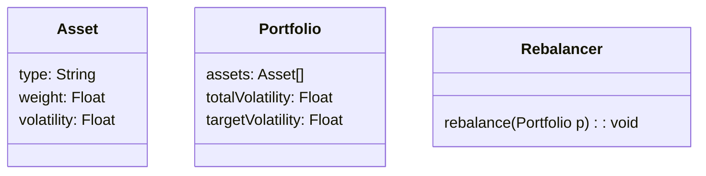
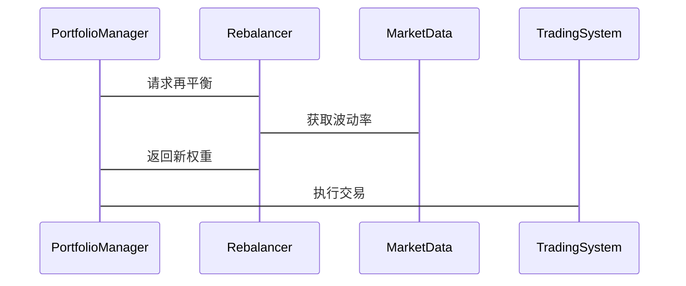

                 


# 利用市场波动重新平衡资产配置的策略

> 关键词：市场波动、资产配置、再平衡、投资策略、风险管理

> 摘要：本文探讨了如何利用市场波动重新平衡资产配置，以优化投资组合的表现。通过分析市场波动对资产配置的影响，提出了基于波动率的动态再平衡策略，并结合数学模型和实际案例，展示了如何在不同市场环境下有效调整资产配置。

---

# 第1章 市场波动与资产配置概述

## 1.1 市场波动的定义与类型

### 1.1.1 市场波动的定义
市场波动是指资产价格在短时间内围绕其长期趋势上下波动的现象。波动性是衡量市场风险的重要指标，通常用标准差或波动率来表示。

### 1.1.2 市场波动的主要类型
1. **短期波动**：由市场参与者的短期交易行为引起，通常持续时间较短。
2. **中期波动**：由宏观经济因素或市场情绪变化引起，持续时间较长。
3. **长期波动**：由结构性变化或重大事件引起，可能影响市场多年。

### 1.1.3 市场波动对投资的影响
市场波动会影响资产价格的稳定性，进而影响投资者的收益和风险。波动率高的市场通常伴随着更高的风险，但也可能带来更高的收益机会。

---

## 1.2 资产配置的基本原理

### 1.2.1 资产配置的定义
资产配置是指将投资资金分配到不同的资产类别（如股票、债券、房地产等）中，以实现风险分散和收益最大化。

### 1.2.2 资产配置的主要策略
1. **被动配置**：根据长期投资目标设定固定权重，定期调整。
2. **主动配置**：根据市场变化动态调整资产权重。
3. **平衡配置**：在风险和收益之间寻求平衡，避免过度集中。

### 1.2.3 资产配置与投资目标的关系
资产配置需要与投资目标（如风险承受能力、收益目标）相匹配。例如，风险厌恶的投资者可能更倾向于配置债券，而风险承受能力强的投资者可能更多配置股票。

---

## 1.3 重新平衡资产配置的必要性

### 1.3.1 资产配置失衡的常见原因
1. **市场波动**：资产价格的波动导致权重偏离初始设定。
2. **资金流入/流出**：新资金或赎回会影响资产权重。
3. **投资目标变化**：投资者的风险承受能力或收益目标可能改变。

### 1.3.2 重新平衡资产配置的意义
重新平衡可以确保投资组合的权重与初始目标一致，避免某类资产过度集中带来的风险。

### 1.3.3 重新平衡的时机与频率
1. **定期再平衡**：如每年一次或每季度一次。
2. **事件驱动再平衡**：如市场剧烈波动或投资目标变化。

---

## 1.4 本章小结
市场波动是资产配置中不可忽视的因素，通过定期或动态再平衡，可以有效应对市场波动带来的影响，优化投资组合的表现。

---

# 第2章 利用市场波动进行资产再平衡的策略

## 2.1 市场波动与资产再平衡的关系

### 2.1.1 市场波动对再平衡的驱动作用
市场波动可能导致资产权重偏离目标，需要通过再平衡来恢复初始配置。

### 2.1.2 不同市场环境下再平衡策略的调整
1. **牛市**：波动率低，再平衡频率可以适当降低。
2. **熊市**：波动率高，再平衡频率可能需要提高，以减少损失。

---

## 2.2 资产再平衡的基本策略

### 2.2.1 被动再平衡策略
被动再平衡是定期（如每年）调整资产权重，无论市场环境如何。

### 2.2.2 主动再平衡策略
主动再平衡是根据市场波动动态调整，例如在市场波动加剧时增加防御性资产的权重。

### 2.2.3 动态再平衡策略
动态再平衡根据波动率的变化实时调整，可能使用数学模型来优化权重。

---

## 2.3 市场波动下的再平衡优化

### 2.3.1 波动率与再平衡频率的关系
波动率高时，再平衡频率可能需要增加，以减少潜在风险。

### 2.3.2 基于波动率的再平衡阈值设定
例如，当某资产的波动率超过设定阈值时，触发再平衡。

### 2.3.3 波动率对再平衡成本的影响
频繁再平衡可能导致交易成本增加，因此需要在波动率和成本之间找到平衡点。

---

## 2.4 本章小结
市场波动是资产再平衡的重要驱动力，通过动态调整再平衡策略，可以更好地应对市场变化，优化投资组合的风险收益比。

---

# 第3章 市场波动与资产配置的核心概念

## 3.1 市场波动的核心属性

### 3.1.1 波动率的度量方法
波动率通常用标准差或波动率指标（如VIX指数）来衡量。

### 3.1.2 波动率与风险的关系
波动率越高，资产的风险越大。

### 3.1.3 波动率与收益的关系
高波动率通常伴随着高收益，但也可能带来更大的亏损。

---

## 3.2 资产配置的核心要素

### 3.2.1 资产类别划分
常见的资产类别包括股票、债券、现金、房地产等。

### 3.2.2 资产权重分配
根据投资目标和风险承受能力分配权重。

### 3.2.3 资产配置的动态调整
根据市场波动和投资目标变化进行调整。

---

## 3.3 波动率与资产配置的关联模型

### 3.3.1 波动率与资产权重的线性关系
波动率与资产权重之间可能存在线性关系，例如波动率越高，权重可能越低。

### 3.3.2 波动率与资产配置风险的非线性关系
波动率对风险的影响可能是非线性的，例如波动率过高可能导致投资组合风险急剧增加。

### 3.3.3 波动率对资产配置收益的影响
高波动率可能导致收益波动，但可能带来更高的潜在收益。

---

## 3.4 本章小结
市场波动是资产配置中的关键因素，理解和利用波动率可以帮助投资者优化资产配置。

---

# 第4章 基于波动率的资产再平衡算法

## 4.1 波动率驱动的再平衡算法原理

### 4.1.1 波动率敏感性分析
分析不同资产对波动率的敏感程度，确定调整幅度。

### 4.1.2 波动率对资产权重的影响
根据波动率调整资产权重，例如波动率高的资产权重降低。

### 4.1.3 波动率驱动的再平衡阈值设定
设定波动率阈值，当波动率超过阈值时触发再平衡。

---

## 4.2 均值-方差优化算法

### 4.2.1 均值-方差优化的数学模型
$$\text{目标：} \min_w \sigma^2$$
$$\text{约束：} \sum_{i=1}^n w_i = 1, \quad w_i \geq 0$$

### 4.2.2 波动率在均值-方差优化中的应用
波动率作为优化目标，调整权重以最小化组合波动率。

### 4.2.3 基于波动率的权重调整公式
$$w_i = \frac{1}{\sum_{j=1}^n \frac{1}{\sigma_j^2}} \cdot \frac{1}{\sigma_i^2}$$

---

## 4.3 基于波动率的动态再平衡算法

### 4.3.1 动态再平衡的定义
动态再平衡是根据实时波动率变化调整资产权重。

### 4.3.2 波动率驱动的动态再平衡流程
1. 计算当前资产的波动率。
2. 根据波动率调整权重。
3. 执行交易以实现新的权重。

---

## 4.4 本章小结
基于波动率的再平衡算法能够有效应对市场波动，优化资产配置。

---

# 第5章 系统分析与架构设计

## 5.1 系统功能设计

### 5.1.1 领域模型（Mermaid 类图）


### 5.1.2 系统架构设计（Mermaid 架构图）


### 5.1.3 系统接口设计
1. 获取市场数据接口。
2. 计算波动率接口。
3. 调整权重接口。

### 5.1.4 系统交互设计（Mermaid 序列图）


---

## 5.2 本章小结
系统设计为基于波动率的再平衡策略提供了实现框架，确保了功能的可扩展性和灵活性。

---

# 第6章 项目实战

## 6.1 环境安装

### 6.1.1 Python 环境安装
安装Python和相关库：
```bash
pip install numpy pandas matplotlib
```

### 6.1.2 数据获取
使用Yahoo Finance获取股票数据。

---

## 6.2 核心实现源代码

### 6.2.1 波动率计算
```python
import pandas as pd

def calculate_volatility(prices):
    returns = prices.pct_change()
    volatility = returns.std() * 100
    return volatility
```

### 6.2.2 动态再平衡算法
```python
def rebalance_portfolio(weights, prices):
    current_weights = calculate_weights(prices)
    target_weights = weights
    adjustment_needed = compare_weights(current_weights, target_weights)
    execute_trades(adjustment_needed)
```

---

## 6.3 案例分析

### 6.3.1 案例背景
假设投资组合初始权重为股票60%，债券40%。

### 6.3.2 市场波动情况
股票波动率从20%上升到30%。

### 6.3.3 再平衡调整
调整股票权重至50%，债券权重至50%，以降低整体波动率。

---

## 6.4 本章小结
通过实际案例展示了基于波动率的再平衡策略的应用，验证了其有效性和可操作性。

---

# 第7章 总结与展望

## 7.1 总结
本文详细探讨了利用市场波动重新平衡资产配置的策略，提出了基于波动率的动态再平衡方法，并通过系统设计和案例分析验证了其可行性。

## 7.2 注意事项
1. 再平衡需要考虑交易成本和税务影响。
2. 波动率不是唯一的决策因素，还需考虑其他市场指标。

## 7.3 拓展阅读
推荐阅读《投资学》和《风险管理》相关书籍，深入理解波动率与资产配置的关系。

---

# 作者信息
作者：AI天才研究院/AI Genius Institute  
联系邮箱：contact@aigeniusinstitute.com  
官方网站：https://www.aigeniusinstitute.com

---

通过本文的详细分析，读者可以深入了解市场波动对资产配置的影响，并掌握如何利用波动率优化投资组合。希望本文对投资实践有所帮助！

