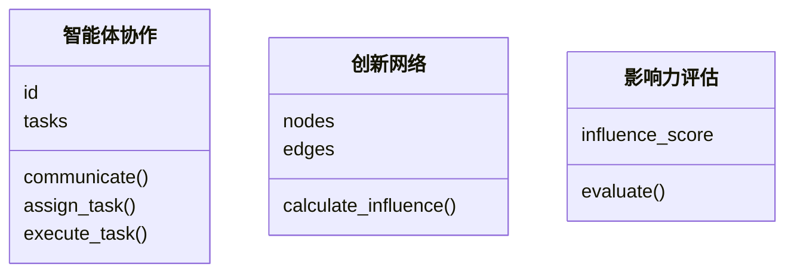
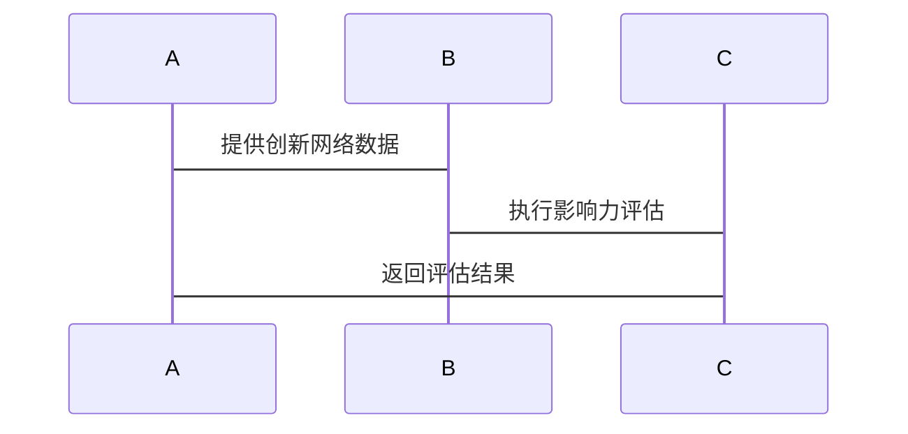

                 


# 利用智能体协作进行全面的公司创新网络影响力评估

> 关键词：智能体协作，创新网络，影响力评估，系统架构设计，项目实战

> 摘要：本文系统地探讨了如何利用智能体协作技术进行全面的公司创新网络影响力评估。通过分析创新网络的结构、智能体协作的核心原理，结合算法设计、系统架构优化和实际项目案例，本文为读者提供了一套完整的解决方案。从理论到实践，本文详细讲解了如何通过智能体协作提升创新网络的评估效率和准确性。

---

# 第1章: 背景介绍

## 1.1 问题背景
### 1.1.1 创新网络的定义与重要性
### 1.1.2 公司创新网络影响力评估的必要性
### 1.1.3 智能体协作在创新网络中的作用

## 1.2 问题描述
### 1.2.1 创新网络中的关键问题
### 1.2.2 智能体协作在创新网络中的具体问题
### 1.2.3 传统评估方法的局限性

## 1.3 问题解决
### 1.3.1 智能体协作的优势
### 1.3.2 创新网络影响力评估的目标
### 1.3.3 智能体协作如何提升评估效果

## 1.4 边界与外延
### 1.4.1 创新网络的边界
### 1.4.2 智能体协作的边界
### 1.4.3 创新网络影响力评估的外延

## 1.5 概念结构与核心要素组成
### 1.5.1 创新网络的构成要素
### 1.5.2 智能体协作的核心要素
### 1.5.3 创新网络影响力评估的指标体系

---

# 第2章: 智能体协作与创新网络影响力评估的核心概念

## 2.1 智能体协作的原理
### 2.1.1 智能体的定义与特征
### 2.1.2 智能体协作的基本原理
### 2.1.3 智能体协作的分类

## 2.2 创新网络影响力评估的原理
### 2.2.1 创新网络的结构分析
### 2.2.2 创新网络影响力评估的指标体系
### 2.2.3 创新网络影响力评估的数学模型

## 2.3 智能体协作与创新网络影响力评估的关系
### 2.3.1 智能体协作在创新网络中的作用
### 2.3.2 创新网络影响力评估对智能体协作的反馈
### 2.3.3 智能体协作与创新网络影响力评估的协同优化

---

# 第3章: 智能体协作与创新网络影响力评估的核心概念联系

## 3.1 智能体协作的核心概念属性对比
### 3.1.1 智能体协作的属性特征
### 3.1.2 创新网络影响力评估的属性特征
### 3.1.3 智能体协作与创新网络影响力评估的属性对比

## 3.2 智能体协作与创新网络影响力评估的ER实体关系图

```mermaid
er
actor(智能体协作, id)
actor(创新网络, id)
actor(影响力评估, id)
```

---

# 第4章: 智能体协作与创新网络影响力评估的算法原理

## 4.1 算法原理概述
### 4.1.1 智能体协作算法的基本流程
### 4.1.2 创新网络影响力评估算法的基本流程
### 4.1.3 智能体协作与创新网络影响力评估算法的结合

## 4.2 智能体协作算法的实现
### 4.2.1 算法流程图

### 4.2.2 算法核心代码实现
```python
class Agent:
    def __init__(self, id):
        self.id = id
        self.tasks = []
    
    def communicate(self, other_agents):
        # 实现智能体间的通信逻辑
        pass
    
    def assign_task(self, task):
        self.tasks.append(task)
    
    def execute_task(self):
        # 执行任务的具体逻辑
        pass
```

## 4.3 创新网络影响力评估算法的实现
### 4.3.1 算法流程图

### 4.3.2 算法核心代码实现
```python
def calculate_influence(nodes, edges):
    # nodes: 创新网络的节点列表
    # edges: 创新网络的边列表
    influence = {}
    for node in nodes:
        influence[node] = 0
    # 计算每个节点的影响力
    for edge in edges:
        source, target = edge
        influence[source] += 1
        influence[target] += 1
    return influence
```

---

# 第5章: 智能体协作与创新网络影响力评估的系统架构设计

## 5.1 系统功能设计
### 5.1.1 领域模型设计


### 5.1.2 系统架构设计


### 5.1.3 系统接口设计
- 智能体协作模块接口：`assign_task`, `execute_task`
- 创新网络模块接口：`calculate_influence`
- 影响力评估模块接口：`evaluate`

### 5.1.4 系统交互流程图


---

# 第6章: 项目实战

## 6.1 环境安装
### 6.1.1 系统环境要求
- Python 3.8 或更高版本
- Mermaid 插件支持
### 6.1.2 安装依赖
```bash
pip install mermaid
```

## 6.2 系统核心实现源代码
### 6.2.1 智能体协作模块实现
```python
class Agent:
    def __init__(self, id):
        self.id = id
        self.tasks = []
    
    def communicate(self, other_agents):
        for agent in other_agents:
            if agent.id != self.id:
                agent.receive_message(self.send_message())
    
    def send_message(self):
        return f"Agent {self.id} message"
    
    def receive_message(self, message):
        print(f"Agent {self.id} received message: {message}")
```

### 6.2.2 创新网络模块实现
```python
class InnovationNetwork:
    def __init__(self, nodes, edges):
        self.nodes = nodes
        self.edges = edges
    
    def calculate_influence(self):
        influence = {node: 0 for node in self.nodes}
        for edge in self.edges:
            source, target = edge
            influence[source] += 1
            influence[target] += 1
        return influence
```

## 6.3 实际案例分析与详细讲解
### 6.3.1 案例背景
- 公司A的创新网络包括5个节点，形成一个复杂的协作网络
### 6.3.2 数据准备
```python
nodes = ['A', 'B', 'C', 'D', 'E']
edges = [('A', 'B'), ('B', 'C'), ('C', 'D'), ('D', 'E'), ('E', 'A')]
```
### 6.3.3 算法实现与结果
```python
network = InnovationNetwork(nodes, edges)
influence = network.calculate_influence()
print(influence)
```

## 6.4 项目小结
### 6.4.1 项目总结
### 6.4.2 项目收获
### 6.4.3 项目经验

---

# 第7章: 最佳实践、小结、注意事项与拓展阅读

## 7.1 最佳实践
### 7.1.1 系统设计中的注意事项
### 7.1.2 算法实现中的技巧
### 7.1.3 项目实施中的经验分享

## 7.2 小结
### 7.2.1 本章总结
### 7.2.2 展望未来

## 7.3 注意事项
### 7.3.1 系统设计中的常见问题
### 7.3.2 算法实现中的潜在问题
### 7.3.3 项目实施中的风险提示

## 7.4 拓展阅读
### 7.4.1 相关领域推荐读物
### 7.4.2 进一步研究的方向
### 7.4.3 其他推荐阅读资源

---

# 作者：AI天才研究院/AI Genius Institute & 禅与计算机程序设计艺术 /Zen And The Art of Computer Programming

