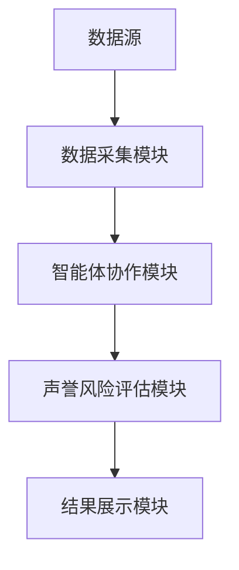

                 


# 利用智能体协作进行全面的公司声誉风险量化

## 关键词：智能体协作，声誉风险，风险管理，量化分析，人工智能

## 摘要：  
随着全球化和信息化的快速发展，公司声誉已成为企业核心竞争力的重要组成部分。然而，声誉风险的复杂性和动态性使得传统声誉管理方法面临巨大挑战。本文提出利用智能体协作技术，从数据采集、分析到量化评估，构建一个全面、动态的声誉风险量化系统。通过智能体协作机制，实现对声誉风险的实时监控、精准评估和有效应对，为企业声誉管理提供新的解决方案。

---

## 第一部分: 公司声誉风险量化背景与概念

### 第1章: 公司声誉风险量化背景与概念

#### 1.1 公司声誉风险的定义与重要性

##### 1.1.1 什么是公司声誉风险  
公司声誉风险是指由于企业内外部因素（如产品质量、服务态度、企业管理层决策等）引发的负面舆论对公司形象、市场地位和财务表现的潜在威胁。声誉风险不仅影响客户信任度，还可能引发股价波动、合作伙伴关系破裂等连锁反应。

##### 1.1.2 声誉风险对企业的影响  
声誉风险对企业的影响是多方面的：  
1. **财务损失**：负面舆论可能导致股价下跌、融资成本增加。  
2. **客户信任度下降**：客户对企业的信任度下降会直接影响销售收入。  
3. **品牌价值受损**：品牌价值是企业长期积累的无形资产，声誉风险可能导致品牌价值大幅缩水。  
4. **舆论扩散风险**：在社交媒体时代，负面信息可能快速传播，对企业声誉造成毁灭性打击。  

##### 1.1.3 声誉风险的分类与特征  
声誉风险可以分为以下几类：  
- **产品风险**：由于产品质量问题引发的声誉风险。  
- **管理风险**：由于企业管理层决策失误引发的声誉风险。  
- **舆论风险**：由于媒体负面报道或公众舆论引发的声誉风险。  
- **合规风险**：由于企业违反法律法规引发的声誉风险。  

声誉风险的特征包括：  
1. **隐蔽性**：声誉风险往往在潜移默化中积累，不易被察觉。  
2. **突发性**：负面信息可能在短时间内迅速扩散，造成重大影响。  
3. **长期性**：声誉的积累和修复需要长期努力，而损失往往难以挽回。  

---

#### 1.2 智能体协作的概念与优势

##### 1.2.1 智能体的定义与特点  
智能体（Agent）是指具有感知环境、做出决策、执行动作能力的实体。智能体可以是软件程序，也可以是物理设备。智能体的核心特点包括：  
1. **自主性**：智能体能够自主决策，无需外部干预。  
2. **反应性**：智能体能够实时感知环境变化并做出反应。  
3. **协作性**：智能体能够与其他智能体或系统进行协作，共同完成复杂任务。  

##### 1.2.2 智能体协作的核心优势  
智能体协作在声誉风险管理中的优势主要体现在以下几点：  
1. **实时性**：智能体能够实时监控企业内外部信息，快速响应声誉风险。  
2. **分布式计算**：智能体协作可以利用分布式计算能力，处理海量数据。  
3. **自我学习能力**：智能体可以通过机器学习算法不断优化自身行为，提高声誉风险预测的准确性。  

##### 1.2.3 智能体协作在声誉风险管理中的应用  
智能体协作在声誉风险管理中的应用场景包括：  
- **实时舆情监控**：通过智能体实时采集社交媒体、新闻媒体等渠道的信息，识别潜在声誉风险。  
- **风险预警**：智能体通过分析海量数据，预测声誉风险的发生概率，提前发出预警。  
- **动态应对策略**：智能体根据实时舆情变化，制定动态的声誉风险管理策略。  

---

#### 1.3 本章小结  
本章主要介绍了公司声誉风险的定义、影响、分类及其特征，同时阐述了智能体协作的概念及其在声誉风险管理中的优势和应用场景。通过智能体协作技术，企业可以更高效地应对声誉风险，提升风险管理能力。

---

## 第二部分: 智能体协作的核心概念与原理

### 第2章: 智能体协作的原理与机制

#### 2.1 智能体协作的基本原理

##### 2.1.1 智能体的感知与决策机制  
智能体的感知能力主要依赖于数据采集模块，通过采集企业内外部信息（如社交媒体评论、新闻报道等）来感知声誉风险。智能体的决策机制基于感知到的信息，通过机器学习算法（如随机森林、支持向量机等）进行风险评估，制定应对策略。

##### 2.1.2 智能体之间的通信与协调  
智能体之间的通信与协调是智能体协作的核心机制。通过通信协议，智能体可以共享信息、协调行动。例如，一个智能体发现负面舆情后，可以通过通信模块通知其他智能体，共同制定应对策略。

##### 2.1.3 智能体协作的数学模型  
智能体协作的数学模型可以表示为一个分布式决策系统。模型的核心是多个智能体之间的信息交互和协同决策。通过博弈论、分布式计算等理论，可以设计高效的协作机制。

---

#### 2.2 智能体协作的核心算法

##### 2.2.1 分布式协作算法  
分布式协作算法是智能体协作的基础算法。常见的分布式协作算法包括：  
- **分布式一致性算法**：如Paxos、Raft等，用于保证智能体之间状态的一致性。  
- **分布式计算算法**：如MapReduce，用于处理海量数据。  

##### 2.2.2 多智能体强化学习  
多智能体强化学习是一种通过强化学习实现智能体协作的方法。智能体通过与环境和其他智能体的交互，学习最优策略。例如，可以在声誉风险管理中，通过多智能体强化学习优化风险预警和应对策略。

##### 2.2.3 联合推理与决策算法  
联合推理与决策算法是一种基于知识图谱的智能体协作方法。通过知识图谱建模企业内外部信息，智能体可以进行联合推理，制定最优决策。  

---

#### 2.3 本章小结  
本章主要介绍了智能体协作的基本原理、核心算法及其在声誉风险管理中的应用。通过智能体协作技术，企业可以实现对声誉风险的实时监控和动态应对。

---

## 第三部分: 声誉风险量化的核心模型与方法

### 第3章: 声誉风险量化模型构建

#### 3.1 声誉风险量化的核心要素

##### 3.1.1 企业声誉的构成要素  
企业声誉的构成要素包括：  
1. **产品与服务质量**：产品的质量和售后服务直接影响客户满意度。  
2. **企业形象**：企业的品牌形象、社会责任感等。  
3. **管理团队**：管理团队的决策能力和领导力。  
4. **市场表现**：企业的市场份额、财务表现等。  

##### 3.1.2 声誉风险的关键指标  
声誉风险的关键指标包括：  
1. **负面舆情比例**：社交媒体和新闻中的负面评论比例。  
2. **舆论传播速度**：负面信息的扩散速度。  
3. **客户信任度**：客户对企业的信任程度。  
4. **品牌价值**：企业的品牌价值评估。  

##### 3.1.3 声誉风险的传播机制  
声誉风险的传播机制包括：  
1. **社交媒体传播**：负面信息通过社交媒体快速传播。  
2. **新闻媒体传播**：媒体报道对企业声誉的影响。  
3. **口碑传播**：客户之间的口碑传播。  

---

#### 3.2 基于智能体的声誉风险量化模型

##### 3.2.1 模型的设计思路  
基于智能体的声誉风险量化模型的设计思路是：通过多个智能体协作，实时采集、分析和评估企业声誉风险。模型的核心是智能体之间的协作机制和数学模型。  

##### 3.2.2 模型的数学表达  
声誉风险量化模型可以用以下公式表示：  
$$ R = \sum_{i=1}^{n} w_i \cdot f_i $$  
其中，$R$ 表示声誉风险，$w_i$ 表示风险因子的权重，$f_i$ 表示风险因子的值。  

##### 3.2.3 模型的验证与优化  
模型的验证与优化需要通过实际数据进行测试，并根据测试结果调整模型参数。例如，可以通过历史舆情数据验证模型的预测准确性，并通过机器学习算法优化模型参数。

---

#### 3.3 本章小结  
本章主要介绍了声誉风险量化的核心要素、基于智能体的量化模型及其数学表达。通过智能体协作技术，可以实现对声誉风险的准确量化和动态评估。

---

## 第四部分: 系统架构与实现方案

### 第4章: 系统架构设计

#### 4.1 系统功能模块划分

##### 4.1.1 数据采集模块  
数据采集模块负责从社交媒体、新闻媒体等渠道采集企业声誉相关的数据。  

##### 4.1.2 智能体协作模块  
智能体协作模块负责协调多个智能体的协作，实现对声誉风险的实时监控和动态评估。  

##### 4.1.3 声誉风险评估模块  
声誉风险评估模块基于智能体协作模块提供的数据，计算声誉风险值，并生成风险报告。  

##### 4.1.4 结果展示与预警模块  
结果展示与预警模块负责将声誉风险评估结果展示给企业管理人员，并根据风险等级发出预警。

#### 4.2 系统架构设计图  
以下是系统的架构图：  


#### 4.3 本章小结  
本章主要介绍了系统架构设计，包括功能模块划分和系统架构图。通过系统的整体设计，可以实现对声誉风险的全面监控和动态评估。

---

## 第五部分: 项目实战与案例分析

### 第5章: 项目实战

#### 5.1 环境搭建与工具安装

##### 5.1.1 开发环境配置  
开发环境包括操作系统、编程语言（如Python）、开发工具（如Jupyter Notebook）等。  

##### 5.1.2 智能体协作框架安装  
常用的智能体协作框架包括Rasa、Starlette等。  

##### 5.1.3 数据采集工具部署  
数据采集工具可以使用爬虫框架（如Scrapy）或API接口调用。  

#### 5.2 核心代码实现

##### 5.2.1 智能体协作算法实现  
以下是基于多智能体强化学习的声誉风险预警算法的代码示例：  
```python
import numpy as np
from agents import Agent

class ReputationRiskAgent(Agent):
    def __init__(self, id):
        super().__init__(id)
        self.state = 0  # 当前状态

    def receive_message(self, message):
        # 处理消息并更新状态
        self.state = max(0, min(1, self.state + message.value))
```

##### 5.2.2 声誉风险量化模型实现  
以下是声誉风险量化模型的代码示例：  
```python
def calculate_reputation_risk(factors):
    # 计算声誉风险
    risk = 0
    for factor in factors:
        risk += factor.weight * factor.value
    return risk
```

##### 5.2.3 系统接口开发  
系统接口开发可以使用RESTful API，例如：  
```python
from flask import Flask
app = Flask(__name__)

@app.route('/api/risk', methods=['POST'])
def calculate_risk():
    # 接收请求数据
    data = request.json
    # 计算声誉风险
    risk = calculate_reputation_risk(data['factors'])
    return jsonify({'risk': risk})
```

#### 5.3 案例分析与结果解读

##### 5.3.1 案例背景介绍  
假设某科技公司面临负面舆情，社交媒体上的负面评论激增。  

##### 5.3.2 数据分析与处理  
通过数据采集模块采集到的负面评论比例为30%。  

##### 5.3.3 实验结果展示与解读  
声誉风险量化模型计算出的风险值为7.5，属于高风险等级。系统发出预警，建议企业采取紧急措施应对负面舆情。

#### 5.4 本章小结  
本章通过实际案例展示了系统的实现过程和应用效果。通过智能体协作技术，企业可以实现对声誉风险的实时监控和动态评估。

---

## 第六部分: 总结与展望

### 第6章: 总结与展望

#### 6.1 项目总结

##### 6.1.1 核心成果与创新点  
项目的核心成果是构建了一个基于智能体协作的声誉风险量化系统，创新点在于利用智能体协作技术实现声誉风险的实时监控和动态评估。  

##### 6.1.2 项目实施中的经验与教训  
项目实施中的经验包括：  
- 数据采集模块需要考虑数据来源的多样性和实时性。  
- 智能体协作算法需要根据具体场景进行优化。  
- 系统设计需要充分考虑可扩展性和可维护性。  

---

#### 6.2 未来研究方向

##### 6.2.1 声誉风险量化模型的优化  
未来可以研究如何进一步优化声誉风险量化模型，提高预测准确性和响应速度。  

##### 6.2.2 智能体协作算法的改进  
未来可以研究如何改进智能体协作算法，提高协作效率和决策精度。  

##### 6.2.3 声誉风险管理系统的扩展与应用  
未来可以考虑将系统扩展到更多行业，探索更多应用场景。  

---

#### 6.3 最佳实践与注意事项

##### 6.3.1 系统设计中的注意事项  
- 系统设计需要充分考虑数据隐私和安全问题。  
- 系统需要具备良好的可扩展性和可维护性。  
- 系统需要定期更新和优化，以适应新的声誉风险挑战。  

---

## 作者：AI天才研究院/AI Genius Institute & 禅与计算机程序设计艺术 /Zen And The Art of Computer Programming

