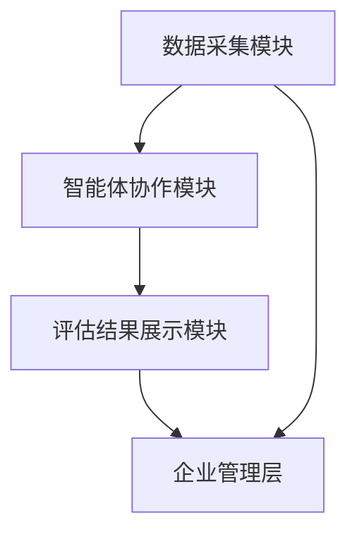

                 


# 利用智能体协作进行全面的公司文化一致性评估

> 关键词：智能体协作、公司文化、一致性评估、AI、算法

> 摘要：本文探讨了利用智能体协作技术进行全面的公司文化一致性评估的方法。通过分析智能体协作的基本概念、算法原理、系统架构以及实际案例，本文旨在为企业的文化管理提供一种高效、智能化的解决方案。

---

# 第一部分: 公司文化一致性评估的背景与意义

## 第1章: 问题背景与目标

### 1.1 问题背景

#### 1.1.1 企业文化的定义与重要性
企业文化是指企业在长期经营过程中形成的价值观、行为准则和组织氛围。它是企业成功的关键因素之一，直接影响员工的凝聚力、创造力和企业的长期发展。

#### 1.1.2 文化不一致对企业的影响
文化不一致可能导致员工行为与企业价值观脱节，影响团队协作和决策效率。例如，员工可能因为价值观冲突而产生矛盾，影响工作效率和产品质量。

#### 1.1.3 智能体协作在文化评估中的作用
智能体协作通过分布式计算和数据挖掘技术，能够高效地分析和评估企业文化的一致性。它能够帮助企业在大规模数据中发现潜在问题，并提供优化建议。

### 1.2 问题描述

#### 1.2.1 文化一致性评估的核心问题
文化一致性评估需要解决数据收集、分析和反馈的问题。如何高效地收集员工行为数据，如何准确地分析这些数据以评估文化一致性，以及如何将评估结果应用于实际管理，是核心挑战。

#### 1.2.2 智能体协作在评估中的应用需求
智能体协作需要具备分布式数据处理能力、高效的通信机制和自适应的学习能力，以满足企业文化一致性评估的多样化需求。

#### 1.2.3 评估目标与边界条件
评估目标包括识别文化偏差、优化企业政策和提升员工满意度。边界条件包括数据隐私保护、评估的实时性和结果的可解释性。

---

## 第2章: 智能体协作的基本概念

### 2.1 智能体的定义与特征

#### 2.1.1 智能体的定义
智能体是指能够感知环境、做出决策并采取行动的实体。它可以是一个软件程序、机器人或其他具有自主决策能力的系统。

#### 2.1.2 智能体的核心特征
智能体具有自主性、反应性、目标导向性和社会性。自主性意味着智能体能够独立决策；反应性意味着能够根据环境变化调整行为；目标导向性意味着智能体的行为是有目的的；社会性意味着智能体能够与其他智能体协作。

#### 2.1.3 智能体协作的优势
智能体协作能够利用分布式计算的优势，提高数据处理效率和决策的准确性。通过协作，智能体可以实现复杂任务的分解和优化。

### 2.2 智能体协作的原理

#### 2.2.1 协作机制
协作机制包括任务分配、信息共享和协调同步。任务分配确保每个智能体都有明确的责任；信息共享保证协作过程中的透明性；协调同步则确保所有智能体的行为一致。

#### 2.2.2 信息共享与处理
智能体通过通信协议共享数据和信息，利用分布式计算技术进行数据处理和分析。信息处理过程可能涉及数据清洗、特征提取和模型训练。

#### 2.2.3 协作目标的实现
智能体协作的目标是通过个体行为的优化，实现整体性能的最大化。这需要智能体之间进行有效的协调和反馈，确保协作过程的高效性。

---

# 第二部分: 智能体协作与文化一致性评估的结合

## 第3章: 智能体协作在文化评估中的应用

### 3.1 文化评估的核心维度

#### 3.1.1 价值观一致性
评估员工的行为是否符合企业的核心价值观，例如创新、诚信和团队合作。

#### 3.1.2 行为规范
评估员工是否遵守企业的行为准则，例如迟到率、沟通方式和决策风格。

#### 3.1.3 领导风格
评估领导的管理风格是否与企业文化一致，例如是否鼓励创新、是否注重员工反馈。

### 3.2 智能体协作在文化评估中的具体应用

#### 3.2.1 数据收集与分析
智能体协作可以通过分布式传感器或员工行为记录系统收集数据，利用数据挖掘技术分析员工行为的模式。

#### 3.2.2 评估模型构建
智能体协作可以构建基于机器学习的评估模型，通过训练数据预测员工行为与企业文化的一致性。

#### 3.2.3 结果反馈与优化
智能体协作可以将评估结果反馈给企业管理层，并提出优化建议，例如调整培训计划或修改企业政策。

---

## 第4章: 智能体协作的算法原理

### 4.1 算法概述

#### 4.1.1 算法的基本流程
智能体协作算法通常包括数据预处理、任务分配、信息共享和结果优化四个阶段。数据预处理确保数据的准确性和完整性；任务分配将数据处理任务分配给不同的智能体；信息共享确保智能体之间能够协同工作；结果优化通过反馈机制不断改进评估结果。

#### 4.1.2 算法的核心思想
智能体协作算法的核心思想是通过分布式计算和自适应调整，实现复杂任务的高效完成。它强调个体与整体的协调，确保协作过程的高效性和准确性。

#### 4.1.3 算法的输入输出
算法的输入包括员工行为数据、企业文化标准和评估指标；输出包括文化一致性评分、问题诊断和优化建议。

### 4.2 算法的数学模型

#### 4.2.1 数学模型的构建
文化一致性评估模型通常基于概率论和统计学方法。例如，可以用贝叶斯网络模型来分析员工行为与企业文化之间的关系。

#### 4.2.2 关键公式推导
假设我们有员工行为数据 $x_i$ 和企业文化标准 $y_i$，我们可以使用以下公式计算文化一致性评分：

$$
\text{评分} = \sum_{i=1}^{n} w_i \cdot x_i
$$

其中，$w_i$ 是权重系数，表示企业文化标准对评分的影响力。

#### 4.2.3 公式的应用场景
上述公式可以应用于员工行为数据分析，通过赋予不同行为特征不同的权重，计算出员工行为与企业文化的一致性评分。

---

## 第5章: 系统架构与设计

### 5.1 系统功能设计

#### 5.1.1 数据采集模块
数据采集模块负责收集员工行为数据，例如迟到记录、会议参与度和任务完成情况。

#### 5.1.2 智能体协作模块
智能体协作模块负责将数据分配给不同的智能体进行处理，并协调智能体之间的通信。

#### 5.1.3 评估结果展示模块
评估结果展示模块将评估结果以可视化形式呈现，帮助企业管理层理解数据。

### 5.2 系统架构图



### 5.3 系统的可扩展性
智能体协作系统具有良好的可扩展性，可以通过增加更多的智能体来处理更大的数据量和更复杂的任务。

---

## 第6章: 项目实战与案例分析

### 6.1 项目环境搭建

#### 6.1.1 开发环境的安装
需要安装Python、Java和分布式计算框架（如Spark或Flink）。

#### 6.1.2 工具链的配置
配置智能体协作框架，例如RabbitMQ用于智能体之间的通信。

#### 6.1.3 数据集的准备
收集员工行为数据，包括员工ID、行为记录和企业文化标准。

### 6.2 核心代码实现

#### 6.2.1 数据处理模块
以下是数据处理模块的Python代码示例：

```python
import pandas as pd

def preprocess_data(data):
    # 数据清洗
    data.dropna(inplace=True)
    # 特征提取
    features = data[['迟到率', '会议参与度', '任务完成度']]
    return features

# 示例数据
data = pd.DataFrame({
    '员工ID': [1, 2, 3],
    '迟到率': [0.1, 0.2, 0.15],
    '会议参与度': [0.8, 0.7, 0.9],
    '任务完成度': [0.9, 0.85, 0.95]
})

features = preprocess_data(data)
print(features)
```

#### 6.2.2 智能体协作模块
以下是智能体协作模块的Java代码示例：

```java
import java.util.List;

public class Agent {
    private String id;
    private List<Task> tasks;

    public void assignTask(Task task) {
        tasks.add(task);
    }

    public void communicate(Agent agent) {
        // 与其他智能体通信
    }
}
```

#### 6.2.3 评估结果展示模块
以下是评估结果展示模块的Python代码示例：

```python
import matplotlib.pyplot as plt

def plot_results(scores):
    plt.bar(range(len(scores)), scores)
    plt.xticks(range(len(scores)), ['员工1', '员工2', '员工3'])
    plt.ylabel('文化一致性评分')
    plt.show()

# 示例评分
scores = [0.7, 0.6, 0.8]
plot_results(scores)
```

### 6.3 案例分析与结果解读

#### 6.3.1 实际案例分析
假设某公司有100名员工，我们通过智能体协作系统评估他们的文化一致性。结果显示，有10%的员工评分低于0.6，需要进一步关注。

#### 6.3.2 结果展示与解读
评估结果以图表形式展示，直观地反映了员工行为与企业文化的一致性。评分高的员工表明其行为与企业价值观高度一致，评分低的员工则需要针对性地进行培训或调整。

#### 6.3.3 案例总结与优化建议
根据评估结果，公司可以制定针对性的培训计划，优化领导风格，并建立更有效的激励机制。

---

# 第三部分: 最佳实践与总结

## 第7章: 最佳实践与注意事项

### 7.1 实施中的注意事项

#### 7.1.1 数据隐私保护
在数据收集和处理过程中，必须确保员工数据的隐私和安全，遵守相关法律法规。

#### 7.1.2 评估结果的可解释性
评估结果必须具有可解释性，确保企业管理层能够理解并采取相应的管理措施。

#### 7.1.3 系统的可扩展性
智能体协作系统应具备良好的可扩展性，以应对企业规模的扩大和数据量的增加。

### 7.2 小结

智能体协作在公司文化一致性评估中的应用，不仅提高了评估的效率和准确性，还为企业提供了优化文化管理的工具。通过智能体协作技术，企业能够更好地识别文化偏差，优化管理策略，提升员工满意度和企业绩效。

### 7.3 注意事项

在实施智能体协作系统时，需要注意数据隐私保护、系统稳定性和结果的可解释性。同时，应定期对系统进行维护和优化，确保其长期有效运行。

### 7.4 拓展阅读

建议进一步阅读以下内容：
1. 智能体协作的分布式计算技术
2. 企业文化管理的最新研究成果
3. 人工智能在企业管理中的其他应用

---

# 作者：AI天才研究院 & 禅与计算机程序设计艺术

通过本文的分析，我们探讨了智能体协作在公司文化一致性评估中的应用，提出了高效的解决方案和实际案例分析。希望本文能够为企业的文化管理提供有益的参考。

