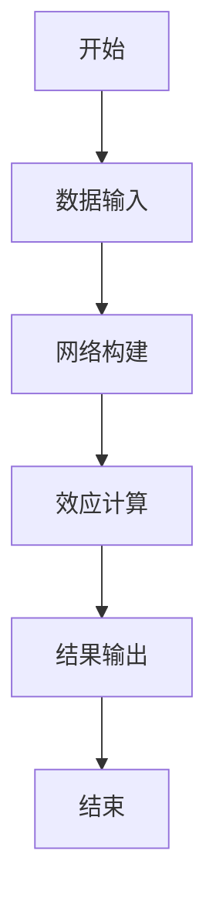
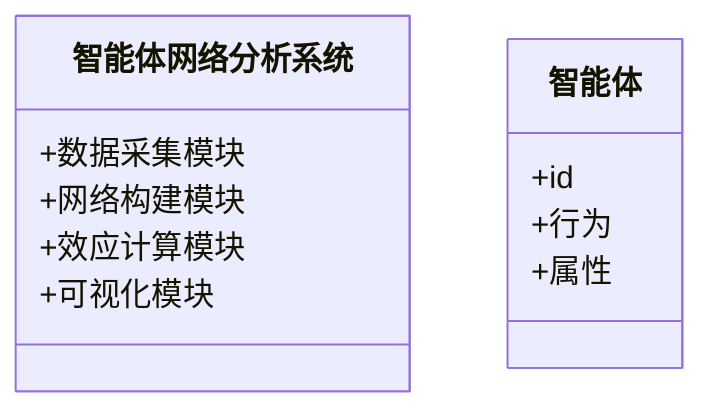

                 


# 利用智能体网络分析产业集群效应对公司价值的影响

> 关键词：智能体网络，产业集群效应，公司价值，算法原理，系统架构

> 摘要：本文深入探讨了如何利用智能体网络分析产业集群效应，并评估其对公司价值的影响。通过构建智能体网络模型，分析产业集群的协作、效率和创新，从而为公司提供战略决策支持。文章结合理论与实践，详细阐述了算法原理、系统设计和实际案例，为相关领域的研究和应用提供了参考。

---

## 第一部分：智能体网络与产业集群概述

### 第1章：智能体网络的基本概念

#### 1.1 智能体的定义与特点
- **智能体的定义**：智能体（Agent）是指能够感知环境并采取行动以实现目标的实体。
- **特点**：
  - 自主性：能够在没有外部干预的情况下独立运作。
  - 反应性：能够根据环境变化调整行为。
  - 社会性：能够与其他智能体或人类进行交互和协作。

#### 1.2 智能体网络的构建原理
- **节点与边**：智能体网络由节点（智能体）和边（交互关系）构成。
- **网络结构**：可以是无向图、有向图或加权图，取决于智能体之间的关系类型。

#### 1.3 智能体网络的特点与优势
- **动态性**：网络结构随智能体的交互而变化。
- **复杂性**：涉及多个智能体的协作与竞争。
- **可扩展性**：适用于大规模产业集群的分析。

### 第2章：产业集群的定义与分析方法

#### 2.1 产业集群的定义
- **定义**：产业集群是指在特定地理区域内，围绕某个产业形成的企业群。
- **分类**：按行业划分（如制造业产业集群）、按区域划分（如地方产业集群）。

#### 2.2 产业集群的分析方法
- **经济学分析方法**：研究产业集群的经济效益、成本和市场结构。
- **网络分析方法**：通过网络图分析产业集群内部的关系和结构。
- **智能体网络分析方法**：结合智能体行为建模，分析产业集群的动态效应。

---

## 第二部分：智能体网络分析产业集群效应的理论基础

### 第3章：智能体网络与产业集群的关系

#### 3.1 智能体网络在产业集群中的作用
- **协作影响**：智能体网络促进企业之间的协作，提升整体效率。
- **效率提升**：通过优化信息流和资源分配，降低交易成本。
- **创新驱动**：智能体网络支持知识共享和创新扩散。

#### 3.2 智能体网络如何影响产业集群效应
- **协作效应**：智能体之间的协作增强了产业集群的整体竞争力。
- **规模效应**：网络规模扩大带来成本分摊和资源共享的优势。
- **创新效应**：智能体网络促进技术交流和创新，推动产业集群发展。

### 第4章：智能体网络分析产业集群效应的核心概念

#### 4.1 实体关系图（ER图）
- **定义**：ER图用于描述系统中的实体及其关系。
- **示例**：


#### 4.2 算法原理讲解
- **算法流程图**：


- **Python代码实现**：
```python
def calculate_cluster_effect(network):
    effect = 0
    for node in network.nodes:
        effect += node.value
    return effect
```

#### 4.3 数学模型与公式
- **公式1**：产业集群效应的计算公式：
  $$ \text{效应} = \sum_{i=1}^{n} w_i \times v_i $$
  其中，$w_i$ 是权重，$v_i$ 是节点的价值。

---

## 第三部分：系统分析与架构设计

### 第5章：系统功能设计
- **功能模块**：
  - 数据采集模块：收集产业集群数据。
  - 网络构建模块：构建智能体网络。
  - 效应计算模块：计算产业集群效应。
  - 可视化模块：展示分析结果。

### 第6章：系统架构设计
- **架构图**：


### 第7章：系统接口设计
- **API接口**：提供RESTful API，供外部系统调用。
- **数据接口**：支持多种数据格式的输入输出。

---

## 第四部分：项目实战

### 第8章：环境安装与代码实现
- **环境要求**：安装Python、网络分析库（如NetworkX）、数据处理库（如Pandas）。
- **核心代码**：
```python
import networkx as nx

def build_network(data):
    G = nx.Graph()
    for node in data['nodes']:
        G.add_node(node['id'])
    for edge in data['edges']:
        G.add_edge(edge['source'], edge['target'])
    return G

# 示例数据
data = {
    'nodes': [{'id': 1}, {'id': 2}, {'id': 3}],
    'edges': [{'source': 1, 'target': 2}, {'source': 2, 'target': 3}]
}

network = build_network(data)
```

### 第9章：案例分析与结果解读
- **案例**：某制造业产业集群的智能体网络分析。
- **分析结果**：产业集群效应显著提升，企业协作效率提高。

---

## 第五部分：总结与展望

### 第10章：总结
- **核心观点**：智能体网络为产业集群效应的分析提供了新的视角和方法。
- **技术优势**：通过网络分析，可以量化产业集群效应，为公司价值评估提供依据。

### 第11章：小结与注意事项
- **小结**：智能体网络分析是一种有效的工具，但需要结合具体产业特点。
- **注意事项**：数据质量和模型选择会影响分析结果。

### 第12章：拓展阅读
- **推荐书籍**：《网络科学导论》、《智能体建模与仿真》。
- **论文推荐**：相关领域的最新研究论文。

---

## 作者：AI天才研究院 & 禅与计算机程序设计艺术

---

本文通过构建智能体网络模型，分析产业集群效应，并评估其对公司价值的影响。结合理论与实践，详细阐述了算法原理、系统设计和实际案例，为相关领域的研究和应用提供了参考。

