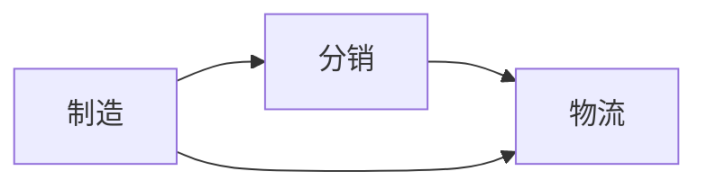

                 


# 利用智能体网络分析公司在产业链中的地位变化

> 关键词：智能体网络，产业链分析，企业地位，AI技术，网络分析

> 摘要：本文将详细探讨如何利用智能体网络分析公司在产业链中的地位变化。通过分析智能体网络的核心原理、算法实现、系统架构设计以及实际案例，本文旨在为企业提供一种新的视角和方法来理解其在产业链中的位置和影响力。结合理论与实践，本文将展示如何通过智能体网络技术帮助企业优化其在产业链中的战略定位。

---

## 第1章: 背景介绍

### 1.1 问题背景

#### 1.1.1 产业链分析的重要性
在全球化和数字化的背景下，产业链的复杂性不断增加。企业之间的合作与竞争关系错综复杂，传统的分析方法难以捕捉动态变化。产业链分析帮助企业理解自身在市场中的位置，优化资源配置，制定更具竞争力的战略。

#### 1.1.2 智能体网络的概念与特点
智能体网络是由多个智能体（Agent）组成的动态网络，每个智能体代表一个具有自主决策能力的实体。智能体网络具有以下特点：
- **自主性**：智能体能够独立决策。
- **反应性**：能够实时感知环境并做出响应。
- **协作性**：智能体之间可以协同完成复杂任务。
- **动态性**：网络结构和关系随环境变化而调整。

#### 1.1.3 问题解决的必要性
随着市场竞争加剧，企业需要更高效的方法来分析其在产业链中的地位。智能体网络提供了实时、动态的分析能力，能够帮助企业快速响应市场变化，优化其在产业链中的位置。

---

### 1.2 问题描述

#### 1.2.1 产业链中的关键问题
- 企业如何在产业链中找到最佳位置？
- 如何预测产业链的变化趋势？
- 如何优化企业间的合作关系？

#### 1.2.2 智能体网络在问题中的作用
智能体网络能够模拟产业链中的多方关系，分析企业之间的协作与竞争，帮助企业在动态环境中找到最优位置。

#### 1.2.3 问题解决的目标与边界
目标：通过智能体网络分析，优化企业的产业链位置，提升竞争力。
边界：专注于企业间的协作与竞争关系，不涉及企业内部管理。

---

## 第2章: 核心概念与联系

### 2.1 智能体网络的核心原理

#### 2.1.1 智能体的定义与属性
智能体是一个能够感知环境、做出决策并采取行动的实体。属性包括：
- **感知能力**：获取环境信息。
- **决策能力**：基于信息做出决策。
- **行动能力**：执行决策。

#### 2.1.2 智能体网络的构建方法
智能体网络的构建包括以下几个步骤：
1. **定义智能体**：确定网络中的智能体及其属性。
2. **建立关系**：定义智能体之间的关系。
3. **动态调整**：根据环境变化实时更新网络结构。

#### 2.1.3 智能体网络的动态特性
智能体网络能够实时更新，反映产业链的动态变化。

---

### 2.2 产业链分析的核心要素

#### 2.2.1 产业链的结构与功能
产业链由多个环节组成，包括生产、加工、分销等。每个环节之间的协作和竞争关系决定了产业链的整体效率。

#### 2.2.2 产业链中的关键节点
关键节点是指在产业链中具有重要影响力的实体，如核心供应商、关键客户等。

#### 2.2.3 产业链的协同机制
协同机制是指产业链中各实体之间如何协作以实现共同目标。

---

### 2.3 智能体网络与产业链的实体关系图

```mermaid
er
actor Company: 公司
actor IndustryChain: 产业链
actor IntelligentAgent: 智能体
relation Analyze: 分析
relation Influence: 影响
```

---

## 第3章: 算法原理讲解

### 3.1 智能体网络分析算法


### 3.2 Python实现代码

```python
class IntelligentAgent:
    def __init__(self, name):
        self.name = name
        self.connections = []
        
    def connect(self, other):
        self.connections.append(other)
        other.connections.append(self)
        
    def analyze(self):
        # 简单的网络分析逻辑
        for agent in self.connections:
            print(f"{self.name} connected to {agent.name}")
            
if __name__ == "__main__":
    agent1 = IntelligentAgent("Agent1")
    agent2 = IntelligentAgent("Agent2")
    agent1.connect(agent2)
    agent1.analyze()
```

### 3.3 数学模型与公式

#### 3.3.1 网络节点表示
$$节点表示为：v_i \in V$$

#### 3.3.2 边权重计算
$$边权重公式：w_{i,j} = |v_i - v_j|$$

#### 3.3.3 网络中心性计算
$$中心性公式：C_i = \sum_{j} w_{i,j}$$

---

## 第4章: 系统分析与架构设计

### 4.1 系统功能设计

#### 4.1.1 功能模块划分
- **数据采集模块**：收集产业链数据。
- **网络构建模块**：构建智能体网络。
- **分析模块**：分析网络关系。
- **结果输出模块**：输出分析结果。

#### 4.1.2 模块交互流程
1. 数据采集模块收集数据。
2. 网络构建模块根据数据构建智能体网络。
3. 分析模块对网络进行分析。
4. 输出模块将结果呈现给用户。

#### 4.1.3 系统功能需求
- 支持多种数据源。
- 实时更新网络结构。
- 提供多种分析工具。

---

### 4.2 系统架构设计

```mermaid
classDiagram
    class Company {
        name: String
        industry: String
        role: String
    }
    class IndustryChain {
        nodes: List[Company]
        edges: List[Edge]
    }
    class IntelligentAgent {
        name: String
        connections: List[IntelligentAgent]
    }
    Company <|-- IntelligentAgent
    IndustryChain <---- IntelligentAgent
```

---

## 第5章: 项目实战

### 5.1 环境安装

```bash
pip install python-mermaid matplotlib networkx
```

### 5.2 代码实现

```python
import networkx as nx
from matplotlib import pyplot as plt

class CompanyAgent(IntelligentAgent):
    def __init__(self, name, industry):
        super().__init__(name)
        self.industry = industry
        
def build_network(companies):
    G = nx.Graph()
    for company in companies:
        G.add_node(company.name)
        for neighbor in company.connections:
            G.add_edge(company.name, neighbor.name)
    return G

def visualize_network(G):
    nx.draw(G, with_labels=True, node_color='blue', edge_color='red')
    plt.show()

# 示例
agent1 = CompanyAgent("Agent1", "制造")
agent2 = CompanyAgent("Agent2", "分销")
agent1.connect(agent2)
network = build_network([agent1, agent2])
visualize_network(network)
```

### 5.3 案例分析

假设我们有三个公司：A（制造）、B（分销）、C（物流）。我们构建一个智能体网络来分析它们在产业链中的关系。



---

## 第6章: 最佳实践与小结

### 6.1 最佳实践
- 定期更新网络数据。
- 结合其他分析工具进行多维度分析。

### 6.2 小结
智能体网络为企业提供了新的视角来分析其在产业链中的地位。通过实时动态的网络分析，企业可以更好地优化其战略定位。

### 6.3 注意事项
- 确保数据的准确性和完整性。
- 合理设置智能体的行为规则。

### 6.4 拓展阅读
- 推荐阅读《智能体网络与企业战略》。

---

## 作者

作者：AI天才研究院/AI Genius Institute & 禅与计算机程序设计艺术 /Zen And The Art of Computer Programming

---

通过以上步骤，我们详细探讨了如何利用智能体网络分析公司在产业链中的地位变化，结合理论与实践，为企业提供了一种新的分析方法。

