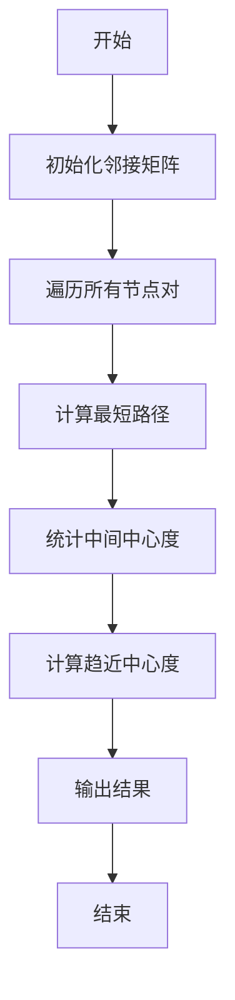
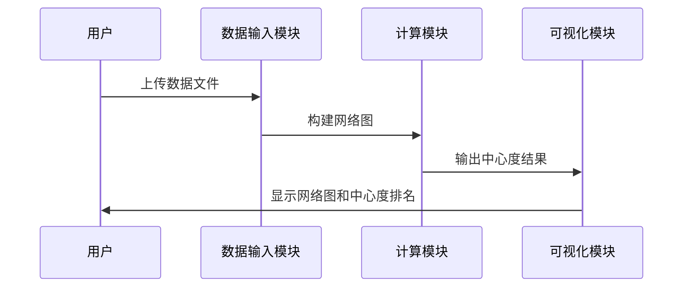

                 


# 利用智能体网络分析公司在创新生态系统中的中心度

## 关键词：智能体网络，创新生态系统，中心度，网络分析，企业创新战略

## 摘要：  
本文探讨了如何利用智能体网络分析方法来评估公司在一个创新生态系统中的中心度。通过分析公司的网络位置、影响力和协作能力，可以更好地理解其在创新生态系统中的角色和价值。本文结合了图论、网络分析和系统架构设计等多学科知识，提出了一个系统化的分析框架，并通过实际案例展示了如何应用这些方法来提升企业的创新竞争力。

---

# 第一部分: 智能体网络与创新生态系统概述

## 第1章: 利用智能体网络分析公司中心度的背景介绍

### 1.1 问题背景与意义  
创新生态系统是一个由多方参与者（如企业、科研机构、政府、非营利组织等）共同构成的复杂网络，这些参与者通过协作、竞争和资源整合推动创新。在这个生态系统中，公司的中心度反映了其在创新网络中的影响力、资源整合能力和战略价值。  
随着全球经济的数字化和知识化，企业之间的竞争不再局限于产品的直接竞争，而是更多地依赖于创新能力和生态系统中的资源整合能力。因此，如何通过智能体网络分析方法，量化公司在创新生态系统中的中心度，成为企业制定创新战略的重要基础。

### 1.2 问题描述与目标  
本文的核心问题是：如何利用智能体网络分析方法，量化公司在创新生态系统中的中心度，并为企业制定创新战略提供数据支持。  
具体目标包括：  
1. 构建创新生态系统的智能体网络模型；  
2. 计算公司在网络中的中心度指标；  
3. 分析中心度与企业创新绩效之间的关系；  
4. 提供基于中心度分析的创新战略建议。

### 1.3 问题解决思路  
1. **数据采集**：收集创新生态系统中的参与者及其关系数据，包括专利合作、技术转让、战略联盟等。  
2. **网络构建**：将参与者及其关系表示为图结构，节点代表参与者，边代表合作关系或竞争关系。  
3. **中心度计算**：基于图论算法计算节点的中心度，包括度中心度、中间中心度和趋近中心度等指标。  
4. **数据分析与可视化**：通过数据可视化工具展示网络结构和中心度分布，分析公司在网络中的位置和角色。  
5. **战略建议**：基于中心度分析结果，提出优化企业创新网络的战略建议。

### 1.4 边界与外延  
1. **边界**：本文主要关注企业的创新网络，不涉及企业的内部创新过程。  
2. **外延**：中心度分析方法可以扩展到其他类型的网络分析，例如供应链网络、合作伙伴网络等。  

---

## 第2章: 智能体网络与中心度的核心概念

### 2.1 智能体网络的基本原理  
智能体网络是一种由多个智能体（节点）及其相互作用构成的网络，节点之间的关系可以是协作、竞争或中立。智能体网络的核心特征包括：  
- **动态性**：网络结构随时间变化，节点之间关系动态调整。  
- **复杂性**：网络中存在多层次、多类型的关系，难以通过简单的线性模型描述。  
- **涌现性**：网络的某些全局属性（如中心度）是由局部交互涌现出来的。  

### 2.2 中心度的定义与类型  
中心度是衡量节点在网络中的重要性程度的指标，常见的中心度类型包括：  
1. **度中心度（Degree Centrality）**：节点的直接邻居数量，反映节点的局部影响力。  
2. **中间中心度（Betweenness Centrality）**：节点在其他节点之间最短路径上的出现次数，反映节点的全局控制力。  
3. **趋近中心度（Closeness Centrality）**：节点到其他节点的平均距离的倒数，反映节点的快速到达能力。  

### 2.3 智能体网络与中心度的关系  
在创新生态系统中，公司的中心度反映了其在网络中的核心地位。例如：  
- **度中心度高**的公司意味着其与许多合作伙伴保持紧密联系，资源整合能力强。  
- **中间中心度高**的公司意味着其在关键路径上具有控制权，能够影响整个网络的协作效率。  
- **趋近中心度高**的公司意味着其能够快速响应市场需求，快速整合资源。  

---

## 第3章: 智能体网络中心度的算法原理

### 3.1 中心度计算的数学模型  
#### 3.1.1 度中心度公式  
$$ C_d(v) = \sum_{u} A_{vu} $$  
其中，$A_{vu}$ 是邻接矩阵的元素，表示节点 $u$ 和节点 $v$ 之间是否存在边。  

#### 3.1.2 中间中心度公式  
$$ C_b(v) = \sum_{u \neq v} \sum_{w \neq v} A_{vu}A_{uw} $$  
该公式计算了节点 $v$ 在其他节点对之间的最短路径上的出现次数。  

#### 3.1.3 趋近中心度公式  
$$ C_c(v) = \frac{1}{\max_{u} d(v, u)} $$  
其中，$d(v, u)$ 是节点 $v$ 和节点 $u$ 之间的最短路径长度，$\max_{u} d(v, u)$ 是节点 $v$ 到其他所有节点的最远距离。  

### 3.2 算法实现流程  
1. **数据预处理**：将创新生态系统中的参与者及其关系数据转换为邻接矩阵或邻接列表形式。  
2. **度中心度计算**：遍历邻接矩阵，统计每个节点的直接邻居数量。  
3. **中间中心度计算**：对每对节点计算最短路径，并统计节点 $v$ 在这些路径中的出现次数。  
4. **趋近中心度计算**：计算每个节点到其他节点的最短路径长度，并取最大值的倒数。  

### 3.3 算法实现的流程图  



---

## 第4章: 智能体网络中心度的系统分析与架构设计

### 4.1 系统功能设计  
1. **数据输入**：支持多种格式的数据输入，例如CSV文件。  
2. **网络构建**：将数据转换为图结构，并存储为邻接矩阵或邻接列表。  
3. **中心度计算**：实现度中心度、中间中心度和趋近中心度的计算功能。  
4. **结果可视化**：将计算结果以图形化的方式展示，例如使用网络图和柱状图。  

### 4.2 系统架构设计  


### 4.3 系统接口设计  
1. **数据输入接口**：用户上传数据文件。  
2. **计算接口**：调用中心度计算函数。  
3. **可视化接口**：显示计算结果。  

### 4.4 交互流程图  



---

## 第5章: 智能体网络中心度的项目实战

### 5.1 项目背景与目标  
以某技术创新产业为例，分析其中的公司网络，计算各公司的中心度，并评估其创新绩效。  

### 5.2 核心代码实现  

```python
import networkx as nx

def calculate_degree_centrality(G):
    return nx.degree_centrality(G)

def calculate_betweenness_centrality(G):
    return nx.betweenness_centrality(G)

def calculate_closeness_centrality(G):
    return nx.closeness_centrality(G)

# 示例代码
G = nx.Graph()
G.add_edges_from([("A", "B"), ("B", "C"), ("C", "D"), ("B", "E")])
degree_centrality = calculate_degree_centrality(G)
betweenness_centrality = calculate_betweenness_centrality(G)
closeness_centrality = calculate_closeness_centrality(G)

print("度中心度:", degree_centrality)
print("中间中心度:", betweenness_centrality)
print("趋近中心度:", closeness_centrality)
```

### 5.3 案例分析与解读  
以某技术创新产业为例，计算各公司的中心度，并分析其与创新绩效的关系。例如，中心度高的公司往往具有更强的资源整合能力和市场影响力。  

### 5.4 项目小结  
通过实际案例分析，验证了中心度分析方法的有效性，并为企业制定创新战略提供了数据支持。

---

## 第6章: 最佳实践与总结

### 6.1 最佳实践 tips  
1. 数据质量是关键，确保数据的完整性和准确性。  
2. 结合实际情况选择合适的中心度指标。  
3. 使用可视化工具帮助理解和分析结果。  

### 6.2 小结  
本文通过智能体网络分析方法，探讨了公司在创新生态系统中的中心度问题。通过数学建模和算法实现，提出了一个系统化的分析框架，并通过实际案例验证了方法的有效性。

### 6.3 注意事项  
- 中心度分析仅反映网络结构特征，不直接反映企业的创新能力。  
- 数据隐私和安全问题需要特别注意。  

### 6.4 拓展阅读  
- 加拿大皇家银行（RBC）关于创新生态系统的研究成果。  
- 关于复杂网络理论的经典书籍《Networks: An Introduction》。

---

## 作者：AI天才研究院/AI Genius Institute & 禅与计算机程序设计艺术 /Zen And The Art of Computer Programming

---

希望这篇文章能够为您提供关于智能体网络分析公司在创新生态系统中的中心度的深入理解。如果需要进一步探讨或扩展，请随时联系我！

