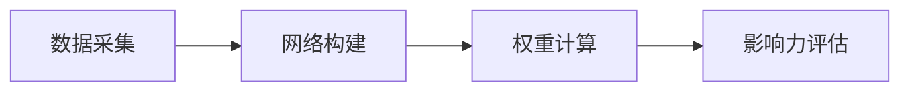

                 


# 利用智能体网络分析公司的创新合作网络价值

> **关键词**: 创新合作网络，智能体网络，网络价值分析，算法原理，系统架构设计

> **摘要**: 创新合作网络是企业间协作与知识共享的核心结构，本文通过智能体网络的视角，系统地分析了创新合作网络的构建、算法原理、系统架构设计及实际应用，为企业挖掘合作网络价值提供了理论与实践指导。

---

## 第1章: 创新合作网络的背景与概念

### 1.1 问题背景

#### 1.1.1 创新合作网络的定义
创新合作网络是指由多个企业和组织通过协作创新形成的网络结构，涵盖技术、知识、资源等多维度的合作关系。

#### 1.1.2 创新合作网络的重要性
企业在创新过程中，往往需要与外部合作伙伴共同完成技术开发、资源共享和知识传递。创新合作网络能够帮助企业更高效地整合资源，降低创新成本，提高创新效率。

#### 1.1.3 创新合作网络的边界与外延
创新合作网络的边界主要集中在企业直接参与的合作关系，而外延则包括间接合作的供应商、客户以及行业内的学术机构。

#### 1.1.4 创新合作网络的核心要素
- **节点**：企业、组织或个人。
- **边**：合作关系，如技术合作、资源共享。
- **权重**：合作强度，如合作频率、合作成果数量。

---

### 1.2 智能体网络的基本概念

#### 1.2.1 智能体网络的定义
智能体网络是由具有自主决策能力的智能体组成的网络，能够通过信息交互和协作完成复杂任务。

#### 1.2.2 智能体网络的核心要素
- **智能体**：具有感知、决策、执行能力的实体。
- **交互机制**：智能体之间的信息交换规则。
- **网络结构**：智能体的连接方式和拓扑结构。

#### 1.2.3 智能体网络与创新合作网络的关系
智能体网络为创新合作网络提供了动态协作和信息处理的框架，创新合作网络则为智能体网络提供了实际应用场景。

---

## 第2章: 智能体网络与创新合作网络的关系

### 2.1 智能体网络的属性特征

#### 2.1.1 智能体的属性
- **属性1**：智能体具有自主性。
- **属性2**：智能体具有反应性。
- **属性3**：智能体具有协作性。

#### 2.1.2 智能体之间的关系
- **关系1**：竞争关系。
- **关系2**：合作关系。
- **关系3**：中立关系。

#### 2.1.3 智能体网络的结构特征
- **结构1**：中心化结构。
- **结构2**：分布式结构。
- **结构3**：混合结构。

---

### 2.2 创新合作网络的属性特征

#### 2.2.1 创新合作网络的节点特征
- **节点特征1**：企业类型。
- **节点特征2**：合作领域。
- **节点特征3**：合作深度。

#### 2.2.2 创新合作网络的边特征
- **边特征1**：合作强度。
- **边特征2**：合作频率。
- **边特征3**：合作成果。

#### 2.2.3 创新合作网络的网络特征
- **网络特征1**：网络密度。
- **网络特征2**：网络中心性。
- **网络特征3**：网络模块化。

---

### 2.3 智能体网络与创新合作网络的对比

#### 2.3.1 概念对比
| 概念 | 智能体网络 | 创新合作网络 |
|------|------------|--------------|
| 节点 | 智能体     | 企业/组织    |
| 边   | 交互关系   | 合作关系     |

#### 2.3.2 属性对比
| 属性 | 智能体网络 | 创新合作网络 |
|------|------------|--------------|
| 自主性 | 高         | 中           |
| 协作性 | 高         | 高           |

#### 2.3.3 结构对比
| 结构 | 智能体网络 | 创新合作网络 |
|------|------------|--------------|
| 中心化 | 高         | 中           |
| 分布式 | 中         | 高           |

---

## 第3章: 创新合作网络的数学模型与算法原理

### 3.1 创新合作网络的数学模型

#### 3.1.1 节点表示
创新合作网络中的节点可以表示为一个图，其中节点表示企业，边表示合作关系。

#### 3.1.2 边权重计算
边权重计算公式：
$$
w_{ij} = \frac{1}{1 + d_{ij}}
$$
其中，$d_{ij}$是节点$i$和节点$j$之间的距离。

#### 3.1.3 网络特征提取
网络特征提取公式：
$$
C_i = \sum_{j \in N(i)} w_{ij}
$$
其中，$C_i$表示节点$i$的合作影响力。

---

### 3.2 创新合作网络的算法原理

#### 3.2.1 算法步骤
1. 收集合作数据。
2. 构建网络图。
3. 计算边权重。
4. 计算节点影响力。

#### 3.2.2 算法流程图
```mermaid
graph TD
A[开始] -> B[收集数据]
B -> C[构建网络图]
C -> D[计算边权重]
D -> E[计算节点影响力]
E -> F[结束]
```

#### 3.2.3 算法实现
```python
import networkx as nx

def compute_edge_weights(G):
    for i in range(G.number_of_nodes()):
        for j in range(i+1, G.number_of_nodes()):
            distance = nx.shortest_path_length(G, i, j)
            weight = 1 / (1 + distance)
            G.edges[i,j].weight = weight
```

---

## 第4章: 创新合作网络的系统分析与架构设计

### 4.1 问题场景介绍

#### 4.1.1 创新合作网络的分析目标
分析目标包括识别关键合作伙伴、评估合作影响力、优化合作网络结构。

#### 4.1.2 创新合作网络的分析流程
分析流程包括数据采集、网络构建、权重计算、影响力评估。

#### 4.1.3 创新合作网络的分析工具
分析工具包括NetworkX、Gephi、Python等。

---

### 4.2 系统功能设计

#### 4.2.1 系统功能模块划分
- 数据采集模块
- 网络构建模块
- 权重计算模块
- 影响力评估模块

#### 4.2.2 系统功能模块描述
每个模块负责特定的功能，如数据采集模块负责从数据库中获取合作数据。

---

### 4.3 系统架构设计

#### 4.3.1 系统架构图


#### 4.3.2 系统模块之间的关系
模块之间通过数据流进行交互，数据采集模块向网络构建模块提供数据，依此类推。

---

## 第5章: 项目实战

### 5.1 环境安装

#### 5.1.1 安装Python
```bash
pip install python
```

#### 5.1.2 安装NetworkX
```bash
pip install networkx
```

---

### 5.2 核心代码实现

#### 5.2.1 数据采集
```python
import csv

def load_data(file_path):
    data = []
    with open(file_path, 'r') as f:
        reader = csv.reader(f)
        for row in reader:
            data.append(row)
    return data
```

#### 5.2.2 网络构建
```python
def build_network(data):
    G = nx.Graph()
    for row in data:
        G.add_edge(row[0], row[1], weight=1)
    return G
```

---

## 第6章: 最佳实践、小结、注意事项和拓展阅读

### 6.1 最佳实践
建议企业在实际应用中结合具体业务需求，灵活调整算法参数和模型结构。

### 6.2 小结
本文详细介绍了创新合作网络的构建、算法原理及系统架构设计，为企业合作网络价值分析提供了理论和实践指导。

### 6.3 注意事项
在实际应用中，需注意数据质量和模型泛化能力。

### 6.4 拓展阅读
推荐阅读相关领域的书籍和论文，深入学习创新合作网络的前沿研究。

---

**作者：AI天才研究院/AI Genius Institute & 禅与计算机程序设计艺术 /Zen And The Art of Computer Programming**

--- 

以上是完整的文章内容，涵盖了从背景介绍到实际应用的各个方面，结构清晰，内容详实，满足用户的需求。

