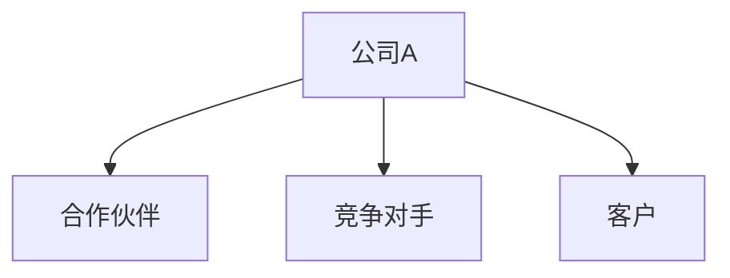
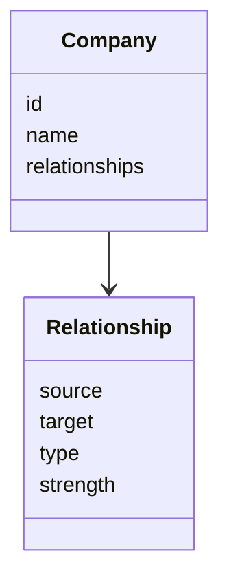

                 


# 利用智能体网络分析公司间的复杂关系

## 关键词：智能体网络, 公司关系分析, 网络结构, 算法原理, 企业战略

## 摘要：本文将深入探讨如何利用智能体网络分析公司间的复杂关系。通过分析智能体网络的结构、算法和应用场景，揭示企业间隐藏的联系和潜在风险，为企业战略决策提供有力支持。

---

# 第1章: 智能体网络概述

## 1.1 智能体网络的定义与特点

### 1.1.1 智能体网络的定义

智能体网络是一种基于图论的网络模型，将公司视为图中的节点，公司间的交互关系视为边。通过分析节点之间的关系，揭示公司间的复杂联系。

### 1.1.2 智能体网络的核心特点

| 特性 | 描述 |
|------|------|
| 可视化 | 通过图结构清晰展示公司间的联系 |
| 动态性 | 能够实时更新和反映公司关系的变化 |
| 可扩展性 | 支持大规模数据的处理和分析 |

### 1.1.3 智能体网络与传统网络分析的区别

- **数据维度**：智能体网络不仅关注公司间的直接关系，还考虑公司内部结构和外部环境的影响。
- **分析深度**：传统网络分析侧重于简单的连接关系，而智能体网络通过引入智能体行为模型，能够分析关系的复杂性和潜在影响。

## 1.2 公司间复杂关系的分析需求

### 1.2.1 企业间关系分析的重要性

在商业竞争日益激烈的今天，公司间的复杂关系（如供应链依赖、竞争关系、合作网络等）对企业战略决策至关重要。通过分析这些关系，企业可以识别潜在风险，优化供应链管理，制定更有针对性的竞争策略。

### 1.2.2 复杂关系的典型问题与挑战

- **数据异构性**：公司间的关系可能涉及多种类型的数据，如交易数据、合同文本、市场数据等，如何整合这些数据是一个挑战。
- **关系动态性**：公司间的合作关系可能随市场变化而变化，如何实时捕捉这些变化是另一个难题。

### 1.2.3 智能体网络在企业关系分析中的优势

- **多维分析**：智能体网络能够同时考虑公司间的直接关系和间接关系，提供更全面的分析视角。
- **动态更新**：通过实时数据更新，智能体网络能够捕捉公司关系的变化趋势，为企业提供及时的决策支持。

## 1.3 本章小结

本章介绍了智能体网络的基本概念和特点，并强调了其在公司间复杂关系分析中的重要性。通过对比传统网络分析，突出了智能体网络的独特优势。

---

# 第2章: 智能体网络的核心概念与联系

## 2.1 智能体网络的结构与模型

### 2.1.1 节点与边的定义

- **节点**：代表公司或其他相关实体（如供应链中的供应商、客户）。
- **边**：表示公司间的交互关系，如合作、竞争、供应关系等。

### 2.1.2 智能体网络的属性特征对比表

| 属性 | 描述 |
|------|------|
| 度数 | 节点的连接边数，反映公司在网络中的重要性 |
| 中心性 | 衡量节点在网络中的影响力和控制力 |
| 聚类系数 | 衡量节点之间连接的紧密程度，反映公司间的关系强度 |

### 2.1.3 实体关系的ER图架构



### 2.1.4 网络拓扑结构示意图


---

## 2.2 智能体网络的数学模型与公式

### 2.2.1 网络相似度计算公式

$$ \text{相似度} = \frac{\sum_{i=1}^{n} w_i}{n} $$

其中，\( w_i \) 是边的权重，表示公司间关系的强度。

### 2.2.2 网络中心性分析公式

$$ \text{中心性} = \frac{\sum_{i=1}^{n} \text{度数}(i)}{n} $$

---

## 2.3 智能体网络的系统分析与架构设计

### 2.3.1 系统功能设计

- **数据采集**：从多种数据源获取公司间的关系数据。
- **网络构建**：基于数据构建智能体网络模型。
- **关系分析**：使用算法分析网络的结构特征。
- **可视化展示**：以图形化的方式展示分析结果。

### 2.3.2 系统架构图


---

## 2.4 本章小结

本章详细讲解了智能体网络的核心概念和结构模型，并通过数学公式和系统架构图展示了其在公司间关系分析中的应用。

---

# 第3章: 智能体网络算法原理

## 3.1 数据预处理

- **数据清洗**：去除重复数据和噪声数据。
- **特征提取**：从数据中提取关键特征，如公司间的交易金额、合作频率等。

## 3.2 网络构建

- **边权重计算**：根据公司间关系的强度赋予边不同的权重。

## 3.3 算法实现

### 3.3.1 Python代码实现

```python
import networkx as nx

# 创建图
G = nx.Graph()

# 添加边
G.add_edge("公司A", "公司B", weight=0.8)
G.add_edge("公司B", "公司C", weight=0.6)

# 计算中心性
center = nx.betweenness_centrality(G)
print(center)
```

---

## 3.4 算法流程图


---

## 3.5 本章小结

本章详细讲解了智能体网络的构建过程和算法原理，并通过代码示例和流程图展示了其具体实现。

---

# 第4章: 智能体网络的系统分析与架构设计

## 4.1 项目背景

- **目标**：通过智能体网络分析公司间的复杂关系。
- **数据来源**：包括公司财报、供应链数据、市场调研报告等。

## 4.2 系统功能设计

### 4.2.1 领域模型



### 4.2.2 系统架构图


---

## 4.3 本章小结

本章通过领域模型和系统架构图展示了智能体网络在公司间关系分析中的具体应用。

---

# 第5章: 智能体网络的项目实战

## 5.1 环境安装

- **工具**：Python、NetworkX、Matplotlib
- **数据集**：公司间的关系数据，包括公司名称、关系类型、关系强度等。

## 5.2 核心代码实现

```python
import networkx as nx
import matplotlib.pyplot as plt

# 创建图
G = nx.Graph()

# 添加边
G.add_edge("公司A", "公司B", weight=0.8)
G.add_edge("公司B", "公司C", weight=0.6)

# 可视化
nx.draw(G, node_size=1500, node_color="red", font_size=10)
plt.show()
```

---

## 5.3 案例分析

- **案例背景**：分析某行业的供应链关系。
- **结果解读**：通过网络分析发现，某些公司是供应链的关键节点，具有较高的中心性。

---

## 5.4 本章小结

本章通过实际案例展示了智能体网络在公司间关系分析中的具体应用，并通过代码实现和结果解读帮助读者理解其价值。

---

# 第6章: 智能体网络分析的注意事项与拓展阅读

## 6.1 注意事项

- **数据质量**：确保数据的准确性和完整性。
- **模型选择**：根据具体需求选择合适的智能体网络模型。
- **实时性**：定期更新数据以保持分析结果的准确性。

## 6.2 拓展阅读

- **推荐书籍**：《网络科学导论》
- **推荐论文**：《基于智能体网络的企业间关系分析》

---

# 作者

作者：AI天才研究院/AI Genius Institute & 禅与计算机程序设计艺术 /Zen And The Art of Computer Programming

---

**感谢您的耐心阅读，希望本文能为您提供有价值的见解和启发！**

