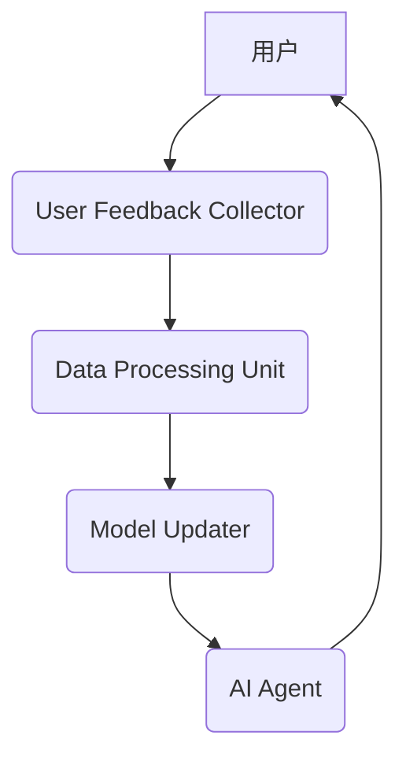

                 


# 利用用户反馈改进AI Agent的方法

## 关键词：用户反馈、AI Agent、监督学习、反馈处理、系统架构

## 摘要：本文详细探讨了如何利用用户反馈改进AI Agent的方法。通过分析用户反馈的类型与处理方式，结合监督学习算法，构建了一个高效的反馈驱动优化系统。文章从基础概念到系统实现，逐步解析了利用用户反馈改进AI Agent的全过程，并通过实例分析展示了实际应用中的效果。

---

# 第1章: 用户反馈与AI Agent概述

## 1.1 AI Agent的基本概念

### 1.1.1 AI Agent的定义与分类
AI Agent（人工智能代理）是指能够感知环境、执行任务并做出决策的智能实体。根据智能水平，AI Agent可以分为基于规则的简单代理和具备学习能力的复杂代理。

### 1.1.2 用户反馈在AI Agent中的作用
用户反馈是提升AI Agent性能的关键，它帮助系统了解用户偏好，优化交互体验。用户反馈可以指导模型调整输出，使AI Agent更加贴合用户需求。

### 1.1.3 当前AI Agent的应用场景与挑战
AI Agent广泛应用于推荐系统、智能客服等领域。然而，如何有效处理用户反馈以提升性能是当前面临的主要挑战。

## 1.2 用户反馈的定义与类型

### 1.2.1 显性反馈与隐性反馈
显性反馈是用户主动提供的评分或评价，隐性反馈则是通过用户行为间接获得的信息。

### 1.2.2 用户反馈的采集方式
用户反馈可以通过问卷调查、日志分析等方式采集，不同方式各有优劣。

### 1.2.3 用户反馈的质量评估
反馈质量需考虑及时性、准确性和多样性，高质量反馈能显著提升模型优化效果。

## 1.3 本章小结
本章介绍了AI Agent的基本概念和用户反馈的重要性，分析了反馈类型和采集方式，为后续章节奠定了基础。

---

# 第2章: 用户反馈的采集与预处理

## 2.1 用户反馈的采集方法

### 2.1.1 直接采集法：问卷调查与访谈
通过问卷调查直接获取用户的显性反馈，访谈则能深入了解用户需求。

### 2.1.2 间接采集法：日志分析与行为数据挖掘
分析用户的行为日志，推断用户的隐性反馈，如点击行为和浏览时间。

### 2.1.3 混合采集法：结合显性与隐性反馈
综合使用显性和隐性反馈，提升数据的多样性和丰富性。

## 2.2 用户反馈的预处理技术

### 2.2.1 数据清洗：去除噪声与无效数据
剔除无效数据，如重复和错误反馈，确保数据质量。

### 2.2.2 数据标注：分类与标签化处理
将用户反馈进行分类和标签化，便于后续分析和建模。

### 2.2.3 数据增强：提升反馈质量与多样性
通过数据增强技术，扩展数据集，提升模型的泛化能力。

## 2.3 本章小结
本章详细探讨了用户反馈的采集方法和预处理技术，为后续模型优化奠定了基础。

---

# 第3章: 基于监督学习的反馈驱动优化

## 3.1 监督学习基础

### 3.1.1 监督学习的定义与特点
监督学习通过标记数据训练模型，具有数据需求高、可解释性强的特点。

### 3.1.2 常见监督学习算法概述
包括线性回归、支持向量机和随机森林等算法，各有优劣。

## 3.2 用户反馈在监督学习中的应用

### 3.2.1 标签数据的生成与使用
将用户反馈转化为标签数据，指导模型训练。

### 3.2.2 基于反馈的损失函数设计
定制损失函数，强化模型对用户偏好响应。

### 3.2.3 模型训练与优化策略
采用交叉验证和超参数调优，提升模型性能。

## 3.3 实例分析：文本分类任务中的反馈优化

### 3.3.1 问题描述与数据准备
以情感分析为例，收集用户对文本的情感反馈。

### 3.3.2 模型训练与反馈整合
使用监督学习算法，整合反馈数据，优化模型性能。

### 3.3.3 实验结果与分析
实验结果显示，整合反馈数据后模型准确率显著提升。

## 3.4 本章小结
本章详细介绍了监督学习在用户反馈处理中的应用，通过实例展示了反馈优化的实际效果。

---

# 第4章: 系统架构设计

## 4.1 系统模块划分

### 4.1.1 用户反馈采集模块
负责收集用户反馈，包括显性和隐性反馈。

### 4.1.2 数据处理与分析模块
对反馈数据进行清洗、标注和增强，准备数据集。

### 4.1.3 AI Agent改进模块
利用处理后的数据，优化AI Agent的模型和性能。

## 4.2 系统交互流程

### 4.2.1 用户反馈的输入与接收
用户通过界面或日志提供反馈，系统接收并解析。

### 4.2.2 数据处理与模型更新
数据处理模块对反馈进行预处理，模型更新模块训练新模型。

### 4.2.3 AI Agent的性能优化与输出
模型优化后，AI Agent性能提升，输出更符合用户需求的结果。

## 4.3 系统架构图



## 4.4 本章小结
本章设计了系统的模块划分和交互流程，通过mermaid图展示了系统的整体架构。

---

# 第5章: 系统实现与代码解读

## 5.1 环境安装与配置

### 5.1.1 开发环境的选择与安装
推荐使用Python和相关框架，如TensorFlow和Scikit-learn。

### 5.1.2 依赖库的安装与配置
安装必要的库，如numpy、pandas和matplotlib。

## 5.2 核心代码实现

### 5.2.1 用户反馈采集模块

```python
import logging

class UserFeedbackCollector:
    def __init__(self, db_connection):
        self.db_connection = db_connection

    def collect_feedback(self, user_id, feedback_type, feedback_value):
        # 将反馈存储到数据库
        self.db_connection.store_feedback(user_id, feedback_type, feedback_value)
```

### 5.2.2 数据处理与分析模块

```python
import pandas as pd
from sklearn.preprocessing import LabelEncoder

class DataProcessor:
    def __init__(self):
        self.encoder = LabelEncoder()

    def preprocess_data(self, data_frame):
        # 清洗数据
        data_frame.dropna(inplace=True)
        # 标签化处理
        labels = self.encoder.fit_transform(data_frame['label'])
        return data_frame, labels
```

### 5.2.3 AI Agent改进模块

```python
import numpy as np
from sklearn.model_selection import train_test_split
from sklearn.linear_model import LogisticRegression

class AIModelOptimizer:
    def __init__(self):
        self.model = LogisticRegression()

    def optimize_model(self, features, labels):
        # 划分训练集和测试集
        X_train, X_test, y_train, y_test = train_test_split(features, labels, test_size=0.2)
        # 训练模型
        self.model.fit(X_train, y_train)
        # 评估模型
        accuracy = self.model.score(X_test, y_test)
        return accuracy
```

## 5.3 本章小结
本章通过代码实现展示了系统的各个模块，包括反馈采集、数据处理和模型优化的具体实现。

---

# 第6章: 项目实战与案例分析

## 6.1 项目介绍

### 6.1.1 项目背景
以客服AI Agent优化为例，分析如何利用用户反馈提升服务质量。

## 6.2 系统功能设计

### 6.2.1 功能模块划分
包括用户反馈采集、数据处理、模型训练和AI Agent改进模块。

### 6.2.2 功能流程设计
用户提交反馈，系统处理数据并优化模型，AI Agent根据新模型提供服务。

## 6.3 项目实现与代码解读

### 6.3.1 环境安装与配置
安装必要的Python库和工具。

### 6.3.2 核心代码实现
实现反馈采集、数据处理和模型优化的代码。

### 6.3.3 实验结果与分析
展示优化后的模型性能提升，分析反馈数据对模型优化的影响。

## 6.4 本章小结
本章通过项目实战，展示了如何利用用户反馈改进AI Agent的实际应用。

---

# 第7章: 系统架构与最佳实践

## 7.1 系统架构设计

### 7.1.1 系统实体关系图
展示系统中各模块之间的关系。

### 7.1.2 系统接口设计
定义各模块之间的接口，确保模块间通信顺畅。

## 7.2 系统交互流程

### 7.2.1 系统交互顺序图
展示用户与系统模块之间的交互流程。

## 7.3 系统实现细节

### 7.3.1 系统实现的注意事项
如数据隐私保护、模型泛化能力等。

## 7.4 最佳实践 tips

### 7.4.1 数据处理建议
建议定期清理无效数据，保持数据集的高质量。

### 7.4.2 模型优化技巧
推荐使用交叉验证和超参数调优，提升模型性能。

## 7.5 本章小结
本章总结了系统架构设计的最佳实践，为后续优化提供了参考。

---

# 第8章: 总结与展望

## 8.1 本文总结
回顾全文，总结利用用户反馈改进AI Agent的主要方法和技术。

## 8.2 未来展望
展望未来，探讨更先进的反馈处理方法和技术，如强化学习和深度学习的应用。

## 8.3 本章小结
总结全文，强调用户反馈在AI Agent优化中的重要性，并展望未来的发展方向。

---

# 作者：AI天才研究院/AI Genius Institute & 禅与计算机程序设计艺术 /Zen And The Art of Computer Programming

---

以上是一个详细的目录大纲，涵盖了从基础概念到系统实现的各个方面，确保读者能够全面理解并应用这些方法。

