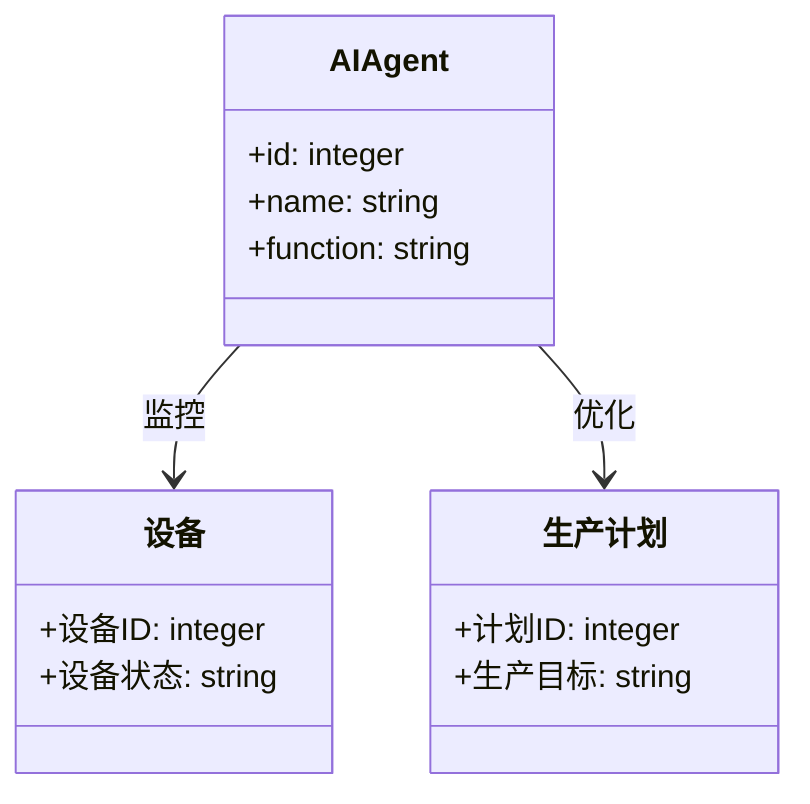

                 


# 制造业中AI Agent的实践案例

> 关键词：AI Agent，智能制造，强化学习，制造业优化，实时决策

> 摘要：本文通过详细分析制造业中AI Agent的应用场景、核心概念、算法原理、系统架构、项目实战以及最佳实践，深入探讨AI Agent在制造业中的实际应用案例，为读者提供从理论到实践的全面指导。

---

# 第一部分: 制造业中AI Agent的背景与核心概念

## 第1章: AI Agent的基本概念与制造业的应用背景

### 1.1 AI Agent的定义与核心特征

#### 1.1.1 AI Agent的基本定义
AI Agent（人工智能代理）是一种能够感知环境、自主决策并执行任务的智能实体。它通过传感器获取数据，利用算法进行分析和推理，并通过执行器与环境交互。AI Agent的核心目标是通过智能化的决策和行动，实现特定的目标或优化特定的指标。

在制造业中，AI Agent可以用于优化生产流程、提高产品质量、降低生产成本等。例如，在智能工厂中，AI Agent可以通过实时监控生产线的状态，预测设备故障并进行自主维护。

#### 1.1.2 制造业中AI Agent的核心特征
- **自主性**：AI Agent能够自主决策，无需人工干预。
- **反应性**：能够实时感知环境变化并做出快速响应。
- **学习能力**：通过机器学习算法不断优化自身的决策模型。
- **协作性**：能够与其他AI Agent或系统协同工作，实现复杂的生产任务。

#### 1.1.3 AI Agent与传统自动化系统的区别
传统自动化系统基于固定的规则和程序运行，缺乏灵活性和适应性。而AI Agent能够通过学习和推理，适应环境的变化，并做出更优的决策。例如，传统自动化系统只能按照预设的参数进行生产，而AI Agent可以根据实时数据动态调整生产参数。

### 1.2 制造业中的AI Agent应用场景

#### 1.2.1 智能工厂中的AI Agent
在智能工厂中，AI Agent可以用于优化生产计划、监控设备状态、实时调整生产参数等。例如，AI Agent可以通过分析历史生产数据和实时传感器数据，预测设备的故障概率，并提前安排维护，从而避免生产中断。

#### 1.2.2 制造业质量控制中的AI Agent
AI Agent可以通过图像识别技术对产品质量进行实时检测，例如检测产品表面的瑕疵。与传统的人工检测相比，AI Agent的检测速度更快、准确率更高。

#### 1.2.3 供应链优化中的AI Agent
AI Agent可以通过分析供应链中的各种数据，优化物流路径、库存管理和供应商选择。例如，AI Agent可以通过预测市场需求，动态调整采购计划，从而降低库存成本。

### 1.3 AI Agent在制造业中的价值与挑战

#### 1.3.1 AI Agent带来的效率提升
AI Agent可以通过自动化决策和优化，显著提高生产效率和资源利用率。例如，AI Agent可以通过优化生产计划，减少生产周期，提高生产效率。

#### 1.3.2 制造业AI Agent应用的挑战
- **数据质量**：制造业数据通常复杂且噪声大，如何有效处理这些数据是一个挑战。
- **算法选择**：选择合适的算法和模型需要深入的领域知识和经验。
- **系统的实时性**：制造业对实时性要求高，AI Agent需要快速做出决策。

#### 1.3.3 未来发展趋势与机遇
随着AI技术的不断发展，AI Agent在制造业中的应用将更加广泛和深入。例如，未来的AI Agent将更加智能化和自主化，能够独立完成复杂的生产任务。

---

## 第2章: 制造业中AI Agent的核心概念与联系

### 2.1 AI Agent的核心原理

#### 2.1.1 AI Agent的基本工作原理
AI Agent通过感知环境、分析数据、制定决策、执行行动的循环过程，实现目标。例如，在智能工厂中，AI Agent通过传感器获取设备状态数据，利用算法分析数据，制定维护计划，并通过执行器执行维护操作。

#### 2.1.2 制造业中AI Agent的决策机制
AI Agent的决策机制通常基于强化学习或监督学习。例如，强化学习通过奖励机制优化决策策略，而监督学习通过训练数据预测最优决策。

#### 2.1.3 知识表示与推理方法
AI Agent需要将知识表示为某种形式（如知识图谱）并进行推理。例如，在质量控制中，AI Agent可以通过知识推理识别产品的潜在缺陷。

### 2.2 AI Agent与相关技术的对比分析

#### 2.2.1 AI Agent与传统机器学习的对比
- **传统机器学习**：基于固定的数据和规则进行预测和分类。
- **AI Agent**：能够自主决策并执行任务，具有更强的适应性和灵活性。

#### 2.2.2 AI Agent与规则引擎的对比
- **规则引擎**：基于固定的规则进行推理和决策。
- **AI Agent**：能够通过学习和推理动态优化决策策略。

#### 2.2.3 AI Agent与RPA（机器人流程自动化）的对比
- **RPA**：通过模拟人工操作实现自动化任务。
- **AI Agent**：具有自主决策和学习能力，能够处理更复杂的任务。

### 2.3 AI Agent的ER实体关系图

```mermaid
er
  %%{init: { 'width': 420, 'height': 300 }}
  title 实体关系图：制造业中的AI Agent

  %%{{
    "model": {
      "entities": [
        {
          "name": "AI Agent",
          "attributes": [
            {
              "name": "id",
              "type": "integer"
            },
            {
              "name": "name",
              "type": "string"
            },
            {
              "name": "function",
              "type": "string"
            }
          ]
        },
        {
          "name": "设备",
          "attributes": [
            {
              "name": "设备ID",
              "type": "integer"
            },
            {
              "name": "设备状态",
              "type": "string"
            }
          ]
        },
        {
          "name": "生产计划",
          "attributes": [
            {
              "name": "计划ID",
              "type": "integer"
            },
            {
              "name": "生产目标",
              "type": "string"
            }
          ]
        }
      ],
      "relationships": [
        {
          "name": "监控",
          "entities": ["AI Agent", "设备"]
        },
        {
          "name": "优化",
          "entities": ["AI Agent", "生产计划"]
        }
      ]
    }
  }}%
```

---

## 第3章: AI Agent的核心算法原理

### 3.1 基于强化学习的AI Agent算法

#### 3.1.1 强化学习的基本原理
强化学习通过智能体与环境的交互，学习最优策略。智能体通过执行动作，获得奖励或惩罚，并根据奖励调整策略。

#### 3.1.2 Q-Learning算法
Q-Learning是一种经典的强化学习算法，适用于离散动作空间。其核心公式为：

$$ Q(s, a) = Q(s, a) + \alpha \left[r + \gamma \max Q(s', a') - Q(s, a)\right] $$

其中，\( \alpha \) 是学习率，\( \gamma \) 是折扣因子。

---

## 第4章: 系统分析与架构设计

### 4.1 问题场景介绍

#### 4.1.1 制造业中的典型问题
- 生产效率低
- 设备故障率高
- 产品质量不稳定

#### 4.1.2 AI Agent解决方案
通过AI Agent实时监控设备状态，预测设备故障，优化生产计划，提高生产效率和产品质量。

### 4.2 系统功能设计

#### 4.2.1 领域模型设计


### 4.3 系统架构设计


### 4.4 系统接口设计

#### 4.4.1 AI Agent与设备之间的接口
- **输入**：设备状态数据
- **输出**：维护指令

#### 4.4.2 AI Agent与生产计划之间的接口
- **输入**：生产目标和约束条件
- **输出**：优化后的生产计划

---

## 第5章: 项目实战

### 5.1 环境安装

#### 5.1.1 安装Python
```bash
# 安装Python
sudo apt-get install python3 python3-pip
```

#### 5.1.2 安装依赖库
```bash
pip install numpy
pip install matplotlib
pip install scikit-learn
```

### 5.2 核心代码实现

#### 5.2.1 加载数据
```python
import numpy as np
import pandas as pd

# 加载数据
data = pd.read_csv('manufacture_data.csv')
```

#### 5.2.2 数据预处理
```python
from sklearn.preprocessing import StandardScaler

scaler = StandardScaler()
scaled_data = scaler.fit_transform(data)
```

#### 5.2.3 训练模型
```python
from sklearn.linear_model import LinearRegression

model = LinearRegression()
model.fit(scaled_data, target)
```

---

## 第6章: 最佳实践与总结

### 6.1 小结

AI Agent在制造业中的应用前景广阔，能够显著提高生产效率和产品质量。通过本文的分析和实践，我们可以看到，AI Agent的应用需要结合具体场景，选择合适的算法和模型，并进行充分的数据处理和系统设计。

### 6.2 注意事项

- 数据质量是AI Agent应用的关键，需要进行充分的数据清洗和特征工程。
- 算法选择需要结合具体场景和数据特点，避免盲目使用热门算法。
- 系统设计需要考虑实时性和可扩展性，确保AI Agent能够稳定运行。

### 6.3 拓展阅读

- 《机器学习实战》
- 《强化学习：理论与实践》
- 《智能制造：AI Agent的应用与发展》

---

作者：AI天才研究院

