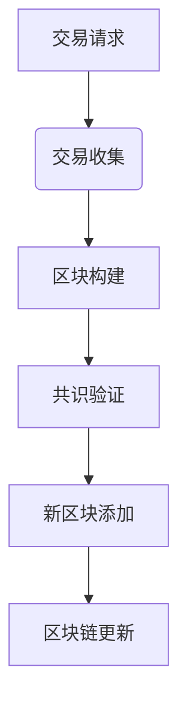
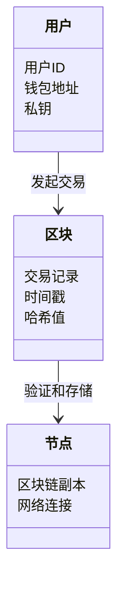
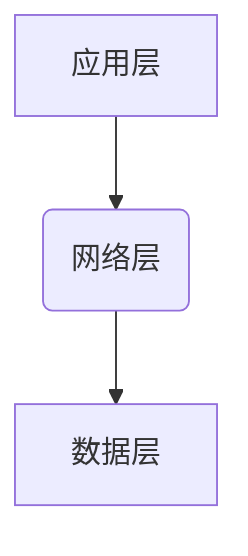
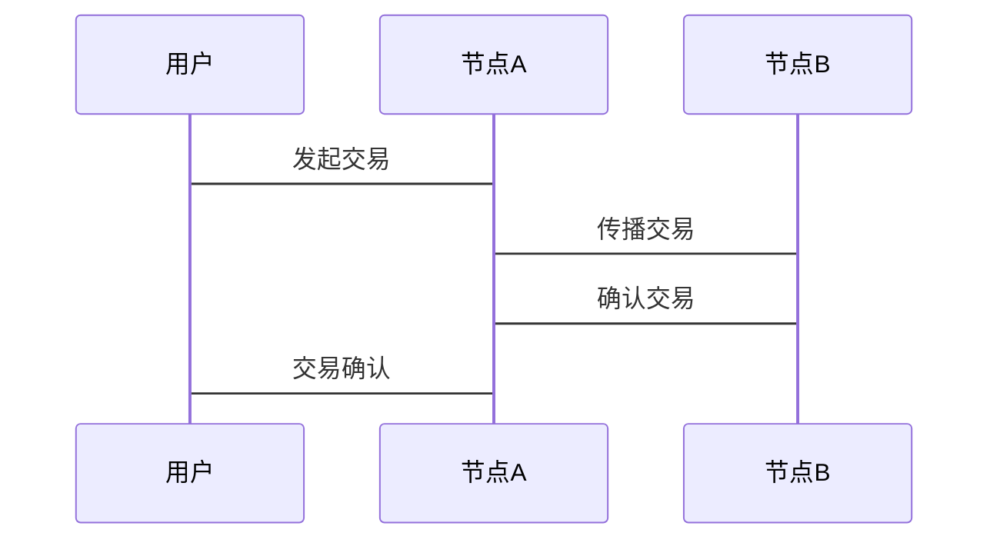

                 


# 区块链在金融数据安全中的创新应用

## 关键词：区块链、金融数据安全、去中心化、智能合约、共识机制、数据隐私、安全挑战

## 摘要：区块链技术以其去中心化、不可篡改和透明性等特性，为金融数据安全提供了革命性的解决方案。本文深入探讨区块链在金融领域的创新应用，从核心概念到算法原理，从系统架构到项目实战，全面解析区块链如何提升金融数据安全，并应对随之而来的安全挑战，为未来的发展提供方向。

---

## 第一部分：区块链在金融数据安全中的背景与核心概念

### 第1章：区块链的起源与发展

#### 1.1 区块链的起源与发展

- **1.1.1 区块链的起源**
  - 区块链起源于比特币的白皮书，2008年由中本聪提出。
  - 比特币的诞生旨在建立一个去中心化的电子现金系统，解决传统金融的信任问题。

- **1.1.2 区块链的核心概念**
  - 去中心化：数据不依赖于单一中心，通过分布式节点存储。
  - 区块链结构：由区块和链组成，每个区块包含交易数据和哈希指针。
  - 共识机制：通过算法确保所有节点达成一致，如PoW、PoS、BFT等。

- **1.1.3 区块链在金融领域的应用背景**
  - 传统金融系统依赖中心化机构，存在单点故障和信任风险。
  - 区块链技术的应用可以提升金融系统的透明度和安全性。

#### 1.2 金融数据安全的问题与挑战

- **1.2.1 传统金融数据安全的痛点**
  - 中心化系统易受黑客攻击，数据泄露频发。
  - 数据孤岛问题，不同机构间数据共享困难。
  - 缺乏透明性，用户难以追踪数据流向。

- **1.2.2 数据隐私与安全的矛盾**
  - 数据共享需要隐私保护，但传统技术难以实现。
  - 数据篡改风险高，缺乏有效的防篡改机制。

- **1.2.3 信任问题与交易透明度**
  - 中心化机构的信任危机，用户对数据处理过程不透明。
  - 跨机构交易中，信任成本高，效率低下。

#### 1.3 区块链如何解决金融数据安全问题

- **1.3.1 去中心化的优势**
  - 消除单点故障，降低攻击风险。
  - 数据分布存储，增强数据冗余性和可用性。

- **1.3.2 数据不可篡改的特性**
  - 每个区块都包含时间戳和前一区块的哈希值，确保数据不可篡改。
  - 每次交易都需要经过共识机制验证，确保数据一致性。

- **1.3.3 提高交易透明度**
  - 所有交易记录在区块链上公开可查，增强透明性。
  - 用户可以实时追踪交易状态，减少信息不对称。

---

## 第二部分：区块链的核心技术与原理

### 第2章：区块链的核心技术原理

#### 2.1 区块链的基本原理

- **2.1.1 区块链的工作流程**
  - 交易发生：用户发起交易请求。
  - 区块构建：交易被收集到临时区块，形成新区块。
  - 共识验证：通过共识机制验证新区块的有效性。
  - 区块链接：新区块被添加到区块链上，确保链式结构。

- **2.1.2 哈希函数的作用**
  - 保证数据完整性：任何数据改动都会导致哈希值变化。
  - 索引数据：通过哈希值快速定位数据存储位置。
  - 示例：使用SHA-256哈希函数对交易数据进行加密。

- **2.1.3 数字签名的原理**
  - 用户使用私钥对交易数据进行签名，公钥用于验证签名。
  - 确保交易发起方的身份真实性，防止数据被篡改。

#### 2.2 共识机制的实现

- **2.2.1 工作量证明（PoW）**
  - 竞争机制：节点通过计算寻找随机数，找到后生成新区块。
  - 优点：安全性高，但消耗大量能源。
  - 缺点：效率低下，不适合高频交易场景。

- **2.2.2 权益证明（PoS）**
  - 基于持币者的权益分配，通过质押机制选择验证节点。
  - 优点：能耗低，效率高。
  - 缺点：存在"富者愈富"的潜在问题。

- **2.2.3 拜占庭容错（BFT）系列**
  - 简单BFT（sBFT）：适用于小型网络。
  - 双层BFT（2L-BFT）：适用于大型网络，分层结构降低通信复杂度。

#### 2.3 智能合约的原理与应用

- **2.3.1 智能合约的基本原理**
  - 在区块链上运行的自动化程序，响应特定事件触发执行。
  - 通过区块链的不可篡改性，确保合约执行的可靠性。

- **2.3.2 智能合约的应用场景**
  - 金融衍生品：自动执行交易，减少人工干预。
  - 供应链金融：自动化支付和账单核验。
  - 股权管理：自动处理股份转让和分红。

---

### 第3章：区块链的算法原理

#### 3.1 区块链的交易流程



#### 3.2 共识机制的数学模型

- **工作量证明（PoW）的数学公式**
  - 难度目标：$P = 2^{256 - k}$
  - 其中，$k$是当前区块的哈希前缀0的数量。
  - 矿工需要找到满足条件的哈希值，确保计算难度。

- **权益证明（PoS）的随机选择机制**
  - 概率公式：$P = \frac{stake}{total\_stake}$
  - 其中，$stake$是该节点质押的金额，$total\_stake$是全网质押总金额。

---

## 第三部分：系统分析与架构设计

### 第4章：系统分析与架构设计

#### 4.1 项目背景介绍

- **项目目标**：构建一个基于区块链的金融数据安全系统。
- **应用场景**：金融交易、支付结算、数据共享等。

#### 4.2 系统功能设计



#### 4.3 系统架构设计

- **分层架构**：
  - 应用层：处理用户请求和业务逻辑。
  - 网络层：负责数据的传输和路由。
  - 数据层：存储区块链数据和交易记录。



#### 4.4 接口与交互设计

- **API接口**：
  - `/api/v1/transaction/create`：发起交易请求。
  - `/api/v1/block/get`：获取指定区块信息。

- **交互流程图**



---

## 第四部分：项目实战

### 第5章：项目实战

#### 5.1 环境安装与配置

- **安装依赖**：
  - 安装Python环境：`python --version`
  - 安装Solidity：`npm install -g solc`
  - 安装区块链框架：`pip install web3`

#### 5.2 核心代码实现

- **智能合约实现**

```solidity
// Smart Contract for Financial Data Security
contract FDS {
    mapping(address => uint) public balance;

    function transfer(address recipient, uint amount) {
        balance[msg.sender] -= amount;
        balance[recipient] += amount;
        emit Transfer(msg.sender, recipient, amount);
    }

    event Transfer(address indexed _from, address indexed _to, uint _amount);
}
```

- **交易验证逻辑**

```python
from web3 import Web3

w3 = Web3(Web3.HTTPProvider("http://localhost:8545"))

def verify_transaction(tx_hash):
    receipt = w3.eth.getTransactionReceipt(tx_hash)
    if receipt is None:
        return False
    return True
```

#### 5.3 案例分析与解读

- **案例：供应链金融**
  - 核心业务：供应商融资。
  - 区块链应用：记录物流信息和票据流转，确保数据真实性和透明性。
  - 实施效果：减少人工审核，提高融资效率。

#### 5.4 项目小结

- **代码功能总结**：
  - 智能合约实现基本的转账功能。
  - 交易验证确保数据真实性和一致性。
- **案例应用总结**：
  - 区块链技术提升了供应链金融的透明度和效率。
  - 数据共享机制降低了信任成本，提高了整体效率。

---

## 第五部分：安全挑战与风险管理

### 第6章：安全挑战与风险管理

#### 6.1 数据隐私与保护

- **数据隐私问题**：
  - 区块链上的数据公开可查，可能导致隐私泄露。
  - 解决方案：采用零知识证明（zk-SNARKs），在不泄露数据的前提下验证交易。

- **数据分类分级管理**：
  - 根据数据敏感程度，设置不同权限和访问级别。
  - 例如，高度敏感数据仅限授权用户访问。

#### 6.2 智能合约的安全风险

- **合约漏洞**：
  - 合约逻辑错误可能导致资金损失。
  - 解决方案：严格测试和审计，确保代码无漏洞。
  
- **恶意攻击**：
  - 攻击者可能利用合约漏洞发起攻击。
  - 解决方案：部署多重签名合约，增加授权门槛。

#### 6.3 安全风险管理措施

- **安全审计**：
  - 定期进行第三方安全审计，发现潜在风险。
  - 使用静态代码分析工具，如Slither，检查合约漏洞。

- **风险管理**：
  - 建立应急响应机制，及时应对安全事件。
  - 定期备份数据，防止数据丢失。

---

## 第六部分：总结与展望

### 第7章：总结与展望

#### 7.1 全文总结

- 区块链技术在金融数据安全中的应用前景广阔。
- 通过去中心化和不可篡改特性，区块链提升了金融系统的安全性。
- 智能合约的应用优化了业务流程，提高了效率。

#### 7.2 未来展望

- **隐私保护技术**：发展更先进的加密技术，如同态加密和 confidential transactions，实现数据隐私保护。
- **跨链技术**：实现不同区块链之间的互操作性，构建更加完善的金融生态系统。
- **监管合规性**：制定更完善的监管框架，确保区块链应用的合规性。

---

## 作者：AI天才研究院/AI Genius Institute & 禅与计算机程序设计艺术 /Zen And The Art of Computer Programming

---

本文通过详细分析区块链在金融数据安全中的应用，从技术原理到实际案例，全面探讨了其创新应用和未来发展方向。希望本文能为金融行业提供新的思路，推动区块链技术的进一步发展。

