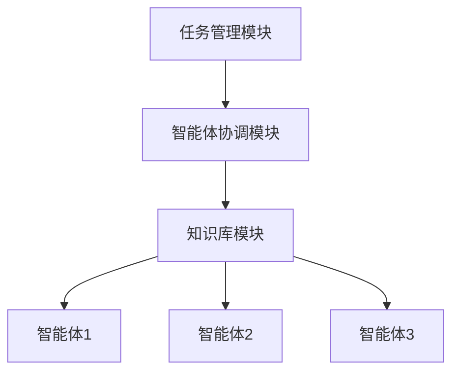

                 


# 协作型多智能体AI Agent：LLM间的任务协调与分工

> 关键词：协作型AI，多智能体系统，LLM，任务协调，分工协作

> 摘要：本文深入探讨了协作型多智能体AI Agent的概念、核心原理、系统架构、算法实现以及实际应用。通过分析LLM间的任务协调与分工，本文为读者提供了从理论到实践的全面指导，帮助读者理解如何构建和优化协作型多智能体AI系统。

---

## 第一部分: 协作型多智能体AI Agent的背景与概述

### 第1章: 协作型多智能体AI Agent的概念与背景

#### 1.1 协作型AI的定义与特点

协作型AI是一种通过多个智能体之间的协作与配合，共同完成复杂任务的AI形式。与传统的单一智能体AI不同，协作型AI强调智能体之间的通信、协商和协同决策。

- **定义**: 协作型AI是指多个智能体通过共享信息、分工协作，共同完成一个或多个目标的系统。
- **特点**:
  - 分工明确: 每个智能体负责不同的任务或子任务。
  - 协调一致: 智能体之间通过通信和协商，确保任务的顺利进行。
  - 高效性: 通过任务分工和协作，提高整体系统的效率和效果。

#### 1.2 多智能体系统概述

多智能体系统（Multi-Agent System, MAS）是由多个智能体组成的分布式系统，这些智能体通过协作完成特定的目标。

- **定义**: 多智能体系统是由多个智能体组成的分布式系统，这些智能体通过协作完成特定的目标。
- **优势**:
  - 分散决策: 每个智能体独立决策，减少单点故障。
  - 灵活性: 系统可以根据任务需求动态调整智能体的角色和任务分配。
  - 高可扩展性: 可以根据任务需求添加或移除智能体。

#### 1.3 LLM间的协作与分工

大语言模型（Large Language Model, LLM）是一种基于深度学习的自然语言处理模型，具有强大的文本理解和生成能力。在协作型多智能体AI Agent中，多个LLM可以通过分工协作，共同完成复杂的任务。

- **LLM间的协作需求**:
  - 信息共享: 智能体之间需要共享任务相关的信息。
  - 任务分配: 根据任务特点和智能体的能力，动态分配任务。
  - 协调决策: 在任务执行过程中，智能体需要通过协商解决冲突和不确定性。

#### 1.4 协作型多智能体AI Agent的应用场景

协作型多智能体AI Agent在多个领域有广泛的应用，包括企业级应用、智能客服和项目管理等。

- **企业级应用**: 在企业中，多个智能体可以分别负责不同的业务模块，例如市场分析、客户服务、数据分析等。
- **智能客服**: 多个智能客服机器人可以协作完成复杂的客户需求，例如订单处理、投诉处理等。
- **项目管理**: 在项目管理中，多个智能体可以分别负责任务分配、进度跟踪、资源分配等。

---

### 第2章: 协作型多智能体AI Agent的核心概念

#### 2.1 协作型多智能体AI Agent的结构

协作型多智能体AI Agent的结构包括以下几个核心要素：

- **智能体**: 每个智能体都是一个独立的实体，具有一定的任务处理能力。
- **通信机制**: 智能体之间的通信方式，例如消息传递、共享数据库等。
- **任务分配策略**: 根据任务特点和智能体能力，动态分配任务的方法。

#### 2.2 协作型多智能体AI Agent的协作机制

协作机制是协作型多智能体AI Agent的核心，主要包括以下内容：

- **协商过程**: 智能体之间通过协商确定任务分配和角色分工。
- **协同决策**: 在任务执行过程中，智能体通过协作完成决策。
- **激励机制**: 通过激励机制确保智能体之间的合作和协调。

---

## 第三部分: 协作型多智能体AI Agent的算法原理

### 第3章: 协作型多智能体AI Agent的算法实现

#### 3.1 任务分配算法

任务分配算法是协作型多智能体AI Agent的核心算法，用于将任务分配给合适的智能体。

- **任务分配模型**: 任务分配可以通过优化模型来实现，例如线性规划模型。
- **任务分配流程**:
  1. 确定任务需求和智能体能力。
  2. 根据任务特点和智能体能力，计算每个智能体的任务分配概率。
  3. 根据概率分配任务，确保任务的高效完成。

#### 3.2 协商算法

协商算法用于智能体之间的任务分配和角色分工。

- **协商过程**:
  1. 智能体提出任务请求。
  2. 其他智能体根据自身能力和任务特点，响应任务请求。
  3. 通过协商确定任务分配和角色分工。

#### 3.3 协作决策算法

协作决策算法用于智能体在任务执行过程中的决策。

- **决策流程**:
  1. 智能体收集任务相关信息。
  2. 根据任务特点和智能体能力，进行决策。
  3. 通过协作完成决策。

---

## 第四部分: 协作型多智能体AI Agent的系统架构

### 第4章: 系统架构设计

#### 4.1 系统功能设计

系统功能设计包括任务管理模块、智能体协调模块和知识库模块。

- **任务管理模块**: 负责任务的分配和跟踪。
- **智能体协调模块**: 负责智能体之间的通信和协商。
- **知识库模块**: 提供任务相关的知识和信息。

#### 4.2 系统架构图

以下是一个协作型多智能体AI Agent的系统架构图：



---

## 第五部分: 项目实战

### 第5章: 项目实战

#### 5.1 环境安装

协作型多智能体AI Agent的实现需要以下环境：

- Python 3.8+
- 网络通信库（例如：socket、http.server）
- 优化库（例如：scipy、numpy）

#### 5.2 核心代码实现

以下是一个协作型多智能体AI Agent的核心代码实现：

```python
import random

class Agent:
    def __init__(self, id):
        self.id = id
        self.task = None

    def assign_task(self, task):
        self.task = task
        print(f"Agent {self.id} assigned task: {task}")

    def complete_task(self):
        print(f"Agent {self.id} completed task: {self.task}")

def task_allocator(agents, tasks):
    for i in range(len(tasks)):
        agent = agents[i % len(agents)]
        agent.assign_task(tasks[i])

def main():
    agents = [Agent(1), Agent(2), Agent(3)]
    tasks = ["task1", "task2", "task3"]
    task_allocator(agents, tasks)
    for agent in agents:
        agent.complete_task()

if __name__ == "__main__":
    main()
```

---

### 第6章: 总结与展望

协作型多智能体AI Agent通过任务协调与分工，可以显著提高系统的效率和效果。未来的研究方向包括优化任务分配算法、提升智能体之间的协作效率以及扩展系统的应用场景。

---

## 作者

**作者：AI天才研究院/AI Genius Institute & 禅与计算机程序设计艺术 /Zen And The Art of Computer Programming**

---

以上是《协作型多智能体AI Agent：LLM间的任务协调与分工》的完整目录和内容概览。通过以上章节的详细阐述，读者可以全面理解协作型多智能体AI Agent的概念、原理和实际应用。

