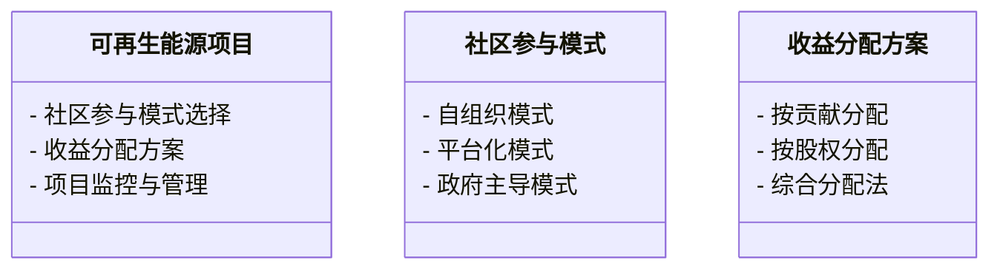

                 


# 可再生能源项目的社区参与模式与收益分配

## 关键词：可再生能源，社区参与，收益分配，数学模型，算法设计，系统架构

## 摘要

可再生能源项目的社区参与模式与收益分配是一个复杂而重要的问题。随着全球能源结构向清洁化、低碳化转型，可再生能源在能源系统中的地位日益重要。社区参与不仅是可再生能源项目成功实施的关键因素，也是确保项目可持续性的重要保障。本文系统探讨了可再生能源项目的社区参与模式及其收益分配机制，分析了不同模式的特点与适用场景，并提出了基于数学模型与算法设计的收益分配方法。文章还通过实际案例分析和系统架构设计，深入探讨了可再生能源项目的实施路径与优化策略，为相关领域的研究和实践提供了理论支持和实践指导。

---

# 第一部分：可再生能源项目与社区参与模式概述

## 第1章：可再生能源项目与社区参与的背景

### 1.1 可再生能源的发展现状

#### 1.1.1 可再生能源在全球能源结构中的地位

可再生能源是指来源于自然并能够再生的能源，主要包括太阳能、风能、水能、生物质能、地热能等。近年来，全球能源结构正在向清洁化、低碳化转型，可再生能源在能源消费中的占比逐年提升。根据国际能源署（IEA）的数据，2022年全球可再生能源发电量占总发电量的38%左右，且这一比例仍在持续增长。可再生能源不仅在减少碳排放方面发挥了重要作用，还在推动能源结构优化和能源安全方面做出了贡献。

#### 1.1.2 可再生能源项目的特点与优势

可再生能源项目的显著特点包括：① 环境友好，几乎零排放；② 可再生性，资源利用不会枯竭；③ 分布广泛，适合分布式发电；④ 技术成熟，成本逐步下降。这些特点使得可再生能源项目在能源转型中具有重要地位。

#### 1.1.3 可再生能源项目中的社区角色

社区在可再生能源项目中的角色主要包括：① 项目参与者，如居民投资或参与项目建设；② 资源提供者，如提供土地、屋顶等资源；③ 收益分享者，通过参与项目获得经济回报；④ 监督者，对项目实施过程进行监督。

---

### 1.2 社区参与在可再生能源项目中的重要性

#### 1.2.1 社区参与的定义与范围

社区参与是指社区居民或组织通过多种形式参与可再生能源项目的规划、建设和运营。参与范围包括：① 投资决策；② 项目选址；③ 运营管理；④ 收益分配。

#### 1.2.2 社区参与对项目成功的影响

社区参与能够提高项目的合法性、可行性和可持续性。通过参与，社区居民能够增强对项目的认同感，减少反对声音，并为项目的实施提供支持。

#### 1.2.3 社区参与与可持续发展的关系

可持续发展要求经济、社会和环境效益的协调统一。社区参与能够确保项目在经济上可行、社会上接受、环境上友好，从而实现可持续发展目标。

---

## 第2章：可再生能源项目中的社区参与模式

### 2.1 社区参与的基本模式

#### 2.1.1 自组织模式

自组织模式是指社区居民自发组织，通过内部协商和合作开展可再生能源项目。这种模式的优点是灵活性高，能够充分反映社区需求；缺点是缺乏专业支持，项目成功率较低。

#### 2.1.2 平台化模式

平台化模式是指通过第三方平台整合社区资源，提供技术支持和管理服务。这种模式能够降低社区的参与门槛，提高项目的组织效率。

#### 2.1.3 政府主导模式

政府主导模式是指政府通过政策支持和资金补贴推动可再生能源项目。这种模式的优点是资源丰富、执行力强；缺点是社区参与度较低，容易出现资源浪费。

### 2.2 不同模式的比较与分析

#### 2.2.1 模式的优缺点对比

| 模式类型     | 优点                           | 缺点                               |
| ------------ | ------------------------------ | ---------------------------------- |
| 自组织模式   | 灵活性高，社区参与度高         | 资源有限，专业性不足               |
| 平台化模式   | 整合资源，效率高               | 依赖平台方，社区控制力较弱         |
| 政府主导模式 | 资源充足，执行力强             | 社区参与度低，创新性不足           |

#### 2.2.2 模式的适用场景

- **自组织模式**适用于小型社区，资源有限但社区凝聚力强的场景。
- **平台化模式**适用于中型社区，希望通过外部支持提高效率的场景。
- **政府主导模式**适用于大型项目，资源需求高且政策支持力度大的场景。

#### 2.2.3 模式的动态调整

在实际应用中，社区可以根据项目进展和需求变化，动态调整参与模式。例如，初期采用自组织模式，后期引入平台化模式提供技术支持，或者在政府主导模式的基础上增加社区参与环节。

---

## 第3章：可再生能源项目的收益分配机制

### 3.1 收益分配的基本原则

#### 3.1.1 公平性原则

收益分配应公平合理，确保各参与方的利益得到充分体现。例如，社区居民投资的资本回报率应与项目收益相匹配。

#### 3.1.2 透明性原则

收益分配过程应公开透明，确保所有参与者对分配结果有清晰的了解。可以通过合同约定分配规则，并定期向社区公示。

#### 3.1.3 可持续性原则

收益分配应注重长期可持续性，避免因短期分配不公影响项目的长期发展。例如，部分收益可用于社区公共事业建设。

---

### 3.2 收益分配的主体与客体

#### 3.2.1 收益分配的主体分析

收益分配的主体包括：① 投资者，提供资金或资源；② 运营商，负责项目建设和运维；③ 社区，提供土地或参与投资。

#### 3.2.2 收益分配的客体分析

收益分配的客体包括：① 电力收益，项目发电的收入；② 环境收益，碳减排带来的收益；③ 社会收益，项目对社区发展的贡献。

#### 3.2.3 收益分配的边界与外延

收益分配的边界包括：① 项目生命周期，从建设到运营的全过程；② 参与方的贡献，包括资金、资源、劳动等；③ 收益的来源，包括直接收益和间接收益。

---

### 3.3 收益分配的具体方法

#### 3.3.1 按贡献分配

按贡献分配是指根据各参与方的贡献比例分配收益。例如，投资者占60%，社区占30%，运营商占10%。

#### 3.3.2 按股权分配

按股权分配是指根据各参与方的股权比例分配收益。例如，投资者持有60%股权，社区持有30%股权，运营商持有10%股权。

#### 3.3.3 综合分配法

综合分配法是将上述两种方法结合，根据贡献和股权综合确定分配比例。例如，贡献和股权各占50%，最终确定分配比例。

---

# 第二部分：可再生能源项目社区参与的数学模型与算法

## 第4章：社区参与模式的数学模型

### 4.1 模型构建的基本思路

#### 4.1.1 数据收集与处理

需要收集的数据包括：① 社区规模；② 可再生能源资源禀赋；③ 社区参与意愿；④ 项目成本与收益。

#### 4.1.2 模型假设与变量定义

假设：社区参与模式的选择影响项目收益和成本。变量：x表示社区参与模式的选择，y表示项目净收益。

#### 4.1.3 模型的数学表达

项目净收益函数：$$ y = f(x) $$，其中x为社区参与模式的类型。

---

### 4.2 模型的具体实现

#### 4.2.1 线性分配模型

线性分配模型假设收益与贡献呈线性关系。数学表达式：$$ y = a x + b $$，其中a为分配系数，b为常数项。

#### 4.2.2 非线性分配模型

非线性分配模型假设收益与贡献呈非线性关系。数学表达式：$$ y = a x^2 + b x + c $$。

#### 4.2.3 综合优化模型

综合优化模型结合了多种因素，通过优化算法确定最优分配方案。数学表达式：$$ \max y = \sum_{i=1}^{n} w_i x_i $$，其中w_i为权重，x_i为各因素的贡献值。

---

## 第5章：收益分配的算法设计

### 5.1 算法设计的基本原理

#### 5.1.1 算法的目标函数

目标函数：$$ \max \sum_{i=1}^{n} w_i x_i $$，其中w_i为权重，x_i为各因素的贡献值。

#### 5.1.2 算法的约束条件

约束条件：$$ \sum_{i=1}^{n} x_i \leq 1 $$，即总贡献不超过100%。

#### 5.1.3 算法的优化方向

优化方向：最大化社区收益，同时确保各参与方的利益平衡。

---

### 5.2 算法的具体实现

#### 5.2.1 基于线性规划的收益分配算法

线性规划模型：  
目标函数：$$ \max \sum_{i=1}^{n} w_i x_i $$  
约束条件：  
1. $$ \sum_{i=1}^{n} x_i \leq 1 $$  
2. $$ x_i \geq 0 $$  

Python代码示例：  

```python
import numpy as np

# 定义权重向量
weights = np.array([0.6, 0.3, 0.1])

# 定义变量x
x = np.array([0.4, 0.3, 0.3])

# 计算收益
收益 = np.dot(weights, x)
print(收益)  # 输出结果
```

#### 5.2.2 基于动态调整的收益分配算法

动态调整算法：  
步骤：  
1. 初始化分配比例；  
2. 根据项目进展动态调整比例；  
3. 通过反馈机制优化分配方案。  

---

# 第三部分：可再生能源项目的系统架构与案例分析

## 第6章：可再生能源项目的系统架构设计

### 6.1 系统功能设计

#### 6.1.1 领域模型设计（mermaid 类图）



#### 6.1.2 系统架构设计（mermaid 架构图）

```mermaid
container 可再生能源项目系统 {
    participant 社区居民
    participant 投资者
    participant 运营商
    participant 政府机构
    component 社区参与模块
    component 收益分配模块
    component 项目监控模块
}
```

---

## 第7章：可再生能源项目的案例分析

### 7.1 项目实战：屋顶光伏项目

#### 7.1.1 项目背景与目标

项目背景：某社区计划建设屋顶光伏项目，目标是实现社区能源自给自足，减少碳排放。  

#### 7.1.2 项目实施过程

1. 确定社区参与模式：采用平台化模式，引入第三方平台提供技术支持。  
2. 设计收益分配方案：按贡献分配，社区占60%，投资者占30%，运营商占10%。  
3. 实施与监控：通过系统监控项目运行，动态调整分配方案。

#### 7.1.3 项目总结

项目成功实现了社区能源自给，提高了居民参与度，优化了收益分配机制。

---

## 第8章：政策支持与最佳实践

### 8.1 政策支持分析

政策支持对可再生能源项目的成功实施至关重要。例如，政府可以通过财政补贴、税收优惠等方式支持社区参与模式。同时，政府还应制定相关政策规范，确保收益分配的公平性与透明性。

---

## 第9章：挑战与未来展望

### 9.1 当前面临的挑战

1. **技术挑战**：可再生能源技术的进一步优化与创新。  
2. **政策挑战**：收益分配机制的完善与政策支持的加强。  
3. **社会挑战**：社区参与度的提高与参与意识的培养。

### 9.2 未来展望

未来，随着技术进步和政策完善，可再生能源项目将更加普及，社区参与模式将更加多样化。收益分配机制也将更加科学合理，实现经济效益与社会效益的双赢。

---

# 小结

可再生能源项目的社区参与模式与收益分配是一个复杂但重要的问题。通过本文的探讨，我们系统分析了不同社区参与模式的特点与适用场景，并提出了基于数学模型与算法设计的收益分配方法。通过实际案例分析和系统架构设计，我们深入探讨了可再生能源项目的实施路径与优化策略。未来，随着技术进步和政策完善，可再生能源项目将更加普及，社区参与模式将更加多样化，收益分配机制也将更加科学合理。

---

# 作者

作者：AI天才研究院/AI Genius Institute & 禅与计算机程序设计艺术 /Zen And The Art of Computer Programming

