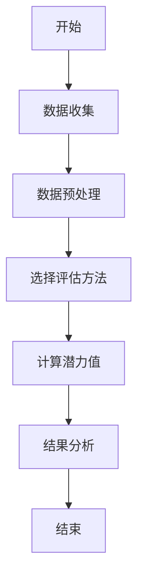

                 


# 可持续城市规划技术的市场潜力评估

> 关键词：可持续城市规划，市场潜力，技术评估，算法模型，系统架构

> 摘要：  
> 本文章系统地探讨了可持续城市规划技术的市场潜力评估方法，结合技术原理、算法模型、系统架构和实际案例，详细分析了该领域的核心概念、评估框架和实施策略。通过对现有技术的优劣势对比和市场环境的深入剖析，本文旨在为城市规划者、政策制定者和技术开发者提供理论支持和实践指导，以推动可持续城市规划技术的广泛应用和市场潜力的充分释放。

---

## 第一部分：可持续城市规划技术的背景与概念

### 第1章：可持续城市规划技术的背景

#### 1.1 问题背景
- 1.1.1 当前城市化面临的环境与资源挑战  
- 1.1.2 可持续发展理念的提出与演变  
- 1.1.3 城市规划技术的转型需求  

#### 1.2 可持续城市规划技术的定义
- 1.2.1 技术的核心概念与术语解析  
- 1.2.2 技术的多维度属性对比（技术性、经济性、社会性）  
- 1.2.3 可持续城市规划技术的边界与外延  

#### 1.3 可持续城市规划技术的核心要素
- 1.3.1 绿色建筑与能源效率  
- 1.3.2 智慧交通与城市 mobility  
- 1.3.3 生态保护与城市韧性  

---

## 第二部分：可持续城市规划技术的市场潜力评估框架

### 第2章：核心概念与联系

#### 2.1 核心概念的原理
- 2.1.1 绿色建筑技术的节能原理  
- 2.1.2 智慧交通系统的优化机制  
- 2.1.3 城市韧性技术的抗灾能力  

#### 2.2 核心概念的属性对比表
| 技术领域 | 能耗效率 | 经济成本 | 社会影响 | 可扩展性 |
|----------|----------|----------|----------|----------|
| 绿色建筑 | 高       | 中       | 正向     | 低       |
| 智慧交通 | 中       | 高       | 正向     | 高       |
| 城市韧性 | 中       | 高       | 正向     | 低       |

#### 2.3 实体关系图（ER图）

```mermaid
er
    actor: 用户
    actor --> SustainableUrbanPlanningTechnology: 使用
    actor --> MarketPotentialAssessment: 评估
    SustainableUrbanPlanningTechnology --> MarketPotentialAssessment: 输入数据
```

---

### 第3章：可持续城市规划技术的市场潜力评估算法

#### 3.1 算法原理
- 3.1.1 层次分析法（AHP）  
  - 理论基础：通过权重分配对各技术进行综合评估。  
  - 公式：$$ A = \lambda_{max} - \frac{1}{n-1} $$，其中，$\lambda_{max}$ 是最大特征值，$n$ 是指标个数。  

- 3.1.2 线性回归分析  
  - 理论基础：通过历史数据拟合市场潜力与技术性能的关系。  
  - 公式：$$ y = \beta_0 + \beta_1x + \epsilon $$  

- 3.1.3 综合评估模型  
  - 理论基础：结合定量与定性指标，构建综合评分模型。  

#### 3.2 算法流程图（Mermaid）



---

### 第4章：系统分析与架构设计

#### 4.1 问题场景介绍
- 技术场景：评估某新型绿色建筑技术的市场潜力。  
- 数据来源：市场调研、技术性能指标、政策支持度。  

#### 4.2 系统功能设计
- 数据采集模块：收集城市规划相关的数据。  
- 数据分析模块：应用层次分析法和线性回归模型进行潜力评估。  
- 结果展示模块：生成可视化报告。  

#### 4.3 系统架构设计（Mermaid）


---

### 第5章：项目实战

#### 5.1 环境安装与数据准备
- 环境需求：Python 3.8+，安装 numpy、pandas、scikit-learn 等库。  

#### 5.2 核心代码实现

```python
import numpy as np
from sklearn.linear_model import LinearRegression
from sklearn.metrics import r2_score

# 示例数据：绿色建筑技术的能耗与市场潜力
X = np.array([[2.5], [3.0], [3.5], [4.0]])  # 能耗（单位： kWh/m²）
y = np.array([65, 70, 75, 80])  # 市场潜力评分

# 模型训练
model = LinearRegression()
model.fit(X, y)

# 预测结果
predictions = model.predict(X)
print("预测值:", predictions)
print("R²值:", r2_score(y, predictions))
```

#### 5.3 案例分析与解读
- 数据分析结果：绿色建筑技术的市场潜力与能耗呈负相关。  
- 模型优化：引入更多变量（如政策支持度、用户接受度）以提高模型精度。  

---

## 第三部分：总结与展望

### 第6章：总结与展望

#### 6.1 总结
- 可持续城市规划技术的市场潜力评估方法已初步构建。  
- 综合评估模型能够为技术推广提供科学依据。  

#### 6.2 展望
- 深入研究多因素影响下的市场潜力预测模型。  
- 推动技术在更多城市规划项目中的应用与验证。  

#### 6.3 注意事项与最佳实践
- 数据收集的全面性与准确性是评估的基础。  
- 模型的应用需结合具体城市特点进行调整。  

#### 6.4 拓展阅读
- 推荐阅读《可持续城市规划技术的理论与实践》与《市场潜力评估方法论》。  

---

## 作者：AI天才研究院 & 禅与计算机程序设计艺术

---

**附录**  
- 附录A：常用数据收集工具与平台  
- 附录B：算法实现的完整代码示例  
- 附录C：案例分析的详细数据表

