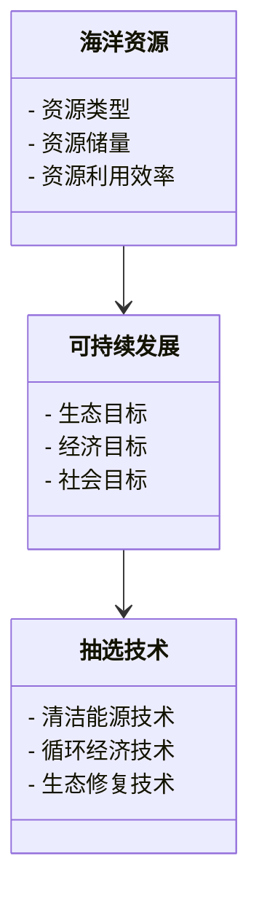
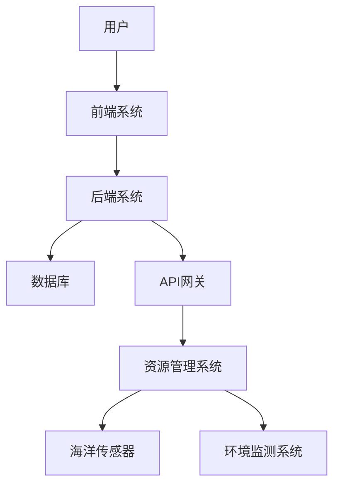
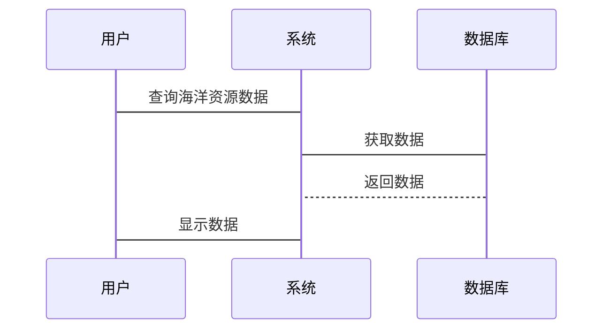

                 


# 可持续海洋经济的蓝色增长投资策略

## 关键词：蓝色增长、海洋经济、可持续发展、投资策略、资源开发、系统架构、经济模型

## 摘要：蓝色增长作为一种新兴的经济模式，旨在通过可持续的方式开发和利用海洋资源，实现经济增长的同时保护海洋生态系统。本文详细探讨了蓝色增长的核心概念、数学模型、系统架构以及实际投资策略，结合案例分析和最佳实践，为投资者和政策制定者提供科学指导。

---

# 第一部分: 可持续海洋经济的蓝色增长背景与概念

## 第1章: 蓝色增长的背景与定义

### 1.1 蓝色增长的背景

#### 1.1.1 海洋经济的重要性
海洋经济是全球经济增长的重要组成部分，涵盖渔业、航运、能源、旅游等多个领域。然而，传统海洋资源开发方式往往忽视了生态系统的脆弱性和有限性。

#### 1.1.2 可持续发展的必要性
随着全球人口增长和资源短缺问题的加剧，海洋资源的过度开发导致海洋生态系统严重退化，如珊瑚礁死亡、鱼类资源枯竭等。因此，可持续发展成为蓝色增长的核心理念。

#### 1.1.3 蓝色增长的概念与内涵
蓝色增长是指通过创新技术、科学管理和政策支持，实现海洋资源的高效利用和生态保护的平衡，从而推动经济可持续增长。

---

## 第2章: 蓝色增长的核心概念与联系

### 2.1 蓝色增长的系统架构

#### 2.1.1 海洋资源的利用流程
从资源勘探、开发、利用到生态修复，蓝色增长强调每个环节的可持续性。

#### 2.1.2 可持续发展的技术路径
通过技术创新（如海洋可再生能源、智能渔业）实现资源高效利用。

#### 2.1.3 经济与生态的协同机制
通过政策引导和市场机制，实现经济利益与生态保护的双赢。

### 2.2 蓝色增长的核心要素对比

#### 2.2.1 海洋资源的分类与特征
| 资源类型 | 特征 |
|----------|------|
| 渔业资源 | 可再生性、季节性 |
| 石油天然气 | 不可再生性、高风险 |
| 海水化学资源 | 可持续性、技术依赖性 |

#### 2.2.2 可持续发展的技术要求
- 清洁能源技术：如潮汐能、波浪能发电。
- 循环经济技术：如废弃物资源化利用。

#### 2.2.3 经济与生态的对比分析
| 方面 | 经济 | 生态 |
|------|-----|-----|
| 重点 | 利润最大化 | 生态保护 |
| 挑战 | 资源枯竭 | 环境破坏 |

---

## 第3章: 蓝色增长的核心要素

### 3.1 海洋资源的多样性
海洋覆盖了地球表面的70%，蕴藏着丰富的资源，包括生物资源（鱼类、海藻）、非生物资源（石油、天然气、矿产）和环境资源（航运、旅游）。

### 3.2 可持续发展的技术支撑
- **清洁能源技术**：海洋能发电（潮汐能、波浪能）。
- **智能渔业技术**：利用大数据和AI优化渔业生产。
- **生态保护技术**：如珊瑚礁修复、海洋污染监测。

### 3.3 经济与生态的平衡点
- **经济收益**：通过高效利用资源实现利润最大化。
- **生态代价**：避免资源过度开发导致的生态破坏。
- **协同机制**：通过政策、技术和市场的结合，实现经济与生态的平衡。

---

# 第二部分: 蓝色增长的数学模型与算法

## 第4章: 蓝色增长的数学模型

### 4.1 投资回报率模型

#### 4.1.1 投资回报率公式
$$ ROI = \frac{\text{净收益}}{\text{初始投资}} $$

#### 4.1.2 应用案例
某海洋可再生能源项目，初始投资为1000万元，预计5年内净收益为2000万元，计算其ROI为200%。

### 4.2 风险评估模型

#### 4.2.1 风险评估公式
$$ R = \sum_{i=1}^{n} w_i \cdot r_i $$
其中，$w_i$为风险因素的权重，$r_i$为风险值。

#### 4.2.2 应用案例
某海洋工程项目面临市场风险（权重0.4，风险值0.6）、技术风险（权重0.3，风险值0.7）和环境风险（权重0.3，风险值0.5），计算其综合风险值为：
$$ R = 0.4 \times 0.6 + 0.3 \times 0.7 + 0.3 \times 0.5 = 0.24 + 0.21 + 0.15 = 0.6 $$

### 4.3 资源分配优化模型

#### 4.3.1 资源分配公式
$$ \max \sum_{i=1}^{n} c_i \cdot x_i $$
其中，$c_i$为资源收益系数，$x_i$为资源分配变量，约束条件包括资源总量、技术限制等。

#### 4.3.2 应用案例
某海洋牧场项目需要分配资金到鱼类养殖和藻类种植，假设鱼类养殖的收益系数为0.8，藻类种植为0.6，总资金为100万元。求解最优分配方案。

---

# 第三部分: 蓝色增长的系统分析与架构设计

## 第5章: 蓝色增长的系统架构

### 5.1 项目背景

#### 5.1.1 项目目标
实现海洋资源的高效利用和可持续发展。

#### 5.1.2 项目范围
涵盖海洋能源、渔业、旅游等多个领域。

### 5.2 系统功能设计

#### 5.2.1 领域模型类图


#### 5.2.2 系统架构图


#### 5.2.3 接口设计
- 用户端接口：API用于数据查询和操作。
- 系统内部接口：模块之间的数据交互接口。

#### 5.2.4 交互序列图


---

# 第四部分: 蓝色增长的项目实战

## 第6章: 蓝色增长的项目实战

### 6.1 环境安装

#### 6.1.1 系统需求
- 操作系统：Linux/Windows/MacOS
- 开发工具：Python、Jupyter Notebook、Mermaid
- 数据库：MySQL/PostgreSQL

#### 6.1.2 安装步骤
```bash
pip install mermaid.py
npm install mermaid-js
```

### 6.2 核心代码实现

#### 6.2.1 投资回报率计算
```python
def calculate ROI(net_profit, initial_investment):
    return net_profit / initial_investment * 100

ROI = calculate ROI(2000000, 1000000)
print(f"ROI: {ROI}%")
```

#### 6.2.2 风险评估
```python
def calculate_risk(weights, risks):
    return sum(w * r for w, r in zip(weights, risks))

risks = [0.6, 0.7, 0.5]
weights = [0.4, 0.3, 0.3]
risk = calculate_risk(weights, risks)
print(f"Risk Value: {risk}")
```

### 6.3 案例分析

#### 6.3.1 案例背景
某海洋牧场项目，总投资1000万元，预期收益2000万元，投资回报期5年。

#### 6.3.2 分析过程
计算投资回报率：
$$ ROI = \frac{2000}{1000} \times 100\% = 100\% $$

风险评估：
市场风险（权重0.4，风险值0.6）、技术风险（权重0.3，风险值0.7）、环境风险（权重0.3，风险值0.5）。
$$ R = 0.4 \times 0.6 + 0.3 \times 0.7 + 0.3 \times 0.5 = 0.6 $$

#### 6.3.3 结论
项目具有较高的投资回报率，但存在一定的综合风险。

---

## 第7章: 蓝色增长的最佳实践与小结

### 7.1 小结
蓝色增长通过技术创新和科学管理，实现了海洋资源的高效利用和生态保护的平衡。

### 7.2 注意事项
- 风险评估必须全面。
- 技术创新是关键。
- 政策支持是保障。

### 7.3 拓展阅读
- 《海洋经济可持续发展研究》
- 《蓝色增长的技术创新路径》
- 《海洋资源管理与政策》

---

# 作者：AI天才研究院/AI Genius Institute & 禅与计算机程序设计艺术 /Zen And The Art of Computer Programming

