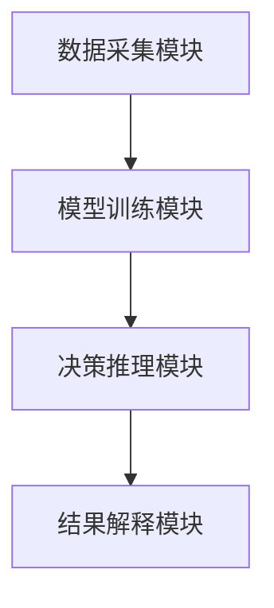

                 


# 可解释性设计：理解AI Agent的决策过程

## 关键词：可解释性设计、AI Agent、决策过程、机器学习、算法原理

## 摘要：  
可解释性设计是当前人工智能领域的重要研究方向，特别是在理解AI Agent的决策过程中。本文从背景介绍出发，分析了可解释性设计的核心概念与实现方法，深入探讨了其算法原理，并通过实际案例展示了如何在系统架构设计和项目实战中应用这些方法。文章最后总结了可解释性设计的最佳实践，为读者提供了全面的理解和实用的指导。

---

## 第一部分：可解释性设计的背景与核心概念

### 第1章：可解释性设计的背景与问题背景

#### 1.1 问题背景
- **1.1.1 AI Agent的决策过程与可解释性的重要性**  
  AI Agent在决策过程中需要考虑多个因素，例如环境信息、目标函数和约束条件。然而，这些决策过程往往难以被人类理解，这导致了用户对AI决策的信任缺失。因此，可解释性设计变得尤为重要。

- **1.1.2 当前AI决策过程中的黑箱问题**  
  当前许多AI系统，尤其是基于深度学习的模型，被称为“黑箱”模型。这些模型的决策过程缺乏透明性，用户无法理解AI为什么会做出某个决策。

- **1.1.3 可解释性设计的必要性与应用场景**  
  可解释性设计能够帮助用户理解AI的决策过程，增强用户对AI系统的信任。其应用场景包括医疗、金融、司法等领域，这些领域对决策过程的透明性和可解释性有较高要求。

#### 1.2 问题描述
- **1.2.1 AI Agent决策过程的复杂性**  
  AI Agent的决策过程涉及多个步骤，包括感知环境、分析信息、制定策略等。这些步骤的复杂性使得决策过程难以被解释。

- **1.2.2 用户对AI决策过程的信任需求**  
  用户希望了解AI为何做出某个决策，而不仅仅是知道结果。这种需求推动了可解释性设计的发展。

- **1.2.3 可解释性设计的目标与范围**  
  可解释性设计的目标是通过设计方法和技术，使得AI的决策过程能够被人类理解和解释。其范围包括算法设计、系统架构和用户界面等多个方面。

#### 1.3 问题解决
- **1.3.1 可解释性设计的核心思想**  
  可解释性设计的核心思想是通过简化和透明化AI的决策过程，使其能够被用户理解和信任。

- **1.3.2 解决AI Agent决策过程中的可解释性问题的方法**  
  通过引入可解释性模型、设计透明化的用户界面以及提供详细的决策日志等方法，可以提高AI决策过程的可解释性。

- **1.3.3 可解释性设计的实现路径**  
  可解释性设计的实现路径包括算法优化、系统架构设计和用户交互设计。这些路径需要在AI系统的开发过程中综合考虑。

#### 1.4 边界与外延
- **1.4.1 可解释性设计的边界**  
  可解释性设计的边界包括AI系统的功能范围和用户需求的限制。例如，在医疗领域，可解释性设计需要符合医疗法规和伦理要求。

- **1.4.2 相关概念的对比与区分**  
  可解释性设计与模型的可解释性不同。前者是一个系统性的设计过程，而后者是一个模型的属性。

- **1.4.3 可解释性设计的外延与未来发展**  
  可解释性设计的外延包括跨领域应用和动态适应性设计。未来的发展方向是结合领域知识和用户需求，进一步提高可解释性设计的效率和效果。

### 第2章：可解释性设计的核心概念与联系

#### 2.1 核心概念原理
- **2.1.1 AI Agent的决策过程模型**  
  AI Agent的决策过程模型包括感知、分析、决策和执行四个阶段。每个阶段都需要考虑可解释性设计的因素。

- **2.1.2 可解释性设计的理论基础**  
  可解释性设计的理论基础包括认知科学、人机交互和伦理学。这些理论为可解释性设计提供了方法论支持。

- **2.1.3 可解释性设计与AI伦理的关系**  
  可解释性设计与AI伦理密切相关。例如，在司法领域，可解释性设计需要确保AI决策的公正性和透明性。

#### 2.2 核心概念属性特征对比
- **2.2.1 AI Agent决策过程的可解释性特征**  
  包括透明性、可追溯性、可解释性等特征。

- **2.2.2 可解释性设计的实现特征**  
  包括模块化设计、日志记录和用户友好的界面设计等。

- **2.2.3 可解释性设计与其他设计方法的对比**  
  例如，与不可解释的深度学习模型相比，可解释性设计更注重用户理解和系统透明性。

#### 2.3 ER实体关系图
```mermaid
er
actor(AI Agent) --> decision_process: 触发决策过程
actor --> decision_rule: 应用决策规则
decision_process --> outcome: 产生决策结果
outcome --> explanation: 提供可解释性说明
```

---

## 第二部分：可解释性设计的算法原理

### 第3章：可解释性设计的算法原理

#### 3.1 算法原理概述
- **3.1.1 解释性模型与黑箱模型的对比**  
  解释性模型如线性回归和决策树具有较高的可解释性，而黑箱模型如深度神经网络则缺乏透明性。

- **3.1.2 可解释性设计的核心算法思想**  
  可解释性设计的核心算法思想是通过引入可解释的模型或对黑箱模型进行可解释性转换，使得决策过程能够被用户理解。

#### 3.2 算法实现
- **3.2.1 解释性模型的实现步骤**  
  以线性回归为例，实现步骤包括数据预处理、模型训练和结果解释。

- **3.2.2 黑箱模型的可解释性转换方法**  
  使用SHAP（Shapley Additive exPlanations）或LIME（Local Interpretable Model-agnostic Explanations）等方法，将黑箱模型的决策过程转化为可解释的形式。

#### 3.3 算法原理的数学模型与公式
- **3.3.1 解释性模型的数学表达式**  
  线性回归模型：
  $$ y = \beta_0 + \beta_1x_1 + \beta_2x_2 + \dots + \beta_nx_n $$

- **3.3.2 黑箱模型的可解释性转换公式**  
  使用SHAP值计算模型的解释性：
  $$ SHAP_{i} = \phi_{i} = \sum_{j} (f_{j}(x) - f_{j-1}(x)) \cdot (R_j(x) - R_{j-1}(x)) $$

---

### 第4章：可解释性设计的系统架构设计

#### 4.1 系统架构设计
- **4.1.1 问题场景介绍**  
  在医疗诊断系统中，AI Agent需要根据患者的症状和检查结果进行诊断。为了提高诊断的可解释性，需要设计一个可解释的系统架构。

- **4.1.2 系统功能设计**  
  包括数据采集、模型训练、决策推理和结果解释四个功能模块。

- **4.1.3 系统架构设计图**  


- **4.1.4 系统接口设计**  
  医疗诊断系统需要与医院的信息系统接口，获取患者的电子健康记录。

- **4.1.5 系统交互设计**  
  使用SHAP值对模型的决策过程进行解释，生成可理解的诊断报告。

---

### 第5章：可解释性设计的项目实战

#### 5.1 项目实战
- **5.1.1 项目环境安装**  
  使用Python 3.8及以上版本，安装必要的库如scikit-learn、shap和xgboost。

- **5.1.2 项目核心代码实现**  
  ```python
  import xgboost as xgb
  import shap

  # 数据加载与处理
  data = ...  # 加载数据
  X_train, y_train = data.train_features, data.train_labels
  X_test, y_test = data.test_features, data.test_labels

  # 训练模型
  model = xgb.XGBClassifier()
  model.fit(X_train, y_train)

  # 可解释性分析
  explainer = shap.TreeExplainer(model)
  shap_values = explainer.shap_values(X_test)

  # 可视化解释
  shap.summary_plot(shap_values, X_test, plot_type="bar")
  ```

- **5.1.3 代码解读与分析**  
  使用XGBoost模型进行分类，并通过SHAP值分析模型的可解释性，生成可视化报告。

- **5.1.4 案例分析与详细讲解**  
  以医疗诊断为例，分析模型在诊断过程中的决策步骤和解释结果。

- **5.1.5 项目小结**  
  通过可解释性设计，医疗诊断系统的决策过程更加透明，用户能够理解AI的诊断依据。

---

## 第三部分：可解释性设计的最佳实践与总结

### 第6章：可解释性设计的最佳实践

#### 6.1 最佳实践
- **6.1.1 从需求出发，选择合适的可解释性方法**  
  根据具体场景选择合适的可解释性方法，例如在金融领域选择LIME方法。

- **6.1.2 在系统设计阶段就考虑可解释性**  
  在系统架构设计阶段，预留可解释性模块的位置，确保可解释性设计的可行性。

- **6.1.3 结合领域知识，提高解释的可理解性**  
  在解释过程中，结合领域知识，使用用户熟悉的术语和概念，提高解释的可理解性。

### 第7章：总结与展望

#### 7.1 总结
- **7.1.1 可解释性设计的核心思想**  
  可解释性设计的核心思想是通过系统性的设计方法，使得AI的决策过程能够被人类理解。

- **7.1.2 可解释性设计的重要性与应用价值**  
  可解释性设计在医疗、金融、司法等领域具有重要的应用价值，能够提高用户对AI系统的信任。

- **7.1.3 可解释性设计的实现路径与方法**  
  可解释性设计的实现路径包括选择合适的可解释性方法、在系统设计阶段考虑可解释性以及结合领域知识提高解释的可理解性。

#### 7.2 展望
- **7.2.1 可解释性设计的未来发展**  
  随着AI技术的发展，可解释性设计将更加重要。未来的可解释性设计将更加智能化和自动化。

- **7.2.2 可解释性设计的挑战与机遇**  
  可解释性设计面临的挑战包括如何提高解释的准确性和如何处理复杂的决策过程。同时，随着技术的发展，可解释性设计也将迎来更多的机遇。

---

## 作者：AI天才研究院/AI Genius Institute & 禅与计算机程序设计艺术 /Zen And The Art of Computer Programming

