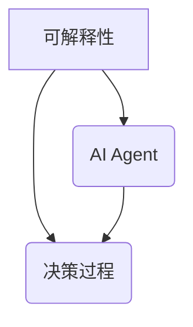

                 


# 可解释性：理解AI Agent的决策过程

## 关键词：
- 可解释性
- AI Agent
- 决策过程
- 人工智能
- 算法原理

## 摘要：
在人工智能快速发展的今天，AI Agent（智能体）在各个领域的应用日益广泛。然而，AI Agent的决策过程往往被视为“黑箱”，缺乏透明性和可解释性。本文将深入探讨可解释性在理解AI Agent决策过程中的重要性，分析可解释性与AI Agent的基本概念，讲解可解释性算法的核心原理，并通过实际项目案例展示如何在AI Agent中实现可解释性。通过本文的阐述，读者将能够更好地理解AI Agent的决策机制，并掌握如何设计和实现具有可解释性的AI系统。

---

# 第一部分：可解释性与AI Agent的背景

## 第1章：可解释性与AI Agent的背景

### 1.1 可解释性的重要性

#### 1.1.1 为什么需要可解释性
在AI Agent的应用中，可解释性是确保用户信任和系统可靠性的关键因素。例如，在医疗诊断、金融风控等领域，用户需要了解AI Agent的决策依据，以确保决策的合理性和正确性。

#### 1.1.2 可解释性在AI Agent中的作用
可解释性使得AI Agent的决策过程能够被人类理解和验证。通过可解释性，用户可以发现系统中的潜在问题，并对系统进行优化和改进。

#### 1.1.3 可解释性与决策过程的关系
AI Agent的决策过程依赖于输入数据、算法模型和系统逻辑。可解释性通过揭示这些因素之间的关系，帮助用户理解决策背后的逻辑。

### 1.2 AI Agent的基本概念

#### 1.2.1 AI Agent的定义
AI Agent是一种能够感知环境并采取行动以实现目标的智能实体。它可以是一个软件程序，也可以是一个物理设备。

#### 1.2.2 AI Agent的类型
AI Agent可以分为基于规则的Agent、基于模型的Agent、基于学习的Agent等类型，每种类型都有其独特的特点和应用场景。

#### 1.2.3 AI Agent的决策过程
AI Agent的决策过程通常包括感知环境、分析信息、制定策略和执行行动等步骤。这些步骤需要通过可解释性来揭示其内在逻辑。

### 1.3 可解释性与AI Agent的结合

#### 1.3.1 可解释性在AI Agent中的应用
通过可解释性，用户可以理解AI Agent的决策依据，验证决策的正确性，并对系统进行优化。

#### 1.3.2 可解释性对AI Agent决策过程的影响
可解释性使得AI Agent的决策过程更加透明，有助于提高系统的可信度和用户的接受度。

#### 1.3.3 可解释性与AI Agent的未来发展
随着AI技术的不断进步，可解释性将成为AI Agent设计中的核心要素，推动AI技术在更多领域的应用。

### 1.4 本章小结
本章介绍了可解释性的重要性，阐述了AI Agent的基本概念及其决策过程，并探讨了可解释性在AI Agent中的作用和未来发展。

---

## 第2章：可解释性的核心概念

### 2.1 可解释性的定义与属性

#### 2.1.1 可解释性的定义
可解释性是指AI系统或算法的输出能够被人类理解和解释的程度。通过可解释性，用户可以理解AI系统的决策逻辑。

#### 2.1.2 可解释性的核心属性对比

| 属性       | 描述                                             |
|------------|--------------------------------------------------|
| 明确性     | 解释必须清晰明了                                 |
| 完整性     | 解释必须涵盖所有关键因素                         |
| 一致性     | 解释必须在不同情况下保持一致                     |
| 可操作性   | 解释必须能够指导实际操作                         |

#### 2.1.3 可解释性与AI Agent的实体关系图



### 2.2 可解释性与其他相关概念

#### 2.2.1 可解释性与可追溯性
可追溯性是指能够追溯AI系统决策的来源和过程。可解释性与可追溯性密切相关，但可解释性更关注决策的逻辑和原因。

#### 2.2.2 可解释性与可验证性
可验证性是指AI系统的决策可以通过验证工具进行验证。可解释性为可验证性提供了基础，使得验证过程更加透明和可信。

#### 2.2.3 可解释性与可解释性
可解释性是AI系统的核心属性，通过可解释性，用户可以理解AI系统的决策逻辑。

### 2.3 本章小结
本章详细阐述了可解释性的定义与属性，分析了可解释性与AI Agent的关系，并通过实体关系图展示了可解释性在AI Agent中的作用。

---

## 第3章：可解释性算法的核心原理

### 3.1 可解释性算法概述

#### 3.1.1 可解释性算法的分类
可解释性算法可以分为基于规则的解释性算法和基于模型的解释性算法。基于规则的算法通过明确的规则解释决策过程，基于模型的算法通过模型的特征重要性进行解释。

#### 3.1.2 可解释性算法的特点
可解释性算法通常具有透明性、可解释性和可操作性等特点，能够帮助用户理解AI系统的决策逻辑。

#### 3.1.3 可解释性算法的应用场景
可解释性算法广泛应用于金融、医疗、司法等领域，帮助用户理解和验证AI系统的决策过程。

### 3.2 基于线性回归的可解释性算法

#### 3.2.1 线性回归模型的定义
线性回归是一种简单而有效的可解释性算法，其数学模型如下：
$$ y = \beta_0 + \beta_1x_1 + \beta_2x_2 + \dots + \beta_nx_n $$

#### 3.2.2 线性回归模型的解释性分析
通过线性回归模型的系数，可以明确每个特征对目标变量的影响程度。例如，在医疗诊断中，线性回归模型可以解释每个症状对疾病诊断的影响权重。

### 3.3 基于SHAP的可解释性算法

#### 3.3.1 SHAP（Shapley Additive exPlanations）的定义
SHAP是一种基于博弈论的可解释性算法，通过计算每个特征对模型预测的贡献值，揭示特征的重要性。

#### 3.3.2 SHAP算法的实现步骤

1. **计算特征重要性**：通过SHAP值计算每个特征对模型预测的贡献值。
2. **可视化解释**：将SHAP值可视化，帮助用户理解每个特征对预测结果的影响。

### 3.4 本章小结
本章介绍了可解释性算法的核心原理，详细阐述了线性回归和SHAP两种算法的实现方法，并通过具体案例展示了可解释性算法的应用。

---

## 第4章：可解释性系统架构设计

### 4.1 系统架构设计概述

#### 4.1.1 问题场景介绍
以医疗诊断为例，设计一个基于AI Agent的诊断系统，需要确保系统的决策过程具有可解释性。

#### 4.1.2 系统功能设计
系统功能包括患者信息输入、诊断推理、诊断结果输出和诊断结果解释。

#### 4.1.3 系统架构设计


### 4.2 系统接口设计

#### 4.2.1 输入接口设计
输入接口包括患者的基本信息、症状描述和病史记录。

#### 4.2.2 输出接口设计
输出接口包括诊断结果和诊断结果的解释说明。

### 4.3 系统交互流程

#### 4.3.1 系统交互流程图


### 4.4 本章小结
本章通过医疗诊断系统的案例，详细阐述了可解释性系统架构的设计过程，包括问题场景、系统功能设计、系统架构设计和系统交互流程。

---

## 第5章：可解释性项目的实战

### 5.1 项目实战概述

#### 5.1.1 项目环境配置
安装必要的Python库，如scikit-learn、shap和mermaid。

#### 5.1.2 项目核心代码实现

```python
import numpy as np
from sklearn.linear_model import LinearRegression
import shap

# 数据准备
X = np.array([[50, 60],
              [55, 65],
              [60, 70],
              [65, 75]])
y = np.array([120, 130, 140, 150])

# 模型训练
model = LinearRegression()
model.fit(X, y)

# SHAP解释
explainer = shap.LinearExplainer(model, X)
shap_values = explainer.shap_values(X)
```

#### 5.1.3 项目案例分析
通过上述代码，可以计算出每个特征对诊断结果的贡献值，并通过可视化工具展示解释结果。

### 5.2 项目小结
本章通过具体项目案例，展示了如何在AI Agent中实现可解释性，并通过代码和可视化工具帮助用户理解AI系统的决策过程。

---

## 第6章：总结与展望

### 6.1 总结
本文深入探讨了可解释性在理解AI Agent决策过程中的重要性，详细阐述了可解释性的核心概念、算法原理和系统架构设计，并通过具体项目案例展示了可解释性的实现过程。

### 6.2 最佳实践Tips
- 在设计AI系统时，应优先考虑系统的可解释性。
- 使用可解释性算法（如线性回归和SHAP）来揭示AI系统的决策逻辑。
- 通过可视化工具帮助用户理解AI系统的决策过程。

### 6.3 注意事项
- 可解释性算法的选择应根据具体应用场景而定。
- 系统设计时需考虑可解释性与性能之间的平衡。

### 6.4 未来研究方向
- 研究更复杂的可解释性算法，提高解释的准确性和深度。
- 探讨可解释性在不同领域的应用，推动AI技术的普及和发展。

### 6.5 拓展阅读
- "Interpretable Machine Learning" by Christoph Molnár
- "SHAP: A Unified Framework for Interpreting Model Predictions" by Scott M. Lundberg et al.

---

## 作者：AI天才研究院/AI Genius Institute & 禅与计算机程序设计艺术 /Zen And The Art of Computer Programming

