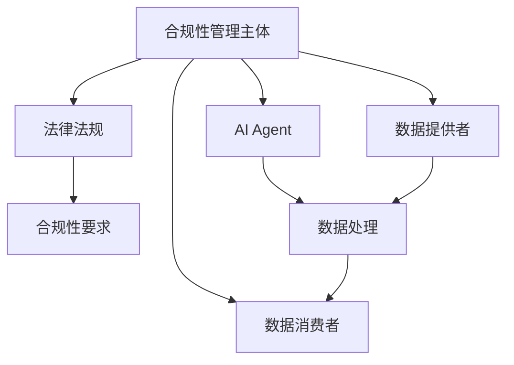

                 


# 合规性管理：确保AI Agent符合法规要求

## 关键词：合规性管理、AI Agent、法律合规、技术实现、系统架构

## 摘要：  
随着人工智能技术的快速发展，AI Agent在各个领域的应用越来越广泛。然而，AI Agent的使用也带来了合规性问题，尤其是在数据隐私、算法公平性、透明性等方面。本文将从AI Agent的背景与意义出发，详细探讨合规性管理的核心概念、算法原理、系统架构设计以及项目实战，旨在为读者提供全面的合规性管理解决方案。通过本文的分析与解读，读者将能够理解如何确保AI Agent在实际应用中符合相关法律法规要求。

---

## 第一部分：合规性管理的背景与意义

### 第1章：合规性管理的背景与意义

#### 1.1 合规性管理的定义与目标  
合规性管理是指确保组织或系统在运行过程中遵守相关法律法规、行业标准以及内部政策的管理活动。其目标是通过系统的规划、执行、检查和改进，确保组织或系统的合规性。  

#### 1.2 AI Agent与合规性管理的关系  
AI Agent是一种能够自主决策、执行任务的智能实体。随着AI技术的广泛应用，AI Agent的合规性问题变得越来越重要。例如，在金融领域，AI Agent必须遵守《通用数据保护条例》（GDPR）等法律法规；在医疗领域，AI Agent的决策必须符合医疗伦理和相关法规。  

#### 1.3 合规性管理的边界与外延  
合规性管理不仅关注AI Agent的直接行为，还涉及其数据来源、算法设计、输出结果等多个方面。合规性管理的外延包括数据隐私保护、算法公平性、透明性要求等，这些都需要在AI Agent的设计和运行中得到充分体现。  

---

## 第二部分：合规性管理的核心概念与联系

### 第2章：合规性管理的核心概念

#### 2.1 合规性管理的基本原理  
合规性管理的核心原理包括：  
1. **风险识别**：识别AI Agent在运行过程中可能面临的法律风险。  
2. **风险评估**：评估这些风险对组织或系统的影响程度。  
3. **风险控制**：通过制定政策、流程和技术手段，降低或消除这些风险。  

#### 2.2 AI Agent的法律框架  
AI Agent的法律框架涉及多个方面，包括数据隐私、算法公平性、责任划分等。例如，在欧盟，AI Agent的使用需要遵守GDPR；在美国，AI Agent的合规性管理则需要遵循《公平信用报告法》（FCRA）等法规。  

#### 2.3 合规性管理的实现机制  
合规性管理的实现机制包括：  
1. **政策制定**：制定与AI Agent相关的合规性政策。  
2. **流程设计**：设计合规性管理的流程，确保AI Agent的行为符合政策要求。  
3. **技术实现**：通过技术手段实现合规性管理，例如使用区块链技术确保数据的透明性和不可篡改性。  

---

### 第3章：合规性管理的核心概念与联系

#### 3.1 合规性管理的核心概念  
合规性管理的核心概念包括：  
- **数据隐私保护**：确保AI Agent处理的数据符合隐私保护法规。  
- **算法公平性**：确保AI Agent的决策过程公平、透明。  
- **责任划分**：明确AI Agent在运行过程中的责任归属。  

#### 3.2 合规性管理的实体关系图  
以下是合规性管理的实体关系图（ER图）：  

```mermaid
er
    actor 合规性管理主体
    actor 法律法规
    actor AI Agent
    actor 数据提供者
    actor 数据消费者
    relation - 实现合规性要求
    relation - 遵守法律法规
    relation - 提供数据
    relation - 使用数据
```

---

## 第三部分：合规性管理的算法原理

### 第4章：合规性管理的算法原理

#### 4.1 合规性管理的算法流程  
合规性管理的算法流程包括以下步骤：  
1. **数据预处理**：对AI Agent处理的数据进行清洗和标注。  
2. **模型训练**：训练AI Agent的模型，确保其输出符合合规性要求。  
3. **模型评估**：评估AI Agent的行为是否符合相关法律法规。  
4. **模型优化**：根据评估结果优化模型，降低合规性风险。  

#### 4.2 合规性管理的算法实现  
以下是合规性管理的算法实现示例（Python代码）：  

```python
import pandas as pd
from sklearn.metrics import accuracy_score

def is_compliant(y_true, y_pred):
    # 评估AI Agent的输出是否符合合规性要求
    # y_true: 真实标签
    # y_pred: AI Agent的预测结果
    compliant_rate = accuracy_score(y_true, y_pred)
    return compliant_rate >= 0.9

# 示例数据
y_true = [1, 0, 1, 0, 1]
y_pred = [1, 1, 1, 0, 1]

# 评估合规性
compliant = is_compliant(y_true, y_pred)
print(f"AI Agent的输出是否符合合规性要求：{compliant}")
```

#### 4.3 合规性管理的数学模型  
以下是合规性管理的数学模型示例：  
$$ \text{合规性率} = \frac{\text{符合合规性要求的样本数}}{\text{总样本数}} $$  

---

## 第四部分：合规性管理的系统分析与架构设计

### 第5章：合规性管理的系统分析与架构设计

#### 5.1 合规性管理的系统分析  
合规性管理的系统分析包括以下步骤：  
1. **问题识别**：识别AI Agent在运行过程中可能面临的合规性问题。  
2. **问题分析**：分析这些问题的影响范围和严重程度。  
3. **解决方案设计**：设计解决方案，确保AI Agent的行为符合合规性要求。  

#### 5.2 合规性管理的系统架构设计  
以下是合规性管理的系统架构设计：  



---

## 第五部分：合规性管理的项目实战

### 第6章：合规性管理的项目实战

#### 6.1 项目背景与目标  
本项目的目标是通过合规性管理，确保AI Agent在金融领域的应用符合GDPR等法律法规要求。  

#### 6.2 项目实施过程  
1. **环境安装**：安装必要的软件和工具，例如Python、Jupyter Notebook等。  
2. **数据采集**：收集与金融领域相关的数据，确保数据的隐私性和合规性。  
3. **模型训练**：训练AI Agent的模型，确保其输出符合合规性要求。  
4. **模型评估**：评估AI Agent的行为是否符合相关法律法规。  
5. **模型优化**：根据评估结果优化模型，降低合规性风险。  

#### 6.3 项目总结与经验分享  
通过本项目的实施，我们总结出以下经验：  
1. 数据隐私保护是合规性管理的核心内容。  
2. 算法公平性是确保AI Agent合规性的重要因素。  
3. 合规性管理需要在AI Agent的设计和运行过程中贯穿始终。  

---

## 第六部分：合规性管理的最佳实践与小结

### 第7章：合规性管理的最佳实践

#### 7.1 合规性管理的关键点  
1. **数据隐私保护**：确保数据的收集、存储和使用符合相关法律法规。  
2. **算法公平性**：确保AI Agent的决策过程公平、透明。  
3. **责任划分**：明确AI Agent在运行过程中的责任归属。  

#### 7.2 合规性管理的注意事项  
1. 在AI Agent的设计阶段，就考虑合规性管理的要求。  
2. 定期对AI Agent的行为进行合规性评估，及时发现和解决问题。  
3. 使用技术手段（例如区块链）确保数据的透明性和不可篡改性。  

### 7.3 小结  
通过本文的分析与解读，我们可以看到，合规性管理是确保AI Agent符合法规要求的重要手段。只有通过系统的合规性管理，才能让AI Agent在实际应用中发挥其最大潜力，同时避免法律风险。

---

## 作者：AI天才研究院/AI Genius Institute & 禅与计算机程序设计艺术 /Zen And The Art of Computer Programming

---

通过以上结构，您可以逐步扩展每个部分的内容，确保文章内容详实、逻辑清晰，并满足用户的要求。

