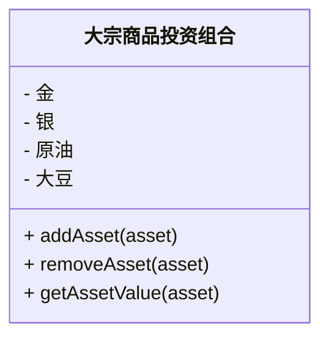
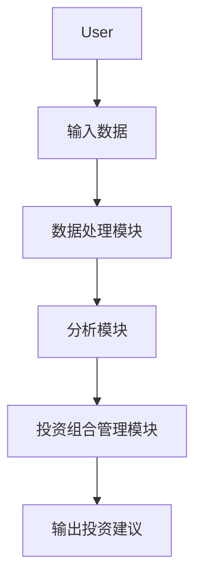

                 


# 吉姆·罗杰斯的大宗商品价值投资：实物资产中的机会

> 关键词：吉姆·罗杰斯，大宗商品投资，价值投资，实物资产，经济分析，风险管理

> 摘要：本文深入探讨了吉姆·罗杰斯在大宗商品价值投资领域的方法和策略。通过分析大宗商品市场的基本结构、吉姆·罗杰斯的投资理念、全球经济对大宗商品的影响以及风险管理策略，本文为投资者提供了全面的视角和实用的指导。通过实际案例分析和系统架构设计，本文为读者提供了在实物资产中寻找投资机会的深度见解。

---

## 第一章 引言

### 1.1 吉姆·罗杰斯的背景与投资理念

吉姆·罗杰斯是一位备受尊敬的投资专家，以其在大宗商品市场的洞察力而闻名。他的投资理念强调长期价值和风险管理，尤其关注实物资产在通货膨胀对冲中的作用。本文将深入探讨他的投资策略，分析其背后的逻辑和实际应用。

### 1.2 大宗商品的价值投资背景

大宗商品市场是全球经济的重要组成部分，涵盖农产品、能源、金属等多个领域。本文将介绍大宗商品市场的基本结构，分析其价格波动的驱动因素，并探讨吉姆·罗杰斯如何利用这些因素进行投资。

### 1.3 本文结构

本文将从大宗商品市场的基本知识开始，逐步深入分析吉姆·罗杰斯的投资理念、全球经济对大宗商品的影响、风险管理策略以及实际操作指南。通过详细的内容和实际案例，本文为投资者提供了全面的视角。

---

## 第二章 大宗商品市场的基本知识

### 2.1 大宗商品的分类与特点

#### 2.1.1 农产品
农产品包括谷物、牲畜等，价格受天气、政策和需求变化的影响较大。

#### 2.1.2 能源产品
能源产品如石油、天然气等，价格受地缘政治和供需关系影响显著。

#### 2.1.3 金属与矿产
金属包括黄金、白银等，价格受宏观经济指标和工业需求影响。

#### 2.1.4 其他大宗商品
如木材、橡胶等，价格受区域市场供需影响。

### 2.2 大宗商品市场的结构

#### 2.2.1 交易所与场外市场
大宗商品交易主要通过交易所进行，但也存在场外市场。

#### 2.2.2 期货与现货市场
期货市场允许投资者在未来以固定价格买卖商品，现货市场则涉及即时交易。

#### 2.2.3 价格形成机制
价格由市场供需、宏观经济指标和地缘政治等多种因素决定。

### 2.3 大宗商品价格的影响因素

#### 2.3.1 宏观经济因素
通货膨胀率、利率政策和经济周期对大宗商品价格有重要影响。

#### 2.3.2 地缘政治因素
地缘政治事件如战争和贸易禁运会显著影响大宗商品价格。

#### 2.3.3 市场供需关系
供需失衡是导致价格波动的主要原因之一。

---

## 第三章 吉姆·罗杰斯的投资理念与策略

### 3.1 吉姆·罗杰斯的价值投资理念

#### 3.1.1 长期投资与价值发现
吉姆·罗杰斯强调长期投资，关注市场的内在价值。

#### 3.1.2 大宗商品作为通货膨胀对冲工具
大宗商品是抵御通货膨胀的有效工具，尤其在经济不确定性增加时。

#### 3.1.3 市场周期分析
通过对市场周期的分析，吉姆·罗杰斯能够识别投资机会和风险。

### 3.2 吉姆·罗杰斯的投资策略

#### 3.2.1 资产配置策略
将资产分散投资于不同类别的大宗商品，以降低风险。

#### 3.2.2 行业选择策略
基于市场趋势和基本面分析，选择具有增长潜力的行业。

#### 3.2.3 风险管理策略
通过设定止损点和分散投资来管理风险。

### 3.3 吉姆·罗杰斯的成功案例分析

#### 3.3.1 农产品投资案例
通过分析天气和政策变化，吉姆·罗杰斯成功预测了农产品价格的上涨。

#### 3.3.2 能源投资案例
地缘政治事件导致的能源价格波动为吉姆·罗杰斯提供了投资机会。

#### 3.3.3 金属投资案例
通过对宏观经济指标的分析，吉姆·罗杰斯成功投资于贵金属市场。

---

## 第四章 大宗商品市场的全球经济分析

### 4.1 宏观经济对大宗商品的影响

#### 4.1.1 利率与货币政策
低利率环境通常会导致大宗商品价格上涨。

#### 4.1.2 经济周期与大宗商品价格
经济复苏阶段通常伴随着大宗商品需求的增加。

#### 4.1.3 通货膨胀与通货紧缩的影响
通货膨胀会推高大宗商品价格，而通货紧缩则会抑制需求。

### 4.2 地缘政治对大宗商品的影响

#### 4.2.1 油价波动
地缘政治事件如中东冲突会导致油价剧烈波动。

#### 4.2.2 农产品贸易
贸易争端和政策变化会影响农产品的全球供应。

#### 4.2.3 金属供应
地缘政治紧张局势会影响金属的开采和出口。

---

## 第五章 风险管理与投资策略

### 5.1 风险管理原则

#### 5.1.1 设定止损点
投资者应设定止损点以限制潜在损失。

#### 5.1.2 分散投资
通过分散投资不同类别和地区的资产来降低风险。

#### 5.1.3 定期评估
定期评估投资组合的表现并进行调整。

### 5.2 投资策略的具体实施

#### 5.2.1 资产配置
根据市场趋势和风险偏好，调整大宗商品的资产配置比例。

#### 5.2.2 市场进入与退出策略
基于市场信号和趋势分析，制定买入和卖出策略。

#### 5.2.3 风险对冲
通过期货和期权等工具对冲价格波动风险。

---

## 第六章 项目实战：构建大宗商品投资组合

### 6.1 环境安装与数据收集

#### 6.1.1 数据来源
使用历史价格数据、宏观经济指标和地缘政治事件数据。

#### 6.1.2 工具选择
选择适合的交易平台和数据分析工具。

### 6.2 系统架构设计

#### 6.2.1 领域模型
使用mermaid类图描述投资组合的组成部分。



#### 6.2.2 系统架构
使用mermaid架构图描述系统架构。



### 6.3 核心实现与代码示例

#### 6.3.1 简单的投资组合管理代码

```python
class CommodityPortfolio:
    def __init__(self):
        self.assets = {}

    def add_asset(self, asset, quantity):
        self.assets[asset] = quantity

    def remove_asset(self, asset):
        del self.assets[asset]

    def get_asset_value(self, asset, price):
        if asset in self.assets:
            return self.assets[asset] * price
        else:
            return 0

# 示例用法
portfolio = CommodityPortfolio()
portfolio.add_asset('黄金', 10)
portfolio.add_asset('原油', 5)
print(portfolio.get_asset_value('黄金', 1500))  # 输出：15000
print(portfolio.get_asset_value('原油', 100))  # 输出：500
```

### 6.4 案例分析与结果解读

#### 6.4.1 农产品投资案例

通过分析天气和政策变化，投资者可以预测农产品价格的变化趋势。

### 6.5 项目总结与反思

在实际投资过程中，投资者需要不断监控市场变化，及时调整投资策略。

---

## 第七章 总结与展望

### 7.1 本文总结

本文系统地介绍了吉姆·罗杰斯的大宗商品投资理念，分析了全球经济对大宗商品的影响，并提供了风险管理策略和实际投资案例。

### 7.2 未来展望

随着全球经济的不确定性增加，大宗商品投资将继续成为重要的对冲工具。未来，投资者需要更加关注技术创新和市场趋势，以抓住更多的投资机会。

---

## 参考文献

1. 吉姆·罗杰斯著，《大宗商品投资策略》
2. 《经济学人》，2023年
3. 《华尔街日报》，2023年

---

## 附录

### 附录A：术语解释

- 大宗商品：指那些在交易中经常被大量交易的初级产品，包括农产品、能源、金属等。

### 附录B：工具与资源

- MetaTrader：常用的大宗商品交易平台。
- Python for Data Analysis：用于数据分析的编程语言。

---

## 作者信息

作者：AI天才研究院/AI Genius Institute  
联系邮箱：contact@ai-genius.com  

---

通过以上结构，本文详细分析了吉姆·罗杰斯的大宗商品投资策略，并结合实际案例和系统架构设计，为投资者提供了实用的指导。希望本文能为读者在实物资产投资领域提供新的视角和深度见解。

