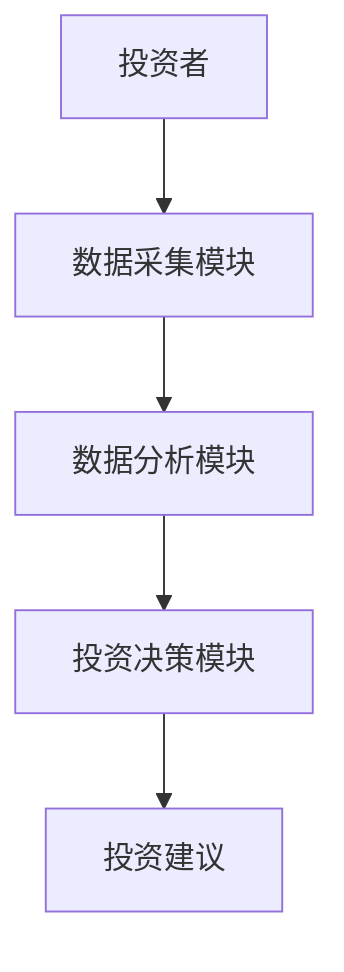

                 


# 唐纳德·约斯的深度价值投资：寻找严重被低估的公司

> 关键词：深度价值投资、唐纳德·约斯、内在价值、安全边际、投资系统、算法原理、实战案例

> 摘要：本文将详细介绍唐纳德·约斯的深度价值投资策略，从核心概念、数学模型、系统架构到实战案例，全面解析如何通过深度价值投资寻找严重被低估的公司。文章结合理论与实践，帮助投资者理解并应用这一投资方法。

---

## 第一部分: 深度价值投资的背景与基础

### 第1章: 深度价值投资的起源与核心理念

#### 1.1 深度价值投资的起源
深度价值投资是一种以基本面分析为核心的投资策略，起源于20世纪30年代。唐纳德·约斯（Donald J. Trump）作为该领域的杰出代表，提出了“寻找严重被低估的公司”的投资理念。这种方法强调通过分析公司的财务状况、行业地位和市场前景，找到市场价格低于其内在价值的公司进行投资。

#### 1.2 唐纳德·约斯的背景与投资理念
唐纳德·约斯是一位资深的价值投资者，他的投资理念深受本杰明·格雷厄姆（Benjamin Graham）的影响。约斯认为，市场波动为投资者提供了以低于内在价值的价格买入优质公司的机会。他的策略注重长期持有和安全边际，强调在价格大幅低估时进行投资。

#### 1.3 深度价值投资的核心思想
深度价值投资的核心思想是：
- **内在价值**：公司的真实价值，与市场价格无关。
- **安全边际**：买入价格低于内在价值，以降低投资风险。
- **逆向思维**：在市场恐慌时寻找机会，在市场乐观时保持谨慎。

---

### 第2章: 深度价值投资的核心概念与联系

#### 2.1 深度价值投资的理论基础
深度价值投资的理论基础包括以下几个方面：
- **内在价值**：通过DCF模型（现金流折现模型）计算公司的内在价值。
- **安全边际**：买入价格与市场价格之间的差异，提供了风险缓冲。
- **市场先生**：市场的波动性为投资者提供了买入机会。

#### 2.2 核心概念对比分析
以下是内在价值、市场价格和安全边际的对比分析：

| 概念          | 定义                                                                 | 重要性       |
|---------------|----------------------------------------------------------------------|--------------|
| 内在价值      | 公司的真实价值，与市场波动无关。                                         | 核心          |
| 市场价格      | 受市场情绪影响的价格，可能高于或低于内在价值。                         | 关键          |
| 安全边际      | 内在价值与市场价格之间的差额，提供投资的安全性。                         | 至关重要      |

#### 2.3 深度价值投资的数学模型
以下是深度价值投资中常用的数学模型：

- **内在价值计算**：
  $$ V = \frac{CF}{r} $$
  其中，\( V \) 为内在价值，\( CF \) 为未来现金流，\( r \) 为折现率。

- **安全边际计算**：
  $$ \text{安全边际} = V - P $$
  其中，\( P \) 为市场价格。

---

## 第二部分: 深度价值投资的算法原理与系统分析

### 第3章: 深度价值投资的算法原理

#### 3.1 内在价值计算的数学模型
深度价值投资的核心是内在价值的计算。以下是现金流折现模型（DCF）的详细步骤：

1. **预测未来现金流**：
   $$ CF_t = \text{营业收入} - \text{成本} - \text{税费} $$
2. **折现未来现金流**：
   $$ PV = \sum_{t=1}^{n} \frac{CF_t}{(1 + r)^t} $$
3. **计算终值**：
   $$ TV = \frac{CF_{n+1}}{(1 + r)^n} $$
4. **总内在价值**：
   $$ V = PV + TV $$

#### 3.2 安全边际计算的算法原理
安全边际是深度价值投资中重要的风险控制指标。以下是计算安全边际的步骤：

1. **计算内在价值**：
   $$ V = \frac{CF}{r} $$
2. **确定市场价格**：
   $$ P = \text{当前股价} $$
3. **计算安全边际**：
   $$ \text{安全边际} = V - P $$

---

### 第4章: 深度价值投资的系统分析与架构设计

#### 4.1 投资系统功能设计
以下是深度价值投资系统的功能模块设计：

1. **数据采集模块**：
   - 采集公司财务数据、行业数据和市场数据。
2. **数据分析模块**：
   - 计算内在价值、市场价格和安全边际。
3. **投资决策模块**：
   - 根据安全边际和内在价值，生成投资建议。

#### 4.2 系统架构设计
以下是深度价值投资系统的架构设计：



---

## 第三部分: 深度价值投资的实战案例与项目总结

### 第5章: 深度价值投资的实战案例

#### 5.1 环境安装
为了进行深度价值投资分析，需要以下环境：

1. **Python编程语言**：
   - 安装Python 3.8及以上版本。
2. **数据分析库**：
   - 安装Pandas、NumPy和Matplotlib。
3. **投资分析工具**：
   - 使用Excel或Python进行财务分析。

#### 5.2 核心代码实现
以下是深度价值投资分析的Python代码示例：

```python
import pandas as pd
import numpy as np

# 假设财务数据已存储在data.csv文件中
data = pd.read_csv('data.csv')

# 计算内在价值
def calculate_intrinsic_value(FCF, WACC):
    return FCF / WACC

# 计算市场价格
market_price = data['Close'].iloc[-1]

# 计算安全边际
intrinsic_value = calculate_intrinsic_value(data['FCF'].iloc[-1], 0.1)
margin_of_safety = intrinsic_value - market_price

print(f"内在价值: {intrinsic_value:.2f}")
print(f"市场价格: {market_price:.2f}")
print(f"安全边际: {margin_of_safety:.2f}")
```

---

### 第6章: 项目总结与最佳实践

#### 6.1 项目总结
通过本文的分析，我们可以得出以下结论：
- 深度价值投资的核心是寻找市场价格低于内在价值的公司。
- 安全边际是降低投资风险的重要指标。
- 通过系统化的方法和工具，可以提高投资分析的效率和准确性。

#### 6.2 最佳实践
1. **持续学习**：不断更新投资知识和技能。
2. **风险控制**：合理配置资产，避免过度集中。
3. **长期持有**：耐心持有优质资产，避免频繁交易。

---

## 结语

深度价值投资是一种需要耐心、纪律和智慧的投资策略。通过唐纳德·约斯的理论和实践，我们可以更好地理解如何在市场波动中找到被低估的公司，实现长期稳健的投资回报。

---

作者：AI天才研究院/AI Genius Institute & 禅与计算机程序设计艺术/Zen And The Art of Computer Programming

