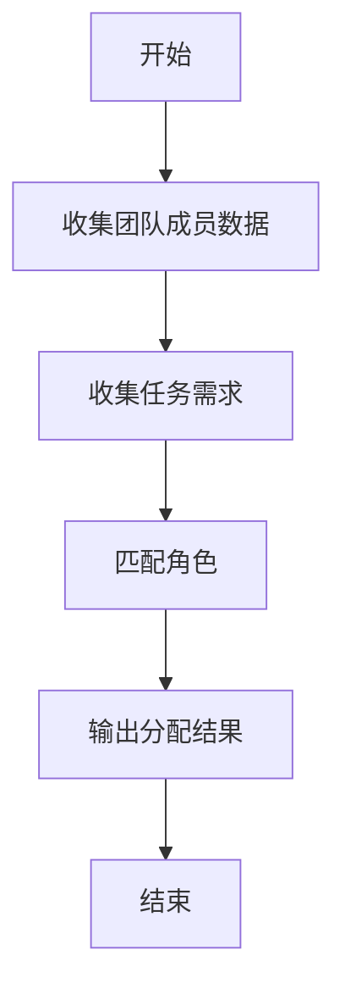
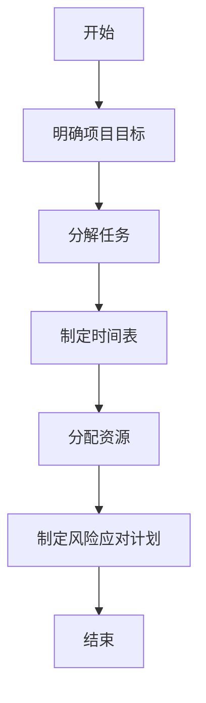
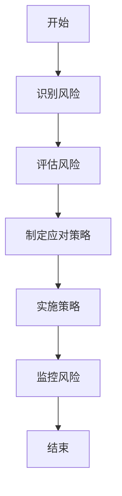
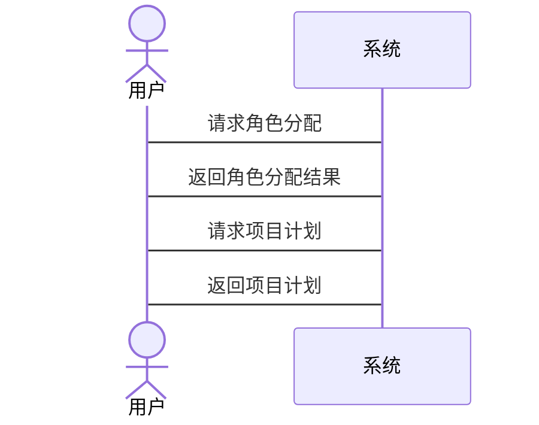

                 


# 团队组建与项目管理

> 关键词：团队组建、项目管理、团队角色、项目计划、风险管理

> 摘要：本文深入探讨了团队组建与项目管理的核心概念、算法原理、系统架构及实际应用。通过分析团队角色分配、项目计划制定、风险管理等关键环节，结合数学模型、算法实现和系统设计，为读者提供全面的理论与实践指导。

---

## 第一部分: 团队组建与项目管理的背景与核心概念

### 第1章: 团队组建与项目管理的背景介绍

#### 1.1 团队的定义与特征
- **团队定义**：团队是由一组具有互补技能的人组成的，能够共同完成特定目标的组织形式。
- **团队特征**：
  - 明确的目标
  - 分工明确的角色
  - 协作与沟通
  - 共享责任与成果

#### 1.2 项目管理的定义与特征
- **项目定义**：为完成特定目标而进行的一次性任务，有明确的开始和结束时间。
- **项目特征**：
  - 目标导向性
  - 临时性与独特性
  - 多学科协作
  - 需求变更管理

#### 1.3 团队与项目的关系
- 团队是项目执行的基础，项目是团队合作的载体。
- 团队的角色分配影响项目的成功与否。

#### 1.4 问题背景与问题描述
- 当前团队组建与项目管理中的主要问题：
  - 角色分配不均，导致效率低下。
  - 项目计划不合理，进度拖延。
  - 风险管理不足，导致项目失败。

#### 1.5 问题解决与实践意义
- 核心目标：提高团队协作效率，确保项目按时完成。
- 实践意义：通过科学的方法和工具，优化团队管理和项目执行。

---

## 第2章: 核心概念与关键联系

#### 2.1 团队角色分配与任务分解
- **团队角色分配**：
  - 基于能力分配：根据成员技能分配任务。
  - 基于性格分配：根据成员性格特点分配任务。
- **任务分解**：
  - 采用WBS（工作分解结构）方法，将项目分解为可管理的任务。

#### 2.2 项目计划与进度管理
- **项目计划制定步骤**：
  1. 明确项目目标。
  2. 分解任务。
  3. 制定时间表。
  4. 分配资源。
  5. 制定风险应对计划。
- **进度管理**：
  - 使用甘特图和关键路径法（CPM）监控进度。

#### 2.3 项目风险与资源管理
- **风险识别**：
  - 通过头脑风暴法和问卷调查识别潜在风险。
- **风险管理**：
  - 制定应对策略，如规避、减轻、转移或接受风险。
- **资源管理**：
  - 合理分配人力、时间和预算资源。

#### 2.4 核心概念对比与联系
- 团队角色与任务分解的对比：
  - 团队角色影响任务分配的合理性。
- 项目计划与进度管理的联系：
  - 计划是进度管理的基础，进度管理是计划的执行过程。
- 风险与资源管理的相互作用：
  - 风险可能影响资源分配，资源分配也影响风险应对能力。

---

## 第3章: 团队角色分配算法

#### 3.1 团队角色分配的原理
- **基于能力的分配算法**：
  - 根据成员技能匹配任务。
- **基于性格的分配算法**：
  - 根据成员性格特点匹配任务。
- **综合能力与性格的分配算法**：
  - 结合能力与性格，综合分配任务。

#### 3.2 算法实现步骤
1. 收集团队成员的技能和性格数据。
2. 根据任务需求，匹配合适的角色。
3. 输出角色分配方案。

#### 3.3 算法实现示例
```python
def assign_roles(team, tasks):
    roles = []
    for task in tasks:
        best_candidate = find_best_candidate(team, task)
        roles.append((task, best_candidate))
    return roles
```

#### 3.4 算法流程图


---

## 第4章: 项目计划与进度管理算法

#### 4.1 项目计划制定算法
- **关键路径法（CPM）**：
  - 确定项目的关键路径，优化时间安排。

#### 4.2 进度管理算法
- **甘特图绘制**：
  - 使用甘特图监控项目进度。

#### 4.3 算法流程图


---

## 第5章: 风险管理算法

#### 5.1 风险识别算法
- **头脑风暴法**：
  - 召集团队成员，列出潜在风险。

#### 5.2 风险应对策略
- **风险规避**：调整计划，避免风险。
- **风险减轻**：采取措施降低风险影响。
- **风险转移**：将风险责任转移给第三方。
- **风险接受**：接受可能的损失。

#### 5.3 风险管理流程图


---

## 第6章: 系统架构与接口设计

#### 6.1 系统架构设计
- **分层架构**：
  - 业务逻辑层、数据访问层、表现层。
- **组件设计**：
  - 团队角色管理组件、项目计划管理组件、风险管理组件。

#### 6.2 系统接口设计
- **RESTful API**：
  - 提供角色分配、任务分解、进度管理等接口。

#### 6.3 系统交互设计


---

## 第7章: 项目实战与案例分析

#### 7.1 项目实战
- **环境安装**：
  - 安装Python和相关库。
- **核心代码实现**：
  ```python
  def main():
      team = read_team_data()
      tasks = read_task_data()
      roles = assign_roles(team, tasks)
      print(roles)
  ```

#### 7.2 案例分析
- **案例背景**：
  - 开发一个项目管理工具。
- **案例分析**：
  - 通过工具实现团队角色分配和项目计划制定。
- **结果展示**：
  - 输出角色分配结果和项目计划。

---

## 第8章: 最佳实践与总结

#### 8.1 最佳实践
- **明确目标**：确保团队和项目目标一致。
- **合理分配角色**：根据成员能力和性格分配任务。
- **科学制定计划**：采用CPM和甘特图优化进度管理。
- **有效风险管理**：制定应对策略，降低项目风险。

#### 8.2 小结
- 通过科学的方法和工具，优化团队管理和项目执行，确保项目按时完成。

#### 8.3 注意事项
- 定期检查和调整项目计划。
- 及时沟通和反馈团队成员的工作进展。
- 建立良好的团队文化和协作机制。

#### 8.4 拓展阅读
- 建议阅读《项目管理知识体系指南》（PMBOK）和《团队协作的五大障碍》。

---

# 作者：AI天才研究院/AI Genius Institute & 禅与计算机程序设计艺术 /Zen And The Art of Computer Programming

