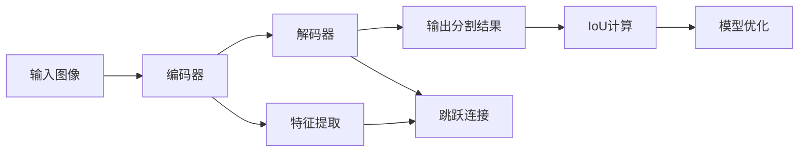
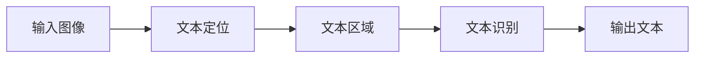
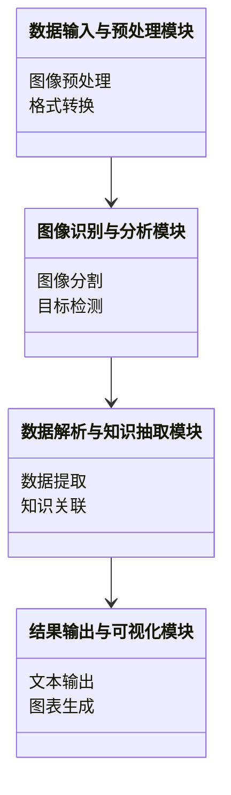
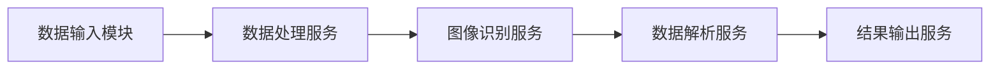

                 


# 图表理解技术：增强AI Agent的数据分析能力

## 关键词：图表理解，AI代理，数据分析，图像分割，OCR，系统架构

## 摘要：图表理解技术是通过AI代理对图表数据进行分析和理解，从而增强数据分析能力。本文从技术背景、核心算法、系统架构设计到项目实战，全面解析图表理解技术，帮助读者掌握从理论到实践的知识体系。

---

# 正文

## 第一部分：图表理解技术基础

### 第1章：图表理解技术概述

#### 1.1 图表理解技术的背景与意义

图表是数据分析和可视化的重要工具，通过图表可以更直观地呈现数据关系和趋势。然而，随着数据量的增加，手动分析图表变得效率低下。AI代理通过图表理解技术，能够自动化识别和分析图表，提取有价值的信息，辅助决策。

**图表理解技术的背景**  
数据可视化在商业、科学和教育等领域中广泛应用。传统的数据分析依赖于手动图表分析，效率低且容易出错。AI代理通过图像识别、自然语言处理等技术，能够自动解析图表内容，显著提升数据分析效率。

**AI代理在图表分析中的作用**  
AI代理可以处理复杂的图表结构，识别图表中的关键元素（如数据点、轴、标题等），并将其转化为结构化数据，用于后续分析和决策支持。

**图表理解技术的目标**  
通过机器学习和深度学习技术，训练AI代理能够识别和理解不同类型的图表，提取关键信息，并生成结构化的数据输出。

---

#### 1.2 图表理解技术的核心概念

**图表类型与特征**  
常见的图表类型包括柱状图、折线图、饼图、散点图等。每种图表都有其独特的视觉特征和数据表达方式。AI代理需要能够识别这些特征，准确分类图表类型。

**图表理解的流程与步骤**  
1. **图像采集与预处理**：获取图表图像，进行降噪、增强等处理。  
2. **图表元素识别**：识别图表中的轴、数据点、标题等元素。  
3. **数据提取与解析**：从图表中提取数值数据，并转化为结构化数据。  
4. **数据关联与分析**：将提取的数据与其他数据源关联，进行深入分析。

**AI代理在图表分析中的角色**  
AI代理作为数据处理和分析的工具，能够自动化完成图表的理解和分析任务，帮助用户快速获取有价值的信息。

---

#### 1.3 图表理解技术的应用场景

**商业分析与数据报告**  
企业可以通过AI代理自动分析销售报告、财务报表中的图表，快速获取关键指标。  
**科学研究与数据可视化**  
科学家可以利用AI代理自动解析实验数据图表，发现数据中的趋势和异常。  
**企业决策支持系统**  
企业决策者可以通过AI代理生成的图表分析结果，做出更明智的决策。

---

## 第二部分：图表理解的核心算法

### 第2章：图像分割与目标检测

#### 2.1 图像分割算法

**基于CNN的图像分割模型**  
卷积神经网络（CNN）是图像分割的核心技术。常用的模型包括U-Net、Mask R-CNN等。  

**U-Net架构详解**  
U-Net是一种经典的图像分割模型，由编码器和解码器两部分组成。编码器提取图像特征，解码器通过上采样和跳跃连接恢复图像细节。  

**图像分割的评估指标**  
常用的评估指标包括IoU（交并比）、Dice系数等，用于衡量分割结果的准确性。



#### 2.2 目标检测算法

**YOLO算法原理**  
YOLO（You Only Look Once）是一种单阶段目标检测算法，通过回归预测边界框和类别概率。  

**Faster R-CNN架构**  
Faster R-CNN由RPN（区域建议网络）和Fast R-CNN组成，用于生成候选框并进行目标分类和定位。

**检测精度与计算效率的平衡**  
YOLO在实时性方面表现优异，但精度可能略逊于Faster R-CNN。根据应用场景选择合适的模型。

---

### 第3章：OCR技术与文本识别

#### 3.1 OCR技术基础

**OCR技术基础**  
OCR（光学字符识别）通过扫描图像中的文字，将其转化为可编辑的文本。  

**文本检测与识别流程**  
1. **图像预处理**：去噪、二值化等。  
2. **文本定位**：检测图像中的文本区域。  
3. **文本识别**：将检测到的文本区域转化为字符。

**常见OCR算法对比**  
Tesseract基于OCR engine，适合复杂场景；百度OCR API基于深度学习，识别速度快。



#### 3.2 图表文本识别实战

**文本矫正与增强**  
通过透视变换和图像增强技术，改善文本区域的可读性。  

**多语言文本识别挑战**  
支持多种语言的OCR模型需要处理不同语言的字体和排版差异。

---

## 第三部分：系统架构与设计

### 第4章：图表理解系统的架构设计

#### 4.1 系统功能模块划分

**数据输入与预处理模块**  
接收图表图像，进行格式转换和预处理。  

**图像识别与分析模块**  
利用深度学习模型识别图表元素。  

**数据解析与知识抽取模块**  
将识别到的图表元素转化为结构化数据。  

**结果输出与可视化模块**  
将结构化数据输出为可读的文本或新的图表形式。



#### 4.2 系统架构设计

**分层架构设计**  
系统分为数据层、业务逻辑层和表现层，各层之间松耦合。  

**微服务架构实现**  
将系统功能拆分为独立的服务，通过API进行通信，提高系统的扩展性和维护性。  

**高可用性与扩展性设计**  
通过负载均衡和容错设计，确保系统在高负载下的稳定运行。



---

## 第四部分：项目实战

### 第5章：图表理解技术的项目实战

#### 5.1 项目介绍与目标

**项目目标**  
开发一个能够自动分析财务报表的AI代理，提取关键数据并生成结构化报告。  

**项目环境搭建**  
安装Python、TensorFlow、OpenCV、Tesseract等工具。

```bash
pip install tensorflow opencv-python pytesseract
```

#### 5.2 系统核心实现源代码

**图像分割代码示例**

```python
import cv2
import numpy as np

def image_segmentation(image_path):
    # 加载图像
    image = cv2.imread(image_path)
    # 转换为灰度图像
    gray = cv2.cvtColor(image, cv2.COLOR_BGR2GRAY)
    # 二值化处理
    _, thresh = cv2.threshold(gray, 127, 255, cv2.THRESH_BINARY)
    return thresh

image_segmentation("input_image.png")
```

**文本识别代码示例**

```python
import pytesseract
from PIL import Image

def ocr_text(image_path):
    # 加载图像
    image = Image.open(image_path)
    # 使用Tesseract进行OCR识别
    text = pytesseract.image_to_string(image)
    return text

ocr_text("input_image.png")
```

#### 5.3 案例分析与详细解读

**财务报表分析案例**  
输入一张柱状图的财务报表，AI代理识别图表中的公司收入和支出数据，并生成结构化报告。  

**数据解析与关联**  
将提取的财务数据与其他数据源关联，进行趋势分析和预测。

---

## 第五部分：总结与扩展

### 第6章：总结与最佳实践

#### 6.1 项目总结

通过本项目，我们实现了AI代理对财务报表图表的自动分析功能，验证了图表理解技术在实际应用中的可行性。

#### 6.2 最佳实践 tips

1. **数据预处理**：确保输入图像的质量，减少噪声干扰。  
2. **模型调优**：根据实际需求调整模型参数，提高识别精度。  
3. **系统优化**：通过并行处理和缓存优化，提升系统的运行效率。

#### 6.3 扩展阅读

1. 《Deep Learning for Image Processing》  
2. 《Applied Deep Learning: A Step-by-Step Guide》  
3. 《Hands-On Machine Learning with Scikit-Learn, Keras, and TensorFlow》

---

## 作者信息

作者：AI天才研究院（AI Genius Institute） & 禅与计算机程序设计艺术（Zen And The Art of Computer Programming）

---

**本文旨在通过系统化的讲解，帮助读者深入理解图表理解技术，并将其应用于实际的AI代理开发中。通过理论与实践的结合，读者可以掌握从数据采集、图像识别到结果输出的完整流程。**

