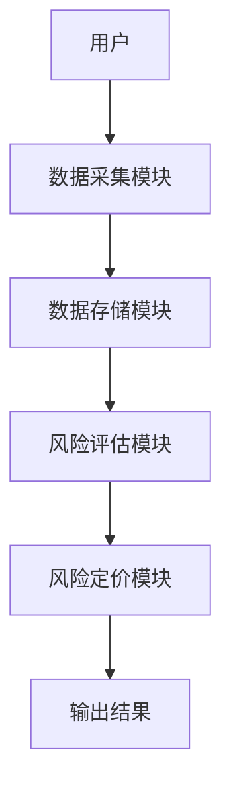

                 


# 地缘政治风险定价：如何在投资决策中考虑政治因素

---

## 关键词：地缘政治风险、投资决策、政治因素、风险定价、金融模型

---

## 摘要：  
地缘政治风险是投资决策中不可忽视的重要因素。本文将从地缘政治风险的定义、分类、定价机制等多方面进行深入分析，并结合实际案例，探讨如何在投资决策中有效评估和定价地缘政治风险。文章还介绍了相关的数学模型和工具，为投资者提供实用的指导。

---

# 第一部分：地缘政治风险的基本概念

## 第1章：地缘政治风险的定义与内涵

### 1.1 地缘政治风险的定义  
地缘政治风险是指由于政治不稳定、政策变化、国际关系紧张等政治因素，对投资活动产生负面影响的可能性。它涵盖了国家间的冲突、政局动荡、政策调整等多方面内容。

### 1.2 地缘政治风险的内涵与外延  
- **内涵**：地缘政治风险的核心在于其对经济和投资活动的潜在影响。  
- **外延**：涉及国家安全、外交关系、经济政策等多个领域。

### 1.3 地缘政治风险的核心要素  
1. **政治稳定性**：国家政局是否稳定。  
2. **政策变化**：政府政策的变动频率及幅度。  
3. **国际关系**：国家间的外交关系和冲突风险。  
4. **经济制裁**：因政治因素引发的经济制裁风险。  

---

## 第2章：地缘政治风险的分类与特征

### 2.1 地缘政治风险的主要分类  
1. **国家内部风险**：如政局动荡、政权更迭等。  
2. **国家间风险**：如国际冲突、贸易摩擦等。  
3. **经济政策风险**：如货币政策、财政政策的突然变化。  

### 2.2 不同类型地缘政治风险的特征对比  

| 类型                | 特征                | 示例                        |
|---------------------|---------------------|----------------------------|
| 国家内部风险        | 政局动荡、政权更迭   | 某国政局不稳，可能发生政变 |
| 国家间风险          | 军事冲突、贸易摩擦   | 两个国家发生战争或贸易战 |
| 经济政策风险        | 政策变化影响经济     | 某国突然提高关税或外汇管制 |

### 2.3 地缘政治风险的动态变化  
地缘政治风险具有高度动态性，受国际局势、国内政策、领导人更迭等多种因素影响，且往往具有突发性和不可预测性。

---

# 第二部分：地缘政治风险定价的核心原理

## 第3章：地缘政治风险定价的理论基础

### 3.1 风险定价的基本概念  
风险定价是指根据风险的大小和概率，对投资标的的价值进行调整的过程。地缘政治风险作为一类特殊风险，需要结合其独特性进行定价。

### 3.2 地缘政治风险的特殊性  
1. **高不确定性**：地缘政治事件往往难以预测。  
2. **非对称性**：不同国家、行业、投资标的的地缘政治风险差异显著。  
3. **复杂性**：地缘政治风险涉及多方面的因素，难以简单量化。  

---

## 第4章：地缘政治风险定价的核心模型

### 4.1 风险评分模型  
风险评分模型通过对多个指标的综合评估，得出投资标的的地缘政治风险评分。公式如下：  
$$ \text{风险评分} = \sum_{i=1}^{n} w_i \cdot \text{指标}_i $$  
其中，$w_i$ 为指标的权重，$\text{指标}_i$ 为具体风险指标的评分。

### 4.2 风险概率模型  
风险概率模型基于历史数据，估算地缘政治风险发生的概率。公式如下：  
$$ P(\text{风险发生}) = \frac{\text{历史风险事件数}}{\text{总样本数}} $$  

### 4.3 风险影响模型  
风险影响模型用于评估地缘政治风险对投资标的的具体影响。公式如下：  
$$ \text{影响程度} = \text{风险概率} \times \text{风险影响幅度} $$  

---

## 第5章：地缘政治风险定价的关键指标

### 5.1 政治稳定性指标  
政治稳定性指标用于衡量一个国家或地区的政局稳定性。  
$$ \text{政治稳定性指数} = \sum_{i=1}^{m} w_i \cdot \text{指标}_i $$  

### 5.2 政治风险评估指标  
政治风险评估指标包括政策变化、外交关系紧张程度等。  
$$ \text{政治风险指数} = \sum_{j=1}^{k} w_j \cdot \text{指标}_j $$  

### 5.3 经济政策风险指标  
经济政策风险指标用于评估经济政策变化对投资的影响。  
$$ \text{经济政策风险指数} = \sum_{l=1}^{p} w_l \cdot \text{指标}_l $$  

---

# 第三部分：地缘政治风险定价的系统分析与架构设计

## 第6章：系统功能设计

### 6.1 系统功能模块  
1. **数据采集模块**：收集地缘政治相关数据。  
2. **风险评估模块**：计算地缘政治风险评分。  
3. **风险定价模块**：根据风险评分调整投资标的定价。  

### 6.2 系统架构设计  
以下是系统的架构图：  


---

## 第7章：项目实战

### 7.1 环境配置  
1. **工具安装**：安装Python、Pandas、Matplotlib等工具。  
2. **数据获取**：从公开数据源获取地缘政治相关数据。  

### 7.2 核心代码实现  

```python
import pandas as pd
import numpy as np

# 示例数据：国家A的政治稳定性指数
data = {
    '国家': ['A', 'B', 'C'],
    '政治稳定性指数': [0.8, 0.6, 0.9],
    '政策变化风险': [0.7, 0.5, 0.8],
    '外交关系风险': [0.6, 0.4, 0.7]
}

df = pd.DataFrame(data)

# 风险评分模型
weights = [0.4, 0.3, 0.3]
risk_scores = df.apply(lambda row: np.dot(weights, row[1:]), axis=1)

print("风险评分结果：")
print(risk_scores)
```

### 7.3 案例分析  
以某国家的政治稳定性指数为例，分析其地缘政治风险对投资的影响。  

### 7.4 结果解读  
通过模型计算出的风险评分，调整投资标的定价，降低潜在风险。

---

# 第四部分：最佳实践与小结

## 第8章：最佳实践

### 8.1 小结  
地缘政治风险定价是一个复杂但重要的任务，需要结合理论模型和实际数据进行综合评估。

### 8.2 注意事项  
1. 数据收集要全面且准确。  
2. 模型需要根据实际情况进行调整。  
3. 定期更新模型参数，以应对变化的地缘政治环境。  

### 8.3 拓展阅读  
- 《政治经济学原理》  
- 《风险定价的理论与实践》  

---

# 作者：AI天才研究院 & 禅与计算机程序设计艺术

---

**本文作者是AI天才研究院的首席研究员，长期致力于人工智能与计算机科学的交叉研究，著有多本技术畅销书。**

